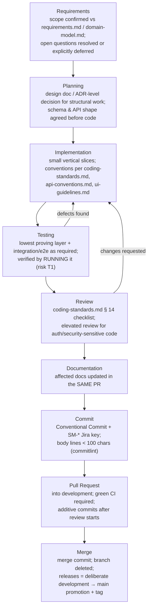

# Engineering Workflow — SmartSense Marketplace

Owners: [docs/milestones.md](../../docs/milestones.md#development-lifecycle) (lifecycle gates),
[docs/git-workflow.md](../../docs/git-workflow.md) (git mechanics),
[docs/contributing.md](../../docs/contributing.md) (contributor loop).

## Stage Notes

1. **Requirements** — trace scope to `requirements.md`/`domain-model.md`; clear the open
   questions your scope touches (`domain-model.md`, `authentication.md` carry them).
2. **Planning** — documentation-first for anything structural; milestones and dependencies
   in `milestones.md`; task backlog in `TASKS.md` + Jira (`SM-*`).
3. **Implementation** — copy the established pattern (the `auth` module, existing specs);
   vertical slice, not horizontal layer; keep the PR small enough to hold in your head.
4. **Testing** — critical paths (auth, business rules, money) in the same PR;
   "compiles and lints" ≠ "works" — boot it, curl it, click it.
5. **Review** — respond to every comment; never force-push over reviewed commits.
6. **Documentation** — same-PR updates; fix facts in the owning doc only.
7. **Commit** — hooks enforce format; never `--no-verify`.
8. **Pull Request** — into `development`; Jira-linked; hotfixes only branch from `main`
   and must back-merge.
9. **Merge** — merge commit, delete branch. `development → main` promotions are releases
   (annotated tag, SemVer).
