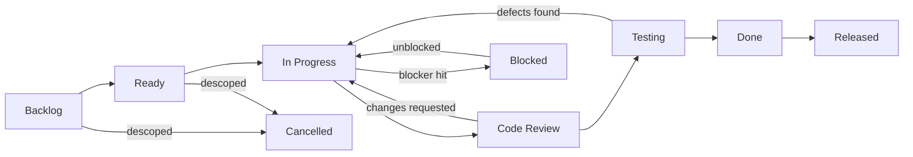

# SmartSense Marketplace — Master Engineering Task Tracker

Version: 1.0

---

## Purpose

### Goals

- Provide the project's **high-level engineering backlog**: every unit of planned work, organized by milestone, with priority, status, and dependencies visible at a glance.
- Organize engineering work — this document deliberately explains _nothing_; every "why" and "how" lives in the documentation each task references.
- Serve as the durable, reviewable record of what was planned versus delivered, maintained by PR like every other document.

### Scope

Task organization only. Architecture, conventions, milestone definitions, and product rationale are owned elsewhere ([Related Documentation](#related-documentation)). A task here is a pointer — one line naming the work, linking its milestone and its documentation — never a specification.

### Audience

Engineers picking up work, reviewers checking scope, and the product owner reading delivery state.

### Relationship with Jira

Jira (`SM-*` issues) is the **operational tracker**: assignees, sprint state, comments, and day-to-day movement live there, and every commit references its Jira key ([coding-standards.md § 13](./coding-standards.md#13-git--commit-message-standards)). This document is the **structural backlog**: the stable, versioned map of what work exists and how it clusters into milestones. Rule of thumb — a task appears here when it is _planned engineering work with a milestone home_; it gets a Jira issue when someone is about to execute it. When the two disagree, Jira reflects the present; this document is corrected at the next review ([Review Process](#review-process)).

### Relationship with milestones.md

[milestones.md](./milestones.md) defines milestones (objective, deliverables, exit criteria, risk); this document breaks them into tasks. A milestone's status in [milestones.md § Milestone Overview](./milestones.md#milestone-overview) is derived reality: it may not read `✅ Complete` while tasks under it here remain open.

**Assumptions made explicit.**

1. **This document supersedes the root-level `TASKS.md`** (the historical working checklist, which used pre-monorepo "Phase 1–12" numbering and an older milestone numbering incompatible with the current M1–M20 scheme). Completed work recorded there is carried into the milestone breakdowns below; the root file remains as a historical log until retired (tracked as debt item TD-9).
2. **Task IDs** use the `M<milestone>-T<n>` scheme, aligned to [milestones.md](./milestones.md). IDs are stable once assigned — a cancelled task keeps its ID with status `Cancelled`; IDs are never reused.
3. One item from the historical log — an "approval checkpoint" holding the initial migration's application to a local database — is treated as superseded: M7's integration suite runs against a migrated database, which is stronger evidence than the checkpoint it was waiting on.

---

## Task Lifecycle



The lifecycle mirrors the development lifecycle gates in [milestones.md § Development Lifecycle](./milestones.md#development-lifecycle) — Code Review and Testing here are the same gates described there, viewed per task instead of per milestone. `Done → Released` is distinct because a merged task is not user-reachable until its release deploys ([deployment.md § Release Strategy](./deployment.md#release-strategy)); until deployed environments exist, `Done` is the practical terminal state.

---

## Priority Definitions

| Priority     | Meaning                                                                                     | Response expectation                                                                                             |
| ------------ | ------------------------------------------------------------------------------------------- | ---------------------------------------------------------------------------------------------------------------- |
| **Critical** | Blocks all other work, breaks the build/main branch, or is a security/data-integrity defect | Drop current work; fix before anything else merges                                                               |
| **High**     | On the critical path of the current or next milestone                                       | Scheduled into current work; picked up next when free                                                            |
| **Medium**   | Needed for a committed milestone but not on its critical path                               | Scheduled within the milestone; may flex order                                                                   |
| **Low**      | Worth doing, no milestone blocks on it                                                      | Picked up opportunistically or batched                                                                           |
| **Future**   | Acknowledged, deliberately unscheduled — tied to an uncommitted release                     | Not scheduled; revisited at roadmap reviews ([roadmap.md § Roadmap Governance](./roadmap.md#roadmap-governance)) |

---

## Task Status Definitions

| Status          | Meaning                                                                                                                                     |
| --------------- | ------------------------------------------------------------------------------------------------------------------------------------------- |
| **Backlog**     | Identified and milestone-assigned; not yet refined enough to start                                                                          |
| **Planned**     | Committed to the upcoming work window; refinement scheduled                                                                                 |
| **Ready**       | Acceptance criteria clear, dependencies met, Jira issue exists — anyone can pick it up                                                      |
| **In Progress** | Actively being worked; has an owner in Jira                                                                                                 |
| **Blocked**     | Cannot proceed; the blocker is named on the task (a nameless blocker is not a valid state)                                                  |
| **Review**      | PR open, in code review                                                                                                                     |
| **Testing**     | Merged to a verification state or under explicit test per its acceptance criteria                                                           |
| **Completed**   | Acceptance criteria verified — the task-level analogue of the DoD ([coding-standards.md § 16](./coding-standards.md#16-definition-of-done)) |
| **Cancelled**   | Deliberately descoped; reason recorded in Notes; ID retired, never reused                                                                   |

---

## Task Template

```markdown
### <Task ID> — <Title>

| Field                        | Value                                                    |
| ---------------------------- | -------------------------------------------------------- |
| **Task ID**                  | M<milestone>-T<n>                                        |
| **Title**                    | Imperative, one line ("Implement silent token refresh")  |
| **Description**              | 1–3 sentences of scope; links, not explanations          |
| **Related Milestone**        | M<n> (milestones.md)                                     |
| **Priority**                 | Critical / High / Medium / Low / Future                  |
| **Status**                   | Per Task Status Definitions                              |
| **Dependencies**             | Task IDs or external decisions this waits on             |
| **Acceptance Criteria**      | Verifiable statements — "done when X demonstrably holds" |
| **Documentation References** | The docs that specify this work (design, conventions)    |
| **Jira Epic**                | SM-<n>                                                   |
| **Estimated Effort**         | S (≤1 day) / M (2–3 days) / L (≤1 week) / XL (split it)  |
| **Notes**                    | Decisions, deferrals, cancellation reasons               |
```

An `XL` estimate is not an estimate — it is an instruction to split the task before it becomes `Ready`.

---

## Milestone Task Breakdown

High-level tasks per milestone. Completed milestones (M1–M7) record what was actually delivered, carried from the historical log. Statuses: ✅ Completed · 🔵 In Progress · 🟡 Blocked · ⬜ Backlog/Planned/Ready as labeled. Detail per task belongs in Jira and the referenced docs, not here.

### M1 — Project Foundation ✅

| Task ID | Task                                                               | Priority | Status       | Dependencies |
| ------- | ------------------------------------------------------------------ | -------- | ------------ | ------------ |
| M1-T1   | Turborepo + npm workspaces monorepo conversion                     | High     | ✅ Completed | —            |
| M1-T2   | Shared `tsconfig` / `eslint-config` packages; strict TS everywhere | High     | ✅ Completed | M1-T1        |
| M1-T3   | Husky + commitlint + lint-staged quality gates                     | High     | ✅ Completed | M1-T1        |
| M1-T4   | CI workflow: install → Prisma generate → lint → typecheck → build  | High     | ✅ Completed | M1-T1        |
| M1-T5   | Root README and workspace scripts                                  | Medium   | ✅ Completed | M1-T1        |

### M2 — Frontend Foundation ✅

| Task ID | Task                                                           | Priority | Status       | Dependencies |
| ------- | -------------------------------------------------------------- | -------- | ------------ | ------------ |
| M2-T1   | Vite + React 19 + Tailwind v4 app shell                        | High     | ✅ Completed | M1           |
| M2-T2   | Feature-based folder scaffold (`app/`, `features/`, `shared/`) | High     | ✅ Completed | M2-T1        |
| M2-T3   | Path aliases across tsconfig + Vite                            | Medium   | ✅ Completed | M2-T1        |
| M2-T4   | Router + providers composition root, placeholder route         | Medium   | ✅ Completed | M2-T2        |

### M3 — Backend Foundation ✅

| Task ID | Task                                                                                   | Priority | Status       | Dependencies |
| ------- | -------------------------------------------------------------------------------------- | -------- | ------------ | ------------ |
| M3-T1   | NestJS 11 + Apollo Server 5 code-first GraphQL app                                     | High     | ✅ Completed | M1           |
| M3-T2   | Domain module scaffold (auth/users/catalog/orders/billing)                             | High     | ✅ Completed | M3-T1        |
| M3-T3   | Global exception filter, validation pipe, logging service, config + Joi                | High     | ✅ Completed | M3-T1        |
| M3-T4   | `/health` endpoint (Terminus) and API Dockerfile                                       | Medium   | ✅ Completed | M3-T1        |
| M3-T5   | Boot-repair fixes: DI-breaking lint rule, logger recursion, Apollo dep, Docker context | Critical | ✅ Completed | M3-T1–T4     |

### M4 — Database ✅

| Task ID | Task                                                                  | Priority | Status       | Dependencies |
| ------- | --------------------------------------------------------------------- | -------- | ------------ | ------------ |
| M4-T1   | Domain model + schema design docs                                     | High     | ✅ Completed | M3           |
| M4-T2   | Prisma schema (16 entities, explicit relations, soft delete, indexes) | High     | ✅ Completed | M4-T1        |
| M4-T3   | Initial migration + hand-written `CHECK`/exclusion constraints        | High     | ✅ Completed | M4-T2        |
| M4-T4   | Constraint verification against a scratch PostgreSQL 17               | High     | ✅ Completed | M4-T3        |
| M4-T5   | Seed script (Roles, Permissions, admin, sample data)                  | Medium   | ✅ Completed | M4-T2        |

### M5 — Authentication Design ✅

| Task ID | Task                                                                             | Priority | Status       | Dependencies |
| ------- | -------------------------------------------------------------------------------- | -------- | ------------ | ------------ |
| M5-T1   | Full auth/authz architecture document ([authentication.md](./authentication.md)) | High     | ✅ Completed | M4           |

### M6 — Keycloak Infrastructure ✅

| Task ID | Task                                                           | Priority | Status       | Dependencies |
| ------- | -------------------------------------------------------------- | -------- | ------------ | ------------ |
| M6-T1   | Keycloak + dedicated Postgres in both compose files            | High     | ✅ Completed | M5           |
| M6-T2   | Realm export (roles, groups, clients, test users), auto-import | High     | ✅ Completed | M6-T1        |
| M6-T3   | Env wiring (`.env.example` both apps) + verification checklist | Medium   | ✅ Completed | M6-T2        |

### M7 — Backend Authentication ✅

| Task ID | Task                                                                | Priority | Status       | Dependencies |
| ------- | ------------------------------------------------------------------- | -------- | ------------ | ------------ |
| M7-T1   | JWT strategy (JWKS) + global guard chain                            | High     | ✅ Completed | M5, M6       |
| M7-T2   | `@Public()`/`@Roles()`/`@Permissions()`/`@CurrentUser()` decorators | High     | ✅ Completed | M7-T1        |
| M7-T3   | User provisioning + Keycloak role sync + PermissionService          | High     | ✅ Completed | M7-T1        |
| M7-T4   | `me` query + audience mapper + seed alignment                       | Medium   | ✅ Completed | M7-T3        |
| M7-T5   | Unit specs + full auth e2e suite (real Postgres, mock JWKS)         | High     | ✅ Completed | M7-T1–T4     |

### M8 — Frontend Authentication

| Task ID | Task                                                                                                            | Priority | Status     | Dependencies |
| ------- | --------------------------------------------------------------------------------------------------------------- | -------- | ---------- | ------------ |
| M8-T1   | Resolve silent-refresh open question ([authentication.md § Open Questions](./authentication.md#open-questions)) | High     | ⬜ Ready   | —            |
| M8-T2   | Auth service wrapping the Keycloak adapter (sole Keycloak import)                                               | High     | ⬜ Ready   | M8-T1        |
| M8-T3   | `useAuth` / permission hooks reading resolved `me` data                                                         | High     | ⬜ Backlog | M8-T2        |
| M8-T4   | Route guards (`ProtectedRoute`, `PermissionRoute`, `PublicRoute`)                                               | High     | ⬜ Backlog | M8-T3        |
| M8-T5   | Apollo auth + error links (token attach, `UNAUTHENTICATED` handling)                                            | High     | ⬜ Backlog | M8-T2        |
| M8-T6   | `/login`, `/unauthorized`, `/forbidden` pages                                                                   | Medium   | ⬜ Backlog | M8-T4        |

### M9 — GraphQL Integration

| Task ID | Task                                                                               | Priority | Status     | Dependencies |
| ------- | ---------------------------------------------------------------------------------- | -------- | ---------- | ------------ |
| M9-T1   | Codegen running against the live schema in the dev workflow                        | High     | ⬜ Backlog | M7           |
| M9-T2   | Consume `me` via generated hook end to end                                         | High     | ⬜ Backlog | M9-T1, M8-T5 |
| M9-T3   | First shared fragments; conventions from [graphql.md](./graphql.md) proven in code | Medium   | ⬜ Backlog | M9-T2        |

### M10 — Shared Component Library

| Task ID | Task                                                                                                       | Priority | Status     | Dependencies |
| ------- | ---------------------------------------------------------------------------------------------------------- | -------- | ---------- | ------------ |
| M10-T1  | Design-token + icon-library decisions (`@theme`, per [ui-guidelines.md](./ui-guidelines.md#design-system)) | High     | ⬜ Backlog | —            |
| M10-T2  | Introduce frontend test tooling (Vitest + React Testing Library) — closes TD-3                             | High     | ⬜ Backlog | —            |
| M10-T3  | Form + action primitives: Button, Input, Select, Modal                                                     | High     | ⬜ Backlog | M10-T1, T2   |
| M10-T4  | Data primitives: Table, Pagination, Card, Badge                                                            | High     | ⬜ Backlog | M10-T1, T2   |
| M10-T5  | State primitives: Skeleton, Empty State, Error State, Toast                                                | High     | ⬜ Backlog | M10-T1, T2   |
| M10-T6  | App shell: sidebar, header, role-parameterized layout                                                      | High     | ⬜ Backlog | M10-T3–T5    |

### M11 — Dashboard

| Task ID | Task                                                               | Priority | Status  | Dependencies |
| ------- | ------------------------------------------------------------------ | -------- | ------- | ------------ |
| M11-T1  | Dashboard schema/resolvers (overview, statistics, recent activity) | High     | ✅ Done | M8, M9       |
| M11-T2  | Dashboard pages with per-card progressive loading, all four states | High     | ✅ Done | M11-T1, M10  |
| M11-T3  | Role-scoped dashboard variants (Admin / Partner / Customer)        | Medium   | ✅ Done | M11-T2       |
| M11-T4  | Document the vertical-slice pattern as the M12–M17 reference       | Medium   | ✅ Done | M11-T2       |

### M12 — Catalog

| Task ID | Task                                                                     | Priority | Status         | Dependencies |
| ------- | ------------------------------------------------------------------------ | -------- | -------------- | ------------ |
| M12-T1  | Product/variant CRUD (schema → resolvers → services → UI)                | High     | ✅ Completed   | M8, M9, M10  |
| M12-T2  | Category taxonomy management                                             | Medium   | 🔵 In Progress | M12-T1       |
| M12-T3  | Inventory tracking with reservation invariants                           | High     | ⬜ Backlog     | M12-T1       |
| M12-T4  | List conventions first implementation: cursor pagination, filter, search | High     | ✅ Completed   | M12-T1       |
| M12-T5  | Product forms (React Hook Form + Zod) incl. publish lifecycle            | High     | ✅ Completed   | M12-T1       |

**M12 scope notes (Catalog Foundation pass):**

- **M12-T1** — `Product`/`Category`/`ProductVariant`/`Inventory` already existed in `schema.prisma` from M4; no migration was needed. Per a confirmed scope decision, `ProductVariant`/`Inventory` are created transactionally by `CatalogService` as internal implementation details and are never exposed via the GraphQL API or UI — every Product's `sku` is flattened from its hidden singleton variant. `price` is intentionally absent from the schema entirely (no field, no placeholder scalar) until the Decimal/Money scalar ships with M14 Billing.
- **M12-T2** — Read/browse only (flat `categories` query + `CategorySelect`), matching Jira SM-63/SM-119's scope. Admin create/edit/delete category management (`docs/domain-model.md` Assumption 4) is not built this pass.
- **M12-T3** — Deliberately descoped: a zero-quantity `Inventory` row is created alongside each Product's hidden variant only to satisfy the domain invariant ("every ProductVariant has exactly one Inventory record") — no stock levels, reservation, or low-stock logic exists. Revisit alongside M13 Orders, which is the first real consumer of inventory reservation.
- New in this pass, not originally itemized: `GlobalExceptionFilter` gained a `ConflictException` → `CONFLICT` mapping (`docs/graphql.md` § 11), first exercised by SKU-uniqueness conflicts; `AuthenticatedUser` gained `partnerId`/`customerId` (`docs/authentication.md` already assumed these existed for ownership checks — this pass is what actually wired them through); `ToastProvider` was mounted at the app composition root (`app/providers`) — it existed since M10 but was never connected until Catalog's mutations needed it.

### M13 — Orders

| Task ID | Task                                                                                          | Priority | Status     | Dependencies |
| ------- | --------------------------------------------------------------------------------------------- | -------- | ---------- | ------------ |
| M13-T1  | Order placement with transactional inventory reservation                                      | High     | ⬜ Backlog | M12          |
| M13-T2  | Status lifecycle + transition guards per [domain-model.md](./domain-model.md#order-lifecycle) | High     | ⬜ Backlog | M13-T1       |
| M13-T3  | Order list/detail pages + timeline UI                                                         | High     | ⬜ Backlog | M13-T2       |
| M13-T4  | Cross-table invariants (single-partner orders, server-computed totals) + tests                | Critical | ⬜ Backlog | M13-T1       |

### M14 — Billing

| Task ID | Task                                                                                       | Priority | Status     | Dependencies |
| ------- | ------------------------------------------------------------------------------------------ | -------- | ---------- | ------------ |
| M14-T1  | `Money`/`Decimal` GraphQL scalar decision ([graphql.md § 7](./graphql.md#7-graphql-types)) | High     | ⬜ Backlog | —            |
| M14-T2  | Invoice generation per completed order                                                     | High     | ⬜ Backlog | M13, M14-T1  |
| M14-T3  | Payment recording with idempotency key                                                     | Critical | ⬜ Backlog | M14-T2       |
| M14-T4  | Invoice/payment status reconciliation + tests                                              | Critical | ⬜ Backlog | M14-T3       |
| M14-T5  | Billing pages + CSV/PDF export                                                             | Medium   | ⬜ Backlog | M14-T2       |

### M15 — Reports

| Task ID | Task                                                | Priority | Status     | Dependencies |
| ------- | --------------------------------------------------- | -------- | ---------- | ------------ |
| M15-T1  | Billing report generation (non-overlapping periods) | High     | ⬜ Backlog | M14          |
| M15-T2  | Sales summaries + downloadable exports              | Medium   | ⬜ Backlog | M15-T1       |
| M15-T3  | Ledger reconciliation tests as exit gate            | High     | ⬜ Backlog | M15-T1       |

### M16 — Notifications

| Task ID | Task                                       | Priority | Status     | Dependencies |
| ------- | ------------------------------------------ | -------- | ---------- | ------------ |
| M16-T1  | Domain event model design                  | High     | ⬜ Backlog | M13          |
| M16-T2  | In-app notification center                 | Medium   | ⬜ Backlog | M16-T1       |
| M16-T3  | Email delivery channel + v1.1 event wiring | Medium   | ⬜ Backlog | M16-T1       |

### M17 — Settings

| Task ID | Task                          | Priority | Status     | Dependencies |
| ------- | ----------------------------- | -------- | ---------- | ------------ |
| M17-T1  | User profile management       | Medium   | ⬜ Backlog | M8           |
| M17-T2  | Partner organization settings | Medium   | ⬜ Backlog | M17-T1       |
| M17-T3  | Notification preferences      | Low      | ⬜ Backlog | M16, M17-T1  |

### M18 — Playwright Testing

| Task ID | Task                                                      | Priority | Status     | Dependencies |
| ------- | --------------------------------------------------------- | -------- | ---------- | ------------ |
| M18-T1  | Wire unit + integration test stages into CI — closes TD-2 | High     | ⬜ Backlog | —            |
| M18-T2  | Auth journey suite + page object foundation               | High     | ⬜ Backlog | M8           |
| M18-T3  | Module suites: dashboard, catalog, orders, billing        | High     | ⬜ Backlog | M11–M14      |
| M18-T4  | Playwright stage in CI, stable (zero tolerated flakes)    | High     | ⬜ Backlog | M18-T1–T3    |

### M19 — Performance Optimization

| Task ID | Task                                                                                       | Priority | Status     | Dependencies |
| ------- | ------------------------------------------------------------------------------------------ | -------- | ---------- | ------------ |
| M19-T1  | N+1 audit + per-request DataLoader where needed                                            | High     | ⬜ Backlog | M11–M14      |
| M19-T2  | Query depth/complexity limits ([graphql.md § 12](./graphql.md#12-security-considerations)) | High     | ⬜ Backlog | M11–M14      |
| M19-T3  | Bundle/lazy-loading audit + index verification against real queries                        | Medium   | ⬜ Backlog | M11–M14      |
| M19-T4  | Baseline load test with latency targets                                                    | Medium   | ⬜ Backlog | M19-T1–T3    |

### M20 — Production Readiness

| Task ID | Task                                                                                                   | Priority | Status     | Dependencies   |
| ------- | ------------------------------------------------------------------------------------------------------ | -------- | ---------- | -------------- |
| M20-T1  | Merge the Docker build-context fix into `development` — closes TD-1                                    | Critical | ⬜ Ready   | —              |
| M20-T2  | Hosting/secrets/monitoring stack decisions (risk D2, [milestones.md](./milestones.md#risk-management)) | High     | ⬜ Backlog | —              |
| M20-T3  | Provision environments (Development → QA → Staging → Production)                                       | High     | ⬜ Backlog | M20-T2         |
| M20-T4  | CD pipeline: image build/push, migrate-then-deploy, smoke tests                                        | High     | ⬜ Backlog | M20-T3, M18    |
| M20-T5  | `/health` dependency indicators + api container healthcheck — closes TD-4/TD-5                         | Medium   | ⬜ Backlog | —              |
| M20-T6  | Monitoring, alerting, backup + rehearsed restore                                                       | High     | ⬜ Backlog | M20-T3         |
| M20-T7  | Production security posture verification + v1.0 launch                                                 | Critical | ⬜ Backlog | M20-T4–T6, M19 |

---

## Technical Debt

Known, deliberately tracked debt — each item names its planned resolution point rather than floating indefinitely:

| ID   | Item                                                                                      | Priority | Reason it exists                                                   | Impact if unaddressed                                            | Planned resolution           |
| ---- | ----------------------------------------------------------------------------------------- | -------- | ------------------------------------------------------------------ | ---------------------------------------------------------------- | ---------------------------- |
| TD-1 | Docker build-context fix unmerged ([deployment.md](./deployment.md), Assumption 3)        | Critical | Fix landed on `chore/claude-agents`, never merged to `development` | `docker compose up --build` fails from the main line             | M20-T1 (do not wait for M20) |
| TD-2 | CI runs no tests ([testing.md § CI Testing Pipeline](./testing.md#ci-testing-pipeline))   | High     | Test stages deferred while suites were small                       | Working test suites cannot fail a PR; regressions merge silently | M18-T1                       |
| TD-3 | No frontend unit/component test tooling ([testing.md](./testing.md), tooling assumption)  | High     | Frontend has had no logic worth testing yet                        | M10+ components would ship untested; retrofitting is costlier    | M10-T2                       |
| TD-4 | `/health` verifies nothing (`health.check([])`)                                           | Medium   | Endpoint scaffolded before dependencies existed                    | Orchestrators see "healthy" while the database is unreachable    | M20-T5                       |
| TD-5 | `api` Compose service has no container healthcheck                                        | Low      | Depends on TD-4 being meaningful first                             | Compose cannot gate on API readiness                             | M20-T5                       |
| TD-6 | No correlation IDs in logs ([api-conventions.md § Logging](./api-conventions.md#logging)) | Medium   | Deferred until log aggregation exists                              | Multi-request debugging in aggregated logs is guesswork          | With M20-T6                  |
| TD-7 | Root `package.json` lacks `"type": "module"` — Node re-parse warning on every commit hook | Low      | Harmless warning, never prioritized                                | Hook-output noise; masks real warnings                           | Opportunistic                |
| TD-8 | Design-session transcripts (`conversation.txt`, `database-conversation.txt`) at repo root | Low      | Working artifacts committed during design sessions                 | Repo hygiene; confuses newcomers about what is authoritative     | Opportunistic                |
| TD-9 | Root `TASKS.md` historical checklist overlaps this document                               | Low      | Predates this tracker (Assumption 1)                               | Two task sources drift; ambiguity about which is canonical       | Retire after M8 lands        |

---

## Bugs

No open bugs are currently tracked at this level (defects found to date were fixed within their milestone — e.g. M3-T5). Report per [testing.md § Bug Reporting Guidelines](./testing.md#bug-reporting-guidelines); track here only bugs that survive triage as scheduled work:

| ID  | Bug (one line)   | Severity                      | Priority | Status | Found in | Jira | Regression test ([testing.md](./testing.md#regression-testing)) |
| --- | ---------------- | ----------------------------- | -------- | ------ | -------- | ---- | --------------------------------------------------------------- |
| B-1 | _(template row)_ | Critical/Major/Minor/Cosmetic | —        | —      | —        | SM-? | required before close                                           |

---

## Improvements

Enhancements to existing, working functionality (distinct from debt — nothing is wrong; something could be better):

| ID  | Improvement                                                                             | Priority | Status     | Milestone | Notes                                                                                |
| --- | --------------------------------------------------------------------------------------- | -------- | ---------- | --------- | ------------------------------------------------------------------------------------ |
| I-1 | Dark mode implementation ([ui-guidelines.md § Dark Mode](./ui-guidelines.md#dark-mode)) | Future   | ⬜ Backlog | Post-M10  | Variant scaffold exists; components must ship `dark:` styles together                |
| I-2 | Storybook (or equivalent) for the shared component library                              | Future   | ⬜ Backlog | Post-M10  | Per [ui-guidelines.md § Future Enhancements](./ui-guidelines.md#future-enhancements) |

## Refactoring

Structural changes with no behavior change — always motivated by a named friction, never speculative:

| ID  | Refactoring                                       | Priority | Status | Trigger (the named friction)                                                                              | Notes |
| --- | ------------------------------------------------- | -------- | ------ | --------------------------------------------------------------------------------------------------------- | ----- |
| R-1 | _(template row — e.g. extract `OrderRepository`)_ | —        | —      | Query shape reused verbatim by ≥2 services ([api-conventions.md](./api-conventions.md#request-lifecycle)) | —     |

## Future Enhancements

Product-level candidates live in [roadmap.md § Future Product Vision](./roadmap.md#future-product-vision); engineering-level candidates in each doc's own Future Enhancements section. Track here only once an item gets a milestone home:

| ID  | Enhancement      | Source document | Priority | Status | Milestone (when assigned) |
| --- | ---------------- | --------------- | -------- | ------ | ------------------------- |
| F-1 | _(template row)_ | —               | Future   | —      | —                         |

---

## Release Checklist

Run per release, in order. Each line is a gate — the detail behind it lives in the referenced document, not here:

| #   | Gate              | Verified by                                                                                                                                                                                                                                                                     |
| --- | ----------------- | ------------------------------------------------------------------------------------------------------------------------------------------------------------------------------------------------------------------------------------------------------------------------------- |
| 1   | **Documentation** | Every doc invalidated by this release was updated in-PR ([coding-standards.md § 16](./coding-standards.md#16-definition-of-done)); [milestones.md](./milestones.md) statuses reconciled                                                                                         |
| 2   | **Testing**       | Full automated suite green in CI; new critical paths covered; zero skipped/flaky tests ([testing.md](./testing.md#regression-testing)); manual checklist run for what automation doesn't cover ([testing.md § Manual Testing Checklist](./testing.md#manual-testing-checklist)) |
| 3   | **Performance**   | No unbounded queries or known N+1 introduced; latency targets hold at representative volume (M19 gates apply from v1.0 on)                                                                                                                                                      |
| 4   | **Security**      | Introspection/Playground off, no dev-placeholder secrets, dependencies audited, authorization verified for all new operations ([deployment.md § Security During Deployment](./deployment.md#security-during-deployment))                                                        |
| 5   | **Deployment**    | [deployment.md § Best Practices](./deployment.md#best-practices) checklist passes: image built once from root context, env vars present, migrate-before-serve                                                                                                                   |
| 6   | **Rollback**      | Previous image tag identified and confirmed re-deployable; migrations in this release are expand-safe ([deployment.md § Database Deployment](./deployment.md#database-deployment))                                                                                              |
| 7   | **Monitoring**    | Post-deploy verification green (healthchecks, `/health`, GraphQL query, login); dashboards/alerts show the deploy marker with no anomaly ([deployment.md § Monitoring](./deployment.md#monitoring))                                                                             |

---

## Maintenance Tasks

Recurring work — scheduled, not remembered:

| Task                          | Cadence                      | Notes                                                                                                                            |
| ----------------------------- | ---------------------------- | -------------------------------------------------------------------------------------------------------------------------------- |
| Dependency updates            | Monthly batch                | Pinned majors bumped deliberately; lockfile-only updates batched; breaking majors get their own task                             |
| Security patches              | On advisory                  | Critical advisories preempt the monthly batch — treated as Critical priority                                                     |
| Database maintenance          | Quarterly                    | Index bloat/slow-query review against [database-schema.md § Indexing Strategy](./database-schema.md#indexing-strategy)           |
| Keycloak upgrades             | Per supported release        | Follow [deployment.md § Keycloak Deployment](./deployment.md#keycloak-deployment): backup → bump → verify                        |
| License review                | Quarterly                    | New dependencies since last review checked for license compatibility                                                             |
| Backup verification           | Monthly (once backups exist) | A restore rehearsal, not a file-exists check ([deployment.md § Backup & Recovery](./deployment.md#backup--recovery))             |
| Docs ↔ reality reconciliation | Every release boundary       | Same review that reconciles [roadmap.md](./roadmap.md#roadmap-governance) and [milestones.md](./milestones.md#progress-tracking) |

---

## Review Process

1. **Intake** — new work enters as `Backlog` under its milestone (or the Debt/Bugs/Improvements sections), via PR to this document.
2. **Refinement** — before a work window, `Backlog → Ready`: acceptance criteria written, dependencies confirmed met, Jira issue created and linked. A task that can't state its acceptance criteria isn't ready — it goes back for splitting or design.
3. **Execution** — status moves through the [Task Lifecycle](#task-lifecycle); day-to-day movement lives in Jira, and this document is updated at meaningful transitions (started, blocked, completed, cancelled), not per stand-up.
4. **Completion** — `Completed` requires the acceptance criteria demonstrably met and the change-level DoD satisfied; when the last task of a milestone completes, the milestone's exit criteria are verified and [milestones.md](./milestones.md#progress-tracking) is updated in the same PR.
5. **Reconciliation** — at every release boundary, this document, Jira, and [milestones.md](./milestones.md) are reconciled; disagreements resolve in favor of delivery reality.

---

## Best Practices

Guidelines for writing tasks in this tracker:

- **One outcome per task.** "Build catalog" is a milestone; "cursor pagination on the product list" is a task. If the title needs "and", split it.
- **Imperative, specific titles.** "Implement silent token refresh," not "auth improvements."
- **Acceptance criteria are verifiable.** "Works correctly" is not a criterion; "an expired token triggers refresh without user-visible interruption" is.
- **Point, don't explain.** A task links the doc that specifies the work; a task body that explains architecture belongs in that doc instead.
- **Name blockers.** `Blocked` without a named blocker is `Backlog` wearing a costume.
- **Estimate honestly, split ruthlessly.** `XL` means split; a task in progress for more than a week without status movement means split-and-re-scope.
- **Keep IDs stable.** Cancelled tasks keep their ID and their reason — history is part of the record.

---

## Related Documentation

| Document                                     | Relationship                                            |
| -------------------------------------------- | ------------------------------------------------------- |
| [requirements.md](./requirements.md)         | Functional scope tasks trace back to                    |
| [roadmap.md](./roadmap.md)                   | Product releases the milestones (and thus tasks) serve  |
| [milestones.md](./milestones.md)             | Milestone definitions this backlog decomposes           |
| [coding-standards.md](./coding-standards.md) | Change-level DoD every task's PRs must meet             |
| [testing.md](./testing.md)                   | Quality gates; bug reporting and regression rules       |
| [deployment.md](./deployment.md)             | Release/rollback mechanics behind the Release Checklist |

---

## Revision History

| Version | Date       | Author       | Changes                                                                                                                                                       |
| ------- | ---------- | ------------ | ------------------------------------------------------------------------------------------------------------------------------------------------------------- |
| 1.0     | 2026-07-02 | Yash Lakhani | Initial tracker — replaces placeholder; supersedes the root-level historical checklist; M1–M7 task history carried over; TD-1–TD-9 debt register established. |
