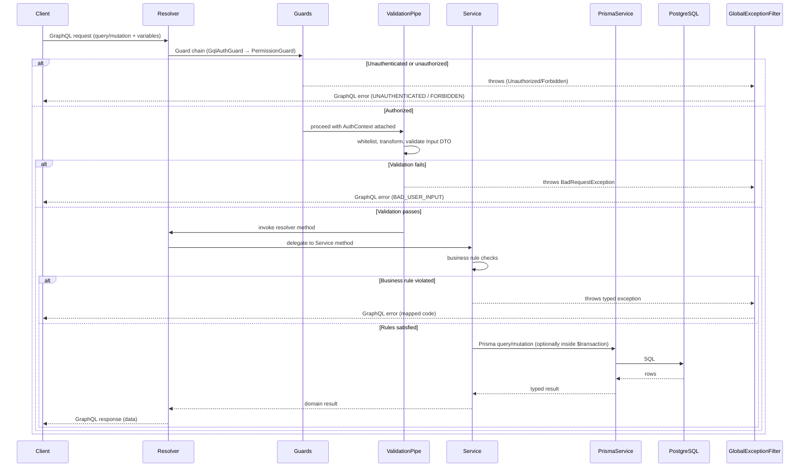

# SmartSense Marketplace — API Development Conventions

Version: 1.0

---

## Purpose

### Scope

This document defines **how backend API code is implemented** inside `apps/api` — the concrete layering, control flow, and implementation-level conventions a developer follows when adding or changing a resolver, service, or database interaction. It complements, and deliberately does not repeat:

| Already covered elsewhere                                                      | See                                          |
| ------------------------------------------------------------------------------ | -------------------------------------------- |
| General architectural principles, layering, data flow                          | [architecture.md](./architecture.md)         |
| TypeScript/React/NestJS/Prisma coding standards, naming at the code level      | [coding-standards.md](./coding-standards.md) |
| GraphQL schema design, query/mutation/type conventions, Apollo Client, codegen | [graphql.md](./graphql.md)                   |
| Prisma schema, relations, indexing, constraints                                | [database-schema.md](./database-schema.md)   |
| JWT validation, guard chain, roles/permissions, session management             | [authentication.md](./authentication.md)     |
| Domain entities and business rules                                             | [domain-model.md](./domain-model.md)         |
| Folder responsibilities and module structure                                   | [folder-structure.md](./folder-structure.md) |

Where this document references a rule already stated in one of the above, it links to it rather than restating it. Read those first — this document assumes their conventions as given and builds the implementation-level detail on top of them.

### Goals

- One predictable path from "a request arrives" to "a response is returned" that holds for every module, so a developer unfamiliar with a specific feature can still navigate its implementation.
- A clear, enforceable boundary between _what a layer is allowed to do_ and _what it must delegate elsewhere_ — this is what keeps [coding-standards.md](./coding-standards.md)'s module rules (resolver → service → Prisma) true in practice, not just on paper.
- Consistent handling of the concerns that cut across every endpoint regardless of domain: validation, errors, transactions, pagination, logging, and security.

### API Philosophy

- **GraphQL-first, resolver-thin.** As established in [graphql.md § Backend (NestJS) Standards](./graphql.md#scope-of-graphql-within-the-system), the API surface is GraphQL; a resolver's job is to declare shape and delegate, never to hold logic.
- **Fail closed, not open.** Authentication is opt-out (`@Public()`), permission checks default to deny, and an identity with no matching database row is rejected rather than provisioned on a guess (see `AuthService.resolveUser` and [authentication.md](./authentication.md)) — the same posture extends to this document's validation and error-handling conventions below.
- **The database is the source of truth for the current state; the service layer is the source of truth for how it changes.** No layer above the service (resolver, DTO) and no layer below it (Prisma, Postgres) makes a business decision — see [§ Business Logic Rules](#business-logic-rules).
- **Boring and consistent beats clever and bespoke.** A new module's resolver/service/DTO should look like it was written by the same person who wrote the last one — [coding-standards.md § 2 General Principles](./coding-standards.md#2-general-principles) applies to API code as much as anywhere else.

---

## Request Lifecycle

Every GraphQL operation flows through the same fixed sequence of layers. No layer is skipped, and no layer reaches past its immediate neighbor (a resolver does not call Prisma directly; a service does not inspect the raw GraphQL context).

```
Client
  ↓
GraphQL Resolver       (declares the operation, delegates immediately)
  ↓
Guard                  (GqlAuthGuard → PermissionGuard)
  ↓
Validation             (AppValidationPipe against the Input DTO)
  ↓
Service                (business logic, orchestration, transactions)
  ↓
Repository / Prisma    (data access — see the note on Repository below)
  ↓
Database               (PostgreSQL)
  ↓
Response               (mapped back through Service → Resolver → GlobalExceptionFilter on error)
```

**Assumption made explicit — "Repository" today is `PrismaService`, not a separate class.** This codebase does not currently introduce a dedicated Repository layer distinct from the Service (see `AuthService`, `PermissionService` in `apps/api/src/modules/auth/`, both of which inject `PrismaService` and query it directly). `PrismaService` itself — a thin `PrismaClient` subclass wiring connection lifecycle to Nest's module hooks (`apps/api/src/prisma/prisma.service.ts`) — already provides a typed, swappable data-access boundary, so a hand-written Repository class wrapping it would be a pass-through layer with no behavior of its own (a YAGNI violation per [coding-standards.md § 2](./coding-standards.md#2-general-principles)). **When to introduce a real Repository class** for a specific model: once a query shape is complex enough to be reused verbatim by two or more services, or a future requirement needs to swap the data layer under a stable interface. Until then, "Repository / Prisma" in the diagram above means: the Service's own Prisma calls.

### Sequence Diagram



This is the API-implementation expansion of the same flow [graphql.md § Architecture Overview](./graphql.md#request-lifecycle) shows from the client/Apollo Client perspective — that diagram covers cache/network behavior on the frontend; this one covers what happens once the request lands on the server.

---

## Layer Responsibilities

| Layer                   | Should contain                                                                                                                                                                                       | Should never contain                                                                                                                                        |
| ----------------------- | ---------------------------------------------------------------------------------------------------------------------------------------------------------------------------------------------------- | ----------------------------------------------------------------------------------------------------------------------------------------------------------- |
| **Resolver**            | `@Query`/`@Mutation` method signatures, GraphQL-specific decorators (`@Args`, `@CurrentUser()`), a single delegating call into the module's service                                                  | Business logic, validation logic, direct Prisma access, `try`/`catch` blocks re-implementing error handling                                                 |
| **Service**             | All business logic for its module, orchestration across the module's own Prisma calls, transaction boundaries, calls into other modules' _exported_ services                                         | Direct knowledge of the GraphQL context (`ExecutionContext`, `@Args` decorators), HTTP/GraphQL response shaping                                             |
| **Repository / Prisma** | Data access only — queries, `include`/`select` shaping, `$transaction` execution (see the note above on where this currently lives)                                                                  | Business rules, authorization decisions, DTO-to-domain mapping beyond what Prisma itself returns                                                            |
| **Prisma (client)**     | Generated, typed query methods (`prisma.order.findMany`, etc.), schema-declared constraints ([database-schema.md](./database-schema.md#design-conventions))                                          | Anything hand-modified — it is generated from `schema.prisma`, never edited directly ([coding-standards.md § Migrations](./coding-standards.md#migrations)) |
| **Guards**              | Authentication/authorization decisions only — `GqlAuthGuard`, `PermissionGuard` ([authentication.md](./authentication.md#graphql-authentication))                                                    | Business rules, data fetching beyond what's needed to authorize (e.g. do not fetch and return domain data from a guard)                                     |
| **Pipes**               | Input transformation and validation — `AppValidationPipe`, applied globally ([coding-standards.md § Validation](./coding-standards.md#validation))                                                   | Business validation that depends on database state (e.g. "does this SKU already exist for this Partner") — that belongs in the Service                      |
| **Interceptors**        | Cross-cutting request/response concerns that wrap the handler: timing/logging, response transformation, cache-key computation                                                                        | Authorization decisions (that's a Guard's job) or business logic (that's a Service's job)                                                                   |
| **Filters**             | Exception-to-response translation — `GlobalExceptionFilter`, the single place a thrown exception becomes a shaped GraphQL/HTTP error ([graphql.md § Error Handling](./graphql.md#11-error-handling)) | Business logic, retry logic, or anything beyond formatting and logging the error that already occurred                                                      |

**Assumption made explicit — no interceptors are currently registered.** `apps/api/src/common/` today holds only `filters/` and `pipes/` (see [folder-structure.md § common, config, health, prisma](./folder-structure.md#common-config-health-prisma)). The Interceptors row above states the convention for _when one is added_ (e.g. a future request-timing or correlation-ID interceptor, [§ Logging](#logging)), not a currently implemented component.

---

## Dependency Rules

| Direction                                                     | Allowed?     | Example                                                                                                                                                                       |
| ------------------------------------------------------------- | ------------ | ----------------------------------------------------------------------------------------------------------------------------------------------------------------------------- |
| Resolver → its own module's Service                           | ✅ Allowed   | `CatalogResolver` → `CatalogService`                                                                                                                                          |
| Service → `PrismaService` / `common/` / `config/`             | ✅ Allowed   | `AuthService` injecting `PrismaService` and `LoggingService`                                                                                                                  |
| Service → another module's **exported** Service               | ✅ Allowed   | Any module injecting `PermissionService`, which `AuthModule` explicitly exports                                                                                               |
| Resolver → `PrismaService` directly                           | ❌ Forbidden | Bypasses the Service's business logic and validation entirely                                                                                                                 |
| Service → another module's Resolver                           | ❌ Forbidden | A Resolver is a GraphQL-transport concern; a Service must stay transport-agnostic                                                                                             |
| Service → another module's **internal, un-exported** provider | ❌ Forbidden | Reaching into a class another module's `providers` array declares but its `exports` array does not                                                                            |
| Guard/Pipe/Filter → a specific module's Service               | ❌ Forbidden | These are transport-layer, cross-cutting components — coupling one to a single module's business logic defeats their purpose as globally registered, module-agnostic concerns |

This table is the API-implementation restatement of the module boundary already defined in [coding-standards.md § Dependency Injection](./coding-standards.md#dependency-injection) and [folder-structure.md § Import Rules (Backend)](./folder-structure.md#import-rules-backend) — the underlying rule is identical; this table exists to make the allowed/forbidden calls concrete at the layer-interaction level rather than the file-import level.

---

## Validation Strategy

### DTO Validation

Every GraphQL Input type is validated by the globally registered `AppValidationPipe` (`apps/api/src/common/pipes/validation.pipe.ts`) before a resolver method body executes — `whitelist`, `forbidNonWhitelisted`, `transform`, and `stopAtFirstError` are all enabled project-wide. Field-level rules are expressed with `class-validator` decorators directly on the Input DTO class (`@IsString()`, `@IsUUID()`, `@IsOptional()`, `@Min()`, etc.), following the DTO conventions in [coding-standards.md § DTOs](./coding-standards.md#dtos). This document does not restate those mechanics — see that section for the pipe configuration and its rationale.

### Zod vs. `class-validator` — Decision

This is not an either/or debate resolved per feature; it is a fixed split by runtime, already implied by [CLAUDE.md](../CLAUDE.md) ("Use React Hook Form with Zod for forms") and this project's dependency graph (`zod` is a dependency of `apps/web` only; `class-validator`/`class-transformer` are dependencies of `apps/api` only):

| Runtime                 | Validation library                                               | Validates                                                                           |
| ----------------------- | ---------------------------------------------------------------- | ----------------------------------------------------------------------------------- |
| `apps/web` (forms)      | Zod, via React Hook Form's resolver                              | Client-side form input, before a GraphQL mutation is even sent — fast user feedback |
| `apps/api` (Input DTOs) | `class-validator` / `class-transformer`, via `AppValidationPipe` | Every mutation/query argument, server-side, regardless of which client sent it      |

**Neither replaces the other.** Frontend Zod validation is a UX optimization (immediate feedback, no round-trip); backend `class-validator` validation is the actual security/correctness boundary, because the server can never trust that a request came from the SPA's form (or was validated at all) — the same posture as [authentication.md § Security Best Practices Checklist](./authentication.md#security-best-practices-checklist)'s "frontend permission checks are UX-only; every mutation/query re-enforces permissions server-side," applied here to input shape instead of authorization.

### Business Validation

A rule that depends on database state or cross-field/cross-entity logic is **not** expressible as a `class-validator` decorator and belongs in the Service layer instead — e.g. "a `ProductVariant.sku` must be unique within its Partner's catalog" ([database-schema.md § Relationships Explained](./database-schema.md#catalog)) requires a query, not a static annotation. See [§ Business Logic Rules](#business-logic-rules).

### Database Validation

The last line of defense, not the primary one: `CHECK` constraints, unique indexes, and the hand-added constraints documented in [database-schema.md § Constraints Added by Hand to the Migration](./database-schema.md#constraints-added-by-hand-to-the-migration) guarantee data integrity even if a bug ever bypassed DTO or Service validation. A Service should still validate business rules itself and return a clear, typed error ([§ Error Handling Strategy](#error-handling-strategy)) — relying on a database constraint violation surfacing as an error is a safety net, not an acceptable primary validation strategy, since a raw Postgres constraint error is not a good user-facing message.

---

## Business Logic Rules

**All business logic lives in the Service layer**, full stop. A Service method:

- Enforces rules from [domain-model.md](./domain-model.md) that a DTO decorator or a database constraint cannot express (e.g. "all `OrderItem`s in an Order belong to the same Partner as the Order," [database-schema.md § Constraints Not Enforceable at the Database Level](./database-schema.md#constraints-not-enforceable-at-the-database-level)).
- Recomputes any derived value server-side rather than trusting client input (an `Order.total`, per the same section).
- Coordinates multiple Prisma calls that must succeed or fail together inside a transaction ([§ Transactions](#transactions)).
- Decides _what_ happens; it does not decide _whether the caller is allowed to ask_ (that's [Guards](#layer-responsibilities)) or _how the request arrived_ (that's the Resolver).

### What Should Never Exist Inside the Resolver

- A conditional business rule (`if (order.status === 'SHIPPED') { ... }`) — the resolver has no business context to evaluate against; it calls `ordersService.cancelOrder(id)` and lets the service decide whether cancellation is currently valid.
- A Prisma call of any kind.
- Error translation logic — a resolver lets an exception propagate; it does not catch and reshape it (that's `GlobalExceptionFilter`'s job, [§ Error Handling Strategy](#error-handling-strategy)).

### What Should Never Exist Inside the Repository / Prisma Layer

- An authorization check (e.g. filtering `WHERE partnerId = ?` because the _caller_ is scoped to that Partner) — the _decision_ of which Partner the caller is scoped to is a Service/Guard concern; the query layer accepts that value as a parameter, it does not derive it.
- A cross-entity business invariant (e.g. checking `Inventory.quantityReserved <= quantityOnHand` in application code) — that's enforced at the database level via a `CHECK` constraint ([database-schema.md](./database-schema.md#constraints-added-by-hand-to-the-migration)) precisely so the query layer doesn't need to re-implement it.
- Any GraphQL- or HTTP-shaped return value — Prisma returns Prisma's own generated types; mapping those into a GraphQL `@ObjectType()` (when the shapes diverge) happens in the Service, not embedded in the query call itself.

---

## Error Handling Strategy

The full exception-to-`extensions.code` mapping and the GraphQL error response format are defined once in [graphql.md § 11 Error Handling](./graphql.md#11-error-handling) and the general error-handling standard (fail fast, never swallow silently) in [coding-standards.md § 10](./coding-standards.md#10-error-handling-standards). This section states the implementation-level practice specific to writing API code that produces those errors correctly.

### Business Errors

Thrown from the Service as the most specific applicable NestJS exception (`BadRequestException` for a violated business rule, `ConflictException` for a state conflict) at the exact point the rule is evaluated — never deferred, never represented as a returned `{ success: false }` value (see [graphql.md § 16 Common Anti-Patterns](./graphql.md#16-common-anti-patterns)).

### Validation Errors

Handled automatically by `AppValidationPipe` before the Service is ever invoked ([§ Validation Strategy](#validation-strategy)) — a Service method body can assume its DTO argument already satisfies every `class-validator` rule declared on it.

### Authorization Errors

Thrown by a Guard (`ForbiddenException` from `PermissionGuard`, an unauthorized rejection from `GqlAuthGuard`) before a resolver method — let alone a Service — ever executes. A Service should not re-check authorization a Guard already enforced; it may add **ownership scoping** on top (e.g. "this Order belongs to the caller's Partner"), which is a business rule, not a role/permission check, per [authentication.md § Security Best Practices Checklist](./authentication.md#security-best-practices-checklist) ("Ownership scoping enforced alongside, not instead of, permission checks").

### Unexpected Errors

Anything not explicitly anticipated (a Prisma error, a third-party call failure) propagates up to `GlobalExceptionFilter` uncaught, which logs it with full context and returns `INTERNAL_SERVER_ERROR` to the client. **Mapping Prisma's own error codes to a typed exception is the Service's responsibility, not the filter's** — the filter only knows "unknown exception," while the Service knows which query it just ran and what the constraint violation means domain-wise:

| Prisma error code | Meaning                           | Service should throw                                               |
| ----------------- | --------------------------------- | ------------------------------------------------------------------ |
| `P2002`           | Unique constraint violation       | `ConflictException` with a message naming the conflicting field    |
| `P2025`           | Record to update/delete not found | `NotFoundException`                                                |
| `P2003`           | Foreign key constraint violation  | `BadRequestException` (referenced entity doesn't exist/is invalid) |

```ts
// Illustrative pattern — catching a known Prisma error code and
// translating it into a typed exception the caller can act on.
try {
  return await this.prisma.productVariant.create({ data })
} catch (error) {
  if (error instanceof Prisma.PrismaClientKnownRequestError && error.code === 'P2002') {
    throw new ConflictException('SKU already exists for this Partner')
  }
  throw error
}
```

A `catch` block that does not recognize the error re-throws it unchanged — it never swallows an error it doesn't know how to translate (per [coding-standards.md § Common Anti-Patterns](./coding-standards.md#15-common-anti-patterns-to-avoid), "catching an exception only to log and rethrow unchanged" is itself an anti-pattern; this is the one legitimate reason to catch at the Service layer — to translate a small, known set of error codes, not to log-and-rethrow everything).

### Logging Expectations (Errors)

`GlobalExceptionFilter` already logs every error it handles with status/path/message context ([graphql.md § Apollo Server](./graphql.md#apollo-server)). A Service that catches and translates a Prisma error (above) does not log it a second time before re-throwing — that would duplicate the filter's log line. See [§ Logging](#logging) for what a Service _should_ log on its own.

---

## Transactions

### When to Use Prisma Transactions

Wrap a sequence of writes in `prisma.$transaction(...)` whenever they must succeed or fail together — the standard already stated in [coding-standards.md § Transactions](./coding-standards.md#transactions) (e.g. creating an `Order` and its `OrderItem` rows). This section adds the implementation-level detail of _how_.

Use the **interactive transaction** form (a callback receiving a transaction client `tx`) whenever a later write depends on the result of an earlier read/write in the same transaction — the array form (`$transaction([queryA, queryB])`) only works for independent operations with no data dependency between them:

```ts
// Illustrative pattern — Order + OrderItem creation, where OrderItem
// rows need the Order's generated id.
await this.prisma.$transaction(async (tx) => {
  const order = await tx.order.create({ data: orderData })
  await tx.orderItem.createMany({
    data: items.map((item) => ({ ...item, orderId: order.id })),
  })
  return order
})
```

### Nested Transactions

Prisma has no concept of a true nested transaction (no savepoints across separate `$transaction` calls). The rule: a Service method that needs transactional behavior takes and uses the ambient `tx` client if one is passed to it (i.e. a private helper method accepts `Prisma.TransactionClient` in place of `PrismaService` when it may be called either standalone or from within an outer transaction), rather than opening a second, independent `$transaction` inside a method that might already be running inside one. Concretely: only the outermost Service method that owns the multi-step write opens the `$transaction`; everything it calls internally uses the `tx` handle it was given.

### Rollback Strategy

Automatic and implicit: if the callback passed to `$transaction` throws (including a re-thrown, translated Prisma error per [§ Error Handling Strategy](#error-handling-strategy)), Prisma rolls back every write made inside it and propagates the error — there is no manual `ROLLBACK` call to write or forget. This is precisely why business-rule checks that should abort the whole write sequence must throw from inside the transaction callback, not be checked only before it starts (a check performed before the transaction cannot see writes made earlier in the same transaction).

### Mutations that span an external service (Keycloak Admin API)

Sprint 3's `inviteUser` and `sendPasswordResetEmail` (Users module) are the first mutations that touch a system other than Postgres — Keycloak's Admin REST API, via `KeycloakAdminService`. The convention they establish, for any future cross-system mutation:

- **Do the external call _before_ opening the Prisma transaction**, never inside it — an external HTTP call inside `$transaction` holds a DB connection open for a slow, unrelated network round-trip (the [gotcha table](#transactions) already flags this). `inviteUser` provisions the Keycloak identity first, then opens one `$transaction` for the local `User` + `UserRole` + `AuditLog` rows.
- **Make the external step idempotent on a natural key** so a retry after a partial failure doesn't double-provision — `KeycloakAdminService.createUser` treats a `409` as success by resolving the existing identity by email (the invite's equivalent of the [idempotency-key pattern](#idempotency) Billing uses).
- **On a mismatch that no transaction can undo, fail loud, not silent.** If the DB transaction fails _after_ the external call already succeeded, there is no distributed-transaction/saga machinery in this codebase to roll the external side back — log the orphaned external id at `error` level for manual reconciliation and rethrow, rather than swallowing the inconsistency. Introducing saga infrastructure for a single flow is explicitly out of scope; the loud log is the accepted trade-off.
- **No secret ever transits the app.** These mutations delegate to Keycloak's own hosted `execute-actions-email` flow; a password value never enters this application's GraphQL layer, service, or logs (`docs/security.md`). See [authentication.md § Invite provisioning](./authentication.md#invite-provisioning) and [§ Admin-triggered password reset](./authentication.md#admin-triggered-password-reset) for the full flows.

---

## Pagination Strategy

The schema-level shape (`<Type>Connection`/`<Type>Edge`/`PageInfo` for cursor pagination) is defined in [graphql.md § Pagination](./graphql.md#pagination). This section covers the Prisma-level implementation.

### Cursor Pagination

Implemented with Prisma's native `cursor`/`skip: 1`/`take` combination, keyed on a stable, unique, sortable field (typically `id`, or `createdAt` + `id` as a tiebreaker for time-ordered lists):

```ts
// Illustrative pattern
const rows = await this.prisma.order.findMany({
  take: first + 1, // fetch one extra to compute hasNextPage
  ...(after && { cursor: { id: after }, skip: 1 }),
  orderBy: { createdAt: 'desc' },
  where: filterToPrismaWhere(filter),
})
const hasNextPage = rows.length > first
const page = hasNextPage ? rows.slice(0, first) : rows
```

The GraphQL-facing `cursor` string is the opaque, base64-encoded form of the underlying key (e.g. `base64(order.id)`) — callers must never be able to infer meaning from a cursor's contents, only pass it back verbatim.

**Use cursor pagination for any list that is unbounded or can be actively written to while a user is paging through it** (Orders, Products, Invoices) — it never skips or repeats a row when new rows are inserted between page fetches, unlike offset pagination.

### Offset Pagination

Implemented with Prisma's `skip`/`take`. Reserved for small, bounded, effectively-static-during-a-session lists where jumping to an arbitrary page number is a genuine UI requirement (e.g. an admin-only reference-data table) — consistent with the scope already defined in [graphql.md § Pagination](./graphql.md#pagination).

### When Each Should Be Used

| Use case                                                               | Pagination style |
| ---------------------------------------------------------------------- | ---------------- |
| Orders, Products, Invoices, any Partner/Customer-facing unbounded list | Cursor           |
| Small, bounded, admin-only reference lists needing "jump to page N"    | Offset           |

---

## Filtering

Filtering, searching, and sorting inputs and their schema shape (`<Type>FilterInput`, `<Type>SortInput`) are defined in [graphql.md § Filtering / Searching / Sorting](./graphql.md#filtering). At the implementation level:

- **Filtering conventions:** a Service translates a `<Type>FilterInput` into a Prisma `where` clause via a small, pure mapping function (`filterToPrismaWhere`) kept in the module's service file (or a sibling file once it grows) — never build the `where` object inline across multiple branches in the resolver or scattered through the service method body.
- **Searching conventions:** free-text search maps to Postgres `ILIKE`/`contains` filters on the relevant text fields for now; a dedicated full-text-search index (Postgres `tsvector`, or an external search service) is an explicit future upgrade, not assumed by this convention.
- **Sorting conventions:** a `<Type>SortInput` maps 1:1 to a Prisma `orderBy` object; only fields with an existing index ([database-schema.md § Indexing Strategy](./database-schema.md#indexing-strategy)) should be exposed as sortable, so a client-chosen sort can never force an unindexed full-table sort.

---

## API Versioning

### Current Strategy

None — and none is needed yet. As [graphql.md § Versioning & Deprecation](./graphql.md#14-versioning--deprecation) establishes, the GraphQL schema evolves additively; there is no `/v1/graphql`. The one REST endpoint in the system, `/health` ([folder-structure.md](./folder-structure.md#common-config-health-prisma)), is versionless by nature — it is an infrastructure contract (liveness/readiness), not a business API, and is not expected to grow additional versions.

### Future Strategy

If a REST surface beyond `/health` is ever introduced, it would version via a URL path segment (`/v1/...`) rather than a header, for operational simplicity (visible in logs, cacheable by path, no content-negotiation ambiguity). No such surface is currently planned.

### Backward Compatibility

Fully delegated to [graphql.md § Versioning & Deprecation](./graphql.md#14-versioning--deprecation) — `@deprecated` fields, additive-only schema changes, and the removal process described there apply identically to backend implementation: a Service method backing a deprecated field keeps working until the field is actually removed from the schema, at which point the method (and any resolver code exposing it) is deleted in the same change.

---

## Performance

The GraphQL-level performance concerns (N+1, DataLoader, caching, pagination) are owned by [graphql.md § 13 Performance Guidelines](./graphql.md#13-performance-guidelines) — this section states the API-implementation-level practices underneath them.

### Avoid N+1

At the Service/Prisma level: prefer a single Prisma query with the necessary `include`s over a resolver-driven fan-out of one query per parent row. A resolver field that individually queries per-item (`orders.map(o => fetchPartner(o.partnerId))`) is the concrete shape an N+1 bug takes in this codebase — see [graphql.md § The N+1 Problem](./graphql.md#the-n1-problem) for why it matters and DataLoader as the fix once nested-entity resolver fields exist.

### DataLoader

The batching pattern itself is defined in [graphql.md § DataLoader Strategy](./graphql.md#dataloader-strategy). Implementation note specific to this API: a DataLoader instance is constructed per-request via the GraphQL context factory (`GraphQLModule`'s `context` option) and passed through to services via the request context — never as a `@Injectable()` singleton, since a singleton would leak batched/cached results across unrelated users' requests.

### Batching

Beyond DataLoader's per-request batching, a Service performing multiple independent writes that don't require transactional atomicity (§ Transactions) but do belong to one logical operation should still use `createMany`/`updateMany` where Prisma supports it, over a loop of individual `create`/`update` calls — fewer round-trips to Postgres for the same result.

### Caching Responsibilities

- **Client-side (Apollo normalized cache):** owned by [graphql.md § Cache Strategy](./graphql.md#cache-strategy) — out of scope here.
- **Server-side:** no response or query-result caching layer exists today. If introduced (e.g. for a genuinely static reference list like `Category`), it is the Service's responsibility to invalidate correctly on write and to respect `deletedAt` filtering ([coding-standards.md § Soft Delete Strategy](./coding-standards.md#soft-delete-strategy)) — a cache is never allowed to serve a soft-deleted row as active.

### Timeout Handling

Not currently configured beyond Postgres/Prisma's own connection defaults. The recommended approach when introduced: a statement-level timeout set at the Postgres connection level (`statement_timeout`) for defense-in-depth, plus a per-request timeout enforced by an Interceptor ([§ Layer Responsibilities](#layer-responsibilities)) that aborts and returns a clear error rather than letting a slow query hang a client indefinitely. No specific timeout values are prescribed yet — this is a documented gap, not a decision already made.

---

## Security

Authorization mechanics (guard chain, roles, permissions, session handling) are fully owned by [authentication.md](./authentication.md) — this section states only how API implementation code must respect them, plus concerns specific to writing safe backend code.

| Concern                    | Convention                                                                                                                                                                                                                                                                                                                                                                                                                                                                                    |
| -------------------------- | --------------------------------------------------------------------------------------------------------------------------------------------------------------------------------------------------------------------------------------------------------------------------------------------------------------------------------------------------------------------------------------------------------------------------------------------------------------------------------------------- |
| **Input validation**       | Enforced globally per [§ Validation Strategy](#validation-strategy) — a Service must never assume an argument is well-formed just because it compiled; the pipe already guarantees DTO-level shape, but a Service still validates state-dependent rules itself.                                                                                                                                                                                                                               |
| **Authorization**          | Never re-implemented ad hoc in a Service — a Service adds _ownership scoping_ on top of what Guards already enforce (see [§ Authorization Errors](#authorization-errors)), it does not duplicate role/permission logic.                                                                                                                                                                                                                                                                       |
| **Rate limiting**          | Not currently implemented at the API layer. Tracked as a known gap alongside GraphQL query depth/complexity limiting in [graphql.md § 12 Security Considerations](./graphql.md#12-security-considerations) — to be addressed in a dedicated `docs/security.md` once written.                                                                                                                                                                                                                  |
| **Sensitive data**         | Secrets (Keycloak client secret, database credentials) are sourced from environment variables only ([authentication.md § Required Environment Variables](./authentication.md#required-environment-variables)), never hardcoded or logged. A Service must never return a field like a password hash or a raw token through a GraphQL response, even if the underlying Prisma model has that column.                                                                                            |
| **Field-level protection** | Where a field must be hidden from most callers (e.g. a future `Order.partner.commissionRate` visible only to `Admin`/that Partner's own users), the check is a field resolver guarded by `PermissionGuard`, per [authentication.md § GraphQL Authentication](./authentication.md#graphql-authentication)'s "field-level guards, not just operation-level" — implemented the same way as an operation-level guard, just attached to a `@ResolveField()` instead of a `@Query()`/`@Mutation()`. |

---

## Logging

The general logging standard (`LoggingService`, log levels, what never to log) is defined in [coding-standards.md § 11 Logging Standards](./coding-standards.md#11-logging-standards). This section adds the API-request-specific practice.

### What Should Be Logged

- Every error `GlobalExceptionFilter` handles, with status/path/message (already implemented — see the filter's own log calls).
- A Service-level log at points where a business decision has a side effect worth tracing later (a role sync, a permission-denial reason beyond what the exception message already states) — `AuthService.syncRoles` logging an ignored, unknown Keycloak role name is the existing example of this pattern.
- Anything already required to be captured as an `AuditLog` row per [domain-model.md § Audit Log](./domain-model.md#audit-log) is a **database write**, not a substitute for or duplicate of application logging — the two serve different purposes (audit = permanent business record; log = operational diagnostics) and both may fire for the same event.

### What Should Never Be Logged

Per [coding-standards.md § 11](./coding-standards.md#11-logging-standards): JWTs, client secrets, passwords, full `Authorization` headers, raw PII beyond what's operationally necessary. Additionally, specific to API request logging: full GraphQL variables objects should not be logged unfiltered by default, since a mutation's input can legitimately contain PII (an address, a payment reference) — log identifiers (`orderId`, `userId`) rather than full payloads.

### Correlation IDs

**Not currently implemented.** No request/correlation ID is generated, propagated, or attached to log lines today (`apps/api/src/main.ts` has no such middleware, and `LoggingService` — a direct `ConsoleLogger` extension — does not carry per-request context). Recommended approach when this is prioritized: a request-scoped identifier (either accepted from an inbound `X-Request-Id` header or generated per request) attached via `AsyncLocalStorage` (or a library such as `nestjs-cls`) early in the request lifecycle — ideally in an Interceptor ([§ Layer Responsibilities](#layer-responsibilities)) — and included in every subsequent log line for that request, plus surfaced in `GlobalExceptionFilter`'s error `extensions` so a client-reported error can be traced back to its exact server-side log trail. This is listed as a near-term gap, not a hypothetical.

---

## Idempotency

Idempotency becomes a requirement the moment a mutation has a real-world cost if executed twice by accident. The canonical case is **Payment creation** ([domain-model.md § Payment](./domain-model.md#payment)): a network retry of `createPayment` must never charge twice — now implemented (`BillingService.recordPayment` keys on a caller-supplied `idempotencyKey`). Sprint 3's `inviteUser` applies the same principle to its external Keycloak step (see [§ Mutations that span an external service](#mutations-that-span-an-external-service-keycloak-admin-api)), keyed on email rather than a client-supplied key.

**Pattern to apply when that mutation is built:** the client supplies a caller-generated idempotency key as part of the mutation's Input (`CreatePaymentInput.idempotencyKey: String!`); the Service checks for an existing `Payment` row with that key before creating a new one, returning the original result if found rather than creating a duplicate. This requires a unique constraint on the idempotency key column — a schema addition, not just application logic, so a race between two near-simultaneous retries can't both pass the "does it exist" check before either has committed.

Other mutations (most `update`/`delete` operations) are naturally idempotent by their own semantics (setting a status to `CANCELLED` twice has the same end state as once) and need no additional mechanism.

---

## File Upload Strategy

### Current Support

None. `apps/api/package.json` has no multipart/upload-handling dependency (e.g. `graphql-upload`), and no domain entity currently models an uploaded file. This is a stated gap, not an oversight.

### Future Support

Two patterns are compatible with this architecture, to be chosen once a concrete requirement exists (e.g. Product images, per [domain-model.md § Product](./domain-model.md#product)):

1. **Direct GraphQL multipart upload** (`graphql-upload` + the `Upload` scalar) — simplest to wire into the existing Apollo Server setup, but routes file bytes through the Node process, which doesn't scale well for large files.
2. **Presigned-URL pattern** — a mutation (`generateUploadUrl`) returns a short-lived, signed URL to object storage; the client uploads directly to storage, then a second mutation confirms/attaches the resulting object key to the relevant entity. Preferred for anything beyond small images, since it keeps large file transfer off the API process entirely.

No decision has been made yet between these — this section exists so the choice is made deliberately when the need arises, not by whichever pattern the first implementer happens to reach for.

---

## Naming Conventions

Most naming (files, folders, resolvers, services, DTOs) is already fully specified in [coding-standards.md § 8 Naming Conventions](./coding-standards.md#8-naming-conventions) and the input/payload naming in [graphql.md § 4 Naming Conventions](./graphql.md#naming-conventions). This table adds only the conventions specific to the Repository/Service method level that those documents don't cover:

| Item                                                        | Convention                                                                                                                                                     | Example                                  |
| ----------------------------------------------------------- | -------------------------------------------------------------------------------------------------------------------------------------------------------------- | ---------------------------------------- |
| Repository class (if/when introduced)                       | `<Name>Repository`, file `<name>.repository.ts`                                                                                                                | `OrderRepository`, `order.repository.ts` |
| Read-one method                                             | `findById`, `findByX`                                                                                                                                          | `findById(id: string)`                   |
| Read-many method                                            | `findMany`, optionally suffixed by filter intent                                                                                                               | `findManyByPartnerId(partnerId: string)` |
| Existence check                                             | `existsBy<X>`                                                                                                                                                  | `existsBySku(partnerId, sku)`            |
| Create                                                      | `create`                                                                                                                                                       | `create(data: CreateOrderInput)`         |
| Update                                                      | `update`                                                                                                                                                       | `update(id, data: UpdateOrderInput)`     |
| Soft delete                                                 | `deactivate` / `archive` (never `delete` for a soft-deleted model, per [database-schema.md § Soft Delete Strategy](./database-schema.md#soft-delete-strategy)) | `deactivate(id: string)`                 |
| Hard delete (rare — only for genuinely hard-deletable rows) | `delete`                                                                                                                                                       | `delete(id: string)`                     |

For everything else (module/resolver/service/DTO file naming, `camelCase`/`PascalCase` rules, GraphQL operation naming), refer to the tables in [coding-standards.md § 8](./coding-standards.md#8-naming-conventions) and [graphql.md § 4](./graphql.md#4-schema-design-principles) rather than a duplicate table here.

---

## API Design Principles

- **Consistency.** Two modules solving the same kind of problem (pagination, filtering, error handling) solve it identically — a developer who has read one module's resolver/service pair should be able to predict the shape of another's.
- **Predictability.** A query never has side effects; a mutation's name states its effect precisely ([graphql.md § Mutations](./graphql.md#6-mutations)). A caller should never need to read a resolver's implementation to know whether calling it twice is safe.
- **Backward compatibility.** Additive-only schema evolution ([graphql.md § 14](./graphql.md#14-versioning--deprecation)) is a design constraint on every new field/type, not an afterthought applied only when a breaking change is proposed.
- **Small, focused services.** A Service method does one thing implied by its name ([coding-standards.md § Services](./coding-standards.md#services)) — this document's layering rules exist specifically to keep services from accumulating unrelated responsibilities (transport handling, direct GraphQL context access) that would make them large and hard to reason about.
- **Single Responsibility, applied per layer.** Each row in [§ Layer Responsibilities](#layer-responsibilities) is itself an application of SRP: a Resolver's one responsibility is "expose this operation," a Guard's is "authorize this request," a Filter's is "shape this error" — none of them additionally owns business logic.

---

## Anti-Patterns

| Anti-pattern                                                                                                         | Why it's a problem                                                                                                              | Instead                                                                                                                     |
| -------------------------------------------------------------------------------------------------------------------- | ------------------------------------------------------------------------------------------------------------------------------- | --------------------------------------------------------------------------------------------------------------------------- |
| A Service method that returns the raw Prisma model directly as the GraphQL return type when the shapes have diverged | Couples the public API to the internal database schema — a column rename becomes a breaking API change                          | Map explicitly to the `@ObjectType()` shape in the Service (or keep them intentionally identical only while they truly are) |
| The same business rule re-implemented in two services instead of factored into a shared method/exported service call | Drifts the moment one copy is fixed and the other isn't                                                                         | Extract to the owning module's exported service method, called from both places                                             |
| Catching a Prisma error and logging a generic string instead of its `code`                                           | Throws away the structured information needed to translate it correctly ([§ Error Handling Strategy](#error-handling-strategy)) | Branch on `error.code` and translate to a specific, typed exception                                                         |
| Opening a `$transaction` inside a method that might already be running inside an outer transaction                   | Prisma has no true nested transactions — this either errors or silently creates a separate, non-atomic transaction              | Accept an optional `Prisma.TransactionClient` and reuse the ambient one ([§ Nested Transactions](#nested-transactions))     |
| Validating the same rule as both a `class-validator` decorator and a manual `if` check in the Service                | Redundant, and the two can silently drift to disagree on the exact condition                                                    | One rule, one place: structural in the DTO, state-dependent in the Service ([§ Validation Strategy](#validation-strategy))  |
| A long-lived `$transaction` callback that makes an external HTTP call (e.g. to Keycloak) mid-transaction             | Holds a database connection/lock for the duration of a slow, unrelated network call                                             | Fetch/call externally _before_ opening the transaction; transact only the Postgres writes                                   |
| A resolver with a `try`/`catch` that reformats an error before letting it propagate                                  | Duplicates `GlobalExceptionFilter`'s single responsibility and produces inconsistent error shapes across resolvers              | Let the exception propagate; the filter formats it once, consistently ([§ Layer Responsibilities](#layer-responsibilities)) |

---

## Best Practices

Checklist for adding or changing an API operation:

- [ ] Resolver method does nothing but call one Service method — no logic, no direct Prisma access.
- [ ] Every mutation takes a single `Input` object; every non-trivial query result that's a list is paginated ([§ Pagination Strategy](#pagination-strategy)).
- [ ] Structural validation is declared on the DTO via `class-validator`; state-dependent validation is in the Service.
- [ ] Business logic lives only in the Service; the Service never touches the GraphQL execution context directly.
- [ ] Multi-write sequences that must be atomic are wrapped in `$transaction`, using the interactive form if any write depends on a prior one ([§ Transactions](#transactions)).
- [ ] Known Prisma error codes relevant to the operation (`P2002`, `P2025`, `P2003`) are caught and translated to a typed exception; anything else propagates unchanged.
- [ ] New Prisma queries against a soft-deletable model explicitly filter `deletedAt: null`.
- [ ] Authorization is enforced via Guards/decorators (`@Public()`, `@Permissions()`), not re-implemented inline.
- [ ] No secret, token, or full request payload is logged.
- [ ] The GraphQL schema change is additive (no removed/renamed field) unless a deprecation cycle has already completed ([graphql.md § 14](./graphql.md#14-versioning--deprecation)).
- [ ] Naming follows [coding-standards.md § 8](./coding-standards.md#8-naming-conventions), [graphql.md § 4](./graphql.md#4-schema-design-principles), and [§ Naming Conventions](#naming-conventions) above.
- [ ] Tests cover the new Service's business logic and any new Guard-relevant authorization path, per [coding-standards.md § 16 Definition of Done](./coding-standards.md#16-definition-of-done).

---

## Future Enhancements

Tracked here as known, deliberate gaps in the current API implementation — cross-referenced with [graphql.md § 17 Future Enhancements](./graphql.md#17-future-enhancements) where the concern is schema-level rather than implementation-level:

- **GraphQL Federation** — splitting the schema across multiple deployable services behind a gateway, if/when a single NestJS monolith backend stops being the right scaling unit. Not currently needed at this project's size ([architecture.md](./architecture.md) assumes a single API service).
- **Subscriptions** — real-time updates (e.g. live Order status); requires `graphql-ws` wiring in `GraphQLModule` and a resolver-level `@Subscription()` per module, per [graphql.md § Future Subscription Support](./graphql.md#future-subscription-support).
- **File Uploads** — per [§ File Upload Strategy](#file-upload-strategy) above, pending a concrete requirement and a deliberate choice between direct multipart upload and the presigned-URL pattern.
- **Caching** — a server-side response/query cache (beyond Apollo Client's normalized cache) for genuinely static reference data, once a concrete case justifies the added invalidation complexity ([§ Caching Responsibilities](#caching-responsibilities)).
- **Persisted Queries** — pre-registering allowed query hashes (Apollo's persisted query support) to both reduce request payload size and, more importantly, lock production down to a known-good query allow-list instead of accepting arbitrary ad hoc queries — a meaningful complement to disabling introspection in production ([graphql.md § 12 Security Considerations](./graphql.md#12-security-considerations)).
