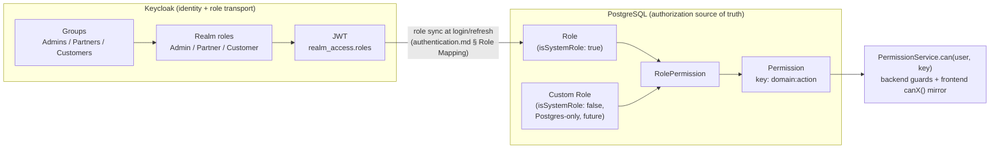
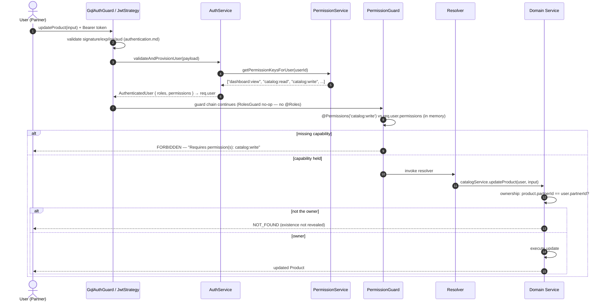

# SmartSense Marketplace — Authorization & Access Control Guide

Version: 1.0

---

## Purpose

### Goals

- Define **who may do what** across the platform: the role and permission model, how it is evaluated on the backend, mirrored on the frontend, and expressed through the GraphQL API.
- Give every new feature a ready-made answer to "how do I protect this" — a documented vocabulary and mechanism, so authorization is applied by convention, never invented per module.
- Serve as the single catalog of roles, permissions, and ownership rules — when a new permission or role is added, this document changes in the same PR.

### Scope

This document covers **authorization**: the RBAC/permission model, role definitions, per-resource access rules, ownership scoping, and the enforcement conventions on each layer. It builds directly on — and does not repeat — what other documents own:

| Already covered elsewhere                                                                            | See                                                                                                                                                                                                                                                            |
| ---------------------------------------------------------------------------------------------------- | -------------------------------------------------------------------------------------------------------------------------------------------------------------------------------------------------------------------------------------------------------------- |
| Login flows, JWT validation, session/token lifecycle, role _mapping_ mechanics (Keycloak → Postgres) | [authentication.md](./authentication.md) — especially [§ Role Mapping](./authentication.md#role-mapping), [§ Permission Strategy](./authentication.md#permission-strategy), [§ Authorization Flow](./authentication.md#authorization-flow-putting-it-together) |
| Guard chain registration and backend layer responsibilities                                          | [api-conventions.md](./api-conventions.md#layer-responsibilities)                                                                                                                                                                                              |
| GraphQL error codes and schema-level conventions                                                     | [graphql.md](./graphql.md#11-error-handling)                                                                                                                                                                                                                   |
| Keycloak realm/client/group configuration                                                            | [keycloak-setup.md](./keycloak-setup.md#realm-configuration)                                                                                                                                                                                                   |
| The `User`/`Role`/`Permission`/`UserRole`/`RolePermission` data model                                | [domain-model.md](./domain-model.md#role), [database-schema.md](./database-schema.md#identity--access-rbac)                                                                                                                                                    |
| Frontend routing/layout structure the route guards live in                                           | [architecture.md](./architecture.md#routing), [folder-structure.md](./folder-structure.md#app--application-shell)                                                                                                                                              |

**Assumptions made explicit.**

1. **The permission catalog below is the real, seeded vocabulary** (`database/prisma/seed.ts`): ten `Permission.key` values across five domains (M13 added `orders:create`). `reports:*` and `settings:*` keys do not exist yet — they are introduced with milestones M15/M17 ([milestones.md](./milestones.md#milestone-details)); the Resource Authorization tables mark them as planned.
2. **Only realm roles are used.** No Keycloak client roles or composite roles are configured, deliberately — see [RBAC Model](#rbac-model).
3. **"Super Admin" and "Read-only" are not implemented roles.** The system roles are exactly `Admin`, `Partner`, `Customer` ([requirements.md § User Roles](./requirements.md#user-roles)); the [System Roles](#system-roles) section documents the two future candidates and the mechanism that makes them cheap to add.

### Authorization Philosophy

- **Deny by default.** Every operation is authenticated unless `@Public()`; every permission check treats "not in the resolved set" as denied; there is no implicit allow anywhere ([authentication.md § Permission Strategy](./authentication.md#permission-strategy), rule 4).
- **Capabilities, not identities.** Code asks "can this user `catalog:write`," never "is this user an Admin" — role names appear in exactly two places: the Keycloak↔Postgres mapping join and the `@Roles()` decorator for the rare genuinely role-shaped rule. Everything else is permission keys.
- **The backend is the enforcement point; the frontend is a mirror.** Frontend checks exist purely to spare users dead-end UI — every decision is re-made server-side from scratch ([authentication.md § Authorization Flow](./authentication.md#authorization-flow-putting-it-together)).
- **Permissions gate the verb; ownership gates the noun.** `orders:read` says a user may read orders _in general_; whether they may read _this_ order is a separate, composed ownership check ([Ownership Rules](#ownership-rules)).

---

## Authentication vs Authorization

| Question           | Concern        | Owner                                                                                                  |
| ------------------ | -------------- | ------------------------------------------------------------------------------------------------------ |
| _Who are you?_     | Authentication | Keycloak + `JwtStrategy`/`GqlAuthGuard` — fully documented in [authentication.md](./authentication.md) |
| _What may you do?_ | Authorization  | This document — roles, permissions, ownership, and their enforcement                                   |

The boundary in code: authentication ends the moment a validated `AuthenticatedUser` (identity + resolved `roles` + resolved `permissions`) is attached to the request. Everything that reads that object to make an allow/deny decision — `RolesGuard`, `PermissionGuard`, service-layer ownership checks, frontend `canX()` helpers — is authorization and is governed here. The two fail differently by design: an authentication failure is `UNAUTHENTICATED` (get a valid identity, then retry); an authorization failure is `FORBIDDEN` (a valid identity that is simply not allowed) — the SPA reacts differently to each ([authentication.md § GraphQL Authentication](./authentication.md#graphql-authentication)).

---

## RBAC Model

| Concept             | This project's position                                                                                                                                                                                                                                                                                                                              |
| ------------------- | ---------------------------------------------------------------------------------------------------------------------------------------------------------------------------------------------------------------------------------------------------------------------------------------------------------------------------------------------------- |
| **Realm roles**     | The only Keycloak roles used: `Admin`, `Partner`, `Customer`, assigned via the matching groups ([keycloak-setup.md § Roles](./keycloak-setup.md#realm-configuration)). Their single job is transport — carrying coarse identity-level role membership into the JWT so the backend can sync it to Postgres.                                           |
| **Client roles**    | **Not used, deliberately.** Client roles would split the role model across two clients (`smartsense-web`, `smartsense-api`) and two systems; since fine-grained authorization lives in Postgres anyway, client roles would add a second place for access decisions to hide with no benefit.                                                          |
| **Composite roles** | **Not used in Keycloak.** Composition happens in Postgres instead: a custom role (`isSystemRole: false`) composes existing `Permission`s ([authentication.md § Role Mapping](./authentication.md#role-mapping), rule on custom roles). This keeps role composition administrable inside the application, without IdP configuration changes per role. |
| **Role hierarchy**  | **Deliberately flat.** `Admin` is not a parent of `Partner`; it simply holds a superset of permission grants. Hierarchy-by-inheritance makes "what can this role actually do" require walking a tree; superset-by-grants keeps every role's capabilities a flat, auditable list in `RolePermission`.                                                 |

The full Keycloak→Postgres sync mechanics (exact-name matching as the join key, fail-closed handling of unknown roles, sync on login/refresh) are owned by [authentication.md § Role Mapping](./authentication.md#role-mapping) and not restated here.

---

## Permission Model

A permission is a **capability string**: `<resource>:<action>`, stored as `Permission.key` with its `domain` recorded alongside ([database-schema.md § Identity & Access](./database-schema.md#identity--access-rbac)).

| Element        | Definition                                                                                                         | Examples from the seeded catalog                     |
| -------------- | ------------------------------------------------------------------------------------------------------------------ | ---------------------------------------------------- |
| **Resource**   | The domain/module being acted on — matches the module names everywhere else                                        | `dashboard`, `catalog`, `orders`, `billing`, `users` |
| **Action**     | The kind of access, from a small fixed verb set                                                                    | `view`, `read`, `write`, `manage`                    |
| **Permission** | One `resource:action` pair — the atomic unit both `PermissionService.can()` and frontend `canX()` helpers evaluate | `catalog:write`, `billing:manage`                    |

### CRUD Permission Strategy

The action vocabulary is **deliberately coarser than CRUD**. Full CRUD granularity (`catalog:create`, `catalog:update`, `catalog:delete` as separate keys) was not adopted because no requirement distinguishes them — in this domain, a user trusted to create a product is trusted to edit it, and "delete" is soft-deactivation governed by the same trust level ([database-schema.md § Soft Delete Strategy](./database-schema.md#soft-delete-strategy)).

| Action   | Covers                                                                                                                                                    |
| -------- | --------------------------------------------------------------------------------------------------------------------------------------------------------- |
| `view`   | Access to an aggregate/summary surface (currently only `dashboard:view`)                                                                                  |
| `read`   | List and detail access to a resource's records                                                                                                            |
| `write`  | Create, update, and lifecycle transitions on records the user can already `read`                                                                          |
| `manage` | Administrative operations above `write` — e.g. `billing:manage` (adjustments, voiding) and `users:manage` (role assignment) vs. their `read` counterparts |

Splitting an action into finer keys is an additive change (new `Permission` row + `RolePermission` grants in a migration) made **when a real requirement demands it** — e.g. if a "Catalog Editor who cannot archive products" role ever materializes, `catalog:write` splits then, not speculatively now.

M13 (Orders) is the first real instance of this: `orders:create` (place/cancel one's own order) was split out from `orders:write` (drive fulfillment) because Customers must be trusted with the former but never the latter — the coarse `write` verb couldn't express that distinction. See the [Orders Status Transition Matrix](#orders-status-transition-matrix-m13) below.

### The Seeded Catalog

| Permission key   | Grants                                                          | Admin | Partner | Customer |
| ---------------- | --------------------------------------------------------------- | :---: | :-----: | :------: |
| `dashboard:view` | Dashboard analytics and summaries                               |  ✅   |   ✅    |    ✅    |
| `catalog:read`   | View products, variants, categories                             |  ✅   |   ✅    |    ✅    |
| `catalog:write`  | Create/edit products, variants, inventory                       |  ✅   |   ✅    |    —     |
| `orders:read`    | View orders and order history                                   |  ✅   |   ✅    |    ✅    |
| `orders:create`  | Place a new order; cancel an own order before fulfillment (M13) |  ✅   |   ✅    |    ✅    |
| `orders:write`   | Update order status, manage fulfillment                         |  ✅   |   ✅    |    —     |
| `billing:read`   | View invoices, payments, billing reports                        |  ✅   |   ✅    |    —     |
| `billing:manage` | Administrative billing operations                               |  ✅   |    —    |    —     |
| `users:read`     | View platform users                                             |  ✅   |    —    |    —     |
| `users:manage`   | Manage users and role assignments                               |  ✅   |    —    |    —     |

Grants are exactly as seeded (`database/prisma/seed.ts`); a ✅ never implies ownership bypass — Partner and Customer grants are always additionally ownership-scoped ([Ownership Rules](#ownership-rules)).

---

## System Roles

| Role                       | Responsibilities                                                                                                            | Accessible modules                                                                                               | Restrictions                                                                                                                                                                                        |
| -------------------------- | --------------------------------------------------------------------------------------------------------------------------- | ---------------------------------------------------------------------------------------------------------------- | --------------------------------------------------------------------------------------------------------------------------------------------------------------------------------------------------- |
| **Admin**                  | Platform operation: partner approval, user/role administration, catalog oversight, billing administration, dispute handling | All modules, all records                                                                                         | None by permission — but every action is audit-logged ([Security Considerations](#security-considerations)); Admin is powerful, not invisible.                                                      |
| **Partner**                | Run their own selling operation: catalog, inventory, order fulfillment, billing visibility                                  | Dashboard, Catalog, Orders, Billing (read), Reports/Settings when shipped                                        | Strictly ownership-scoped: only records where `partnerId` matches their organization; no user administration; no billing management.                                                                |
| **Customer**               | Browse, place, and track their own purchases                                                                                | Dashboard (own summary), Catalog (read-only, all Partners), Orders (own: read, place, cancel before fulfillment) | No catalog management, no billing surface, no fulfillment (`orders:write`); scoped to `customerId` ownership.                                                                                       |
| **Super Admin** _(future)_ | Would separate platform _configuration_ (role/permission administration, destructive operations) from day-to-day operation  | —                                                                                                                | Not implemented — today `Admin` holds all nine permissions. If operational experience shows Admin is too broad, the split is a new system role + regrant, no structural change.                     |
| **Read-only** _(future)_   | Auditor/viewer access — every `read`/`view` key, no `write`/`manage`                                                        | All modules, read-only                                                                                           | Not implemented — expressible today as a custom Postgres role composing the existing `*:read`/`*:view` keys, per [RBAC Model](#rbac-model); needs no new mechanism, only the decision to create it. |

---

## Resource Authorization

Per-module access rules. "Own" means ownership-scoped per [Ownership Rules](#ownership-rules); permission keys marked _(planned)_ do not exist yet (Assumption 1).

| Module                      | Operation                       | Required permission                                                                          | Admin    | Partner         | Customer                                                                                                |
| --------------------------- | ------------------------------- | -------------------------------------------------------------------------------------------- | -------- | --------------- | ------------------------------------------------------------------------------------------------------- |
| **Dashboard**               | View dashboard                  | `dashboard:view`                                                                             | All data | Own data        | Own data                                                                                                |
| **Catalog**                 | Browse products/categories      | `catalog:read`                                                                               | All      | Own catalog     | All Partners' published catalog _(M13 — needed to shop when placing an order; unscoped, same as Admin)_ |
|                             | Create/edit products, inventory | `catalog:write`                                                                              | All      | Own catalog     | —                                                                                                       |
| **Orders**                  | View orders                     | `orders:read`                                                                                | All      | Own (as vendor) | Own (as buyer)                                                                                          |
|                             | Place an order / cancel own     | `orders:create`                                                                              | All      | Own (as vendor) | Own (as buyer)                                                                                          |
|                             | Update status / fulfill         | `orders:write`                                                                               | All      | Own (as vendor) | —                                                                                                       |
| **Billing**                 | View invoices/payments          | `billing:read`                                                                               | All      | Own             | —                                                                                                       |
|                             | Adjust/void/administer          | `billing:manage`                                                                             | All      | —               | —                                                                                                       |
| **Reports**                 | Generate/view billing reports   | `reports:read` _(planned, M15)_ — interim: `billing:read`                                    | All      | Own             | —                                                                                                       |
| **Settings**                | Own profile/preferences         | Authenticated (no key — every user manages _their own_ profile; ownership is the whole rule) | Own      | Own             | Own                                                                                                     |
|                             | Partner organization settings   | `settings:manage` _(planned, M17)_ — interim: ownership + Partner role                       | All      | Own org         | —                                                                                                       |
| **Users** _(Admin surface)_ | View users                      | `users:read`                                                                                 | All      | —               | —                                                                                                       |
|                             | Manage users/roles              | `users:manage`                                                                               | All      | —               | —                                                                                                       |

When M15/M17 introduce their permission keys, this table and the [seeded catalog](#the-seeded-catalog) are updated in the same PR as the migration that adds them.

### Orders Status Transition Matrix (M13)

`orders:create` and `orders:write` compose with the current `Order.status` to decide exactly which transition a caller may perform — a single coarse "can write orders" check can't express "a Customer may confirm/cancel their own order but never drive fulfillment." `apps/api/src/modules/orders/orders.service.ts`'s `ORDER_TRANSITIONS` table is the executable form of this; the resolver's `@Permissions` decorator is only the floor (the loosest key any row needs), and `OrdersService.updateStatus` re-derives and enforces the row-specific key.

| Transition                 | Required permission | Who (ownership per [Ownership Rules](#ownership-rules))      | Inventory effect                       |
| -------------------------- | ------------------- | ------------------------------------------------------------ | -------------------------------------- |
| (create) → `DRAFT`         | `orders:create`     | Customer (self) or Partner/Admin (on behalf of a customerId) | None                                   |
| `DRAFT` → `CONFIRMED`      | `orders:create`     | Order's own Customer, vendor Partner, or Admin               | Reserve (`quantityReserved` increases) |
| `CONFIRMED` → `PROCESSING` | `orders:write`      | Vendor Partner or Admin only                                 | None                                   |
| `DRAFT` → `CANCELLED`      | `orders:create`     | Order's own Customer, vendor Partner, or Admin               | None                                   |
| `CONFIRMED` → `CANCELLED`  | `orders:create`     | Order's own Customer, vendor Partner, or Admin               | Release (`quantityReserved` decreases) |
| `PROCESSING` → `CANCELLED` | `orders:write`      | Vendor Partner or Admin only                                 | Release (`quantityReserved` decreases) |

Any other requested transition (including every status beyond these four — `PENDING_PAYMENT`, `SHIPPED`, `DELIVERED`, `RETURN_REQUESTED`, `COMPLETED`, `REFUNDED` — which exist in the `OrderStatus` enum for future milestones but aren't reachable yet) is rejected as an invalid transition, not silently allowed.

---

## Backend Authorization

The mechanics live in `apps/api/src/modules/auth/` and are registered/ordered as described in [api-conventions.md § Layer Responsibilities](./api-conventions.md#layer-responsibilities) and [authentication.md § GraphQL Authentication](./authentication.md#graphql-authentication). This section is the authorization-specific usage guide.

| Component                  | Authorization role                                                                                                                                                                                                                                                                                                                                                                                                                |
| -------------------------- | --------------------------------------------------------------------------------------------------------------------------------------------------------------------------------------------------------------------------------------------------------------------------------------------------------------------------------------------------------------------------------------------------------------------------------- |
| **Guards**                 | `GqlAuthGuard` (authentication, opt-out) → `RolesGuard` (checks `@Roles()` metadata) → `PermissionGuard` (checks `@Permissions()` metadata) — globally registered in that order; both authorization guards are no-ops on handlers without their decorator.                                                                                                                                                                        |
| **Decorators**             | `@Public()` — opt out of authentication entirely (rare, justified per use). `@Roles('Admin', ...)` — OR semantics: any listed role passes. `@Permissions('catalog:write', ...)` — AND semantics: every listed key required. `@CurrentUser()` — injects the resolved `AuthenticatedUser` for ownership checks.                                                                                                                     |
| **Authorization services** | `PermissionService` — the single place `Permission`/`RolePermission` are queried for authorization: `getPermissionKeysForUser()` (resolution) and `can()`/`canAll()` (evaluation). No other code queries those tables for access decisions.                                                                                                                                                                                       |
| **Permission evaluation**  | Resolution happens **once per request during authentication** (`AuthService.validateAndProvisionUser` computes `roles` + `permissions` from Postgres and attaches them to `req.user`); guards then evaluate **in memory** against that resolved set. Fresh-per-request, never cached across requests, never trusted from JWT claims ([authentication.md § Permission Strategy](./authentication.md#permission-strategy), rule 2). |
| **Ownership validation**   | Not a guard concern — a **service-layer business rule** ([api-conventions.md § Business Logic Rules](./api-conventions.md#business-logic-rules)): the service compares the record's owner FK against the caller's organization and throws `NotFoundException`/`ForbiddenException` on mismatch (see [Ownership Rules](#ownership-rules) for which). Guards decide the verb; services decide the noun.                             |

Choosing the right tool, in order of preference:

1. `@Permissions('resource:action')` — the default for every protected operation.
2. Service-layer ownership check — always composed with (1) for Partner/Customer-reachable data.
3. `@Roles(...)` — only for genuinely role-shaped rules with no capability framing (rare; prefer adding a permission key).
4. `@Public()` — exceptional, with a comment justifying why the operation is public.

---

## Frontend Authorization

All frontend checks are UX-only mirrors of the backend decision — worth building well, never worth trusting ([authentication.md § Permission Strategy](./authentication.md#permission-strategy)). Mechanics landed with milestone M8 (`app/guards/PermissionRoute.tsx`, `features/auth/hooks/usePermissions.ts`):

| Concern                           | Convention                                                                                                                                                                                                                                                                                                                                                                                                                                                   |
| --------------------------------- | ------------------------------------------------------------------------------------------------------------------------------------------------------------------------------------------------------------------------------------------------------------------------------------------------------------------------------------------------------------------------------------------------------------------------------------------------------------ |
| **Route guards**                  | `ProtectedRoute` (authenticated?), `PermissionRoute` (authenticated + a declared `canX()`), `PublicRoute` (inverse) — responsibilities and failure behavior defined in [authentication.md § Route Protection](./authentication.md#route-protection-frontend).                                                                                                                                                                                                |
| **Protected routes**              | Every private route declares its guard in the route table (`app/router`), driven by the same permission keys as the backend via the `me` query's resolved `permissions` — no route is protected by "the page happens to error without data."                                                                                                                                                                                                                 |
| **Navigation visibility**         | Sidebar/menu items render only when the user holds the permission behind the destination (`canViewOrders()` gates the Orders nav item). A hidden nav item is a _courtesy_; the route guard and the backend still enforce independently — hiding is never the enforcement.                                                                                                                                                                                    |
| **Component-level authorization** | Action-level rendering uses the same `canX()` helpers (`canEditCatalog()` decides whether the "New Product" button renders). Helpers are named by capability, never by role — the rule and rationale live in [authentication.md § Permission Strategy](./authentication.md#permission-strategy), rule 3. Disabled-with-reason is preferred over hidden when the user could obtain the capability ([ui-guidelines.md § Buttons](./ui-guidelines.md#buttons)). |
| **Feature flags**                 | **Not implemented, and not an authorization mechanism.** A flag answers "is this feature on," a permission answers "may this user use it" — if flags are introduced later, a flagged-off feature is absent for everyone; it never substitutes for a permission check when the flag is on.                                                                                                                                                                    |

---

## GraphQL Authorization

Schema conventions and error formatting are owned by [graphql.md](./graphql.md); this section states only the authorization overlay:

| Concern                       | Convention                                                                                                                                                                                                                                                                                                                                                                                                                         |
| ----------------------------- | ---------------------------------------------------------------------------------------------------------------------------------------------------------------------------------------------------------------------------------------------------------------------------------------------------------------------------------------------------------------------------------------------------------------------------------- |
| **Query authorization**       | Authenticated by default (global `GqlAuthGuard`); `@Permissions()` on the resolver method declares the required capability next to the operation it protects — never in a separate mapping file that drifts from the schema.                                                                                                                                                                                                       |
| **Mutation authorization**    | Identical mechanism; additionally, every mutation touching Partner/Customer-owned data performs the service-layer ownership check — a mutation authorized by permission but not ownership must fail ([Ownership Rules](#ownership-rules)).                                                                                                                                                                                         |
| **Field-level authorization** | The same guards attach to `@ResolveField()` for fields more sensitive than their parent (the designed example: `Order.partner.commissionRate`, visible to Admin and the owning Partner only — [authentication.md § GraphQL Authentication](./authentication.md#graphql-authentication)). **No field-level guard is in use yet** — the schema has no nested-entity fields; the mechanism is documented so the first one follows it. |
| **Error responses**           | `UNAUTHENTICATED` vs `FORBIDDEN` per the mapping in [graphql.md § 11 Error Handling](./graphql.md#11-error-handling). A `FORBIDDEN` message names the missing capability (`Requires permission(s): catalog:write`) — actionable for the developer, revealing nothing about the data. For ownership failures on _reads_, prefer `NOT_FOUND` over `FORBIDDEN` (below).                                                               |

---

## Ownership Rules

Ownership is the second half of every authorization decision for non-Admin users. The owner FK is structural in the schema ([database-schema.md § Relationships Explained](./database-schema.md#relationships-explained)) — every ownable record carries `partnerId` and/or `customerId`.

| Actor    | Resource                                | Rule                                                                                                           |
| -------- | --------------------------------------- | -------------------------------------------------------------------------------------------------------------- |
| Partner  | Catalog (Products, Variants, Inventory) | Only records where `partnerId == user.partnerId` — list queries filter by it; single-record access verifies it |
| Partner  | Orders                                  | Only orders where `Order.partnerId == user.partnerId` (vendor side)                                            |
| Partner  | Invoices / Payments / Reports           | Only their own (`Invoice.partnerId`, reports per Partner)                                                      |
| Customer | Orders                                  | Only orders where `Order.customerId == user.customerId` (buyer side)                                           |
| Customer | Addresses / profile                     | Only their own organization's records                                                                          |
| Admin    | Everything                              | No ownership scoping — Admin access is platform-wide, and audit-logged instead of scoped                       |

Implementation conventions:

- **List queries scope in the `where` clause** (ownership as a filter — other owners' records simply don't exist in the result), never by fetching broadly and filtering in application code.
- **Single-record reads return `NOT_FOUND` on ownership mismatch**, not `FORBIDDEN` — "there is a record here but it isn't yours" leaks existence; an ID outside your scope should be indistinguishable from an ID that doesn't exist.
- **Mutations on an owned record verify ownership before any write**, inside the same service method (and transaction, where applicable) as the write itself.
- **Ownership derives from the user's provisioned organization** (`user.partnerId`/`user.customerId`, set at invite/provisioning — [authentication.md](./authentication.md)), never from client-supplied input: a `partnerId` argument in a query is a _filter within_ the caller's scope for Admins, and ignored/overridden by the caller's own scope for everyone else.

---

## Permission Evaluation Flow

The full request path for one protected mutation — resolution once at authentication, in-memory evaluation in the guards, ownership in the service:

The same flow evaluated from the user-journey perspective (route guard → mutation → guards), including the frontend mirror, is diagrammed in [authentication.md § Authorization Flow](./authentication.md#authorization-flow-putting-it-together) — this diagram adds the internal resolution/evaluation split that document leaves implicit.

---

## Security Considerations

| Principle            | Application here                                                                                                                                                                                                                                                                                                                                                                                                                                                                                                         |
| -------------------- | ------------------------------------------------------------------------------------------------------------------------------------------------------------------------------------------------------------------------------------------------------------------------------------------------------------------------------------------------------------------------------------------------------------------------------------------------------------------------------------------------------------------------ |
| **Least privilege**  | Roles grant the minimum capability set their responsibilities require (see the [seeded catalog](#the-seeded-catalog) — Customer holds two keys, not "read everything"). New roles start minimal and gain grants on demonstrated need, never "Admin minus a few things."                                                                                                                                                                                                                                                  |
| **Default deny**     | Enforced structurally, not by discipline: authentication is opt-out (`@Public()`), permission absence is denial, unknown Keycloak roles are logged and ignored rather than mapped ([authentication.md § Role Mapping](./authentication.md#role-mapping)). A forgotten decorator yields an _authenticated-only_ endpoint, never an anonymous one.                                                                                                                                                                         |
| **Defense in depth** | Four independent layers deny independently: frontend guards (UX), `GqlAuthGuard` (identity), `PermissionGuard` (capability), service ownership checks (scope) — plus the database's structural FKs bounding what a scoped query can even express. Bypassing one layer defeats none of the others.                                                                                                                                                                                                                        |
| **Audit logging**    | Authorization-relevant _changes_ — role assignment, permission grants, user/partner suspension — are recorded as `AuditLog` rows (immutable, actor-attributed — [domain-model.md § Audit Log](./domain-model.md#audit-log)). Authorization _denials_ are operational log events, not audit rows ([authentication.md § Security Best Practices Checklist](./authentication.md#security-best-practices-checklist)). Admin's unscoped access makes this non-optional: what Admin does is unrestricted but never unrecorded. |

---

## Best Practices

Developer checklist for any new operation, page, or field:

- [ ] The operation declares `@Permissions()` with an existing key from the [catalog](#the-seeded-catalog) — or this document and the seed/migration gain the new key in the same PR.
- [ ] Partner/Customer-reachable data has a service-layer ownership check composed with the permission check — never one substituting for the other.
- [ ] List queries scope ownership in the `where` clause; single-record ownership misses return `NOT_FOUND`.
- [ ] No `role === 'Admin'`-style checks anywhere — capability helpers on the frontend, `@Permissions()`/`@Roles()` metadata on the backend.
- [ ] `@Public()` appears only with a comment justifying it, and never on anything touching user-scoped data.
- [ ] Frontend nav/rendering uses `canX()` helpers keyed to the same permission strings the backend checks.
- [ ] Authorization paths have tests: permission-denied, ownership-denied, and success, per [testing.md § Authentication Testing](./testing.md#authentication-testing).
- [ ] Role/permission _administration_ actions write `AuditLog` rows.

---

## Anti-Patterns

| Anti-pattern                                                                             | Why it's a problem                                                                                        | Instead                                                                                                                      |
| ---------------------------------------------------------------------------------------- | --------------------------------------------------------------------------------------------------------- | ---------------------------------------------------------------------------------------------------------------------------- |
| `if (user.roles.includes('Admin'))` scattered through services                           | Role names become load-bearing string literals everywhere; adding a role means auditing every conditional | `@Permissions()` metadata / `PermissionService.can()` with capability keys                                                   |
| Frontend-only protection (hidden button, guarded route, no backend check)                | The API is directly callable; the SPA's checks are advisory by design                                     | Backend guard + service check always; frontend mirrors for UX                                                                |
| Permission check without ownership check on Partner-scoped data                          | One Partner's `orders:read` reads every Partner's orders — capability leaks across tenant boundaries      | Compose both, per [Ownership Rules](#ownership-rules)                                                                        |
| Ownership check by trusting a client-supplied `partnerId` argument                       | The caller chooses their own scope — scoping becomes decorative                                           | Derive scope from `req.user`'s provisioned organization, always                                                              |
| Returning `FORBIDDEN` for single-record ownership misses                                 | Confirms the record exists — an enumeration oracle over other tenants' IDs                                | `NOT_FOUND` for reads outside the caller's scope                                                                             |
| Resolving permissions from JWT claims instead of the database                            | Revocations and role edits don't take effect until token expiry — stale grants linger                     | Request-scoped resolution from Postgres ([authentication.md § Permission Strategy](./authentication.md#permission-strategy)) |
| Caching a user's permission set across requests                                          | Same staleness problem, self-inflicted                                                                    | Resolution is per-request by design; optimize the query before adding a cache                                                |
| Speculative fine-grained keys (`catalog:create`/`update`/`delete`) with identical grants | Triples the catalog's surface with zero behavioral difference — audit noise                               | Coarse verbs; split a key when a real requirement distinguishes them ([Permission Model](#permission-model))                 |
| A feature flag standing in for a permission                                              | Flags are global on/off, unowned, and unaudited — none of authorization's properties                      | Flags gate rollout; permissions gate access ([Frontend Authorization](#frontend-authorization))                              |

---

## Future Enhancements

Tracked as deliberate non-goals for now — each with the condition that would activate it:

- **ABAC (attribute-based access control)** — if rules emerge that RBAC + ownership can't express (time-boxed access, record-state-dependent capability like "editable only while `DRAFT`"), attribute conditions would compose onto the existing permission checks rather than replace them. Today's two-attribute model (role-derived capability + organization ownership) is deliberately the simplest thing that satisfies every current rule.
- **Policy engine (OPA/Cedar-style)** — externalizing decisions into declarative policy becomes worth its operational cost if authorization logic starts changing faster than application releases, or must be shared with services outside this codebase. The single-choke-point design (`PermissionService`) is exactly what would make that swap contained.
- **Multi-tenancy** — the [roadmap.md § Future Product Vision](./roadmap.md#future-product-vision) candidate. Ownership scoping is single-marketplace today; true multi-tenancy adds a tenant dimension _above_ Partner/Customer ownership — flagged so schema/authorization decisions avoid hard-coding the one-marketplace assumption.
- **External authorization providers** — delegating fine-grained authorization to Keycloak Authorization Services (UMA) or a SaaS provider was considered and rejected for v1: it moves per-request decisions across a network boundary and splits the audit trail. Revisited only alongside the policy-engine trigger above.
- **Planned permission keys** — `reports:*` (M15) and `settings:*` (M17) per [Resource Authorization](#resource-authorization); **Super Admin** and **Read-only** roles per [System Roles](#system-roles). These are scheduled evolution of the current model, not new mechanisms.
