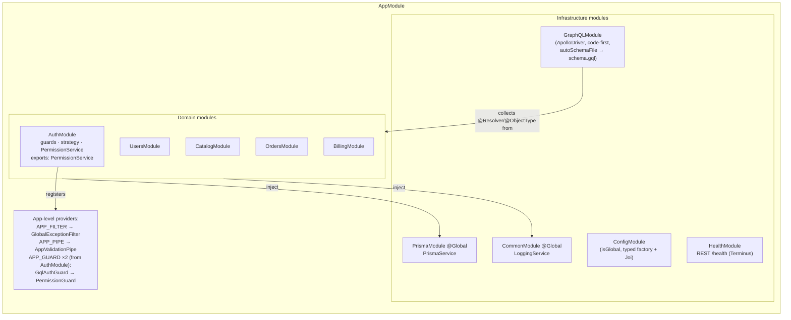

# SmartSense Marketplace — Backend Architecture Guide

Version: 1.0

---

## Purpose

### Goals

- Define the **NestJS application's structural architecture**: how the module graph is composed, how the dependency-injection container wires cross-cutting concerns, in what order NestJS's enhancers execute, and where each architectural seam (events, jobs, caching) will attach when needed.
- Be the backend counterpart to [frontend-architecture.md](./frontend-architecture.md): the composition view that connects the per-request conventions in [api-conventions.md](./api-conventions.md) to the running process.

### Scope

Structural composition only. The per-request implementation conventions — what a resolver/service may contain, error translation, transactions, pagination — are owned by [api-conventions.md](./api-conventions.md) and referenced, never restated:

| Already covered elsewhere                                                                  | See                                                                              |
| ------------------------------------------------------------------------------------------ | -------------------------------------------------------------------------------- |
| Request lifecycle detail, layer do's/don'ts, validation, errors, transactions, performance | [api-conventions.md](./api-conventions.md)                                       |
| GraphQL schema design, code-first conventions, codegen                                     | [graphql.md](./graphql.md)                                                       |
| Guard chain semantics, JWT validation, role mapping                                        | [authentication.md](./authentication.md), [authorization.md](./authorization.md) |
| NestJS coding rules (DI style, DTOs, naming)                                               | [coding-standards.md](./coding-standards.md#6-backend-nestjs-standards)          |
| Folder layout and per-folder responsibilities                                              | [folder-structure.md](./folder-structure.md#appsapi--backend-application)        |
| Prisma schema, relations, constraints                                                      | [database-schema.md](./database-schema.md)                                       |
| Deployment, container, environment topology                                                | [deployment.md](./deployment.md)                                                 |

**Assumption made explicit.** The domain modules (`users`, `catalog`, `orders`, `billing`) are scaffolds exposing placeholder `xStatus` queries; `auth` is the one fully built module and therefore the reference implementation every structural statement below is verified against. Sections marked _(future)_ describe attachment points, not existing machinery.

---

## NestJS Architecture

The application is a single NestJS process composed from a module graph. Infrastructure modules are global (registered once, injectable everywhere); domain modules are scoped and explicit about what they export:



Three structural decisions this graph encodes:

1. **Cross-cutting concerns are registered once, at the top.** The exception filter and validation pipe bind in `AppModule`; the three guards bind in `AuthModule` — no resolver opts into them, only out (`@Public()`). A new domain module inherits the full protective envelope by merely being imported.
2. **Global modules are infrastructure only.** `@Global()` is reserved for `CommonModule` and `PrismaModule` — dependencies literally every module needs. A domain module is never global; its consumers import it and receive only its `exports`.
3. **The schema is emergent.** `GraphQLModule` assembles `schema.gql` from whatever decorated classes the imported modules contribute — adding a module extends the API without touching any central schema file ([graphql.md § 3 Schema Organization](./graphql.md#3-schema-organization)).

---

## Module Organization

Module anatomy (folders, file naming) is owned by [folder-structure.md § modules](./folder-structure.md#modules--domain-modules). The organizational rules on top:

| Rule                                               | Rationale                                                                                                                                                                                                                                                                                      |
| -------------------------------------------------- | ---------------------------------------------------------------------------------------------------------------------------------------------------------------------------------------------------------------------------------------------------------------------------------------------- |
| One module per bounded context                     | The module boundary _is_ the domain boundary ([domain-model.md](./domain-model.md)) — vertical slices ([milestones.md § Engineering Philosophy](./milestones.md#engineering-philosophy)) map 1:1 to modules.                                                                                   |
| `exports` is the module's public API               | Anything not exported is invisible to other modules by DI-container rule, making the layering in [api-conventions.md § Dependency Rules](./api-conventions.md#dependency-rules) mechanically enforced, not just documented. `AuthModule` exporting exactly `PermissionService` is the pattern. |
| A module registers its own cross-cutting machinery | `AuthModule` owns the `APP_GUARD` registrations because guard order is an auth concern — `AppModule` stays a thin composition root that only lists imports.                                                                                                                                    |
| No module knows the transport                      | Only resolvers (and `HealthController`) touch GraphQL/HTTP types; a module's service layer is transport-agnostic and would survive a transport swap unchanged.                                                                                                                                 |

---

## Request Lifecycle

The full annotated sequence diagram is owned by [api-conventions.md § Request Lifecycle](./api-conventions.md#request-lifecycle) — this section adds only the **NestJS enhancer ordering** that diagram abstracts away, because it explains _why_ the chain behaves as it does:

```
Client
  → Middleware            (none registered; CORS via app.enableCors())
  → Guards                (GqlAuthGuard → PermissionGuard — registration order)
  → Interceptors (pre)    (none registered — see Interceptors)
  → Pipes                 (AppValidationPipe against the Input DTO)
  → Resolver              (delegates immediately)
  → Service               (business logic, ownership, transactions)
  → Repository / Prisma   (PrismaService — see Repository Layer)
  → Database              (PostgreSQL)
  → Interceptors (post)   (response path of any future interceptor)
  → Exception Filters     (GlobalExceptionFilter — only on thrown exceptions)
```

Two ordering facts worth engraving: **guards run before pipes** — authorization is decided before input is even validated, so an attacker never gets validation feedback on an operation they can't call; and **filters wrap everything** — an exception thrown at any stage above lands in the same `GlobalExceptionFilter`, which is what makes one error-shape contract possible ([api-conventions.md § Error Handling Strategy](./api-conventions.md#error-handling-strategy)).

---

## GraphQL Integration

Owned by [graphql.md § 2 Architecture Overview](./graphql.md#2-architecture-overview) (driver, code-first, `schema.gql` as reviewed build artifact, environment-driven introspection/playground). The structural point this document adds: `GraphQLModule.forRootAsync` is configured **from `ConfigService`**, not literals — GraphQL behavior differences between environments are configuration, never code branches, the same posture as everything else in [Configuration Management](#configuration-management).

## Service Layer

Owned by [api-conventions.md § Layer Responsibilities](./api-conventions.md#layer-responsibilities) and [§ Business Logic Rules](./api-conventions.md#business-logic-rules). Structurally: services are singleton-scoped providers (NestJS default) — they hold **no per-request state**; everything request-specific arrives as a method argument (the `AuthenticatedUser`, the input DTO). This is what makes the process horizontally scalable ([deployment.md § Scaling Strategy](./deployment.md#scaling-strategy)) and is the rule a future request-scoped provider must have a strong reason to break (request scope re-instantiates the provider per request, with measurable cost).

## Repository Layer

There is deliberately no repository class today — "Repository" means the service's own `PrismaService` calls, with the introduction threshold defined in [api-conventions.md § Request Lifecycle](./api-conventions.md#request-lifecycle) (its explicit Repository assumption). Nothing to add structurally until that threshold is met.

## Prisma Layer

`PrismaService extends PrismaClient` and binds the client's connection lifecycle to Nest's module lifecycle — `onModuleInit` connects, `onModuleDestroy` disconnects — so the connection pool lives exactly as long as the application and shuts down cleanly on SIGTERM. It is provided once via the global `PrismaModule`; a second client instance anywhere is a defect ([folder-structure.md](./folder-structure.md#common-config-health-prisma)). Schema, migrations, and constraints: [database-schema.md](./database-schema.md).

## Validation Strategy

Owned by [api-conventions.md § Validation Strategy](./api-conventions.md#validation-strategy) (DTO/class-validator vs. business vs. database validation, the Zod split). Structural note only: `AppValidationPipe` binds as `APP_PIPE` in `AppModule` — validation is an application-level guarantee, not a per-resolver choice.

## Exception Filters

Behavior owned by [graphql.md § 11 Error Handling](./graphql.md#11-error-handling) and [api-conventions.md § Error Handling Strategy](./api-conventions.md#error-handling-strategy). Structurally: one filter, bound as `APP_FILTER`, dispatching on `GqlArgumentsHost` context type — the single place the API's two transports (GraphQL, REST `/health`) converge on an error shape. Adding a second filter should be treated as a design smell until proven otherwise.

## Guards

Semantics owned by [authorization.md § Backend Authorization](./authorization.md#backend-authorization); chain rationale by [authentication.md § GraphQL Authentication](./authentication.md#graphql-authentication). The structural mechanics: `APP_GUARD` providers execute **in registration order**, which is why `AuthModule` lists `GqlAuthGuard` before `PermissionGuard` and documents that ordering in a comment — `req.user` must exist before anything reads it. Reordering those two lines is a security-relevant change, not a cleanup.

## Interceptors

**None are registered.** The designated future uses — request timing, correlation-ID attachment ([api-conventions.md § Logging](./api-conventions.md#logging)), per-request timeout ([api-conventions.md § Performance](./api-conventions.md#performance)) — sit at the interceptor position in the lifecycle above precisely because they need to wrap the handler (see both the pre and post side of a request). An interceptor never makes an authorization decision (guards) or holds business logic (services), per [api-conventions.md § Layer Responsibilities](./api-conventions.md#layer-responsibilities).

## Logging

Conventions owned by [coding-standards.md § 11](./coding-standards.md#11-logging-standards) and [api-conventions.md § Logging](./api-conventions.md#logging). Two structural facts implemented in `main.ts`: the app boots with `bufferLogs: true`, so log lines emitted before the custom logger is registered are buffered and replayed through it (nothing is lost to the default logger during startup); and `app.useLogger(app.get(LoggingService))` makes the DI-managed logger the sink for _all_ logging app-wide — including NestJS's own internal messages — which is exactly why `LoggingService` must extend `ConsoleLogger` rather than wrap `new Logger()` (the recursion trap documented on the class itself).

## Transactions

Fully owned by [api-conventions.md § Transactions](./api-conventions.md#transactions) — interactive form, ambient `tx` client for nesting, implicit rollback. No structural addition.

## Caching Strategy

**No server-side cache layer exists**, deliberately ([api-conventions.md § Caching Responsibilities](./api-conventions.md#performance)). When one is justified, the structural placement is decided in advance: a cache is a **service-layer concern behind an injectable provider** (a `CacheModule`-style infrastructure module, global like `PrismaModule`) — never inside a resolver, never a module-level `Map` in a singleton service (which would silently diverge across horizontally scaled replicas; a real cache is an external service, per [deployment.md § Scaling Strategy](./deployment.md#scaling-strategy)).

## Background Jobs _(future)_

Nothing asynchronous runs outside the request path today. The first real need arrives with M16 (email delivery must not block the mutation that triggered it — [milestones.md](./milestones.md#milestone-details)) and grows with M15 (scheduled report generation). Structural pre-decision: jobs enter as a queue-backed worker (BullMQ + Redis, or `@nestjs/schedule` for pure cron) registered as its own infrastructure module, with job _handlers_ delegating to the same domain services the resolvers use — a job is an alternative entry point into the service layer, never a second implementation of the business logic.

## Event Architecture _(future)_

The M16 notification model requires domain events ("order placed," "stock low"). Structural pre-decision, so it's made deliberately rather than by the first implementer: start **in-process** (`@nestjs/event-emitter`) — services emit typed events after their transaction commits; listener modules (notifications) subscribe without the emitting module knowing they exist. This keeps module coupling unidirectional (emitters don't import listeners) and is the same seam a message broker would later replace if cross-process delivery is ever needed ([roadmap.md § Future Product Vision](./roadmap.md#future-product-vision), workflow automation). Emit-after-commit is the rule to enforce from day one — an event about a rolled-back write is a lie.

## Configuration Management

Loading and validation mechanics are owned by [api-conventions.md § Validation Strategy](./api-conventions.md#validation-strategy)-adjacent sections and [deployment.md § Environment Configuration](./deployment.md#environment-configuration). Structure: `ConfigModule.forRoot({ isGlobal: true, load: [configuration], validationSchema })` — one typed factory (`AppConfig`), one Joi schema, injected as `ConfigService` everywhere. The type and the schema live side by side in `src/config/` and change together; a config value without a Joi rule is a review failure.

## Health Checks

Owned by [deployment.md § Health Checks](./deployment.md#health-checks) — including the known gap that the Terminus check list is currently empty (debt item TD-4, resolved by M20-T5 per [TASKS.md](./TASKS.md#technical-debt)). Structural note: `/health` is deliberately a REST controller outside the GraphQL guard envelope — infrastructure probes don't authenticate, and `GqlAuthGuard` explicitly passes non-GraphQL contexts through for exactly this reason.

---

## Dependency Rules

Owned by [api-conventions.md § Dependency Rules](./api-conventions.md#dependency-rules) (the allowed/forbidden call table) and [folder-structure.md § Import Rules (Backend)](./folder-structure.md#import-rules-backend). The structural additions:

- **No circular module imports, ever.** NestJS's `forwardRef()` exists to paper over module cycles — in this codebase its appearance is treated as a design error to resolve (extract the shared dependency into its own module) rather than a tool to use.
- **`@Global()` requires the same justification as a new dependency.** Two global modules exist; a third must be genuinely universal infrastructure, or it's hiding an import that should be explicit.

## Folder Responsibilities

Owned entirely by [folder-structure.md § apps/api](./folder-structure.md#appsapi--backend-application) — not duplicated here. The [module graph](#nestjs-architecture) above is the runtime view of that same structure.

---

## Best Practices

- [ ] A new domain module ships as: module + resolver + service (+ `dto/` as needed), imported once in `AppModule`, exporting only what other modules genuinely consume.
- [ ] Cross-cutting machinery binds via `APP_*` tokens in the module that owns the concern — never per-resolver decoration for something every operation needs.
- [ ] Guard registration order is treated as security-sensitive code: changes require the ordering comment to be updated and a reviewer to acknowledge it.
- [ ] Services stay singleton and stateless; request-specific data travels as arguments.
- [ ] Anything async/deferred (future jobs, events) re-enters through domain services — one implementation of every business rule, regardless of entry point.
- [ ] Every new config value lands in the typed factory _and_ the Joi schema in the same commit.
- [ ] Structural changes to this graph (new global module, new `APP_*` binding, new transport) update this document in the same PR ([coding-standards.md § 16](./coding-standards.md#16-definition-of-done)).

## Anti-Patterns

| Anti-pattern                                                          | Why it's a problem                                                                                                                                                | Instead                                                                 |
| --------------------------------------------------------------------- | ----------------------------------------------------------------------------------------------------------------------------------------------------------------- | ----------------------------------------------------------------------- |
| `forwardRef()` to break a module cycle                                | Legalizes a circular domain dependency; the cycle remains, just hidden from the DI container                                                                      | Extract the shared concern into a module both sides import              |
| Marking a domain module `@Global()` for convenience                   | Erases the `exports` boundary that makes layering enforceable                                                                                                     | Explicit imports; `@Global()` is for universal infrastructure only      |
| A stateful singleton service (in-memory cache/`Map`, per-user fields) | Wrong under horizontal scaling; leaks data across requests                                                                                                        | External cache service; request data as method arguments                |
| Instantiating dependencies with `new` inside providers                | Bypasses DI — untestable, unmockable, invisible to the container ([coding-standards.md § Dependency Injection](./coding-standards.md#6-backend-nestjs-standards)) | Constructor injection, always                                           |
| Business logic in a future job handler or event listener              | Second implementation of a rule that already lives in a service — they drift                                                                                      | Handlers/listeners delegate to the owning domain service                |
| Emitting a domain event before its transaction commits                | Listeners act on state that may roll back — phantom notifications, phantom side effects                                                                           | Emit after commit, structurally (post-`$transaction` return)            |
| A second exception filter for a special case                          | Two competing error-shape contracts; clients can no longer rely on one format                                                                                     | Extend the mapping inside `GlobalExceptionFilter`                       |
| Request-scoped providers adopted casually                             | Per-request re-instantiation of the provider _and everything injecting it_ — a quiet performance cliff                                                            | Singleton + arguments; request scope only with a measured justification |

## Future Enhancements

Attachment points pre-decided above, listed with their trigger:

- **Interceptors** — first concrete need: correlation IDs / request timing alongside monitoring (M20, [api-conventions.md § Logging](./api-conventions.md#logging)).
- **Background job infrastructure** — M16 email delivery; queue module + worker as described in [Background Jobs](#background-jobs-future).
- **Domain event bus** — M16 notification events; in-process emitter first ([Event Architecture](#event-architecture-future)).
- **Server-side cache module** — only after a measured read bottleneck; external store, service-layer placement ([Caching Strategy](#caching-strategy)).
- **Repository classes** — per the threshold in [api-conventions.md](./api-conventions.md#request-lifecycle).
- **DataLoader wiring** — with the first relation-traversing resolver ([graphql.md § 13](./graphql.md#13-performance-guidelines)); request-scoped via the GraphQL context factory, the one sanctioned request-scoped construct.
- **GraphQL Federation** — only if the single-process module graph stops being the right deployment unit ([api-conventions.md § Future Enhancements](./api-conventions.md#future-enhancements)); the module boundaries above are the natural subgraph seams.
