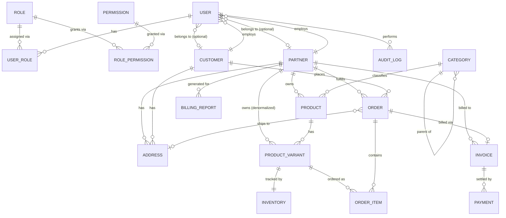

# SmartSense Marketplace — Database Schema

Version: 1.1
Status: Schema designed, validated, initial migration generated with hand-written constraints (`prisma migrate dev --create-only`) — **not yet applied** (awaiting approval — see [Next Steps](#next-steps))

## Purpose

This document is the physical-schema counterpart to [`docs/domain-model.md`](./domain-model.md). Where the domain model defines the business vocabulary and rules, this document defines how that vocabulary is implemented as a normalized PostgreSQL schema via [`database/prisma/schema.prisma`](../database/prisma/schema.prisma) — every table, column, relationship, index, and constraint, and why it exists.

Nothing here changes the business rules already agreed in `docs/domain-model.md`. Where the schema cannot express a rule declaratively (Postgres can't check cross-row aggregates, and Prisma's schema language doesn't support `CHECK` constraints), that gap is called out explicitly rather than silently dropped.

Out of scope, per the milestone brief: GraphQL types/resolvers and authentication implementation. This is data modeling only.

---

## Entity-Relationship Diagram

This is the **physical** ERD — it includes the join tables (`UserRole`, `RolePermission`) and denormalized columns that don't appear in the conceptual diagram in `docs/domain-model.md`.



Notes:

- `AUDIT_LOG`'s target side is polymorphic (`entityType` + `entityId`, any table) and isn't representable as a fixed ER edge — see [AuditLog](#auditlog).
- `PARTNER ||--o{ PRODUCT_VARIANT` is a denormalized convenience edge, not a distinct business relationship — see [ProductVariant](#productvariant).
- Every table below also has implicit `ROLE`/`PERMISSION`-style read access controlled entirely by the application layer (permission checks), not by Postgres row-level security. That's a deliberate simplification for v1.

---

## Design Conventions

| Convention           | Decision                                                                                                 | Rationale                                                                                                                                                                                                                                                                                                                                                                                     |
| -------------------- | -------------------------------------------------------------------------------------------------------- | --------------------------------------------------------------------------------------------------------------------------------------------------------------------------------------------------------------------------------------------------------------------------------------------------------------------------------------------------------------------------------------------- |
| Primary keys         | `UUID`, Prisma `@default(uuid())`                                                                        | Non-sequential IDs avoid leaking row counts/creation order across a multi-tenant (multi-Partner) system; portable across environments without sequence coordination.                                                                                                                                                                                                                          |
| Timestamps           | `createdAt` (`@default(now())`) + `updatedAt` (`@updatedAt`) on every mutable table                      | Baseline audit trail on every row, independent of `AuditLog` (which records _who_ and _why_, not just _when_).                                                                                                                                                                                                                                                                                |
| Immutable tables     | `OrderItem`, `AuditLog` omit `updatedAt`                                                                 | They are write-once by business rule (domain-model.md) — omitting the column documents that in the schema itself.                                                                                                                                                                                                                                                                             |
| Soft delete          | Nullable `deletedAt`                                                                                     | See [Soft Delete Strategy](#soft-delete-strategy) below.                                                                                                                                                                                                                                                                                                                                      |
| Naming               | Prisma models/fields: `PascalCase`/`camelCase`. Database tables/columns: `snake_case` via `@@map`/`@map` | Prisma Client stays idiomatic TypeScript; the physical schema stays idiomatic PostgreSQL.                                                                                                                                                                                                                                                                                                     |
| Money                | `Decimal @db.Decimal(12, 2)`                                                                             | Never `Float` — avoids binary floating-point rounding errors in financial calculations.                                                                                                                                                                                                                                                                                                       |
| Percentages          | `Decimal @db.Decimal(5, 2)`                                                                              | `commissionRate`, range 0–100.00.                                                                                                                                                                                                                                                                                                                                                             |
| Semi-structured data | `Json @db.JsonB`                                                                                         | `ProductVariant.attributes`, `AuditLog.metadata` — Postgres `jsonb` supports indexing/querying, unlike plain `json`.                                                                                                                                                                                                                                                                          |
| Enums                | Native Postgres enums via Prisma `enum`                                                                  | Fixed, well-understood state machines (order status, invoice status, etc.) get type safety and a `CHECK`-equivalent at the DB level for free. Reserved for genuinely fixed sets — `Role.name` and `Permission.domain` stay as `String` (see [RBAC](#identity--access-rbac)) so new roles/domains never require a migration, matching the extensibility requirement in `docs/requirements.md`. |

---

## Soft Delete Strategy

Not every table is soft-deleted — the domain model's own lifecycle descriptions dictate which are:

**Soft-deleted (nullable `deletedAt`):** `User`, `Partner`, `Customer`, `Category`, `Product`, `ProductVariant`, `Address` (via `isActive`, see below), `Role`.

These are all entities the domain model explicitly says are deactivated/archived rather than destroyed — e.g. "Deactivating a User does not delete their AuditLog history," "Deactivating a Partner does not delete historical Orders/Invoices," "No hard delete — Customers are anonymized rather than removed." `deletedAt` gives the application a single, consistent flag to filter on (`WHERE deleted_at IS NULL`) instead of overloading each table's own status enum for "is this visible at all."

`Address` uses its existing `isActive` boolean instead of a second `deletedAt` column — the domain model already defines "soft-deactivate" as the address-specific term, and one boolean is simpler than two overlapping soft-delete signals on the same row.

**Never soft-deleted:**

- `Permission` — static reference data, "never deleted while any code path still checks for it" (domain-model.md).
- `Order`, `Invoice`, `Payment`, `BillingReport` — ledger/financial records. These use their own status state machine (`Cancelled`, `Void`, `Refunded`, etc.) as the "is this still active" signal; a `deletedAt` on top would create two competing sources of truth for the same question.
- `OrderItem`, `AuditLog` — immutable by design (see table above); "deleted" isn't a state that should exist for a row that's supposed to be a permanent record.
- `UserRole`, `RolePermission` — pure join rows; removing an assignment is a hard delete of the join row, not a soft delete of the User/Role/Permission itself.

**Enforcement note:** Prisma has no built-in global soft-delete filter. Every query against a soft-deletable model must explicitly filter `deletedAt: null` at the service layer (e.g. a shared Prisma Client extension/middleware) — this is a backend implementation task, not a schema concern, and is called out here so it isn't lost between milestones.

---

## Relationships Explained

Every relationship in the schema, why it exists, and how it's enforced.

### Identity & Access (RBAC)

- **`User` ↔ `Role` (many-to-many, via `UserRole`)** — a User can hold multiple Roles (domain-model.md's example: a Partner-side "Billing Manager" _and_ "Catalog Editor"). Modeled as an explicit join table rather than Prisma's implicit many-to-many so `onDelete` behavior can be declared (`Cascade` on both sides — removing a User or Role removes the assignment rows, not the other side) and so `assignedAt` is available if "who granted this role, when" ever needs to be surfaced.
- **`Role` ↔ `Permission` (many-to-many, via `RolePermission`)** — same reasoning. `onDelete: Restrict` on the `Permission` side specifically, because a Permission must never be deleted while a Role still grants it (domain-model.md: Permissions are static and code paths depend on them existing).
- **`User` → `Partner` (many-to-one, optional)** and **`User` → `Customer` (many-to-one, optional)** — a User optionally belongs to exactly one owning organization (`ownerType` discriminates which, per Assumption 2 in the domain model). Both FKs are nullable and `onDelete: SetNull`, because Users are never hard-deleted in practice (only deactivated), but the schema still needs a safe default if that were ever to happen — unlinking the User is safer than silently deleting a human account as a side effect of an organization change.
  - **Known schema gap, closed at the migration level:** "exactly one of `partnerId`/`customerId`, consistent with `ownerType`" is a business rule Prisma's schema language has no syntax for. See [Constraints Added by Hand to the Migration](#constraints-added-by-hand-to-the-migration).
- **`User` → `AuditLog` (one-to-many)** — every audit entry has exactly one actor. `onDelete: Restrict` — a User can never be hard-deleted while they have audit history, which in practice means never (Users aren't hard-deleted at all).

### Organizations

- **`Partner` → `User`, `Address`, `Product`, `Order`, `Invoice`, `BillingReport` (all one-to-many)** — Partner is the vendor org; everything it owns, sells, fulfills, or is billed for hangs off its `id`. `onDelete: Restrict` on `Product`, `Order`, `Invoice`, `BillingReport` — a Partner with any business history can never be hard-deleted (matches "Deactivating a Partner does not delete historical Orders/Invoices"). `Address` and `User` use `Cascade`/`SetNull` respectively since those are dependent records with no independent value once the owning Partner is truly gone.
- **`Customer` → `User`, `Address`, `Order` (all one-to-many)** — same shape as Partner, buyer side. `Order` is `Restrict` for the same reason (no hard delete while history exists); `Customer.users` supports the "an Organization-type Customer may have several buyer contacts" rule.

### Catalog

- **`Category` → `Category` (self-referencing, one-to-many, `parent`/`children`)** — the taxonomy tree. `onDelete: Restrict` on the parent side — you cannot delete a Category that still has children, matching "must be deactivated or Products reassigned first."
- **`Category` → `Product` (one-to-many)** — `onDelete: Restrict` — same rule, applied to the Product side: a Category with active Products can't be deleted.
- **`Partner` → `Product` (one-to-many)** — ownership; a Product always belongs to exactly one Partner (Partners don't create categories, but do create Products — Assumption 4).
- **`Product` → `ProductVariant` (one-to-many)** — the conceptual/sellable split from Assumption 5. `onDelete: Cascade` — a Variant has no independent existence without its Product.
- **`ProductVariant` → `Partner` (many-to-one, denormalized)** — this edge doesn't exist in the conceptual domain model; it's a deliberate physical-schema addition. `ProductVariant.sku` must be "unique within a Partner's catalog" (a business rule from domain-model.md), but the natural path to a Partner is two hops away (`ProductVariant → Product → Partner`), and Postgres can't express a uniqueness constraint across a join. Denormalizing `partnerId` directly onto `ProductVariant` makes `@@unique([partnerId, sku])` a plain two-column constraint. This mirrors the existing precedent in the domain model itself: `Invoice.partnerId` is denormalized from `Invoice.order.partnerId` for the same class of reason ("Denormalized for billing-report queries"). The tradeoff: the service layer must write `ProductVariant.partnerId` from `Product.partnerId` at creation time and never let it drift (Products are never reassigned across Partners, so this is a write-once value in practice).
- **`ProductVariant` ↔ `Inventory` (one-to-one)** — every Variant has exactly one Inventory row, created alongside it (domain-model.md: "even if quantity starts at zero"). `onDelete: Cascade` — Inventory has no meaning without its Variant.
- **`ProductVariant` → `OrderItem` (one-to-many)** — `onDelete: Restrict` — a Variant referenced by any historical OrderItem can never be hard-deleted, preserving order history integrity even after a Variant is `Discontinued`.

### Orders & Fulfillment

- **`Customer` → `Order` (many-to-one)** and **`Partner` → `Order` (many-to-one)** — both `Restrict`. Assumption 3 (single-partner order scoping) is enforced at the application layer when building an Order's line items (all `OrderItem.productVariant.partnerId` must equal `Order.partnerId`) — this is a cross-table invariant, not something a single-row `CHECK` can express; see [Constraints Not Enforceable at the Database Level](#constraints-not-enforceable-at-the-database-level).
- **`Address` → `Order` (many-to-one, optional, `shippingAddress`)** — `onDelete: Restrict`. In practice this should never fire, because Addresses are soft-deactivated (`isActive = false`), never hard-deleted (domain-model.md: "Soft-deactivate instead").
- **`Order` → `OrderItem` (one-to-many)** — `onDelete: Cascade`. Line items have no independent existence without their Order.
- **`Order` ↔ `Invoice` (one-to-one, optional)** — Assumption 7: exactly one Invoice per completed Order, and not every Order has reached that stage yet, hence optional on the Order side.

### Billing

- **`Order` → `Invoice` (one-to-one)** and **`Partner` → `Invoice` (many-to-one, denormalized)** — both `Restrict`, financial records are never hard-deleted.
- **`Invoice` → `Payment` (one-to-many)** — Assumption 8: many Payments can settle one Invoice (partial/installment payments supported), but a Payment always belongs to exactly one Invoice. `onDelete: Restrict`.
- **`Partner` → `BillingReport` (many-to-one)** — periodic aggregation per Partner. Not a direct FK to Invoice/Payment rows — it's computed at generation time from a date range query, matching domain-model.md ("Conceptually aggregates... not a direct FK relationship").

### Shared

- **`Partner`/`Customer` → `Address` (many-to-one, mutually exclusive via `ownerType`)** — same "exactly one of two nullable FKs" shape as `User`, same schema gap (see below). `onDelete: Cascade` on both — an Address has no value once its owning organization is gone (this differs from the `Order.shippingAddress` FK direction above, which is `Restrict` because _Orders_ reference Addresses, not the other way around).
- **`User` → `AuditLog` (many-to-one, actor)** — covered above. `AuditLog`'s _target_ (the entity being audited) is intentionally not a foreign key at all — `entityType` + `entityId` is a polymorphic reference by design, because a single `AuditLog` table needs to point at rows in any other table, and Postgres FKs can only ever point at one target table.

---

## Constraints Added by Hand to the Migration

Prisma's schema language cannot express every rule in `docs/domain-model.md` (no `CHECK` syntax, no partial/filtered unique indexes, no exclusion constraints). These are documented in-line as comments in `schema.prisma` at the relevant field, and were added as raw SQL to the bottom of `database/prisma/migrations/20260701110512_init/migration.sql` (in a clearly marked "hand-written additions" section that `prisma migrate dev` will not regenerate or overwrite on future schema changes):

| Rule                                                                                           | Where           | Fix applied                                                                                                                                                                            |
| ---------------------------------------------------------------------------------------------- | --------------- | -------------------------------------------------------------------------------------------------------------------------------------------------------------------------------------- |
| `User`: exactly one of (`partnerId`, `customerId`) is set, consistent with `ownerType`         | `User`          | `CHECK` constraint `users_owner_type_consistency_check`                                                                                                                                |
| `Address`: exactly one of (`partnerId`, `customerId`) is set, consistent with `ownerType`      | `Address`       | `CHECK` constraint `addresses_owner_type_consistency_check`                                                                                                                            |
| `OrderItem.quantity > 0`                                                                       | `OrderItem`     | `CHECK` constraint `order_items_quantity_positive_check`                                                                                                                               |
| `Inventory.quantityOnHand >= 0`, `quantityReserved >= 0`, `quantityReserved <= quantityOnHand` | `Inventory`     | Three `CHECK` constraints (`inventory_quantity_on_hand_non_negative_check`, `inventory_quantity_reserved_non_negative_check`, `inventory_quantity_reserved_le_on_hand_check`)          |
| `Partner.commissionRate` between 0 and 100                                                     | `Partner`       | `CHECK` constraint `partners_commission_rate_range_check`                                                                                                                              |
| Only one `isDefault = true` Address per (owner, type)                                          | `Address`       | Two partial unique indexes (`addresses_partner_default_unique`, `addresses_customer_default_unique`) — split in two because exactly one of `partner_id`/`customer_id` is ever non-null |
| `BillingReport` periods must not _overlap_ (not just not be identical) for the same Partner    | `BillingReport` | GiST exclusion constraint `billing_reports_no_overlapping_periods_excl` (requires the `btree_gist` extension, also added by the migration)                                             |

Verified against a scratch PostgreSQL 17 database (not through `prisma migrate`, so nothing was marked as applied): all seven constraints correctly reject invalid inserts/updates (overlapping billing periods, out-of-range commission rate, inconsistent owner-type/FK combination, duplicate default address per owner+type) while valid rows still succeed.

### Constraints Not Enforceable at the Database Level

These require cross-row aggregates, which Postgres `CHECK` constraints cannot express regardless of how they're added:

| Rule                                                                                      | Where                                | Why                              | Handling                                                                                      |
| ----------------------------------------------------------------------------------------- | ------------------------------------ | -------------------------------- | --------------------------------------------------------------------------------------------- |
| `Order.total` == sum of `OrderItem.lineTotal` + tax + shipping                            | `Order`/`OrderItem`                  | Cross-row aggregate              | Service-layer only; recomputed server-side on every mutation, never trusted from client input |
| All `OrderItem`s in an Order belong to the same Partner as the Order                      | `Order`/`OrderItem`/`ProductVariant` | Cross-table, cross-row invariant | Service-layer only                                                                            |
| `Invoice.status = Void` ⇒ zero associated `Payment` rows                                  | `Invoice`/`Payment`                  | Cross-row aggregate              | Service-layer only                                                                            |
| `Invoice.status = Paid` ⇔ sum(`Payment.amount` where `status = Succeeded`) == `amountDue` | `Invoice`/`Payment`                  | Cross-row aggregate              | Service-layer only                                                                            |

None of these are bugs — they're the expected boundary between what a relational schema can guarantee and what application logic must guarantee. They're listed here explicitly so nothing gets silently assumed to be DB-enforced when it isn't.

---

## Indexing Strategy

- Every foreign key has an index — either its own single-column `@@index`, or as the **leftmost** column of a composite index (composite indexes only serve lookups that filter on their leftmost-prefix columns, so a foreign key buried in the middle or end of a composite index doesn't count).
- Composite indexes pair a foreign key with the field most commonly filtered alongside it: `[partnerId, status]` on `Product`/`Order`/`Invoice` (e.g. "this Partner's Published Products," "this Partner's Confirmed Orders" — the two access patterns every Partner-facing dashboard needs).
- Every soft-deletable model indexes `deletedAt` so `WHERE deleted_at IS NULL` scans stay cheap as tables grow.
- Unique business keys double as their own index automatically: `User.email`, `User.keycloakSubjectId`, `Category.slug`, `Order.orderNumber`, `Invoice.invoiceNumber`, `Payment.externalTransactionId`, `ProductVariant.(partnerId, sku)`.
- `AuditLog` indexes `(entityType, entityId)` for its primary query shape ("show me the history for this specific entity") and `occurredAt` for time-range queries independent of entity.

---

## Validation

Ran against the schema in `database/prisma/schema.prisma` on 2026-07-01:

```
$ npx prisma format
Formatted ../../database/prisma/schema.prisma in 35ms 🚀

$ npx prisma validate
The schema at ../../database/prisma/schema.prisma is valid 🚀
```

`prisma validate` checks schema syntax, type references, and relation consistency — it does not require a live database connection. It does **not** check anything in [Constraints Added by Hand to the Migration](#constraints-added-by-hand-to-the-migration), since those live in the migration SQL, not `schema.prisma`.

An independent review pass (via the `database-architect` agent) was run against `docs/domain-model.md` after the first draft; its findings (missing FK indexes on `Order.shippingAddressId` and `Address.partnerId`/`customerId`, and four additional un-enforceable business rules) are incorporated into the schema and the tables above.

The initial migration has been generated (`prisma migrate dev --create-only`) and hand-extended with the raw-SQL constraints, then verified against a scratch PostgreSQL 17 database — all seven constraints correctly reject invalid data while valid rows succeed (see [Constraints Added by Hand to the Migration](#constraints-added-by-hand-to-the-migration)). It has **not** been applied to any persistent database. See [Next Steps](#next-steps).

---

## Seed Data

[`database/prisma/seed.ts`](../database/prisma/seed.ts) provisions baseline development data, idempotently (every write is an `upsert`):

- **Permissions** — nine capabilities across the five domains from `docs/requirements.md` (`dashboard`, `catalog`, `orders`, `billing`, `users`), e.g. `catalog:write`, `billing:manage`.
- **Roles** — the three system roles (`Admin`, `Partner`, `Customer`, `isSystemRole: true`), each granted the subset of Permissions matching its access level in the domain model (Admin: all; Partner: catalog/orders/billing/dashboard; Customer: read-only orders/dashboard).
- **Admin User** — one platform Admin (`ownerType: NONE`), assigned the Admin role.
- **Sample Partner** — one `Active` Partner ("Acme Supplies") with `commissionRate` set (a precondition for BillingReport generation) and one staff User assigned the Partner role, demonstrating the full onboarding shape from `docs/domain-model.md`'s Partner Onboarding flow.
- **Categories** — a small starter tree (Electronics → Computers & Laptops / Mobile Phones; Home & Kitchen; Apparel) to exercise the self-referencing hierarchy.

`keycloakSubjectId` values in the seed are placeholders (`seed-admin-...`) — they exist only to satisfy the `NOT NULL UNIQUE` constraint for local development and are not real identity-provider subjects. This does not implement authentication; it's fixture data for a column that will later be populated by a real Keycloak flow.

The `"seed"` entry is already wired up under the `"prisma"` key in `apps/api/package.json`. Once a database is available and the migration has been applied, run:

```
cd apps/api
npm run prisma:seed
```

---

## Next Steps

The initial migration (`database/prisma/migrations/20260701110512_init/migration.sql`) has been generated via `prisma migrate dev --create-only` and hand-extended with the raw-SQL constraints from the table above. It has been syntax- and behavior-verified against a scratch PostgreSQL 17 database, but **has not been applied** — per the milestone instructions, that step is on hold pending review. Once approved:

1. Review the final migration SQL (`database/prisma/migrations/20260701110512_init/migration.sql`), in particular the "hand-written additions" section at the bottom.
2. Run `npx prisma migrate dev` (from `apps/api/`) to apply it against a local PostgreSQL 17 instance — Prisma will detect the migration already exists and simply mark it applied, then generate the client.
3. Run `npm run prisma:seed` (from `apps/api/`) to populate baseline data.
4. Implement the soft-delete query filter (Prisma Client extension) at the service layer — flagged above as a backend task, not a schema task.
