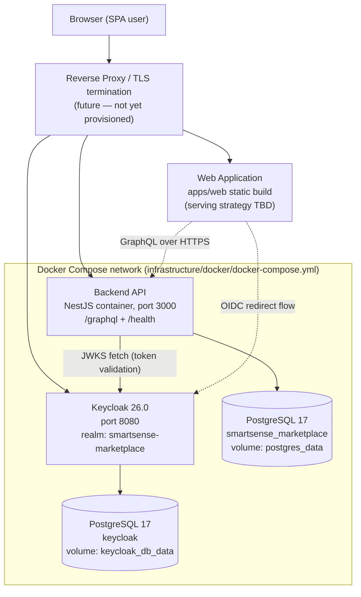
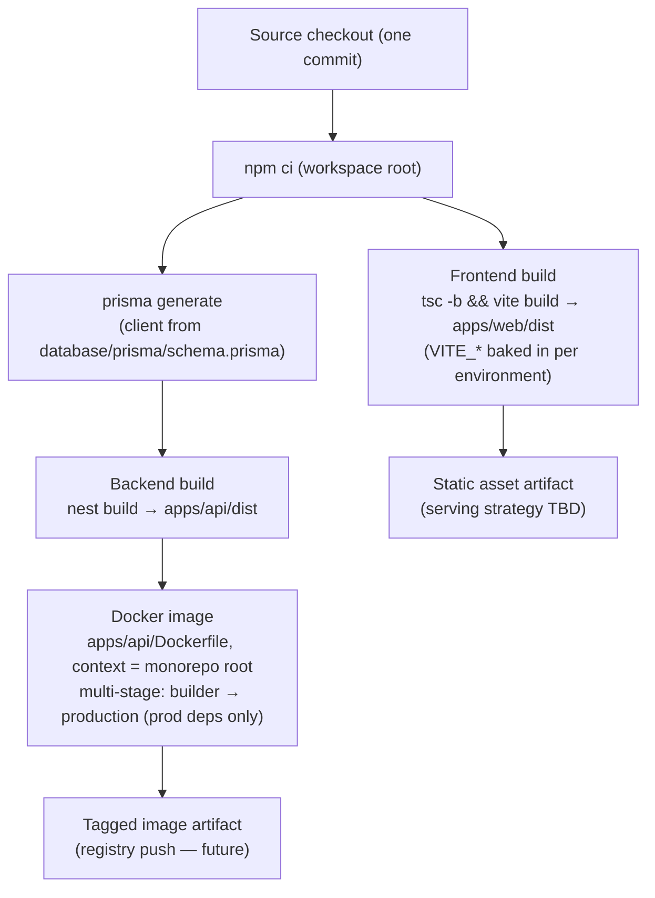
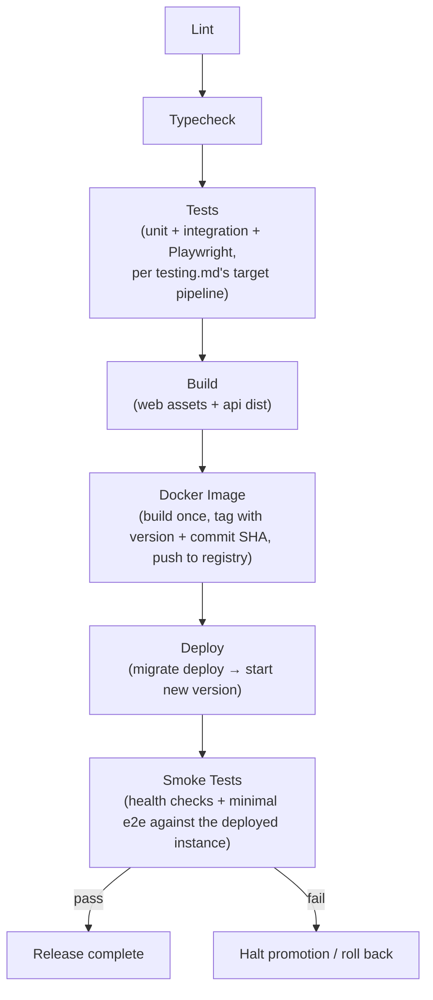

# SmartSense Marketplace — Deployment & Operations Guide

Version: 1.0

---

## Purpose

### Goals

- Define how SmartSense Marketplace is configured, built, deployed, verified, and recovered — one authoritative reference for anyone standing up, upgrading, or debugging a running environment.
- Make every deployment reproducible: the same inputs (commit, environment variables, database state) always produce the same running system, with no undocumented manual steps.
- Separate what is **implemented today** (local Docker Compose, including a full Local Production Simulation and working backup/restore) from what genuinely **requires production infrastructure that this project does not run** (a real remote host, DNS, TLS, external monitoring) — labeled explicitly as such throughout this document, rather than built as a fake version of itself.

### Scope

This document covers **deployment and operations**: environments, build artifacts, container orchestration, configuration, releases, health verification, and recovery. It does not repeat what other documents own:

| Already covered elsewhere                                                                   | See                                                   |
| ------------------------------------------------------------------------------------------- | ----------------------------------------------------- |
| Application architecture, layering, frontend/backend responsibilities                       | [architecture.md](./architecture.md)                  |
| Repository layout, workspace structure, where infrastructure files live                     | [folder-structure.md](./folder-structure.md)          |
| Authentication flows, JWT validation, required auth environment variables (the full tables) | [authentication.md](./authentication.md)              |
| Prisma schema, migration content, constraint verification, seed data contents               | [database-schema.md](./database-schema.md)            |
| Keycloak realm contents, clients, roles/groups, local startup and verification steps        | [keycloak-setup.md](./keycloak-setup.md)              |
| Testing strategy, the CI test-stage gap, smoke/e2e test definitions                         | [testing.md](./testing.md)                            |
| GraphQL production posture (introspection/playground off in production)                     | [graphql.md](./graphql.md#12-security-considerations) |

**Assumptions made explicit.**

1. **This project runs no VPS and no paid cloud service, by deliberate policy, not by omission.** The deployment target that exists and is fully exercised today is local Docker Compose (`infrastructure/docker/docker-compose.yml`) — including a **Local Production Simulation** (build → migrate → deploy → smoke-test, `scripts/local-prod-sim.sh`) that proves the release pipeline end to end on a developer's machine or an ephemeral GitHub-hosted CI runner. A genuinely separate remote host, DNS, TLS termination, a reverse proxy, and external monitoring/alerting are real gaps relative to a live production system, but they **require infrastructure this project does not provision** — they are labeled "Requires Production Infrastructure" wherever they appear below, not built as a local approximation of themselves.
2. **The frontend has a production container image.** `apps/web/Dockerfile` builds the Vite static output and serves it via `nginx:alpine` with CSP headers (SM-346) — both `api` and `web` are containerized, and `infrastructure/docker/docker-compose.yml` runs the whole stack (web + api + db + keycloak-db + keycloak) together.
3. **The Docker build-context fix is merged and current.** Both `apps/api/Dockerfile` and `apps/web/Dockerfile` build with the **monorepo root as context** (`context: ../..` from either compose file) — the API depends on `database/prisma/schema.prisma` and `packages/*`, both outside `apps/api` (see [folder-structure.md](./folder-structure.md#root-layout)). A root `.dockerignore` keeps the build context small. This is the convention in effect today, not a target.

### Deployment Philosophy

- **Containers everywhere beyond a developer's laptop.** The unit of deployment is a Docker image, not a directory of source files on a host.
- **Configuration through the environment, never through the image.** One image serves every environment; behavior differences come exclusively from environment variables ([Environment Configuration](#environment-configuration)). An image rebuilt "for staging" is a process failure.
- **Fail closed on misconfiguration.** The API refuses to boot if required variables are missing or malformed — enforced by the Joi `validationSchema` in `apps/api/src/config/validation.schema.ts`. A misconfigured deployment dies loudly at startup, not quietly at the first request.
- **Roll forward by default, roll back by exception.** Additive database migrations and additive schema evolution ([graphql.md § 14](./graphql.md#14-versioning--deprecation)) mean most bad releases are fixed by deploying the corrected next version, not by restoring the previous one — see [Release Strategy § Rollback](#release-strategy).

---

## Deployment Architecture

The deployed system is four long-running services plus (eventually) a reverse proxy and the statically served frontend:

Key structural decisions, stated once:

- **Two isolated PostgreSQL instances.** The application database (`db`) and Keycloak's database (`keycloak-db`) are separate containers with separate volumes — identity data and business data never share a database, per [authentication.md § Security Best Practices Checklist](./authentication.md#security-best-practices-checklist). (Whether production uses two instances or two databases in one managed cluster is an open question carried in [authentication.md § Open Questions](./authentication.md#open-questions).)
- **The browser talks to Keycloak directly** for login (OIDC redirect flow) and to the API for everything else; the API talks to Keycloak only to fetch the JWKS document for token validation — full flow in [authentication.md](./authentication.md#complete-authentication-flow-login).
- **Startup ordering is dependency-driven**: the API container starts only after both `db` and `keycloak` report healthy (`depends_on` with `condition: service_healthy`), because it validates its configuration and needs both reachable at boot.

---

## Supported Environments

| Environment                     | Status                                | Purpose                                                                                                                                                                                                                                                                                                                                                                                                                   |
| ------------------------------- | ------------------------------------- | ------------------------------------------------------------------------------------------------------------------------------------------------------------------------------------------------------------------------------------------------------------------------------------------------------------------------------------------------------------------------------------------------------------------------- |
| **Local Development**           | ✅ Implemented                        | A developer's machine: apps run via `npm run dev` (Turborepo watch mode) against Dockerized `db`/`keycloak`, or the full stack via Compose. The only environment with hot reload, GraphQL Playground, and seeded dev credentials.                                                                                                                                                                                         |
| **Local Production Simulation** | ✅ Implemented                        | Production-configured images (`NODE_ENV=production`, introspection/playground off), built or pulled from GHCR, deployed via Compose, migrated, and smoke-tested — entirely on a developer's machine or a GitHub-hosted CI runner (`scripts/local-prod-sim.sh`, [CI/CD Strategy](#cicd-strategy)). Proves the release pipeline without a live host.                                                                        |
| **QA / Staging / Production**   | ⬜ Requires Production Infrastructure | A continuously reachable, deployed instance needs a real remote host, DNS, and (beyond QA) TLS and monitoring — none of which this project provisions ([Purpose, Assumption 1](#purpose)). Playwright ([testing.md § End-to-End Testing](./testing.md#end-to-end-testing)) runs today against the CI-orchestrated Compose stack instead of a deployed QA build; a deployed QA target remains the goal once a host exists. |

Environment-specific behavior differences are expressed **only** through the environment variables in [Environment Configuration](#environment-configuration) — never through code branches on environment names beyond what `NODE_ENV` already controls.

---

## Infrastructure Components

| Component                  | Deployment responsibility                                                                                                                                                                                                                                                                                                                          |
| -------------------------- | -------------------------------------------------------------------------------------------------------------------------------------------------------------------------------------------------------------------------------------------------------------------------------------------------------------------------------------------------- |
| **React Application**      | Static asset bundle produced by `npm run build -w @smartsense/web` (Vite). Environment values are baked at build time via `VITE_*` variables — meaning the frontend, unlike the API, needs one build per environment (or a runtime-config injection pattern, a future decision).                                                                   |
| **NestJS API**             | The single stateful-process-free backend container ([apps/api/Dockerfile](../apps/api/Dockerfile), multi-stage `node:22-alpine`). Serves `/graphql` and `/health` on port 3000. Horizontally scalable — see [Scaling Strategy](#scaling-strategy).                                                                                                 |
| **PostgreSQL**             | `postgres:17-alpine` (pinned major version — matches what the schema's constraints were verified against, per [database-schema.md](./database-schema.md#constraints-added-by-hand-to-the-migration)). Owns the only irreplaceable state in the system.                                                                                             |
| **Prisma**                 | Not a runtime service — a build-time (client generation) and deploy-time (migrations) tool. The generated client ships inside the API image; migrations run as a deploy step ([Database Deployment](#database-deployment)).                                                                                                                        |
| **Keycloak**               | `quay.io/keycloak/keycloak:26.0`, imports the realm from `infrastructure/keycloak/realm-export/` on startup. Full configuration in [keycloak-setup.md](./keycloak-setup.md).                                                                                                                                                                       |
| **Docker**                 | The packaging format for every backend service. Images are immutable per release ([Release Strategy](#release-strategy)).                                                                                                                                                                                                                          |
| **Docker Compose**         | The orchestrator for local development and (initially) single-host deployments — `infrastructure/docker/docker-compose.yml` is the full-stack definition; `apps/api/docker-compose.yml` is the API-workspace convenience variant ([folder-structure.md § infrastructure](./folder-structure.md#infrastructure--local--deployment-infrastructure)). |
| **Reverse Proxy (future)** | Not yet chosen or provisioned. Target responsibilities when introduced: TLS termination, routing (`/` → web assets, `/graphql`+`/health` → API, `/realms/*` → Keycloak), compression, and the natural insertion point for rate limiting ([graphql.md § 12](./graphql.md#12-security-considerations)).                                              |

---

## Environment Configuration

### `.env` Strategy

| File                          | Committed?               | Purpose                                                                                                                                                                                                                      |
| ----------------------------- | ------------------------ | ---------------------------------------------------------------------------------------------------------------------------------------------------------------------------------------------------------------------------- |
| `apps/api/.env.example`       | ✅ Yes                   | The authoritative list of every API variable with safe dev defaults — updated in the same PR as any config change.                                                                                                           |
| `apps/api/.env`               | ❌ Never                 | A developer's local values, copied from the example.                                                                                                                                                                         |
| `apps/web/.env.example`       | ✅ Yes                   | Same contract for the frontend's `VITE_*` variables.                                                                                                                                                                         |
| `apps/web/.env.local`         | ❌ Never                 | Local frontend values.                                                                                                                                                                                                       |
| Compose `environment:` blocks | ✅ Yes (dev values only) | Local-stack wiring. The values checked in (e.g. `smartsense-api-dev-secret-change-me`, `postgres`/`password`, Keycloak `admin`/`admin`) are **deliberately dev-only placeholders** — no deployed environment may reuse them. |

### Secrets

- A secret (database password, `KEYCLOAK_API_CLIENT_SECRET`, Keycloak admin credentials) is never committed with a real value and never baked into an image — in deployed environments it is injected at runtime from the platform's secret store (GitHub Actions secrets for CI, a secrets manager for hosting, per [authentication.md § Security Best Practices Checklist](./authentication.md#security-best-practices-checklist)).
- The frontend bundle contains **no secrets by construction** — every `VITE_*` value is public configuration (URLs, realm/client identifiers); the SPA is a public OIDC client with no client secret ([authentication.md § Keycloak Realm & Client Topology](./authentication.md#keycloak-realm--client-topology)).

### Configuration Loading

The API reads `process.env` in exactly one place — `apps/api/src/config/configuration.ts` — validated at boot by the Joi schema in `validation.schema.ts` (required variables, type/range checks, defaults). The frontend equivalently centralizes `import.meta.env` access per [architecture.md § Environment Configuration](./architecture.md#environment-configuration). A deployment that omits a required variable fails at container start with a named validation error, which is the intended behavior.

### Environment Variable Naming

| Convention                                                                  | Example                                                                    |
| --------------------------------------------------------------------------- | -------------------------------------------------------------------------- |
| `SCREAMING_SNAKE_CASE`, prefixed by subsystem                               | `KEYCLOAK_URL`, `KEYCLOAK_JWKS_CACHE_TTL_SECONDS`, `GRAPHQL_INTROSPECTION` |
| Frontend variables prefixed `VITE_` (Vite exposes only these to the bundle) | `VITE_GRAPHQL_URL`, `VITE_KEYCLOAK_REALM`                                  |
| Booleans as `'true'`/`'false'` strings, parsed centrally                    | `GRAPHQL_PLAYGROUND=false`                                                 |

The complete variable tables (name, meaning, per-environment values) for auth-related configuration live in [authentication.md § Required Environment Variables](./authentication.md#required-environment-variables) — this document does not duplicate them.

### Production Values Checklist (SM-148)

The full variable list lives in the table referenced above; this is the production-specific overlay — the values that must differ from `apps/api/.env.example`'s dev defaults, verified before a deploy. The API's Joi schema (`validation.schema.ts`) fails startup fast on a missing/invalid required key, so an omission is caught at container start, not first request.

| Variable                       | Production value                                             | Why it differs from dev                                                                             |
| ------------------------------ | ------------------------------------------------------------ | --------------------------------------------------------------------------------------------------- |
| `NODE_ENV`                     | `production`                                                 | Drives fail-closed defaults (introspection off, etc.).                                              |
| `GRAPHQL_INTROSPECTION`        | `false` (or unset — defaults off when `NODE_ENV=production`) | Never expose the full schema publicly ([graphql.md § 12](./graphql.md#12-security-considerations)). |
| `GRAPHQL_PLAYGROUND`           | `false`                                                      | No interactive endpoint in production.                                                              |
| `GRAPHQL_DEBUG`                | `false`                                                      | No stacktraces in error responses (SM-243).                                                         |
| `CORS_ALLOWED_ORIGINS`         | the web app origin(s), e.g. `https://app.smartsense.example` | Empty (dev) is permissive; production restricts to known callers (SM-269).                          |
| `DATABASE_URL`                 | real managed-Postgres credentials, from the secret store     | Never the `postgres`/`password` dev placeholder.                                                    |
| `KEYCLOAK_API_CLIENT_SECRET`   | real confidential-client secret, from the secret store       | Never `smartsense-api-dev-secret-change-me`.                                                        |
| `KEYCLOAK_ADMIN_CLIENT_SECRET` | real service-account secret, from the secret store           | Never the `-dev-secret-change-me` placeholder (invite / password-reset stay disabled without it).   |

**Rule:** no value checked into a Compose `environment:` block or `.env.example` (all deliberately dev-only placeholders per [`.env` Strategy](#env-strategy)) may appear in a deployed environment — secrets come from the platform's secret store at runtime ([Secrets](#secrets)).

---

## Build Process

Order and rationale:

1. **`npm ci` at the workspace root** — installs every workspace's dependencies from the single lockfile. Never `npm install` in CI/builds (non-reproducible).
2. **Prisma client generation before any TypeScript build** — the API's code imports `@prisma/client` types; building without generating first fails typecheck (this is why CI generates the client as its second step, per `.github/workflows/ci.yml`).
3. **Backend and frontend builds are independent** and can run in parallel (Turborepo's task graph already models this — `turbo run build`).
4. **The API image build repeats these steps inside Docker** (multi-stage): the `builder` stage runs `npm ci` + `prisma:generate` + `nest build`; the `production` stage re-installs with `--omit=dev` and copies only `dist`, the generated Prisma client, and production `node_modules` — dev toolchain never ships. The build context **must be the monorepo root** (Assumption 3 in [Purpose](#purpose)).
5. **Deployment artifacts** are: one tagged API image + one frontend static bundle per environment + the migration files already in the repo. Nothing else is produced or needed.

---

## Docker Strategy

Current, checked-in behavior of `infrastructure/docker/docker-compose.yml` (and its `apps/api/` twin):

| Concern              | Convention                                                                                                                                                                                                                                                                                                                                                                              |
| -------------------- | --------------------------------------------------------------------------------------------------------------------------------------------------------------------------------------------------------------------------------------------------------------------------------------------------------------------------------------------------------------------------------------- |
| **Containers**       | `api` (built), `db`, `keycloak-db`, `keycloak` (pulled, version-pinned images: `postgres:17-alpine`, `keycloak:26.0`). Image tags are always pinned to at least a major version — never `latest`.                                                                                                                                                                                       |
| **Networks**         | The single default Compose network; services address each other by service name (`db`, `keycloak`) — which is why `KEYCLOAK_URL=http://keycloak:8080` inside the stack differs from `http://localhost:8080` outside it (a recurring troubleshooting item, see [Troubleshooting](#troubleshooting)).                                                                                     |
| **Volumes**          | Exactly two named volumes, both for database state: `postgres_data`, `keycloak_db_data`. Application containers are stateless and own no volumes. The realm export is a **read-only bind mount** (`realm-export:/opt/keycloak/data/import:ro`) — configuration flows from the repo into Keycloak, never back.                                                                           |
| **Restart policies** | `restart: unless-stopped` on every service — a crashed service recovers automatically; a deliberately stopped one stays stopped.                                                                                                                                                                                                                                                        |
| **Health checks**    | `db`/`keycloak-db`: `pg_isready` (10s interval, 5 retries). `keycloak`: TCP connect to 8080 (30s start period — Keycloak boots slowly). `api`: an inline Node `http.get('/health')` check (`node:22-alpine` has neither curl nor wget) — matches the identical `HEALTHCHECK` baked into `apps/api/Dockerfile` itself, so the image is self-checking even run outside this compose file. |

---

## Database Deployment

Schema content, constraint rationale, and seed data contents are owned by [database-schema.md](./database-schema.md) — this section covers only the _operational_ handling.

### Prisma Migrations

- **Local development:** `npm run prisma:migrate -w @smartsense/api` (`prisma migrate dev`) — creates and applies migrations, regenerates the client.
- **Deployed environments:** `prisma migrate deploy` — applies pending, already-authored migrations only; it never generates, never prompts, never drifts. This is the only migration command that may run against a shared/production database.
- Migrations run **as an explicit deploy step before the new API version starts serving traffic**, not implicitly at application boot — a migration failure must abort the deployment while the previous version keeps running, which is impossible if the new container migrates on startup.
- Hand-written SQL sections inside migrations (the `CHECK`/exclusion constraints per [database-schema.md § Constraints Added by Hand](./database-schema.md#constraints-added-by-hand-to-the-migration)) deploy exactly like generated SQL — `migrate deploy` runs the file verbatim.

### Seed Strategy

`npm run prisma:seed -w @smartsense/api` populates reference data (system Roles, Permissions, seed admin — see [database-schema.md § Seed Data](./database-schema.md#seed-data)). Seeding is for **local/dev/QA database initialization only**; it is never run automatically in staging/production, where reference data changes ship as migrations or deliberate operational tasks instead.

### Rollback Considerations

Prisma has no down-migrations. The strategy is therefore **expand → migrate → contract**: a schema change ships in a backward-compatible form first (add the new column nullable, backfill, switch code, then remove the old column in a _later_ release), so the previous application version always still runs against the new schema. If a migration itself fails mid-deploy, the deployment aborts with the old version still serving; genuinely destructive recovery falls to [Backup & Recovery](#backup--recovery).

### Backup Expectations

Implemented locally: `scripts/db-backup.sh db` / `scripts/db-restore.sh <dump> db` (see [Backup & Recovery](#backup--recovery)). A **scheduled**, automated backup with a defined retention window requires an always-on host to run the schedule against — that piece is "Requires Production Infrastructure," not the backup/restore mechanism itself, which is implemented and rehearsed (`scripts/verify-backup-restore.sh`).

---

## Keycloak Deployment

Realm contents, clients, roles, verification steps: [keycloak-setup.md](./keycloak-setup.md). Operationally:

| Concern                  | Convention                                                                                                                                                                                                                                                                                                                                                                                                                                                                                             |
| ------------------------ | ------------------------------------------------------------------------------------------------------------------------------------------------------------------------------------------------------------------------------------------------------------------------------------------------------------------------------------------------------------------------------------------------------------------------------------------------------------------------------------------------------ |
| **Realm import**         | The realm JSON is imported automatically at container start (`start-dev --import-realm` locally). Import is a _bootstrap_ mechanism: it does not overwrite an existing realm on restart — drift between the file and a long-running instance is resolved by re-export or reset ([keycloak-setup.md § Resetting to a clean state](./keycloak-setup.md#starting-the-environment)). Production uses `start` (not `start-dev`) with proper hostname/TLS settings — the dev command is not production-safe. |
| **Client configuration** | Client changes (redirect URIs per environment, secret rotation) are made in the realm export file and re-imported/re-applied, keeping the repo the source of truth — exact-match redirect URIs per environment, no wildcards beyond local dev ([authentication.md § Security Best Practices Checklist](./authentication.md#security-best-practices-checklist)).                                                                                                                                        |
| **Backup**               | Keycloak's state _is_ its database — backing up `keycloak-db` (same mechanism as the application database) is the backup. The realm export file in the repo is a configuration baseline, not a backup: it does not contain users created at runtime.                                                                                                                                                                                                                                                   |
| **Version upgrades**     | Keycloak is pinned (`26.0`). Upgrades are deliberate: read the upgrade notes, back up `keycloak-db`, bump the tag in both compose files in one commit, verify login + JWKS fetch + the [keycloak-setup.md verification checklist](./keycloak-setup.md#verification-checklist) in a non-production environment first. Keycloak migrates its own schema on first boot of a new version — which is why the database backup precedes the upgrade.                                                          |

---

## CI/CD Strategy

### Current State

`.github/workflows/ci.yml` implements **CI** as two jobs. `ci`: install → Prisma generate → lint → typecheck → unit tests → migrate/seed → backend integration tests (real Postgres + mocked JWKS) → build, on pushes/PRs to `main` and `development`. `playwright` (`needs: ci`, fail-fast): builds the `api`/`web` images with the GHA layer cache, boots the **full** stack (db, keycloak-db, keycloak, api, web) via Docker Compose — not GitHub Actions `services:`, which has no equivalent to Compose's `depends_on: condition: service_healthy` chain — waits for container health _and_ for the Keycloak realm's own `.well-known/openid-configuration` endpoint (the container healthcheck alone only proves the HTTP port is listening, not that `--import-realm` finished), migrates and seeds, then runs the Playwright suite against the Compose-served web app (port 8081) with `PW_BASE_URL`. On failure it uploads the Playwright HTML report and `docker compose logs`; it always tears the stack down.

`.github/workflows/cd.yml` implements **CD** (SM-266), triggered by a semver tag (`v*.*.*`) or manual dispatch — promotion, not every merge:

- **Build & push (SM-299)** — the `api` and `web` images are built once from the monorepo root (SM-263/SM-346) and pushed to **GHCR** (`ghcr.io/lakhaniyash/smartsense-marketplace/{api,web}`), tagged with the release version and the commit SHA, using `GITHUB_TOKEN` (no extra registry secret). GHCR is a pull-based artifact registry, not a VPS and not a paid cloud service — nothing runs there, and this stays within Assumption 1's no-VPS policy.
- **Local Production Simulation (replaces the former VPS deploy stub)** — `local-prod-sim` pulls the exact tags `build-and-push` just published and runs `scripts/local-prod-sim.sh --pull "$VERSION"` on the GitHub-hosted runner itself: `compose up -d --wait` the db/keycloak-db/keycloak trio, `prisma migrate deploy` via a throwaway `node` container on the pinned `smartsense` Compose network (never from inside a serving container), `compose up -d --wait` api/web, then a `/health` smoke test (SM-267's DB dependency check). No SSH, no `VPS_HOST`/`VPS_USER`/`VPS_SSH_KEY` secrets, no `environment: production`, nothing left running after the job ends. Pulling (rather than rebuilding fresh in this job) also validates the GHCR round-trip a real promotion would depend on.
- The same script (`scripts/local-prod-sim.sh --build`) is runnable directly on a developer's machine, and is reused by `scripts/verify-clean-clone.sh` to prove the whole pipeline works from a fresh checkout — see [Operational Runbooks](#operational-runbooks).

### Target Pipeline

Principles for the pipeline as it gets built out:

- **Build once, promote many.** The image built for the release candidate is byte-identical in QA, staging, and production — only environment variables differ.
- **Every stage gates the next.** A test failure never produces an image; a failed smoke test never marks a release complete.
- **Deployment is triggered by promotion (a tag or approved release), not by every merge to `development`** — except the shared Development environment, which tracks `development` continuously once it exists.

---

## Release Strategy

| Concern               | Convention                                                                                                                                                                                                                                                                                                                                             |
| --------------------- | ------------------------------------------------------------------------------------------------------------------------------------------------------------------------------------------------------------------------------------------------------------------------------------------------------------------------------------------------------ |
| **Versioning**        | Semantic versioning (`MAJOR.MINOR.PATCH`), currently `0.0.1` across workspaces. Conventional Commits ([coding-standards.md § 13](./coding-standards.md#13-git--commit-message-standards)) make version bumps and changelogs derivable mechanically (`feat` → minor, `fix` → patch). Docker images are tagged with both the version and the commit SHA. |
| **Release process**   | Work merges to `development` via PR ([coding-standards.md § Branch Naming](./coding-standards.md#branch-naming)); a release is a reviewed merge from `development` to `main` plus a version tag, which (once CD exists) triggers the pipeline above through staging to production.                                                                     |
| **Rollback strategy** | Application rollback = redeploy the previous image tag (always possible because migrations are backward-compatible per [Database Deployment § Rollback Considerations](#database-deployment)). Database rollback = restore from backup, treated as an incident, not a routine operation. Roll forward is the default response to a bad release.        |
| **Hotfix process**    | Branch `fix/...` from `main`, fix, PR back to `main`, release as a patch version through the same pipeline (staging is not skipped — it is fast, not optional), then merge `main` back into `development` so the fix is never lost in the next release.                                                                                                |

---

## Health Checks

| Component    | Mechanism                                                                                                                                                                                                                                                                   |
| ------------ | --------------------------------------------------------------------------------------------------------------------------------------------------------------------------------------------------------------------------------------------------------------------------- |
| **API**      | `GET /health` — NestJS Terminus (`apps/api/src/health/`), checking `PrismaHealthIndicator.pingCheck('database', ...)` (SM-267) — fails when the database is unreachable, not just when the process is up. A JWKS-reachability indicator remains a possible future addition. |
| **Database** | Container level: `pg_isready` healthcheck in Compose. Application level: the API's `/health` database indicator above.                                                                                                                                                      |
| **Keycloak** | Container level: TCP healthcheck on 8080 (Compose). Keycloak's own health endpoints are enabled (`KC_HEALTH_ENABLED: 'true'`) for a richer check when a reverse proxy/orchestrator can consume them.                                                                        |
| **Frontend** | Static assets — "health" is the HTTP status of the serving layer plus a smoke test that the SPA boots and reaches the API ([testing.md](./testing.md#end-to-end-testing)).                                                                                                  |

**Verification expectation after any deploy or restart:** all container healthchecks report healthy, `curl /health` returns 200, and a `{ authStatus }` GraphQL query succeeds — the same sequence as the local verification flow in [keycloak-setup.md § Verification](./keycloak-setup.md#verification).

---

## Monitoring

**Requires Production Infrastructure** — real metrics/alerting/dashboards presuppose an always-on, externally reachable instance to monitor, which this project deliberately does not run (Purpose, Assumption 1). Target strategy below, so tooling choices later slot into a plan rather than being improvised once a host exists:

| Concern        | Target                                                                                                                                                                                                                                                                                                                                                                                                                                                 |
| -------------- | ------------------------------------------------------------------------------------------------------------------------------------------------------------------------------------------------------------------------------------------------------------------------------------------------------------------------------------------------------------------------------------------------------------------------------------------------------ |
| **Logs**       | Containers log to stdout/stderr (already true — `LoggingService` extends `ConsoleLogger`); the platform aggregates them centrally with retention. What is logged (and never logged) is governed by [coding-standards.md § 11](./coding-standards.md#11-logging-standards) and [api-conventions.md § Logging](./api-conventions.md#logging) — correlation IDs, once implemented per that document, are what make aggregated logs traceable per request. |
| **Metrics**    | Process-level (CPU/memory/restarts), HTTP-level (request rate, error rate, p95/p99 latency per GraphQL operation), and database-level (connections, slow queries) — the runtime counterpart of the performance concerns in [graphql.md § 13](./graphql.md#13-performance-guidelines).                                                                                                                                                                  |
| **Alerts**     | Page-worthy: sustained health-check failure, error-rate spike, database unreachable, disk/volume near capacity, TLS certificate expiry. Alerts fire on symptoms users feel, not on every warning-level log line.                                                                                                                                                                                                                                       |
| **Dashboards** | One per environment answering "is it healthy, what changed, what's trending" — service status, error rates, latency, and the most recent deploy markers side by side.                                                                                                                                                                                                                                                                                  |

---

## Backup & Recovery

The backup/restore _mechanism_ is implemented and rehearsed locally; a scheduled job running it against an always-on instance requires production infrastructure this project does not run (Assumption 1).

| Concern               | Convention                                                                                                                                                                                                                                                                                                                                                                                                                                                                                                                                                                   |
| --------------------- | ---------------------------------------------------------------------------------------------------------------------------------------------------------------------------------------------------------------------------------------------------------------------------------------------------------------------------------------------------------------------------------------------------------------------------------------------------------------------------------------------------------------------------------------------------------------------------- |
| **Database backups**  | `scripts/db-backup.sh db` — `pg_dump -F c` (custom format: compressed, restorable both over an existing schema and into an empty database) to a timestamped file under `backups/db/` (gitignored). **Requires Production Infrastructure:** a _scheduled_ daily job with a retention policy needs an always-on host to run the schedule against — the mechanism above is what that schedule would call.                                                                                                                                                                       |
| **Keycloak backups**  | `scripts/db-backup.sh keycloak-db` — same mechanism, same script, targeting the `keycloak-db` service. It contains runtime users/sessions the realm export file does not ([Keycloak Deployment](#keycloak-deployment)).                                                                                                                                                                                                                                                                                                                                                      |
| **Restore process**   | `scripts/db-restore.sh <dump-file> <db\|keycloak-db> --force` (destructive by design — refuses to run without `--force`/`CONFIRM=yes`). **Rehearsed, not just documented:** `scripts/verify-backup-restore.sh` backs up, **destroys the volume**, restores into nothing, and asserts row counts match — proving the backup actually works rather than trusting it exists.                                                                                                                                                                                                    |
| **Disaster recovery** | The system's only irreplaceable state is the two databases. Everything else — images, realm config, migrations, infrastructure definitions — is reproducible from the Git repository and the image registry. Locally, DR is exactly `scripts/verify-clean-clone.sh --with-backup-restore`: fresh checkout, fresh stack, restore the databases, verify. **Requires Production Infrastructure:** a real DR drill — provision fresh infrastructure, restore the two databases, deploy the current release, re-point DNS, with defined RTO/RPO — needs a real host to provision. |

---

## Security During Deployment

| Concern                 | Convention                                                                                                                                                                                                                                                                                                                                             |
| ----------------------- | ------------------------------------------------------------------------------------------------------------------------------------------------------------------------------------------------------------------------------------------------------------------------------------------------------------------------------------------------------ |
| **Secret management**   | Secrets injected at runtime from the platform's secret store; never in images, never in Git, never in logs ([Environment Configuration § Secrets](#environment-configuration)). Rotation is an expected operation, not an emergency — see [Operational Runbooks](#operational-runbooks).                                                               |
| **TLS expectations**    | HTTPS for all traffic in every environment beyond local dev ([architecture.md § Security](./architecture.md#security)); termination at the future reverse proxy. Keycloak in production runs with strict hostname settings and TLS — the local `KC_HTTP_ENABLED`/`KC_HOSTNAME_STRICT: 'false'` settings are dev-only.                                  |
| **Least privilege**     | The API's database user gets DML on the application schema only — DDL rights are reserved for the migration step's credentials. The Keycloak DB user cannot touch the application database and vice versa. CI/CD credentials can deploy, not administer.                                                                                               |
| **Image security**      | Base images pinned (`node:22-alpine`, `postgres:17-alpine`, `keycloak:26.0`) and bumped deliberately. Production stage of the API image carries no dev dependencies or source — only `dist` and production `node_modules` — runs as the non-root `node` user, and carries its own `HEALTHCHECK`. Target: image vulnerability scanning in the pipeline. |
| **Dependency scanning** | Target: automated dependency audit (Dependabot/`npm audit`) wired into CI so vulnerable transitive dependencies surface as PRs/failures, not surprises — consistent with [coding-standards.md](./coding-standards.md)'s "do not introduce unnecessary dependencies" posture.                                                                           |

---

## Scaling Strategy

| Concern                  | Position                                                                                                                                                                                                                                                                                                                                                                                                   |
| ------------------------ | ---------------------------------------------------------------------------------------------------------------------------------------------------------------------------------------------------------------------------------------------------------------------------------------------------------------------------------------------------------------------------------------------------------- |
| **Horizontal scaling**   | The API is stateless by design — sessions live in the browser + Keycloak, request-scoped state dies with the request ([authentication.md § Session Management](./authentication.md#session-management)) — so it scales by running more containers behind the reverse proxy with no coordination. The frontend is static assets and scales trivially (CDN).                                                 |
| **Stateless services**   | The invariant that keeps the above true, and therefore a deployment-time rule: no filesystem writes (uploads go to object storage when implemented, per [api-conventions.md § File Upload Strategy](./api-conventions.md#file-upload-strategy)), no in-process caches that must be shared (a future shared cache would be an external service, e.g. Redis), no sticky sessions ever required.              |
| **Database scaling**     | Vertical first (PostgreSQL 17 goes far on one primary), guided by the indexing strategy in [database-schema.md § Indexing Strategy](./database-schema.md#indexing-strategy); read replicas only when a measured read-heavy bottleneck justifies the consistency trade-offs. Connection pooling (e.g. PgBouncer) becomes relevant as API replica count grows, since each replica holds its own Prisma pool. |
| **Kubernetes readiness** | Not needed at current scale — Compose on a single host is the deliberate starting point. The design keeps the door open: stateless containers, health endpoints, env-only configuration, and pinned images are exactly the properties a later Kubernetes migration needs; nothing in the current setup assumes a single host except Compose itself.                                                        |

---

## Operational Runbooks

All commands run from the repository root. `<compose>` = `docker compose -f infrastructure/docker/docker-compose.yml`. For a consolidated, ready-to-execute production-deployment checklist that sequences these runbooks and marks each step proven-vs-deferred, see [production-deployment-runbook.md](./production-deployment-runbook.md).

| Task                                    | Procedure                                                                                                                                                                                                                                                                                                                                                |
| --------------------------------------- | -------------------------------------------------------------------------------------------------------------------------------------------------------------------------------------------------------------------------------------------------------------------------------------------------------------------------------------------------------- |
| **Restart services**                    | Single service: `<compose> restart api`. Full stack: `<compose> down && <compose> up -d`. Data survives (named volumes); add `-v` to `down` **only** when deliberately destroying local state ([keycloak-setup.md § Resetting to a clean state](./keycloak-setup.md#starting-the-environment)).                                                          |
| **Apply migrations**                    | Local: `npm run prisma:migrate -w @smartsense/api`. Deployed: back up first, then `npx prisma migrate deploy` with the environment's `DATABASE_URL` (via the migration-privileged credentials), then restart/deploy the API.                                                                                                                             |
| **Seed database**                       | `npm run prisma:seed -w @smartsense/api` — local/dev/QA only, never staging/production ([Database Deployment § Seed Strategy](#database-deployment)).                                                                                                                                                                                                    |
| **Rotate secrets**                      | Generate the new value (for `KEYCLOAK_API_CLIENT_SECRET`: regenerate in Keycloak admin console → update the realm export file so the repo stays authoritative) → update the secret store → restart the API → verify with the [Health Checks](#health-checks) sequence. Database password rotation additionally updates `DATABASE_URL` wherever injected. |
| **Update Keycloak realm**               | Edit `infrastructure/keycloak/realm-export/smartsense-marketplace-realm.json` in a PR → apply to the running instance (local: reset + re-import; deployed: apply the same change via admin console/API, keeping file and instance in sync) → run the [keycloak-setup.md verification checklist](./keycloak-setup.md#verification-checklist).             |
| **Run the local production simulation** | `scripts/local-prod-sim.sh --build` (builds from source) or `--pull <version>` (pulls published GHCR tags) — builds/pulls, migrates, deploys, and smoke-tests the full stack locally, tearing down afterward. Add `--keep-up` to leave it running for manual poking.                                                                                     |
| **Back up a database**                  | `scripts/db-backup.sh db` (application DB) or `scripts/db-backup.sh keycloak-db` — writes a timestamped `pg_dump -F c` file to `backups/<service>/` (gitignored).                                                                                                                                                                                        |
| **Restore a database**                  | `scripts/db-restore.sh <dump-file> <db\|keycloak-db> --force` — destructive by design, refuses to run without `--force`/`CONFIRM=yes`.                                                                                                                                                                                                                   |
| **Rehearse a restore**                  | `scripts/verify-backup-restore.sh` — seeds, captures row counts, backs up, **destroys the volume**, restores, and asserts the row counts match. Run this periodically, not just once — a backup that's never been restored is a hope, not a backup.                                                                                                      |
| **Verify a clean clone**                | `scripts/verify-clean-clone.sh` (optionally `--with-backup-restore`) against a fresh `git clone` — proves `npm ci` → build → migrate → deploy → a GraphQL smoke query all work with no pre-existing local state.                                                                                                                                         |
| **Deploy a new release**                | `git tag vX.Y.Z && git push --tags` triggers `.github/workflows/cd.yml`: build & push to GHCR, then `local-prod-sim` pulls those tags and runs the sequence above on the GitHub-hosted runner. A genuine remote deployment beyond this is [Requires Production Infrastructure](#purpose).                                                                |

---

## Troubleshooting

| Symptom                                                                              | Likely cause & fix                                                                                                                                                                                                                                                                                                                                                                                                                                                                                                                                                                                                                                                                                                                                      |
| ------------------------------------------------------------------------------------ | ------------------------------------------------------------------------------------------------------------------------------------------------------------------------------------------------------------------------------------------------------------------------------------------------------------------------------------------------------------------------------------------------------------------------------------------------------------------------------------------------------------------------------------------------------------------------------------------------------------------------------------------------------------------------------------------------------------------------------------------------------- |
| API container exits immediately with a Joi validation error                          | A required environment variable is missing/malformed. The error names the variable — fix the environment, not the code. This is the fail-closed design working as intended.                                                                                                                                                                                                                                                                                                                                                                                                                                                                                                                                                                             |
| Docker build fails at `prisma:generate` — schema not found                           | The build used `apps/api` as the context instead of the monorepo root (Assumption 3 in [Purpose](#purpose)). Confirm the compose file has `context: ../..` + `dockerfile: apps/api/Dockerfile`.                                                                                                                                                                                                                                                                                                                                                                                                                                                                                                                                                         |
| `local-prod-sim.sh` fails with a network-not-found error                             | `run_migrations` targets `smartsense_default` — the network name Compose derives from the **pinned project name** (`-p smartsense`, set in `scripts/lib.sh`'s `compose()` wrapper), not from the checkout directory's name. Don't invoke the underlying `docker compose` commands without that same `-p smartsense` flag, or the network name won't match.                                                                                                                                                                                                                                                                                                                                                                                              |
| Logging into the Compose-served web app (`:8081`) redirects to a Keycloak error page | The realm's `smartsense-web` client must allowlist the caller's exact origin in both `redirectUris` and `webOrigins` (`infrastructure/keycloak/realm-export/smartsense-marketplace-realm.json`) — `:8081` is allowlisted alongside `:5173` today; a new port/origin needs the same treatment, then a realm re-import.                                                                                                                                                                                                                                                                                                                                                                                                                                   |
| API starts but every authenticated request returns `UNAUTHENTICATED`                 | Issuer mismatch — inside Compose the API reaches Keycloak via `http://keycloak:8080` (service name), while the browser (and therefore issued tokens' `iss`) uses `http://localhost:8080`; a token minted against one issuer string fails validation against the other. `infrastructure/docker/docker-compose.yml`'s `api` service already sets `KEYCLOAK_ISSUER=http://localhost:8080` (paired with an explicit `KEYCLOAK_JWKS_URI` pointed at the container-reachable hostname, since its own default is derived from the issuer) for exactly this reason — if you've overridden either without the other, that's the first thing to check ([authentication.md § Required Environment Variables](./authentication.md#required-environment-variables)). |
| Keycloak container unhealthy for ~30s after start                                    | Normal — Keycloak boots slowly; the healthcheck has a 30s `start_period` and the API waits via `depends_on`. Only investigate if it stays unhealthy past the retry window (then: `<compose> logs keycloak`, usually a `keycloak-db` connectivity or import error).                                                                                                                                                                                                                                                                                                                                                                                                                                                                                      |
| Realm changes in the export file don't appear in a running Keycloak                  | Import only runs against a fresh instance — it does not overwrite an existing realm. Reset local state or apply the change through the admin console/API ([Keycloak Deployment § Realm import](#keycloak-deployment)).                                                                                                                                                                                                                                                                                                                                                                                                                                                                                                                                  |
| `migrate deploy` fails partway                                                       | The deployment must halt with the previous version serving. Read the migration error, fix forward with a corrective migration where possible; restore from the pre-migration backup only for destructive failures ([Database Deployment](#database-deployment)).                                                                                                                                                                                                                                                                                                                                                                                                                                                                                        |
| Frontend loads but all GraphQL calls fail (CORS / connection refused)                | `VITE_GRAPHQL_URL` was baked with the wrong value for this environment (frontend env vars are build-time, per [Infrastructure Components](#infrastructure-components)) — rebuild the frontend with the correct env, and confirm the API's CORS configuration covers the frontend's origin.                                                                                                                                                                                                                                                                                                                                                                                                                                                              |

---

## Best Practices

Deployment checklist — every deploy, any environment:

- [ ] The exact commit being deployed passed CI (lint, typecheck, unit + integration tests, Playwright E2E, build — [testing.md](./testing.md#ci-testing-pipeline)).
- [ ] The image was built once from the monorepo-root context and is the same artifact promoted from the previous environment — not rebuilt per environment.
- [ ] All required environment variables are present in the target environment's secret store/config (the API's boot-time validation is the backstop, not the plan).
- [ ] Production posture confirmed: `GRAPHQL_INTROSPECTION=false`, `GRAPHQL_PLAYGROUND=false`, no dev-placeholder secrets, Keycloak not running `start-dev`.
- [ ] Database backed up before running migrations; migrations applied via `migrate deploy` **before** the new version takes traffic.
- [ ] Pending migrations reviewed for backward compatibility (expand → migrate → contract) so the previous image remains deployable.
- [ ] Post-deploy verification run: container healthchecks green, `/health` 200, a GraphQL query succeeds, login flow works.
- [ ] The previous image tag is known and confirmed re-deployable (the rollback path exists _before_ it's needed).
- [ ] Any config/realm/infra change made during the deploy is reflected back into the repository in the same release.

---

## Future Enhancements

Genuinely achievable without a remote host — tracked as known, deliberate gaps, roughly in priority order:

- **Frontend runtime-config strategy** — to avoid one image build per environment for `VITE_*` origins, an alternative to Vite's build-time inlining ([Infrastructure Components](#infrastructure-components)).
- **Image vulnerability scanning + dependency audit in CI** ([Security During Deployment](#security-during-deployment)) — the remaining, genuinely local piece of image hardening (non-root user and container `HEALTHCHECK` are already in place).
- **Scheduled/retained backups** — the backup/restore _mechanism_ is implemented and rehearsed (`scripts/db-backup.sh`/`db-restore.sh`/`verify-backup-restore.sh`); a recurring schedule with a retention policy presupposes an always-on host to run it against.

**Requires Production Infrastructure** — real gaps relative to a live system, deliberately not built locally (Purpose, Assumption 1):

- A genuinely separate remote host for a shared Development/QA/Staging/Production environment ([Supported Environments](#supported-environments)).
- Real DNS and a reverse proxy with TLS termination ([Deployment Architecture](#deployment-architecture)).
- A secrets manager (local simulation uses the checked-in dev-placeholder Compose environment, which is fine because it is not a deployed environment).
- External monitoring, alerting, and log aggregation ([Monitoring](#monitoring)).
- Kubernetes migration — only relevant once single-host Compose becomes a measured bottleneck on a real host ([Scaling Strategy](#scaling-strategy)).
