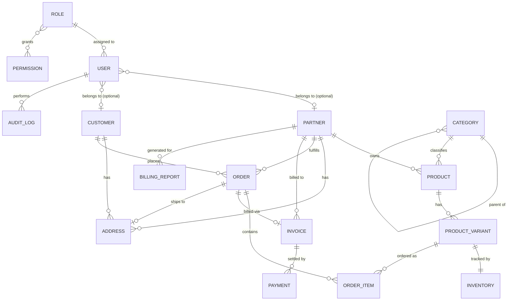
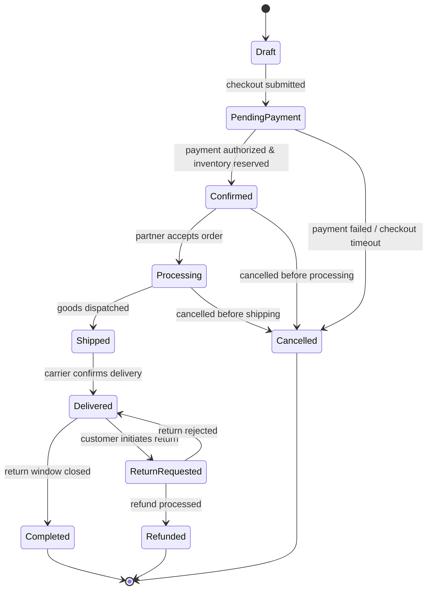
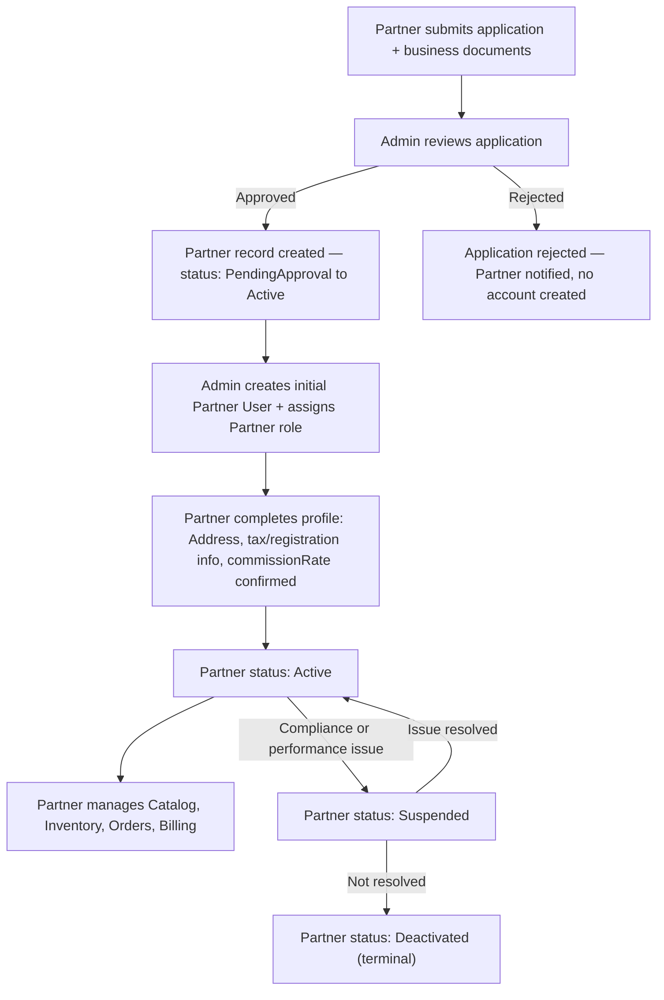
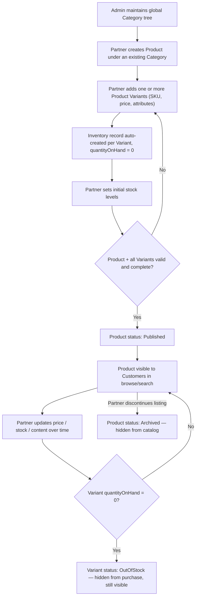
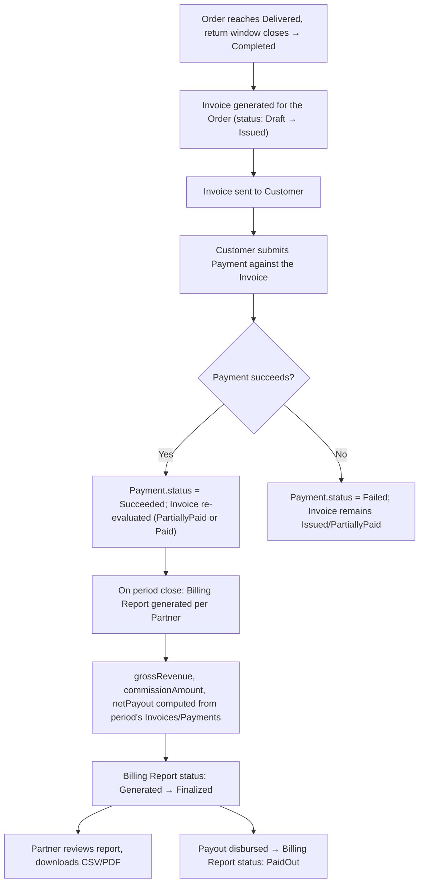

# SmartSense Marketplace — Domain Model

Version: 1.0
Status: Pre-implementation (no database schema exists yet)

## Purpose

This document defines the business domain for SmartSense Marketplace before any database schema, Prisma model, or GraphQL type is written. It is the shared vocabulary for Admins, Partners, and Customers interacting with the platform, and the reference every future schema/API decision should trace back to.

Per `CLAUDE.md` and the current repository state, this document intentionally contains **no Prisma models** and **no GraphQL types** — those are downstream artifacts of the model described here.

---

## Scope & Assumptions

`docs/requirements.md` and `docs/architecture.md` establish the roles (Admin, Partner, Customer), the modules (Dashboard, Catalog, Orders, Billing), and the permission-service pattern (`canViewOrders()`, `canEditCatalog()` — never hardcoded role checks). They do not specify entity-level business rules, so the following assumptions fill the gaps. They should be validated with stakeholders before schema work begins.

1. **Marketplace shape.** SmartSense Marketplace is a multi-vendor (B2B2C) marketplace: **Partners** are vendor organizations that sell; **Customers** are buyer organizations or individuals; **Admin** is the platform operator that governs both sides.
2. **User ownership.** A `User` is a platform login identity (backed by Keycloak) that belongs to at most one owning organization — either a `Partner` or a `Customer` — never both. Platform Admin users belong to neither. This keeps "who does this user act on behalf of" unambiguous.
3. **Order scoping is single-partner.** Each `Order` is scoped to exactly one `Partner`. If a Customer's cart contains items from multiple Partners, checkout splits it into one `Order` per Partner (the common multi-vendor "cart-splitting" pattern). This keeps fulfillment, invoicing, and payout logic per-order instead of per-line-item.
4. **Categories are centrally managed.** The `Category` taxonomy is owned and maintained by Admin as a single global tree shared by all Partners, not a per-partner taxonomy. Partners assign `Product`s to existing categories; they don't create new ones. This keeps cross-partner search and filtering consistent.
5. **Product vs. Product Variant.** `Product` is the marketing/conceptual entity (title, description, brand, category). `ProductVariant` is the actual sellable unit (SKU, price, attributes like size/color) and is what carries `Inventory` and is what `OrderItem` references. Even a product with no real variation (e.g., a single-SKU item) still has exactly one `ProductVariant` row, so downstream logic never special-cases "simple" vs "variant" products.
6. **Inventory granularity.** `Inventory` is tracked per `ProductVariant` as a single stock count for v1 — no per-warehouse/location breakdown. Multi-location inventory is a plausible future extension, not modeled here.
7. **Invoice cardinality.** One `Invoice` is generated per completed `Order`. A `BillingReport` is a separate, higher-level aggregation of many Invoices/Payments over a period for one Partner (e.g., a monthly statement with commission summary) — it does not replace per-order invoicing.
8. **Payment cardinality.** A `Payment` always references exactly one `Invoice`. Partial/installment payments are supported (many Payments per Invoice), but a single Payment settling multiple Invoices at once is out of scope for v1.
9. **RBAC is permission-based, not role-string-based.** `Role` is a named, extensible bundle of fine-grained `Permission`s (e.g., `catalog:write`, `orders:read`, `billing:manage`). This mirrors the `canViewOrders()`/`canEditCatalog()` pattern already mandated in `docs/architecture.md`, and is what lets "future roles should be easy to add" (per `docs/requirements.md`) hold true without code changes to authorization checks.
10. **Audit Log is polymorphic and immutable.** `AuditLog` records who did what, to which entity, and when, for any entity type in the system. It is write-once (append-only) — never updated or deleted — and is written by the application/service layer, not inferred from database triggers.
11. **Address is referenced, not snapshotted.** `Address` is a standalone, reusable entity owned by exactly one `Partner` or one `Customer`. `Order`s reference an existing `Address` rather than freezing a copy of it at order time. This is a deliberate simplification — if an Address is edited after an Order ships, the Order's shipping record changes retroactively. Revisit this if legal/compliance recordkeeping requires immutable historical snapshots.

---

## Entity-Relationship Overview

Notes on the diagram:

- `AUDIT_LOG` is drawn only against `USER` (the actor). Its target side is polymorphic (any entity type + id) and is not representable as a fixed ER edge — see the Audit Log section.
- `ROLE }o--o{ PERMISSION` is many-to-many: a Permission can belong to multiple Roles, and a Role bundles multiple Permissions.
- `CATEGORY ||--o{ CATEGORY` is the self-referencing parent/child hierarchy.

---

## Entities

### User

**Purpose.** Represents a single human login identity in the system, authenticated via Keycloak. A User is the actor behind every action; it is never itself a business counterparty (that's `Partner`/`Customer`).

**Attributes**

| Attribute             | Notes                                                                                                                          |
| --------------------- | ------------------------------------------------------------------------------------------------------------------------------ |
| id                    | Unique identifier                                                                                                              |
| keycloakSubjectId     | External identity provider subject (`sub` claim); source of truth for auth                                                     |
| email                 | Unique, used for notifications                                                                                                 |
| fullName              | Display name                                                                                                                   |
| status                | `Invited`, `Active`, `Suspended`, `Deactivated`                                                                                |
| ownerType             | `None` (platform Admin), `Partner`, or `Customer` — which organization, if any, this user acts on behalf of (see Assumption 2) |
| createdAt / updatedAt |                                                                                                                                |

**Relationships**

- Many-to-many with `Role` (a User can hold more than one Role, e.g., a Partner-side "Billing Manager" and "Catalog Editor").
- Optionally belongs to one `Partner` (staff account) or one `Customer` (buyer contact) — mutually exclusive, per Assumption 2.
- One-to-many with `AuditLog` as the acting user.

**Business rules**

- Email must be unique platform-wide (not just within an organization).
- A User with `ownerType = None` must have the Admin role; a User cannot be `ownerType = None` and hold only Partner/Customer roles.
- Deactivating a User does not delete their `AuditLog` history.

**Lifecycle.** `Invited` (account created, awaiting first login/email verification) → `Active` → `Suspended` (temporary, reversible — e.g., security concern) → `Deactivated` (terminal; login blocked permanently). Suspended and Deactivated Users retain all historical data (Orders, Audit entries) for record-keeping.

---

### Role

**Purpose.** A named, reusable bundle of Permissions assigned to Users. Exists so authorization logic never checks role strings directly and new roles can be introduced without code changes (per `docs/requirements.md`: "Future roles should be easy to add").

**Attributes**

| Attribute    | Notes                                                                                               |
| ------------ | --------------------------------------------------------------------------------------------------- |
| id           |                                                                                                     |
| name         | e.g., `Admin`, `Partner`, `Customer` — extensible, not a fixed enum                                 |
| description  | Human-readable purpose                                                                              |
| isSystemRole | `true` for the three baseline roles (protected from deletion); `false` for custom roles added later |

**Relationships**

- Many-to-many with `Permission`.
- Many-to-many with `User`.

**Business rules**

- System roles (`Admin`, `Partner`, `Customer`) cannot be deleted or renamed.
- A Role must have at least one Permission to be assignable (an empty Role is not useful and likely a data error).
- Role name must be unique.

**Lifecycle.** Created (by Admin) → Active → optionally Archived (custom roles only; archiving prevents new assignment but doesn't retroactively strip it from existing Users, to avoid silently locking people out).

---

### Permission

**Purpose.** The smallest unit of authorization — a single capability like `catalog:write` or `orders:read`. Permissions are what UI/API authorization checks (`canViewOrders()`, `canEditCatalog()`) actually evaluate; Roles are just a convenient way to assign many Permissions at once.

**Attributes**

| Attribute   | Notes                                                                       |
| ----------- | --------------------------------------------------------------------------- |
| id          |                                                                             |
| key         | Machine-readable, namespaced, e.g., `billing:manage`                        |
| description | Human-readable                                                              |
| domain      | The module it governs: `catalog`, `orders`, `billing`, `users`, `dashboard` |

**Relationships**

- Many-to-many with `Role`.

**Business rules**

- `key` is unique and immutable once referenced by authorization checks (renaming would silently break access control).
- Permissions are seeded/managed by the platform (not created ad hoc by Admin users through the UI in v1) — they map 1:1 to capabilities the codebase actually checks.

**Lifecycle.** Effectively static reference data: added when a new capability ships, never deleted while any code path still checks for it.

---

### Partner

**Purpose.** A vendor organization that sells products on the marketplace. The primary "seller" business entity — owns a catalog, holds inventory, fulfills orders, and is billed/paid out by the platform.

**Attributes**

| Attribute                  | Notes                                                                            |
| -------------------------- | -------------------------------------------------------------------------------- |
| id                         |                                                                                  |
| legalName / displayName    |                                                                                  |
| status                     | `PendingApproval`, `Active`, `Suspended`, `Deactivated` (see Partner Onboarding) |
| contactEmail               | Primary business contact                                                         |
| taxId / registrationNumber | For invoicing/compliance                                                         |
| commissionRate             | Platform's cut, used in Billing flow                                             |
| createdAt / approvedAt     |                                                                                  |

**Relationships**

- One-to-many with `User` (staff accounts).
- One-to-many with `Address`.
- One-to-many with `Product`.
- One-to-many with `Order` (as fulfilling party).
- One-to-many with `Invoice` and `BillingReport`.

**Business rules**

- A Partner cannot list Products or receive Orders while `status != Active`.
- `commissionRate` must be set before the first `BillingReport` can be generated.
- Deactivating a Partner does not delete historical Orders/Invoices — it only blocks new activity.

**Lifecycle.** See [Partner Onboarding](#partner-onboarding) below for the full flow: `PendingApproval` → `Active` ⇄ `Suspended` → `Deactivated`.

---

### Customer

**Purpose.** A buyer — an organization or individual that places Orders. Read-mostly counterpart to Partner, per `docs/requirements.md`'s "Customer: read-only access where applicable."

**Attributes**

| Attribute    | Notes                          |
| ------------ | ------------------------------ |
| id           |                                |
| displayName  |                                |
| type         | `Individual` or `Organization` |
| status       | `Active`, `Suspended`          |
| billingEmail |                                |
| createdAt    |                                |

**Relationships**

- One-to-many with `User` (buyer contacts — an Organization-type Customer may have several).
- One-to-many with `Address`.
- One-to-many with `Order`.

**Business rules**

- An `Individual`-type Customer has exactly one associated `User`; an `Organization`-type Customer may have several.
- A Suspended Customer cannot place new Orders but can still view Order history (read-only, consistent with the role's general access level).

**Lifecycle.** Created on first successful signup/registration → `Active` → `Suspended` (billing dispute, policy violation) ⇄ `Active`. No hard delete — Customers are anonymized rather than removed if data-retention rules require it, to preserve Order/Invoice history integrity.

---

### Category

**Purpose.** Hierarchical classification for Products, enabling browse/filter/search. Centrally managed (Assumption 4) so the taxonomy is consistent across all Partners.

**Attributes**

| Attribute        | Notes                              |
| ---------------- | ---------------------------------- |
| id               |                                    |
| name             |                                    |
| slug             | URL-friendly identifier            |
| parentCategoryId | Nullable — null means top-level    |
| displayOrder     | Sort position among siblings       |
| isActive         | Hides from browse without deleting |

**Relationships**

- Self-referencing one-to-many (`parent` → `children`).
- One-to-many with `Product`.

**Business rules**

- A Category with active Products cannot be deleted (must be deactivated or Products reassigned first).
- Circular parent references are invalid (a Category cannot be its own ancestor).
- Only Admin can create/edit/delete Categories (Assumption 4).

**Lifecycle.** Created by Admin → Active → Inactive (hidden from new Product assignment and browse, but existing Products keep the reference) → (rarely) deleted once no Products reference it, directly or via descendants.

---

### Product

**Purpose.** The marketing/conceptual catalog entry a Partner creates — what a Customer sees as "one item" in search results, even though the purchasable unit is one of its `ProductVariant`s (Assumption 5).

**Attributes**

| Attribute               | Notes                                             |
| ----------------------- | ------------------------------------------------- |
| id                      |                                                   |
| partnerId               | Owning Partner                                    |
| categoryId              |                                                   |
| title / description     |                                                   |
| brand                   | Optional                                          |
| status                  | `Draft`, `PendingReview`, `Published`, `Archived` |
| createdAt / publishedAt |                                                   |

**Relationships**

- Many-to-one with `Partner` (owner) and `Category`.
- One-to-many with `ProductVariant`.

**Business rules**

- A Product must have at least one `ProductVariant` before it can move to `Published`.
- Only the owning Partner (or Admin) can edit a Product.
- Archiving a Product archives visibility only — historical `OrderItem` records keep referencing the Product/Variant as it existed at order time is out of scope for v1 (see Assumption 11 on referencing vs. snapshotting; the same trade-off applies here and is worth revisiting together).

**Lifecycle.** See [Catalog Management](#catalog-management) below: `Draft` → `PendingReview` (optional, if Admin moderation is enabled) → `Published` → `Archived`.

---

### Product Variant

**Purpose.** The actual sellable SKU — the unit that carries price, attributes (size/color/etc.), inventory, and is what an `OrderItem` references (Assumption 5).

**Attributes**

| Attribute  | Notes                                                          |
| ---------- | -------------------------------------------------------------- |
| id         |                                                                |
| productId  |                                                                |
| sku        | Unique per Partner                                             |
| attributes | Structured key/value set, e.g., `{ size: "M", color: "Blue" }` |
| price      | Current sell price. Must be strictly positive.                 |
| status     | `Active`, `OutOfStock`, `Discontinued`                         |
| isDefault  | Exactly one per Product (see below)                            |

**Relationships**

- Many-to-one with `Product`.
- One-to-one with `Inventory`.
- One-to-many with `OrderItem`.

**Business rules**

- `sku` unique within a Partner's catalog (not necessarily platform-wide).
- `price` must be strictly positive (`> 0`) — enforced by the API's Input DTO validation and, as a backstop, a database `CHECK` constraint (docs/database-schema.md).
- `status = OutOfStock` is derived from `Inventory.quantityOnHand == 0` and should not be independently editable — it's a computed/reflected state, not a source of truth. The only client-settable transition is to `Discontinued`.
- Exactly one non-deleted `ProductVariant` per `Product` has `isDefault = true` at any time — enforced by a partial unique index (docs/database-schema.md). It is the Variant a Product-level view (e.g. a catalog list's flattened `sku`) resolves through. Setting a new default unsets the previous one in the same transaction.
- A Product's default Variant, and a Product's last remaining non-deleted Variant, cannot be archived — every Product must always have at least one Variant (see `Product`'s business rules). Promote a different Variant to default first.

**Lifecycle.** Created with its parent Product (the first one is always the default) → `Active` ⇄ `OutOfStock` (automatic, based on Inventory) → `Discontinued` (manual, terminal — Partner stops selling it, but past Orders remain intact). Archiving (soft-delete) is independent of this status lifecycle and is blocked while the Variant is the Product's default or only remaining one.

---

### Inventory

**Purpose.** Tracks available stock for a Product Variant so Orders can be validated against real availability.

**Attributes**

| Attribute        | Notes                                                  |
| ---------------- | ------------------------------------------------------ |
| id               |                                                        |
| productVariantId | One-to-one                                             |
| quantityOnHand   | Physical stock                                         |
| quantityReserved | Held against unconfirmed Orders (checkout in progress) |
| reorderThreshold | Optional, for low-stock alerts                         |
| updatedAt        |                                                        |

**Relationships**

- One-to-one with `ProductVariant`.

**Business rules**

- `quantityOnHand - quantityReserved` is the sellable quantity; it must never go negative.
- Stock decrements happen at Order confirmation, not at cart-add, to avoid overselling from abandoned carts (reservation is time-boxed). This reservation flow is Order-driven and lands with M13 — M12 exposes only direct, Partner-initiated stock adjustments (`adjustInventory`: increase, decrease, or set `quantityOnHand` outright), which are rejected if the result would go negative or drop below `quantityReserved`.
- Every `ProductVariant` has exactly one `Inventory` record, created at the same time as the Variant (even if quantity starts at zero).

**Lifecycle.** Created alongside its Variant with `quantityOnHand = 0` → updated by Partner stock adjustments and Order confirmations/cancellations for the life of the Variant. Not independently deleted; it's removed only when its Variant is.

---

### Order

**Purpose.** Represents a Customer's purchase from a single Partner (Assumption 3). The central transactional entity connecting Customer, Partner, Product Variants, and ultimately billing.

**Attributes**

| Attribute                             | Notes                    |
| ------------------------------------- | ------------------------ |
| id                                    |                          |
| orderNumber                           | Human-readable, unique   |
| customerId                            |                          |
| partnerId                             |                          |
| shippingAddressId                     |                          |
| status                                | See Order Lifecycle      |
| subtotal / tax / shippingCost / total | Computed at confirmation |
| placedAt                              |                          |

**Relationships**

- Many-to-one with `Customer` and `Partner`.
- Many-to-one with `Address` (shipping).
- One-to-many with `OrderItem`.
- One-to-zero-or-one with `Invoice`.

**Business rules**

- All `OrderItem`s in an Order must reference `ProductVariant`s belonging to the same `Partner` as the Order (enforces Assumption 3).
- `total` must equal the sum of `OrderItem` line totals plus tax and shipping — recomputed server-side, never trusted from client input.
- An Order cannot transition to `Confirmed` if any line item's requested quantity exceeds available Inventory at confirmation time.

**Lifecycle.** Full detail in [Order Lifecycle](#order-lifecycle) below.

---

### Order Item

**Purpose.** A single line within an Order — one Product Variant, a quantity, and the price at the time of purchase.

**Attributes**

| Attribute         | Notes                              |
| ----------------- | ---------------------------------- |
| id                |                                    |
| orderId           |                                    |
| productVariantId  |                                    |
| quantity          |                                    |
| unitPriceSnapshot | Price at time of order — immutable |
| lineTotal         | `quantity * unitPriceSnapshot`     |

**Relationships**

- Many-to-one with `Order`.
- Many-to-one with `ProductVariant`.

**Business rules**

- `unitPriceSnapshot` is captured at order placement and never recalculated from the live `ProductVariant.price`, so historical Orders remain accurate even after price changes.
- `quantity` must be a positive integer and cannot be edited after the Order leaves `Draft`/cart state — cancel and reorder instead of mutating a placed line item.

**Lifecycle.** Created with its parent Order and effectively immutable afterward; removed only if the whole Order is cancelled before confirmation (cart-stage edits).

---

### Invoice

**Purpose.** The financial document issued for a completed Order, billed to the Customer and used to reconcile what the Partner is owed.

**Attributes**

| Attribute        | Notes                                              |
| ---------------- | -------------------------------------------------- |
| id               |                                                    |
| invoiceNumber    | Unique, sequential                                 |
| orderId          | One-to-one with the Order it bills                 |
| partnerId        | Denormalized for billing-report queries            |
| amountDue        |                                                    |
| status           | `Draft`, `Issued`, `PartiallyPaid`, `Paid`, `Void` |
| issuedAt / dueAt |                                                    |

**Relationships**

- One-to-one with `Order` (Assumption 7).
- Many-to-one with `Partner`.
- One-to-many with `Payment`.

**Business rules**

- `amountDue` equals the Order's `total` at the time the Invoice is issued and does not change afterward (adjustments require a credit note / new Invoice, not mutation — out of scope for v1 but the constraint should hold from day one).
- Status moves to `Paid` only when the sum of associated `Payment` amounts equals `amountDue`; `PartiallyPaid` covers everything in between.
- A `Void` Invoice must have zero recorded Payments, or the void itself is invalid.

**Lifecycle.** `Draft` (generated but not yet sent) → `Issued` → `PartiallyPaid` → `Paid`, or `Issued`/`Draft` → `Void` (e.g., Order cancelled after invoicing). See [Billing Flow](#billing-flow).

---

### Payment

**Purpose.** A single payment transaction applied against an Invoice.

**Attributes**

| Attribute             | Notes                                        |
| --------------------- | -------------------------------------------- |
| id                    |                                              |
| invoiceId             |                                              |
| amount                |                                              |
| method                | e.g., `Card`, `BankTransfer`                 |
| externalTransactionId | Reference to payment gateway                 |
| status                | `Pending`, `Succeeded`, `Failed`, `Refunded` |
| processedAt           |                                              |

**Relationships**

- Many-to-one with `Invoice` (Assumption 8).

**Business rules**

- Only `Succeeded` Payments count toward an Invoice's paid total.
- A `Refunded` Payment is a terminal state reached only from `Succeeded`, and triggers a corresponding Invoice status re-evaluation (e.g., `Paid` → `PartiallyPaid` or back to `Issued`).
- `externalTransactionId` must be unique — prevents double-recording the same gateway callback.

**Lifecycle.** `Pending` (initiated) → `Succeeded` or `Failed`. `Succeeded` → `Refunded` is the only further transition; `Failed` is terminal (retried as a new Payment record, not reopened).

---

### Billing Report

**Purpose.** A periodic, aggregated statement for a Partner — summarizing Orders, Invoices, Payments, platform commission, and net payout over a period (e.g., monthly). This is the artifact behind `docs/requirements.md`'s "Reports, Download CSV/PDF."

**Attributes**

| Attribute               | Notes                                   |
| ----------------------- | --------------------------------------- |
| id                      |                                         |
| partnerId               |                                         |
| periodStart / periodEnd |                                         |
| grossRevenue            | Sum of Invoice amounts in period        |
| commissionAmount        | `grossRevenue * Partner.commissionRate` |
| netPayout               | `grossRevenue - commissionAmount`       |
| status                  | `Generated`, `Finalized`, `PaidOut`     |
| generatedAt             |                                         |

**Relationships**

- Many-to-one with `Partner`.
- Conceptually aggregates many `Invoice`/`Payment` records within its period (not a direct FK relationship — computed at generation time).

**Business rules**

- Periods must not overlap for the same Partner.
- A `Finalized` report is immutable; corrections require a new adjustment report rather than editing history.
- `netPayout` can only be marked `PaidOut` after the platform's payout process confirms disbursement (external to this domain model).

**Lifecycle.** `Generated` (computed, editable/regenerable) → `Finalized` (locked, sent to Partner) → `PaidOut` (funds disbursed). See [Billing Flow](#billing-flow).

---

### Address

**Purpose.** A reusable postal address owned by either a Partner or a Customer, used for shipping and billing.

**Attributes**

| Attribute                                           | Notes                               |
| --------------------------------------------------- | ----------------------------------- |
| id                                                  |                                     |
| ownerType                                           | `Partner` or `Customer`             |
| ownerId                                             |                                     |
| type                                                | `Shipping`, `Billing`, `Registered` |
| line1 / line2 / city / state / postalCode / country |                                     |
| isDefault                                           | Per owner + type                    |

**Relationships**

- Many-to-one with `Partner` or `Customer` (mutually exclusive — see Assumption 11).
- Referenced by `Order.shippingAddressId`.

**Business rules**

- Exactly one of `ownerType = Partner`/`Customer` applies; an Address can't belong to both.
- Only one `isDefault = true` Address per owner + type combination.
- Deleting an Address referenced by an existing Order is not permitted while the Order is active (Assumption 11 — Orders reference live Addresses, so removing a referenced one would corrupt an in-flight Order's shipping info). Soft-deactivate instead.

**Lifecycle.** Created by owner → Active → optionally deactivated (kept for historical Order references, hidden from "select an address" pickers going forward).

---

### Audit Log

**Purpose.** An immutable, platform-wide record of "who did what, to what, and when" — covering sensitive or business-critical actions across every module (Assumption 10).

**Attributes**

| Attribute   | Notes                                                                  |
| ----------- | ---------------------------------------------------------------------- |
| id          |                                                                        |
| actorUserId | Who performed the action                                               |
| action      | e.g., `Order.StatusChanged`, `Product.Published`, `Partner.Suspended`  |
| entityType  | Polymorphic target type, e.g., `Order`, `Product`, `Partner`           |
| entityId    | Polymorphic target id                                                  |
| metadata    | Structured diff/context (e.g., `{ from: "Pending", to: "Confirmed" }`) |
| occurredAt  |                                                                        |

**Relationships**

- Many-to-one with `User` (actor).
- Polymorphic (not a strict FK) association to any other entity via `entityType` + `entityId`.

**Business rules**

- Append-only: no update or delete operations exist for this entity, by design.
- Written by the service layer at the point an action is committed, not reconstructed later from other tables.
- Must never contain secrets (payment credentials, tokens) in `metadata` — only business-relevant field diffs.

**Lifecycle.** Created once per auditable action. Never transitions state; retained indefinitely or per the platform's data-retention policy (external to this model).

---

## Order Lifecycle

An Order's status governs what actions are valid — inventory reservation, invoicing, and cancellation eligibility all key off it.

Key rules:

- Inventory is decremented (reserved → committed) at `Confirmed`, not at `Draft`, so abandoned carts never falsely reduce sellable stock.
- `Invoice` generation is triggered at `Delivered` → `Completed` (see Billing Flow), not at `Confirmed`, so Partners aren't billed for orders that get cancelled mid-fulfillment.
- `Cancelled` and `Refunded` both release any reserved/committed Inventory back to the pool.

---

## Partner Onboarding

Key rules:

- A Partner cannot create Products or receive Orders before reaching `Active` (enforced by the `Partner` business rules above).
- The first Partner `User` is created by Admin as part of onboarding; that User can then invite additional staff Users under the same Partner.
- `Suspended` is reversible; `Deactivated` is terminal — historical data is retained either way.

---

## Catalog Management

Key rules:

- A Product needs at least one complete, valid Variant before it can be `Published` (business rule under `Product`).
- `OutOfStock` is a derived Variant state driven by `Inventory`, not an independent Partner toggle.
- Categories are read-only from the Partner's perspective (Assumption 4) — Partners select, they don't create.

---

## Billing Flow

Key rules:

- Invoicing is tied to Order completion, not confirmation (see Order Lifecycle) — Partners are billed for what was actually fulfilled.
- `BillingReport` never mutates history: a `Finalized` report is locked, and corrections are new adjustment reports, not edits (business rule under `Billing Report`).
- Payout disbursement itself (the money movement) is treated as external to this domain model — `BillingReport.status = PaidOut` reflects confirmation from that external process, not the process itself.

---

## Summary of Open Questions

These fell out of writing this model and are worth resolving with stakeholders before schema design locks in:

1. Should Product/Variant edits be versioned so historical Orders can show "what the listing looked like at purchase time," beyond just the price snapshot already captured on `OrderItem`?
2. Should Address be snapshotted per-Order instead of referenced live (Assumption 11), for shipping/legal accuracy?
3. Is partner-level category proposal (Partner suggests a new Category, Admin approves) needed, or is fully Admin-only category management (Assumption 4) sufficient long-term?
4. Does the platform need multi-warehouse Inventory before v1 ships, or is single-count-per-Variant (Assumption 6) acceptable initially?
