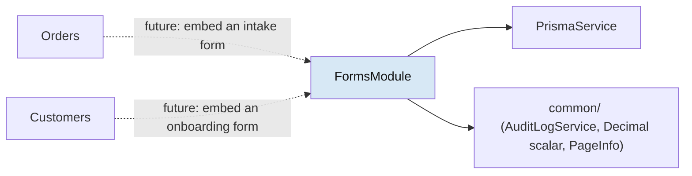
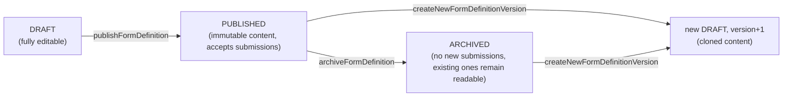

# Dynamic Forms Engine — Design Document

Version: 1.0 (design — no code implemented yet)

---

## Purpose

### Goals

- Design, before any code is written, a platform capability that lets an Admin or Partner **author a
  form schema** (sections, fields, validation, conditional visibility, layout) and have it **rendered
  and filled at runtime** as a real, validated form — attachable to any existing or future business
  entity (Customer, Order, Product, a future Skills Engine, …) without a schema migration per form.
- Follow this project's own documentation-first rule (`CLAUDE.md`, `docs/milestones.md` § Engineering
  Philosophy): this doc is written and reviewed **before** implementation, the same way
  `authentication.md` and `database-schema.md` preceded M5–M7.
- Ground every decision in what this codebase already does, not what a generic form-builder tutorial
  would do — reusing `AuditLogService`, the `Decimal` scalar, the `resolvePartnerScope` ownership
  pattern, and the `PermissionRoute` gating convention rather than inventing parallel mechanisms.

### Scope

This document owns the Dynamic Forms Engine's architecture, schema, API surface, and milestone
sequencing. It does **not** own:

| Not covered here                                   | See                                                                    |
| -------------------------------------------------- | ---------------------------------------------------------------------- |
| General backend/module conventions                 | [backend-architecture.md](./backend-architecture.md)                   |
| General GraphQL conventions                        | [graphql.md](./graphql.md), [api-conventions.md](./api-conventions.md) |
| General frontend/feature-folder conventions        | [frontend-architecture.md](./frontend-architecture.md)                 |
| Permission-key taxonomy mechanics                  | [authorization.md](./authorization.md)                                 |
| Where this sits in the release sequence            | [roadmap.md § Feature Roadmap](./roadmap.md#feature-roadmap)           |
| Milestone-level delivery tracking once work starts | [milestones.md](./milestones.md), [TASKS.md](./TASKS.md)               |

### Grounding: what already exists vs. what's new

Research against the live codebase (not assumption) found:

| This design reuses                                             | Precedent                                                                                          |
| -------------------------------------------------------------- | -------------------------------------------------------------------------------------------------- |
| Polymorphic, immutable audit trail                             | `AuditLog` model + `common/services/audit-log.service.ts` (`AuditLogService.record(tx, ...)`)      |
| Polymorphic entity linking (no per-consumer FK)                | `AuditLog.entityType` + `entityId` (String, not FK) — same shape reused for `FormSubmission`       |
| Versioned, immutable-once-locked lifecycle                     | `BillingReport`'s `Generated → Finalized → PaidOut`, service-layer-enforced immutability           |
| JSON column scoped to small config, never a schema/data dump   | `ProductVariant.attributes Json @db.JsonB`                                                         |
| Money/precise-numeric GraphQL scalar                           | `common/graphql/decimal.scalar.ts` (`Decimal`, reused as-is)                                       |
| `resource:action` permission taxonomy + migration/seed pattern | `docs/authorization.md`, `reports:read`'s introduction at M15 as the precedent for adding a domain |
| `<Type>FilterInput`/`<Type>SortInput`, Relay-style connections | `graphql.md` § Queries, used throughout Catalog/Orders/Billing/Reports                             |
| Ownership-scoping-in-service pattern                           | `ReportsService.resolvePartnerScope` / `resolveRequiredPartnerScope`                               |
| `PermissionRoute` two-tier read/write gating                   | Catalog's `catalog:read`/`catalog:write` route split                                               |
| React Hook Form + Zod, `*.schema.ts` builder-function pattern  | `GenerateBillingReportForm`, `ProductForm`, `OrderForm`                                            |

| This design introduces for the first time in this codebase                   | Why                                                                                                                                                                                                                                              |
| ---------------------------------------------------------------------------- | ------------------------------------------------------------------------------------------------------------------------------------------------------------------------------------------------------------------------------------------------ |
| A **field-type registry** (backend enum ↔ frontend renderer/validator map)   | No registry/plugin pattern exists anywhere today (`grep -rl "registry"` returns nothing)                                                                                                                                                         |
| RHF `Controller`-based wiring for controlled inputs                          | `RadioGroup`/`DateRangePicker` are controlled-only and never wired into RHF anywhere today                                                                                                                                                       |
| A **runtime-generated** Zod schema (built from data, not authored as a file) | Every existing Zod schema is a static, hand-written file; forms need one built from `FormField[]`                                                                                                                                                |
| A conditional-visibility rule evaluator                                      | No show/hide-based-on-another-field logic exists anywhere in this codebase today                                                                                                                                                                 |
| A sparse-typed polymorphic value object (`FormFieldValueOutput`)             | The closest genuinely-polymorphic GraphQL need this codebase has had; `graphql.md` forbids a raw JSON blob, so this is designed as typed nullable fields, not a union (see [GraphQL Schema § Design Note](#design-note-why-not-a-graphql-union)) |

This design deliberately does **not** introduce: a generic expression/rule DSL (visibility rules are a
small fixed operator set, not arbitrary code — an eval'd expression language is a security and
maintenance liability this milestone doesn't need), a pixel-level drag-and-drop layout builder (layout
is a small enum of width hints, matching the "don't design for hypothetical future requirements"
project rule), or a `GraphQLJSON` scalar (the schema is fully typed, relational, and versioned instead —
see [Database Schema](#database-schema)).

---

## Architecture

### Where it lives

- **Backend:** `apps/api/src/modules/forms/` — one module, following the exact anatomy every other
  domain module uses (`forms.module.ts`, `forms.resolver.ts`, `dto/`, `events/`, `listeners/`). Split
  into two services within the module (mirroring Billing's Invoice/Payment split inside one module):
  - `FormDefinitionsService` — authoring, versioning, lifecycle.
  - `FormSubmissionsService` — validation, submission, retrieval.
  - `FormValidationService` — pure functions (no Prisma access): given a `FormField[]` and submitted
    values, returns validation errors and evaluates visibility rules. Shared by both services and,
    critically, **exposed as the same logic the frontend runs** (ported 1:1, not just "similar") so
    client and server validation cannot drift — reusing this project's own "recomputed server-side,
    never trusted from client input" rule (`database-schema.md` § Constraints Not Enforceable, applied
    here to form answers the same way it's applied to `Order.total`).
- **Frontend:** `apps/web/src/features/forms/` — one feature, same fixed anatomy as every other feature
  (`components/ graphql/ hooks/ pages/ services/ types/ index.ts`), plus one new subfolder this feature
  specifically needs: `field-registry/` (see [Reusable Field Registry](#reusable-field-registry)).
  Authoring (`/forms/builder/*`) and filling (`/forms/fill/*`, or embedded in a host feature's page) are
  two page groups within the same feature, gated by different permissions, not two separate features —
  they share the field registry, the generated-schema logic, and the GraphQL types.

### Module dependency shape

Per `backend-architecture.md`'s rule ("`modules/*` may depend on `common/`, `config/`, `prisma/` — never
the reverse") and Reports' own precedent (querying Order/Invoice/Payment/Product directly via
`PrismaService` rather than importing Orders/Billing/Catalog modules), `FormsModule` does the same:
ownership checks against a `FormSubmission.entityType`/`entityId` (e.g. "does this caller own this
Order?") are resolved by querying the relevant table directly via `PrismaService`, **not** by importing
`OrdersModule`. This keeps Forms a leaf module other modules can eventually depend on (e.g. a future
Customer-onboarding flow importing `FormDefinitionsService` to fetch a form to embed) without a cycle.



### Core object model (conceptual)

```
FormDefinition (versioned, key-stable)
  └─ FormSection (ordered)
       └─ FormField (typed, ordered)
            ├─ FormFieldOption (for SINGLE_SELECT / MULTI_SELECT)
            └─ FormFieldVisibilityRule (this field's show/hide condition)

FormSubmission (immutable once SUBMITTED, linked to the exact FormDefinition version filled)
  └─ FormFieldValue (one row per answered field, sparse-typed)
```

---

## Database Schema

All new models follow `database-schema.md`'s existing conventions: UUID primary keys
(`@default(uuid())`), native Postgres enums, `@@map`/`@map` snake_case column mapping, and — per the
ledger-model precedent (`Order`/`Invoice`/`Payment`/`BillingReport` have no `deletedAt`, using their own
status enum as the "is this active" signal instead) — **no `deletedAt`** on `FormDefinition` or
`FormSubmission`; both use their own status enum, because a published form or a submitted answer is a
historical record, not a mutable/deletable row.

### Enums

```prisma
enum FormDefinitionStatus {
  DRAFT
  PUBLISHED
  ARCHIVED

  @@map("form_definition_status")
}

enum FormFieldType {
  TEXT
  TEXTAREA
  NUMBER
  DECIMAL
  BOOLEAN
  DATE
  SINGLE_SELECT
  MULTI_SELECT

  @@map("form_field_type")
}

enum FormFieldWidth {
  FULL
  HALF
  THIRD

  @@map("form_field_width")
}

enum FormVisibilityOperator {
  EQUALS
  NOT_EQUALS
  IN
  NOT_IN
  IS_EMPTY
  IS_NOT_EMPTY

  @@map("form_visibility_operator")
}

enum FormSubmissionStatus {
  SUBMITTED
  WITHDRAWN

  @@map("form_submission_status")
}
```

Eight field types, deliberately: this is the smallest set that covers every existing shared-UI
form-input component (`Input`, `Textarea`, `Checkbox`/`Switch`→`BOOLEAN`, native date `Input`→`DATE`,
`Select`/`RadioGroup`→`SINGLE_SELECT`, a multi-value equivalent→`MULTI_SELECT`, plus `DECIMAL` reusing
the existing `Decimal` scalar for money-shaped custom fields). `EMAIL`/`PHONE`/`URL` are **not** separate
field types — they are `TEXT` with a `config.pattern` validation preset, avoiding registry sprawl for
what is really just a `TEXT` field with a different regex (mirrors Catalog's own restraint: it didn't
invent a type per attribute either).

### Models

```prisma
model FormDefinition {
  id              String               @id @default(uuid())
  key             String               // stable across versions, e.g. "customer-onboarding-intake"
  version         Int                  @default(1)
  title           String
  description     String?
  entityTypeScope String?              // e.g. "Customer" | "Order" | null (general-purpose)
  status          FormDefinitionStatus @default(DRAFT)
  ownerPartnerId  String?              // null = Admin-authored, platform-wide
  createdByUserId String
  publishedAt     DateTime?
  archivedAt      DateTime?
  createdAt       DateTime             @default(now())
  updatedAt       DateTime             @updatedAt

  ownerPartner  Partner?        @relation(fields: [ownerPartnerId], references: [id], onDelete: Restrict)
  createdBy     User            @relation(fields: [createdByUserId], references: [id], onDelete: Restrict)
  sections      FormSection[]
  submissions   FormSubmission[]

  @@unique([key, version])
  @@index([key, status])
  @@index([ownerPartnerId])
  @@map("form_definitions")
}

model FormSection {
  id               String   @id @default(uuid())
  formDefinitionId String
  title            String
  displayOrder     Int
  createdAt        DateTime @default(now())
  updatedAt        DateTime @updatedAt

  formDefinition FormDefinition @relation(fields: [formDefinitionId], references: [id], onDelete: Cascade)
  fields         FormField[]

  @@index([formDefinitionId, displayOrder])
  @@map("form_sections")
}

model FormField {
  id            String         @id @default(uuid())
  formSectionId String
  key           String         // stable within the form, e.g. "email_address"
  label         String
  type          FormFieldType
  required      Boolean        @default(false)
  displayOrder  Int
  width         FormFieldWidth @default(FULL)
  helpText      String?
  placeholder   String?
  config        Json?          @db.JsonB // small, type-specific extras only — see note below
  createdAt     DateTime       @default(now())
  updatedAt     DateTime       @updatedAt

  formSection      FormSection               @relation(fields: [formSectionId], references: [id], onDelete: Cascade)
  options          FormFieldOption[]
  visibilityRules  FormFieldVisibilityRule[] @relation("FieldOwnRules")
  dependentRules    FormFieldVisibilityRule[] @relation("FieldDependedOn")
  values           FormFieldValue[]

  @@unique([formSectionId, key])
  @@index([formSectionId, displayOrder])
  @@map("form_fields")
}

model FormFieldOption {
  id           String @id @default(uuid())
  formFieldId  String
  value        String
  label        String
  displayOrder Int

  formField FormField @relation(fields: [formFieldId], references: [id], onDelete: Cascade)

  @@unique([formFieldId, value])
  @@index([formFieldId, displayOrder])
  @@map("form_field_options")
}

model FormFieldVisibilityRule {
  id               String                 @id @default(uuid())
  formFieldId      String                 // the field this rule hides/shows
  dependsOnFieldId String                 // another field in the same FormDefinition
  operator         FormVisibilityOperator
  comparisonValue  String?                // cast at evaluation time per dependsOnField.type
  createdAt        DateTime               @default(now())

  formField      FormField @relation("FieldOwnRules", fields: [formFieldId], references: [id], onDelete: Cascade)
  dependsOnField FormField @relation("FieldDependedOn", fields: [dependsOnFieldId], references: [id], onDelete: Cascade)

  @@index([formFieldId])
  @@index([dependsOnFieldId])
  @@map("form_field_visibility_rules")
}

model FormSubmission {
  id                 String                @id @default(uuid())
  formDefinitionId   String                // the EXACT version filled
  entityType         String?               // polymorphic, mirrors AuditLog — e.g. "Customer" | "Order"
  entityId           String?
  submittedByUserId  String
  status             FormSubmissionStatus  @default(SUBMITTED)
  submittedAt        DateTime              @default(now())
  createdAt          DateTime              @default(now())
  updatedAt          DateTime              @updatedAt

  formDefinition  FormDefinition    @relation(fields: [formDefinitionId], references: [id], onDelete: Restrict)
  submittedBy     User              @relation(fields: [submittedByUserId], references: [id], onDelete: Restrict)
  values          FormFieldValue[]

  @@index([formDefinitionId])
  @@index([entityType, entityId])
  @@index([submittedByUserId])
  @@map("form_submissions")
}

model FormFieldValue {
  id                   String    @id @default(uuid())
  formSubmissionId     String
  formFieldId          String
  stringValue          String?
  numberValue          Decimal?  @db.Decimal(14, 4) // reuses the M12 Decimal convention
  booleanValue         Boolean?
  dateValue            DateTime?
  selectedOptionValues String[]              // Postgres native array; MULTI_SELECT only

  formSubmission FormSubmission @relation(fields: [formSubmissionId], references: [id], onDelete: Cascade)
  formField      FormField      @relation(fields: [formFieldId], references: [id], onDelete: Restrict)

  @@unique([formSubmissionId, formFieldId])
  @@index([formFieldId])
  @@map("form_field_values")
}
```

**Why `FormFieldValue` isn't a single JSON blob.** `graphql.md`'s anti-pattern table forbids "a single
`data: JSON` scalar field returning an arbitrary blob... model the actual shape as typed fields." The
sparse-typed-columns approach (one column per scalar kind, exactly one populated per row) satisfies that
rule at the storage layer the same way `ProductVariant.attributes` satisfies it at the projection layer
— the difference is `FormFieldValue` doesn't even need the JSON-then-mapper indirection, because the
value's _kind_ is a small, fixed set (matching `FormFieldType`), not truly open-ended.

**`config: Json?` scope, explicitly bounded.** This is the one JSON column in the new schema, and it is
scoped exactly like `ProductVariant.attributes` — small, type-specific, non-authoritative extras that
don't warrant their own columns (`{ min, max }` for `NUMBER`/`DECIMAL`, `{ maxLength, pattern }` for
`TEXT`). It is **not** where the form's shape lives — section/field/option/rule structure is fully
relational, queryable, and typed. This distinction is deliberately called out because it is the exact
"JSON scalar" anti-pattern boundary `graphql.md` warns about, and a future maintainer must not "helpfully"
widen `config` into a schema dump.

### Constraints not enforceable at the database level (per `database-schema.md`'s own convention of listing these explicitly)

| Rule                                                                                                                                     | Enforced                                                                                                                      |
| ---------------------------------------------------------------------------------------------------------------------------------------- | ----------------------------------------------------------------------------------------------------------------------------- |
| Exactly one of `FormFieldValue`'s typed columns is populated, matching the field's `type`                                                | Service-layer only (`FormValidationService`), same class of rule as `Order.total` reconciliation                              |
| A `FormFieldVisibilityRule.dependsOnFieldId` must belong to the same `FormDefinition` as `formFieldId`                                   | Service-layer only (cross-row, cross-table invariant, same shape as "all OrderItems belong to the same Partner as the Order") |
| Once `FormDefinition.status = PUBLISHED`, its sections/fields/options/rules are immutable                                                | Service-layer only, mirroring `BillingReport`'s `Finalized` immutability — no DB trigger                                      |
| A `FormSubmission` must reference a `PUBLISHED` (or `ARCHIVED`, for late-arriving submissions in flight) `FormDefinition`, never `DRAFT` | Service-layer only, checked in `submitForm`'s transaction                                                                     |

---

## GraphQL Schema

Naming and shape follow `graphql.md` exactly: `camelCase` noun queries, `<Type>Connection`/`<Type>Edge`
Relay pagination for unbounded lists, `<Type>FilterInput`/`<Type>SortInput` for filtering/sorting.

### Types (abbreviated — full field lists mirror the Prisma models above 1:1)

```graphql
enum FormDefinitionStatus {
  DRAFT
  PUBLISHED
  ARCHIVED
}
enum FormFieldType {
  TEXT
  TEXTAREA
  NUMBER
  DECIMAL
  BOOLEAN
  DATE
  SINGLE_SELECT
  MULTI_SELECT
}
enum FormFieldWidth {
  FULL
  HALF
  THIRD
}
enum FormVisibilityOperator {
  EQUALS
  NOT_EQUALS
  IN
  NOT_IN
  IS_EMPTY
  IS_NOT_EMPTY
}
enum FormSubmissionStatus {
  SUBMITTED
  WITHDRAWN
}

type FormDefinitionOutput {
  id: ID!
  key: String!
  version: Int!
  title: String!
  description: String
  entityTypeScope: String
  status: FormDefinitionStatus!
  ownerPartnerId: ID
  createdByUserId: ID!
  publishedAt: DateTime
  archivedAt: DateTime
  sections: [FormSectionOutput!]!
  createdAt: DateTime!
  updatedAt: DateTime!
}

type FormSectionOutput {
  id: ID!
  title: String!
  displayOrder: Int!
  fields: [FormFieldOutput!]!
}

type FormFieldOutput {
  id: ID!
  key: String!
  label: String!
  type: FormFieldType!
  required: Boolean!
  displayOrder: Int!
  width: FormFieldWidth!
  helpText: String
  placeholder: String
  config: FormFieldConfigOutput # typed, not JSON — see below
  options: [FormFieldOptionOutput!]!
  visibilityRules: [FormFieldVisibilityRuleOutput!]!
}

# Typed projection of the `config` JSON column — same mapper-pattern precedent as
# ProductVariantMapper turning Json into ProductVariantAttributeOutput[].
type FormFieldConfigOutput {
  min: Decimal
  max: Decimal
  maxLength: Int
  pattern: String
}

type FormFieldOptionOutput {
  id: ID!
  value: String!
  label: String!
  displayOrder: Int!
}

type FormFieldVisibilityRuleOutput {
  id: ID!
  dependsOnFieldId: ID!
  operator: FormVisibilityOperator!
  comparisonValue: String
}

type FormSubmissionOutput {
  id: ID!
  formDefinitionId: ID!
  entityType: String
  entityId: ID
  submittedByUserId: ID!
  status: FormSubmissionStatus!
  submittedAt: DateTime!
  values: [FormFieldValueOutput!]!
}

# The one genuinely polymorphic type in this design — see Design Note below.
type FormFieldValueOutput {
  formFieldId: ID!
  stringValue: String
  numberValue: Decimal
  booleanValue: Boolean
  dateValue: DateTime
  selectedOptionValues: [String!]
}
```

#### Design note: why not a GraphQL union?

`graphql.md` reserves Interface/Union types for "genuine polymorphism" and currently has none — a field
answer that varies by declared type is arguably exactly that case. This design uses a **sparse nullable
object** instead of a `union FormFieldValue = StringValue | NumberValue | ...`, for one concrete reason:
the discriminant (`FormField.type`) already exists as sibling data the client always has (it rendered
the field to know what to submit in the first place), so a union would force every consumer to write a
`__typename` switch to recover information it already had for free, for zero additional type safety —
GraphQL can't statically guarantee "the union member matches the sibling field's declared type" any more
than the sparse-object form can. The sparse object was chosen as the simpler idiom for a case where the
discriminant is already externally available; a future genuinely-discriminant-free polymorphism case
(e.g. a search result mixing unrelated entity types) is still the right time to introduce this
codebase's first real union.

### Queries

```graphql
formDefinitions(filter: FormDefinitionFilterInput, sort: FormDefinitionSortInput, first: Int, after: String): FormDefinitionConnection!   # forms:read
formDefinition(id: ID!): FormDefinitionOutput                                                                                              # forms:read
formDefinitionByKey(key: String!, version: Int): FormDefinitionOutput   # latest PUBLISHED if version omitted — used by the runtime renderer  # forms:read
formSubmissions(filter: FormSubmissionFilterInput, first: Int, after: String): FormSubmissionConnection!                                   # forms:read
formSubmission(id: ID!): FormSubmissionOutput                                                                                              # forms:read
```

### Mutations

```graphql
createFormDefinition(input: CreateFormDefinitionInput!): FormDefinitionOutput        # forms:build
updateFormDefinition(id: ID!, input: UpdateFormDefinitionInput!): FormDefinitionOutput  # forms:build, DRAFT only
createNewFormDefinitionVersion(id: ID!): FormDefinitionOutput                        # forms:build, clones PUBLISHED/ARCHIVED → new DRAFT version
publishFormDefinition(id: ID!): FormDefinitionOutput                                 # forms:build, DRAFT → PUBLISHED (locks immutability)
archiveFormDefinition(id: ID!): FormDefinitionOutput                                 # forms:build, PUBLISHED → ARCHIVED
submitForm(input: SubmitFormInput!): FormSubmissionOutput                            # forms:submit
withdrawFormSubmission(id: ID!): FormSubmissionOutput                                # forms:submit, own submission only
```

`SubmitFormInput` mirrors `FormFieldValueOutput`'s sparse shape on the way in
(`{ formDefinitionId, entityType, entityId, values: [{ formFieldId, stringValue, numberValue,
booleanValue, dateValue, selectedOptionValues }] }`) — server-side, `FormValidationService` re-derives
required/type/visibility-rule correctness before persisting, never trusting the client's own
show/hide decisions (a hidden required field must not be enforced; a hidden field's stray submitted
value is rejected) — same "recomputed server-side, never trusted from client input" discipline
`Order.total` already follows.

---

## Backend Services

| Service                  | Responsibility                                                                                                                                                                                                                                                                    |
| ------------------------ | --------------------------------------------------------------------------------------------------------------------------------------------------------------------------------------------------------------------------------------------------------------------------------- |
| `FormDefinitionsService` | CRUD while `DRAFT`; `publish`/`archive`/`createNewVersion` lifecycle transitions, each in its own `$transaction`, each ending with an `AuditLogService.record()` call.                                                                                                            |
| `FormSubmissionsService` | `submitForm` (validates via `FormValidationService`, writes `FormSubmission` + `FormFieldValue[]` in one `$transaction`, ownership-checks `entityType`/`entityId` by querying the owning table directly via `PrismaService`), `withdrawFormSubmission`.                           |
| `FormValidationService`  | Pure, no Prisma: `validateSubmission(fields, values)` → errors; `evaluateVisibility(fields, rules, currentValues)` → visible field-id set. Ported to the frontend as the same algorithm (not merely "equivalent code") so client/server visibility and validation cannot diverge. |

### Events (following the exact `@nestjs/event-emitter` pattern from Orders/Billing)

```ts
class FormDefinitionPublishedEvent {
  static readonly EVENT_NAME = 'form_definition.published'
  constructor(
    public readonly formDefinitionId: string,
    public readonly key: string,
  ) {}
}

class FormSubmissionCreatedEvent {
  static readonly EVENT_NAME = 'form_submission.created'
  constructor(
    public readonly formSubmissionId: string,
    public readonly entityType: string | null,
    public readonly entityId: string | null,
  ) {}
}
```

Emitted strictly after the owning transaction commits, exactly like `OrderCreatedEvent`/
`InvoiceGeneratedEvent`. No listener consumes these in this design's scope — they exist as a zero-cost
hook for a **future** Notifications consumer (e.g. "notify the Partner when a Customer submits their
intake form"), the same relationship M13's events had to M16 Notifications before M16 existed.

### Transactions

Every multi-row write is wrapped in `prisma.$transaction`, per `api-conventions.md`: version-cloning
(`FormDefinition` + cascaded `FormSection`/`FormField`/`FormFieldOption`/`FormFieldVisibilityRule` rows),
`publishFormDefinition` (status flip + audit log), and `submitForm` (`FormSubmission` + `FormFieldValue[]`

- audit log).

---

## Frontend: Reusable Field Registry

The core new pattern this milestone introduces. A single source of truth mapping `FormFieldType` to
everything needed to render, validate, and default that type — `apps/web/src/features/forms/field-registry/`:

```ts
interface FieldRegistryEntry<TValue> {
  type: FormFieldType
  Renderer: React.ComponentType<FieldRendererProps<TValue>>   // wraps the existing shared Input/Select/etc.
  buildZodSchema: (field: FormFieldOutput) => z.ZodTypeAny     // per-field validator, composed into the form schema
  defaultValue: TValue
  toSubmissionValue: (value: TValue) => FormFieldValueInputShape
  fromSubmissionValue: (value: FormFieldValueOutput) => TValue
}

const FIELD_REGISTRY: Record<FormFieldType, FieldRegistryEntry<unknown>> = {
  TEXT: { Renderer: TextFieldRenderer /* wraps shared Input */, ... },
  TEXTAREA: { Renderer: TextareaFieldRenderer /* wraps shared Textarea */, ... },
  NUMBER: { Renderer: NumberFieldRenderer /* wraps shared Input type=number */, ... },
  DECIMAL: { Renderer: DecimalFieldRenderer /* wraps shared Input, Decimal-string safe */, ... },
  BOOLEAN: { Renderer: BooleanFieldRenderer /* wraps shared Switch, RHF Controller-wired */, ... },
  DATE: { Renderer: DateFieldRenderer /* wraps shared Input type=date */, ... },
  SINGLE_SELECT: { Renderer: SingleSelectFieldRenderer /* wraps shared Select */, ... },
  MULTI_SELECT: { Renderer: MultiSelectFieldRenderer /* wraps shared Checkbox group, RHF Controller-wired */, ... },
}
```

This is the first plugin/registry-shaped pattern in the codebase; it's kept intentionally boring (a
plain object literal, not a dynamic-import plugin system) — extensibility here means "add a case to this
map," not "load an external module," matching the project's stated "not planned, but the principle is
maintained" stance on a real plugin ecosystem (`roadmap.md` § Future Product Vision).

`BOOLEAN`/`SINGLE_SELECT` (via `RadioGroup`, if used instead of `Select`)/`MULTI_SELECT` are the first
uses of RHF's `Controller` API in this codebase, since `RadioGroup`/`DateRangePicker`-shaped controlled
components have never been wired into RHF before — this is called out explicitly so a reviewer isn't
surprised to see `Controller` for the first time here.

---

## Frontend Renderer (runtime fill-out)

Unlike every existing form in this codebase (a hand-written `*.schema.ts` file + hand-written JSX), the
Dynamic Forms renderer builds both **at runtime** from a fetched `FormDefinitionOutput`:

1. `buildZodSchemaFromDefinition(definition)` walks `sections[].fields[]` and composes
   `z.object({ [field.key]: registry[field.type].buildZodSchema(field) })`, respecting `required`.
2. `useForm({ resolver: zodResolver(schema), mode: 'onBlur', reValidateMode: 'onChange' })` — same RHF
   options every existing form already uses.
3. Each section/field renders via `FIELD_REGISTRY[field.type].Renderer`, wired through `register()` for
   native-input types and `Controller` for controlled types (see above).
4. Conditional visibility: the form's `watch()` (this codebase's existing, if rare, pattern from
   `OrderForm.tsx`) tracks all field values; `FormValidationService`'s ported `evaluateVisibility` logic
   runs on every change to compute the visible-field-id set. A hidden field is unmounted (not just
   CSS-hidden), so it never submits a stray value and its `required` rule is skipped — enforced
   identically server-side so a client bypass can't force a hidden required field through.
5. Layout: each `FormSection` renders as a card; fields lay out in a CSS grid, each field's `width`
   (`FULL`/`HALF`/`THIRD`) mapping to a Tailwind grid-span class — no custom layout engine, matching the
   deliberately-small scope stated above.

---

## Form Builder (authoring UI)

`apps/web/src/features/forms/pages/`:

| Page                          | Route                    | Permission    |
| ----------------------------- | ------------------------ | ------------- |
| Form list                     | `/forms`                 | `forms:read`  |
| Form builder (create/edit)    | `/forms/builder/:id?`    | `forms:build` |
| Form detail / version history | `/forms/:id`             | `forms:read`  |
| Submissions list (per form)   | `/forms/:id/submissions` | `forms:read`  |

The builder page composes: section list (add/reorder via up/down controls — no drag-and-drop in this
scope, a candidate future enhancement, not a v1 requirement), per-section field list (add field → choose
type from the registry → configure label/required/width/help text/options-if-select/visibility rules
referencing an earlier field in the same form), a **live preview** that renders the exact same
[Frontend Renderer](#frontend-renderer-runtime-fill-out) component in read-only/preview mode (so the
builder never maintains a second rendering implementation), and Publish/Archive/New-Version actions
mapped 1:1 to the mutations above.

---

## Validation

Two layers, same algorithm, per the project's "recomputed server-side" discipline:

1. **Client:** `FIELD_REGISTRY[type].buildZodSchema(field)` per field, composed into one form-level Zod
   schema — standard RHF+Zod error surfacing (`errorProp` pattern from existing forms).
2. **Server:** `FormValidationService.validateSubmission` re-runs the equivalent checks against the
   authoritative `FormField` rows fetched fresh from Postgres (never trusting client-declared field
   metadata), rejecting with the same field-level error shape `graphql.md`'s error conventions specify.

---

## Conditional Visibility

A fixed, small rule model — deliberately not a general expression language:

- Each `FormFieldVisibilityRule` says: _field X is visible only if field Y's value `operator`
  `comparisonValue`_ (`EQUALS`/`NOT_EQUALS`/`IN`/`NOT_IN`/`IS_EMPTY`/`IS_NOT_EMPTY`).
- Multiple rules on the same field are **AND-combined** (v1 semantics, documented explicitly; OR/grouped
  conditions are an explicit future enhancement, not silently unsupported — see Open Questions).
- `comparisonValue` is stored as `String?` and cast at evaluation time based on `dependsOnField.type`
  (e.g. `"true"`/`"false"` for `BOOLEAN`, a `SINGLE_SELECT` option value for `IN`) — this keeps the rule
  table simple (one column) rather than needing the same sparse-typed-column treatment `FormFieldValue`
  needed, because a rule's comparison value is always a single literal, never a genuinely ambiguous type.
- Enforced identically client-side (hides/unmounts) and server-side (a hidden field's submitted value —
  or a hidden-yet-still-required field's _absence_ — is validated exactly as if the client had run the
  same rule, closing the "disable JS, submit anything" gap).

---

## Dynamic Layouts

Deliberately scoped down from a true page-builder: `FormSection` provides ordering, `FormField.width`
provides a 3-value hint (`FULL`/`HALF`/`THIRD`) mapped to a CSS grid span. This covers the realistic
majority of intake-form layouts (single column, or two/three fields sharing a row) without building a
freeform grid/canvas editor — consistent with `CLAUDE.md`'s "don't design for hypothetical future
requirements" rule. A true drag-and-drop, arbitrary-grid layout builder is named explicitly as a
**non-goal of this design**, not an oversight.

---

## Permission Integration

Following `authorization.md`'s `resource:action` taxonomy and the exact migration+seed pattern `reports:read`
established at M15:

| Key            | Domain | Granted to (proposed)    | Gates                                             |
| -------------- | ------ | ------------------------ | ------------------------------------------------- |
| `forms:build`  | forms  | Admin, Partner           | Author/publish/archive/version `FormDefinition`   |
| `forms:read`   | forms  | Admin, Partner           | List/view `FormDefinition`s and `FormSubmission`s |
| `forms:submit` | forms  | Admin, Partner, Customer | `submitForm`/`withdrawFormSubmission`             |

Ownership scoping mirrors `ReportsService.resolvePartnerScope` exactly: a Partner-scoped caller building
or reading forms is floored to `ownerPartnerId = their own partnerId OR null` (global/Admin-authored
forms are visible to everyone; a Partner never sees another Partner's forms); Admin sees all. A Customer
never holds `forms:build`/`forms:read` — only `forms:submit`, scoped to submissions where
`submittedByUserId` is their own or where `entityId` resolves to an entity they own (checked the same way
`resolvePartnerScope`/existing ownership checks resolve "is this yours" — direct Prisma query against the
target table, e.g. `Order.customerId === caller.customerId`, never a cross-module service call).

---

## Versioning

`FormDefinition.key` is the stable identity across time; `(key, version)` is unique. Lifecycle:



This mirrors `BillingReport`'s `Generated → Finalized → PaidOut` immutability pattern exactly (service-layer
enforced, not a DB trigger) with one addition BillingReport didn't need: **every `FormSubmission`
references the exact `FormDefinition` row (a specific `version`) it was filled against**, so publishing a
new version never invalidates or reinterprets historical submissions — a submission is always read back
against the schema it was actually answered under, even if the "current" version has since changed which
fields exist or what they validate.

---

## Audit Logging

No new audit infrastructure — every lifecycle transition and submission calls the existing
`AuditLogService.record(tx, { actorUserId, action, entityType, entityId, metadata })`:

| Action                            | `entityType`     | `metadata` (example)                         |
| --------------------------------- | ---------------- | -------------------------------------------- |
| `form_definition.created`         | `FormDefinition` | `{ key, version }`                           |
| `form_definition.published`       | `FormDefinition` | `{ key, version }`                           |
| `form_definition.archived`        | `FormDefinition` | `{ key, version }`                           |
| `form_definition.version_created` | `FormDefinition` | `{ key, fromVersion, toVersion }`            |
| `form_submission.created`         | `FormSubmission` | `{ formDefinitionId, entityType, entityId }` |
| `form_submission.withdrawn`       | `FormSubmission` | `{ formDefinitionId }`                       |

---

## Integration Points

| Consumer                 | How it attaches                                                                                                                                                                                                                                                                                                                               | Status                                                                                                                                                                                                                          |
| ------------------------ | --------------------------------------------------------------------------------------------------------------------------------------------------------------------------------------------------------------------------------------------------------------------------------------------------------------------------------------------- | ------------------------------------------------------------------------------------------------------------------------------------------------------------------------------------------------------------------------------- |
| **Customers**            | A form's `entityTypeScope = "Customer"`; `FormSubmission.entityType/entityId` points at the `Customer` row (e.g. an onboarding/profile-completion intake form).                                                                                                                                                                               | No dedicated Customers module exists yet (`Customer` is a Prisma model only, touched via Orders) — Forms needs no new Customer module, just the polymorphic link + a direct `prisma.customer.findUnique` ownership check.       |
| **Users**                | `FormSubmission.submittedByUserId` always points at the acting `User` (already exists) — the actor, not necessarily the form's subject.                                                                                                                                                                                                       | No change needed; `Users` module today is a placeholder (`usersStatus` query only) and Forms doesn't depend on it growing.                                                                                                      |
| **Catalog**              | A form's `entityTypeScope = "Product"` (e.g. an extended Product intake form beyond `ProductVariant.attributes`'s flat key/value pairs).                                                                                                                                                                                                      | Complements, doesn't replace, `ProductVariant.attributes` — that field stays for simple per-variant key/value pairs (size/color); Dynamic Forms is for genuinely structured, validated, versioned, conditional data collection. |
| **Orders**               | A form's `entityTypeScope = "Order"` (e.g. a "special instructions" or "return reason" form attached at order creation/cancellation).                                                                                                                                                                                                         | Ownership check reuses the exact pattern Billing/Reports already use against Order — direct Prisma query, no cross-module import.                                                                                               |
| **Future Skills Engine** | Not defined anywhere in `docs/` today (confirmed by repo-wide search — zero mentions). The polymorphic `entityType`/`entityId` link means Skills Engine, whatever it becomes, attaches forms (e.g. "Skill Assessment") the exact same way Orders/Customers do — **zero Forms Engine changes required**, only a new `entityType` string value. | This is the concrete payoff of choosing `AuditLog`'s polymorphic-link precedent over a per-consumer FK: the integration surface for an undefined future module is already closed.                                               |

---

## Milestone Plan

No milestone number is claimed here — `docs/milestones.md`'s own Change Management rule requires the
product owner's agreement to add a milestone and assign its release. The sequence below is written as
four independently shippable, vertically-sliced milestones (matching this project's own "small PRs,
each milestone leaves the system in a working, demonstrable state" philosophy), proposed as **M21–M24**:

| Proposed ID | Name                                           | Objective                                                                                                                                                                                                                             | Depends on                                          |
| ----------- | ---------------------------------------------- | ------------------------------------------------------------------------------------------------------------------------------------------------------------------------------------------------------------------------------------- | --------------------------------------------------- |
| M21         | Dynamic Forms — Authoring Foundation           | DB schema, `forms:build`/`forms:read`/`forms:submit` permissions seeded, `FormDefinitionsService` + resolver, versioned Draft→Published→Archived lifecycle, audit logging — API-level only, no UI, no submissions yet.                | M4 (schema baseline)                                |
| M22         | Dynamic Forms — Builder UI                     | Frontend authoring pages (section/field CRUD, options, visibility-rule authoring, live preview via the same renderer M23 ships), consuming M21's API.                                                                                 | M21, M10 (shared UI)                                |
| M23         | Dynamic Forms — Runtime Renderer & Submissions | Field registry, runtime Zod-schema generation, `Controller`-wired inputs, conditional-visibility engine, dynamic layout; backend `FormSubmissionsService`, `submitForm` with full server-side re-validation.                          | M21, M22 (shares the renderer with builder preview) |
| M24         | Dynamic Forms — First Real Integrations        | Wire one real form into Orders (e.g. a special-instructions form on order creation) and one into Customers (an onboarding intake form) — proves the polymorphic link end-to-end with real UI entry points in those existing features. | M23, M13 (Orders)                                   |

**Exit criteria per milestone**, following `milestones.md`'s own "verifiable, not vibes" rule:

- **M21:** An Admin/Partner can author, publish, version, and archive a form entirely via GraphQL
  operations (verified by an e2e suite against real Postgres, mirroring `reports.e2e-spec.ts`'s shape);
  publishing locks immutability (a direct-update attempt on a `PUBLISHED` form's fields is rejected);
  every transition is audit-logged; ownership scoping matches the table in
  [Permission Integration](#permission-integration).
- **M22:** An Admin/Partner can build a multi-section, multi-field form (including at least one
  conditional-visibility rule and one `SINGLE_SELECT`/`MULTI_SELECT` field) entirely through the UI, see
  an accurate live preview, and publish it — verified by a Playwright journey.
- **M23:** A Customer/Partner/Admin holding `forms:submit` can fill and submit a real `PUBLISHED` form,
  with conditional fields correctly shown/hidden and required-when-visible enforced identically
  client- and server-side; a submission is retrievable afterward and its values reconcile exactly against
  what was entered — verified by unit tests on `FormValidationService` (both the frontend and backend
  copies, pinned against the same fixture cases) plus a Playwright fill-and-submit journey.
- **M24:** At least one real, permission-gated form-fill entry point exists inside the Orders feature and
  one inside a Customer-facing flow, each correctly linking `FormSubmission.entityType/entityId` back to
  the real Order/Customer row, verified end-to-end.

**Explicitly out of scope for all four milestones** (candidates for a later pass, named so they aren't
silently forgotten): drag-and-drop section/field reordering, OR-grouped visibility rule conditions, a
Reports integration surfacing form-submission analytics (a natural M15 Reports extension, once there's
real submission volume), file-upload field type, and multi-page/paginated forms (all forms in this design
render as a single scrollable page, matching this codebase's existing bounded-scroll page convention).

---

## Open Questions

Carried forward explicitly, per this project's own "resolved or explicitly deferred" rule
(`milestones.md` § Development Lifecycle):

1. **Release slotting.** This design proposes M21–M24 numbering but takes no position on v1.x/v2.x
   placement — that's a product-owner governance decision (`roadmap.md` § Roadmap Governance), not an
   engineering one, especially since "Dynamic Forms Engine" has no prior roadmap mention to anchor it.
2. **Who can be the target of `entityTypeScope`?** This design allows any string value (open, matching
   the "additive, no migration" extensibility principle) but doesn't define a registry of _valid_ values
   — should there be a small enum (`Customer`/`Order`/`Product`/…) validated at `createFormDefinition`
   time, or should it stay a free string validated only by convention? Recommendation: start as a free
   string (lowest friction for the "future Skills Engine" case, which doesn't exist yet to enumerate),
   revisit if invalid values become an operational problem.
3. **Submission edit window.** This design allows `withdrawFormSubmission` but not editing a submitted
   answer — is a bounded edit window needed (e.g. "editable for 24h" like some intake-form products
   allow), or is withdraw-and-resubmit sufficient? Left for M23 implementation-time product input.
4. **File-upload field type.** Explicitly deferred (no file-storage precedent exists anywhere in this
   codebase yet — introducing one is a separable design decision, not a Dynamic Forms detail).

---

## Related Documentation

| Document                                                                                              | Relationship                                                                        |
| ----------------------------------------------------------------------------------------------------- | ----------------------------------------------------------------------------------- |
| [domain-model.md](./domain-model.md)                                                                  | `AuditLog`'s polymorphic-link precedent this design reuses for `FormSubmission`     |
| [database-schema.md](./database-schema.md)                                                            | Conventions (UUID PKs, enums, no-`deletedAt`-on-ledger-models) this schema follows  |
| [graphql.md](./graphql.md)                                                                            | The typed-fields-over-JSON-blob rule this design's `FormFieldValueOutput` satisfies |
| [authorization.md](./authorization.md)                                                                | `resource:action` permission taxonomy and migration+seed pattern for `forms:*`      |
| [frontend-architecture.md](./frontend-architecture.md) / [folder-structure.md](./folder-structure.md) | Feature-folder anatomy `features/forms/` follows                                    |
| [roadmap.md § Feature Roadmap](./roadmap.md#feature-roadmap)                                          | Where this capability is now named as proposed product direction                    |
| [milestones.md](./milestones.md)                                                                      | Where M21–M24 would be added once the product owner confirms scope/sequencing       |

---

## Revision History

| Version | Date       | Author       | Changes                                                                                                          |
| ------- | ---------- | ------------ | ---------------------------------------------------------------------------------------------------------------- |
| 1.0     | 2026-07-13 | Yash Lakhani | Initial design — no code implemented; grounded against live codebase conventions before any M21–M24 work begins. |
