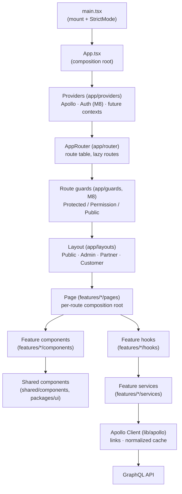
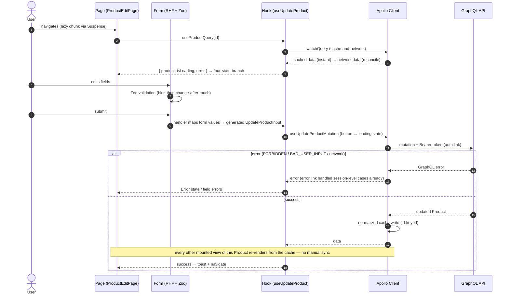

# SmartSense Marketplace — Frontend Architecture Guide

Version: 1.0

---

## Purpose

### Goals

- Define the **React application's runtime architecture**: how the app boots, how a route becomes a rendered page, how data flows from a user interaction to the API and back, and which layer owns which responsibility along the way.
- Make every new feature's wiring predictable — a feature built by following this document plugs into bootstrap, routing, auth, and data-fetching without inventing any of them.

### Scope

This document covers **how the frontend's pieces connect and execute at runtime**. It deliberately does not repeat what other documents own — read this as the connective tissue between them:

| Already covered elsewhere                                                                 | See                                                                |
| ----------------------------------------------------------------------------------------- | ------------------------------------------------------------------ |
| Architectural principles, high-level structure, styling, security, state escalation order | [architecture.md](./architecture.md)                               |
| Folder layout, per-folder responsibilities, import rules, path aliases                    | [folder-structure.md](./folder-structure.md)                       |
| React/TypeScript coding rules (component size, props, hooks, memoization)                 | [coding-standards.md](./coding-standards.md#4-react-standards)     |
| Apollo Client configuration, cache, fetch policies, codegen workflow                      | [graphql.md](./graphql.md#9-apollo-client-strategy)                |
| Visual design system, component states, layout chrome, accessibility design rules         | [ui-guidelines.md](./ui-guidelines.md)                             |
| Login/session/token flows and route-protection semantics                                  | [authentication.md](./authentication.md#route-protection-frontend) |
| Permission model, `canX()` helpers, navigation visibility rules                           | [authorization.md](./authorization.md#frontend-authorization)      |

**Assumption made explicit.** The application shell is real but young: `main.tsx` → `App` → `Providers` (Apollo only) → `AppRouter` (placeholder routes) exists and runs; `app/bootstrap`, `app/guards`, `app/layouts`, and all feature folders are scaffolds (`export {}`) pending milestones M8–M11 ([milestones.md](./milestones.md#milestone-details)). This document defines the architecture those milestones fill in — sections describing not-yet-built behavior name the milestone that builds it.

---

## Frontend Architecture Overview

Two invariants hold everywhere in this diagram:

1. **Dependencies point down and only down** — the `app → features → shared` direction from [folder-structure.md § Import Rules (Frontend)](./folder-structure.md#import-rules-frontend), extended one level: within a feature, `pages → components/hooks → services → lib`.
2. **Each layer has exactly one job** — the layer table in [Folder Responsibilities](#folder-responsibilities) is the map; the rest of this document explains the arrows.

---

## Application Bootstrap

Bootstrap is everything that must complete **before the first meaningful render**. Order matters — each step depends on the previous:

| #   | Step                                                                           | Where                          | Status                                                                                                                                                                              |
| --- | ------------------------------------------------------------------------------ | ------------------------------ | ----------------------------------------------------------------------------------------------------------------------------------------------------------------------------------- |
| 1   | Locate `#root`, fail loudly if absent                                          | `main.tsx`                     | ✅ Implemented                                                                                                                                                                      |
| 2   | Load centralized configuration (validated `VITE_*` access)                     | `app/config`                   | Scaffold — the only module that reads `import.meta.env`, per [architecture.md § Environment Configuration](./architecture.md#environment-configuration)                             |
| 3   | Initialize authentication (Keycloak adapter, silent SSO check)                 | `app/bootstrap` + auth service | M8 — runs _before_ render so the app never flashes login-then-content or content-then-login ([authentication.md § Route Protection](./authentication.md#route-protection-frontend)) |
| 4   | Construct Apollo Client (auth + error links need the auth service from step 3) | `lib/apollo`                   | Partial — client exists; auth/error links land with M8                                                                                                                              |
| 5   | Render `<App />` in `StrictMode`: providers → router                           | `main.tsx` → `App.tsx`         | ✅ Implemented                                                                                                                                                                      |

The rule the ordering encodes: **auth resolves before routing decides anything**. Until step 3 settles, the router renders the app-level loading state — never a guessed redirect.

---

## Application Lifecycle

| Phase                | What happens                                                                                                                                                                                                                                                                                                                                                               |
| -------------------- | -------------------------------------------------------------------------------------------------------------------------------------------------------------------------------------------------------------------------------------------------------------------------------------------------------------------------------------------------------------------------- |
| **Startup**          | Bootstrap sequence above; app-level loading state visible from step 3 onward.                                                                                                                                                                                                                                                                                              |
| **Session active**   | Router serves navigations; Apollo serves data (cache-first paint, network reconcile — [graphql.md § Fetch Policies](./graphql.md#fetch-policies)); silent token refresh runs in the background ([authentication.md § Silent Refresh](./authentication.md#silent-refresh--token-refresh-strategy)).                                                                         |
| **Session degraded** | An `UNAUTHENTICATED` response triggers the Apollo error link → refresh attempt → on failure, session teardown and redirect per [authentication.md § Session Management](./authentication.md#session-management). The app distinguishes this from `FORBIDDEN`, which never tears down the session ([authorization.md](./authorization.md#authentication-vs-authorization)). |
| **Render failure**   | The nearest error boundary catches, renders its fallback, reports the error ([Error Handling](#error-handling)) — a component crash never blanks the whole app.                                                                                                                                                                                                            |
| **Teardown**         | Logout: auth service clears in-memory tokens, resets the Apollo cache (`clearStore`), then hands off to Keycloak's end-session flow — cache reset is mandatory, or the next user on the same tab can read the previous user's cached data.                                                                                                                                 |

---

## Routing Architecture

Route structure and the route inventory are defined in [architecture.md § Routing](./architecture.md#routing) and [requirements.md § Routing](./requirements.md#routing); guard semantics in [authentication.md § Route Protection](./authentication.md#route-protection-frontend). This section defines how the route table is _built_:

| Concern                | Convention                                                                                                                                                                                                                                                                                                                       |
| ---------------------- | -------------------------------------------------------------------------------------------------------------------------------------------------------------------------------------------------------------------------------------------------------------------------------------------------------------------------------- |
| **Route table**        | One `createBrowserRouter` tree in `app/router`, composed from per-feature route fragments — a feature exports its routes through its barrel; the router assembles them. Path strings live once, as constants in `shared/constants`, imported by both the router and every `<Link>`/`navigate()` call site.                       |
| **Public routes**      | Children of `PublicLayout` (`/login`, `/unauthorized`, `/forbidden`, `*`→404), wrapped in `PublicRoute` where being already-authenticated should redirect away (login).                                                                                                                                                          |
| **Protected routes**   | Children of a role layout, wrapped in `ProtectedRoute`; routes needing a specific capability additionally declare `PermissionRoute` with the same permission keys the backend checks ([authorization.md § Frontend Authorization](./authorization.md#frontend-authorization)).                                                   |
| **Nested routing**     | Layouts are parent routes rendering `<Outlet />`; a module's sub-pages (`/orders`, `/orders/:id`) nest under the module's route fragment so shared module chrome (tabs, breadcrumbs) lives at the fragment level, not per page.                                                                                                  |
| **Role-based routing** | The guard chain decides _access_; the layout decides _chrome_. Post-login landing is resolved from the user's roles by one function in the auth feature — never duplicated `if (isAdmin)` branches at call sites.                                                                                                                |
| **Lazy loading**       | Every route-level page is `React.lazy` + a route-level `Suspense` fallback (mandated by [CLAUDE.md](../CLAUDE.md)); only the shell and layouts are in the entry chunk. Suspense fallbacks render the skeleton treatment from [ui-guidelines.md § Loading Experience](./ui-guidelines.md#loading-experience), not a blank screen. |

---

## Layout Architecture

Layout anatomy (header/sidebar/content, responsive collapse) is owned by [ui-guidelines.md § Layout Guidelines](./ui-guidelines.md#layout-guidelines). Architecturally:

| Layout             | Wraps                        | Structural note                                                                                                                                                                                                                                   |
| ------------------ | ---------------------------- | ------------------------------------------------------------------------------------------------------------------------------------------------------------------------------------------------------------------------------------------------- |
| **PublicLayout**   | Login, error pages, 404      | No auth dependency — must render even when bootstrap's auth step failed.                                                                                                                                                                          |
| **AdminLayout**    | All operator routes          | One shared authenticated shell component, parameterized by navigation data — Admin/Partner/Customer are three _configurations_ of it, not three implementations ([ui-guidelines.md § Application Layouts](./ui-guidelines.md#layout-guidelines)). |
| **PartnerLayout**  | Partner-scoped module routes | Same shell; navigation items filtered by the Partner's permissions.                                                                                                                                                                               |
| **CustomerLayout** | Customer-scoped routes       | Same shell; minimal navigation. _(The prompt-era docs sometimes list only three layouts — Customer is a first-class fourth, per [architecture.md § Routing](./architecture.md#routing).)_                                                         |

Layout selection happens **after** auth resolves and is driven by resolved roles from the auth feature — a layout renders chrome; it never re-derives or re-checks authorization ([authentication.md § Route Protection](./authentication.md#route-protection-frontend)).

---

## Feature Module Architecture

A feature's folder anatomy is defined in [folder-structure.md § features](./folder-structure.md#features--feature-modules). Architecturally, the layers inside a feature have a strict runtime contract — the concrete form of [architecture.md § API Layer](./architecture.md#api-layer)'s `Component → Hook → Service → Apollo Client` chain:

| Layer          | Owns                                                                                                                                | Never does                                           |
| -------------- | ----------------------------------------------------------------------------------------------------------------------------------- | ---------------------------------------------------- |
| **Page**       | Route-level composition: calls the feature's hooks, branches the four view states, arranges components                              | Business logic; direct Apollo/service calls          |
| **Components** | Feature-specific presentation; receive data and callbacks as props                                                                  | Data fetching; importing another feature's internals |
| **Hooks**      | The feature's stateful logic: wrap generated Apollo hooks, shape data for the UI, expose loading/error                              | Rendering; touching `import.meta.env` or Keycloak    |
| **Services**   | Imperative, non-hook operations (the auth feature's Keycloak orchestration is the canonical case) and logic shared by several hooks | Holding React state                                  |
| **graphql/**   | The feature's operation documents — codegen input, per [graphql.md § File Organization](./graphql.md#file-organization)             | Hand-written types                                   |

Features never import each other; cross-feature needs route through `shared/` or compose at the page/router level ([folder-structure.md § Import Rules](./folder-structure.md#import-rules-frontend)).

---

## Shared Module Architecture

Placement and promotion rules ("promote, don't pre-share"; feature → `shared/` → `packages/ui`) are owned by [folder-structure.md § shared](./folder-structure.md#shared--cross-feature-reusable-code) and [ui-guidelines.md § Component Hierarchy](./ui-guidelines.md#component-hierarchy). The architectural constraint this adds: **`shared/` is dependency-terminal** — nothing in `shared/` may import from `app/` or `features/`, which means shared code can never depend on auth state, routing context, or any feature's types. A shared component that needs the current user takes it as a prop; the moment it wants to call `useAuth()` directly, it belongs in a feature.

---

## State Management Strategy

The escalation order (local → Context → Apollo cache; no global state library without a proven need) is [architecture.md § State Management](./architecture.md#state-management)'s. The decision table this document adds — where each _kind_ of state lives:

| Kind of state                                               | Home                                                                                | Rationale                                                                                                                                                                   |
| ----------------------------------------------------------- | ----------------------------------------------------------------------------------- | --------------------------------------------------------------------------------------------------------------------------------------------------------------------------- |
| Server data (entities, lists)                               | **Apollo normalized cache**                                                         | Already the source of truth for fetched data; normalization keeps every view of an entity consistent ([graphql.md § Cache Normalization](./graphql.md#cache-normalization)) |
| Session/identity (user, roles, permissions)                 | **Auth context** (fed by the `me` query)                                            | Needed app-wide by guards, layouts, and `canX()` helpers — the one justified Context                                                                                        |
| Form state                                                  | **React Hook Form**                                                                 | Never mirrored into `useState`/Context — RHF is the form's state manager, full stop                                                                                         |
| Ephemeral UI (open modal, hover, active tab)                | **`useState` in the owning component**                                              | Dies with the component; lifting it higher is the first step toward accidental global state                                                                                 |
| Cross-component UI within one feature                       | **Lift to the page**, or a feature-local context if prop-drilling exceeds ~2 levels | Stays inside the feature boundary                                                                                                                                           |
| URL-worthy state (filters, pagination cursor, selected tab) | **The URL (search params)**                                                         | Shareable, back-button-correct, survives refresh — if a user would bookmark it, it belongs in the URL, not in memory                                                        |

---

## GraphQL Integration

Owned end-to-end by [graphql.md](./graphql.md): client configuration and fetch/error policies (§ 9), codegen workflow and generated-file rules (§ 10), operation/fragment conventions (§ 4–8). The single architectural rule restated here because every layer above depends on it: **components and hooks consume only generated hooks and generated types** — the `lib/apollo` client and `lib/graphql/__generated__` are the only two places raw GraphQL machinery is visible.

---

## Authentication Flow

Owned by [authentication.md](./authentication.md) — login/logout/silent-refresh flows (§ Complete Authentication Flow, § Silent Refresh, § Logout Flow) and the frontend feature's responsibilities (§ Frontend Auth Feature Responsibilities). Architecturally: the auth feature's **service** is the only Keycloak importer; its **hooks** are the only way the rest of the app reads auth state; `app/bootstrap` invokes it exactly once before first render ([Application Bootstrap](#application-bootstrap), step 3).

## Authorization Integration

Owned by [authorization.md § Frontend Authorization](./authorization.md#frontend-authorization): route guards, navigation visibility, component-level `canX()` checks, and the rule that all of it is a UX mirror of backend enforcement. Architecturally: permission state enters the app in exactly one place (the `me` query's resolved `permissions`, held in the auth context) and is consumed only through capability-named helpers — no component reads the raw permission array directly.

---

## Error Handling

The error taxonomy (GraphQL error codes, network errors) is owned by [graphql.md § 11](./graphql.md#11-error-handling); the visual treatment by [ui-guidelines.md § Error Pages](./ui-guidelines.md#error-pages) and [§ Feedback Components](./ui-guidelines.md#feedback-components). The frontend's architectural layering — which layer catches what:

| Layer                          | Catches                                               | Response                                                                                         |
| ------------------------------ | ----------------------------------------------------- | ------------------------------------------------------------------------------------------------ |
| **Apollo error link** (M8)     | Cross-cutting: `UNAUTHENTICATED`, network failure     | Session-level reaction (refresh/redirect); never renders UI                                      |
| **Hook/page level**            | Operation-specific errors surfaced by generated hooks | The page's Error state (four-state model)                                                        |
| **Route-level error boundary** | Render crashes within one route                       | Route-scoped fallback; layout chrome survives                                                    |
| **App-level error boundary**   | Anything that escapes route boundaries                | The 500-style full-page state ([ui-guidelines.md § Error Pages](./ui-guidelines.md#error-pages)) |

An error is handled at the lowest layer that can respond meaningfully — a component never re-implements what the error link already does globally.

## Loading Strategy

Owned by [architecture.md § Loading Strategy](./architecture.md#loading-strategy) (four states, skeletons over spinners) and [ui-guidelines.md § Loading Experience](./ui-guidelines.md#loading-experience) (skeleton/spinner/progressive rules). The architectural addition: loading layers **nest** — app-level (auth bootstrap) → route-level (`Suspense` for the lazy chunk) → page-level (query skeletons) → action-level (button loading state). Each layer's loading state is scoped to exactly what it's waiting for; a page-level fetch never re-triggers the app-level loader.

## Form Strategy

Owned by [architecture.md § Forms](./architecture.md#forms) (RHF + Zod, `schema.ts` beside `Form.tsx`), [ui-guidelines.md § Forms](./ui-guidelines.md#forms) (layout, validation timing, states), and [coding-standards.md](./coding-standards.md#4-react-standards). The architectural rule: the Zod schema validates _user input_; the generated GraphQL input type governs _what the mutation accepts_ — the submit handler maps validated form values to the generated input type explicitly, so the compiler catches schema/API drift at the mapping site instead of at runtime.

## Component Architecture

Tier responsibilities (Layout/Page/Feature/Shared) are owned by [ui-guidelines.md § Component Hierarchy](./ui-guidelines.md#component-hierarchy); size/props/naming rules by [coding-standards.md § 4](./coding-standards.md#4-react-standards). Architecturally: data flows **down** as props, events flow **up** as `on<Event>` callbacks, and only pages connect to data sources — the container/presentational split falls out of the feature-layer contract ([Feature Module Architecture](#feature-module-architecture)) rather than being a separate pattern to apply.

## Custom Hooks Strategy

Extraction rules live in [coding-standards.md § Hooks Rules](./coding-standards.md#4-react-standards). The architecture adds a taxonomy — every hook is one of:

| Kind                   | Example                        | Lives in              | Contract                                                                                                                  |
| ---------------------- | ------------------------------ | --------------------- | ------------------------------------------------------------------------------------------------------------------------- |
| **Data hook**          | `useOrders(filter)`            | `features/*/hooks`    | Wraps generated Apollo hooks; returns `{ data, isLoading, error }`-shaped values ready for the four-state branch          |
| **Capability hook**    | `useAuth()`, `usePermission()` | `features/auth/hooks` | The only readers of auth context                                                                                          |
| **UI utility hook**    | `useDebounce`, `useMediaQuery` | `shared/hooks`        | Zero domain knowledge; candidates for `packages/ui` eventually                                                            |
| **Feature logic hook** | `useOrderFilters()`            | `features/*/hooks`    | Encapsulates one feature's interaction logic (often URL-state-backed, per [State Management](#state-management-strategy)) |

## Asset Management

- `src/assets/` (alias `@assets`) holds imported, build-processed assets — Vite hashes, inlines small files, and tree-shakes unreferenced ones. The `public/` directory is reserved for the rare file that must keep a stable URL (favicon, robots.txt).
- Icons are components in `shared/icons`, not image files ([ui-guidelines.md § Icons](./ui-guidelines.md#design-system)); product/user imagery is runtime data from the API, not a build asset ([ui-guidelines.md § Icons & Images](./ui-guidelines.md#icons--images)).

## Environment Configuration

Owned by [architecture.md § Environment Configuration](./architecture.md#environment-configuration) (centralized module, never raw `import.meta.env`) and [deployment.md § Infrastructure Components](./deployment.md#infrastructure-components) (`VITE_*` values bake at build time — one build per environment until a runtime-config pattern is adopted). Architecturally: `app/config` validates required values **at bootstrap step 2** and fails loudly, mirroring the backend's Joi fail-closed posture — a missing `VITE_GRAPHQL_URL` is a startup error, not a broken fetch three screens later.

## Performance Strategy

Owned by [architecture.md § Performance](./architecture.md#performance) and [graphql.md § 13](./graphql.md#13-performance-guidelines) (cache), with the memoization policy in [coding-standards.md § Memoization Guidelines](./coding-standards.md#4-react-standards). The architectural layering of where performance comes from, in priority order: (1) route-level code splitting — the entry chunk is shell + layouts only; (2) the Apollo cache absorbing repeat navigation; (3) list virtualization when a real list outgrows pagination; (4) targeted memoization, last and only measured. M19 ([milestones.md](./milestones.md#milestone-details)) is the audit gate, not the moment performance work starts.

## Accessibility Strategy

Owned by [ui-guidelines.md § Accessibility](./ui-guidelines.md#accessibility) (design rules, WCAG target, focus management) and [coding-standards.md § Accessibility Expectations](./coding-standards.md#4-react-standards) (code rules). The architectural contribution: accessibility is enforced **at the shared-component tier** — because every feature composes `shared/components`/`packages/ui` primitives, a keyboard-correct, labeled, focus-managed primitive makes every consumer correct by default. Feature code's accessibility duty reduces to semantics and page-level focus flow.

## Responsive Design Strategy

Owned by [ui-guidelines.md § Responsive Design](./ui-guidelines.md#responsive-design) (breakpoints, per-device behavior, mobile-first). Architectural note: responsiveness is a **styling concern, not a rendering-branch concern** — the same component tree serves all widths via Tailwind variants; `useMediaQuery`-driven conditional trees are reserved for the few cases where the _structure_ genuinely differs (the table→card transformation), not for hiding/showing what CSS can handle.

---

## Dependency Rules

Owned by [folder-structure.md § Import Rules (Frontend)](./folder-structure.md#import-rules-frontend) — alias table, `app → features → shared` direction, barrel-only imports. This document's two runtime extensions, stated in [Overview](#frontend-architecture-overview) and [Shared Module Architecture](#shared-module-architecture): within a feature, `pages → components/hooks → services → lib`; and `shared/` is dependency-terminal.

## Folder Responsibilities

Owned entirely by [folder-structure.md § apps/web](./folder-structure.md#appsweb--frontend-application) — the per-folder tables there are authoritative and are not duplicated here. This document's [Overview diagram](#frontend-architecture-overview) is the runtime view of that same structure.

---

## Data Flow

One complete round trip — a Partner updates a product — showing every layer's touch:

The property to preserve as features grow: **steps 15–16 are the only synchronization mechanism.** No feature ever hand-propagates updated data to other views — cache normalization is the contract ([graphql.md § Cache Normalization](./graphql.md#cache-normalization)), which is why entity `id` selection is non-negotiable.

---

## Best Practices

- [ ] New route: constant in `shared/constants`, lazy page, guard declared, layout chosen — all four, in the router PR.
- [ ] New feature: full folder anatomy from day one ([folder-structure.md](./folder-structure.md#features--feature-modules)); the page is the only data-connected component.
- [ ] Every data-driven page branches all four states before it merges ([ui-guidelines.md § Design Philosophy](./ui-guidelines.md#purpose)).
- [ ] Server state lives in the Apollo cache; URL-worthy state lives in the URL; nothing is mirrored into a second store "for convenience."
- [ ] Auth/permission state is read only through `useAuth()`/`canX()` — never from the raw context or a decoded token.
- [ ] Submit handlers map RHF values to the generated input type explicitly — no `as` casts across that boundary.
- [ ] `shared/` additions import nothing from `app/` or `features/` — if they need to, they aren't shared code yet.
- [ ] A new dependency clears [CLAUDE.md](../CLAUDE.md)'s "no unnecessary dependencies" bar — state libraries especially ([State Management Strategy](#state-management-strategy)).

## Anti-Patterns

| Anti-pattern                                                                          | Why it's a problem                                                                  | Instead                                                                                                 |
| ------------------------------------------------------------------------------------- | ----------------------------------------------------------------------------------- | ------------------------------------------------------------------------------------------------------- |
| Fetching in a nested component ("it's just one small query")                          | Data dependencies scatter; the page can no longer own its states; waterfalls appear | Pages (or their hooks) own fetching; components receive props                                           |
| Mirroring Apollo data into `useState`/Context                                         | Two sources of truth that drift; cache updates stop propagating                     | Render from the cache; derive, don't copy                                                               |
| A "utils" dumping ground accumulating quasi-features                                  | Business logic escapes the feature boundary and its ownership                       | Logic belongs to its feature; only genuinely domain-free helpers in `shared/utils`                      |
| Guarding a route but not the nav item, or vice versa                                  | Dead-end links or invisible-but-reachable pages — inconsistent authorization mirror | Both driven by the same `canX()` helper ([authorization.md](./authorization.md#frontend-authorization)) |
| `useMediaQuery` branches for what Tailwind variants express                           | JS-coupled layout, hydration-fragile, duplicated breakpoint logic                   | CSS-first responsiveness; JS branching only for structural transforms                                   |
| Importing `keycloak-js` or reading `import.meta.env` outside their designated modules | Breaks the single-point-of-change contract bootstrap depends on                     | Auth service / `app/config` respectively                                                                |
| An effect syncing state that could be computed during render                          | Extra renders, tearing, subtle staleness — the classic `useEffect` misuse           | Derive during render; reserve effects for real external synchronization                                 |

## Future Enhancements

- **Runtime configuration injection** — removing the build-per-environment constraint ([deployment.md § Infrastructure Components](./deployment.md#infrastructure-components)); the `app/config` chokepoint is designed so this swap touches one module.
- **Route preloading** — hover/viewport-triggered prefetch of lazy chunks and queries for likely next navigations, once real usage data identifies them (post-M19).
- **List virtualization** — for catalog/order tables at production data volume; deferred until a measured need, per the performance layering above.
- **Server-driven personalization of navigation** — today navigation data is a frontend constant filtered by permissions; if menu configuration ever becomes an Admin capability ([roadmap.md § Administration](./roadmap.md#feature-roadmap)), it moves behind the API without changing the layout contract.
- **Frontend observability** — error-boundary and error-link reporting into the monitoring stack once it exists ([deployment.md § Monitoring](./deployment.md#monitoring)); the boundary/link layering above is the designed insertion point.
