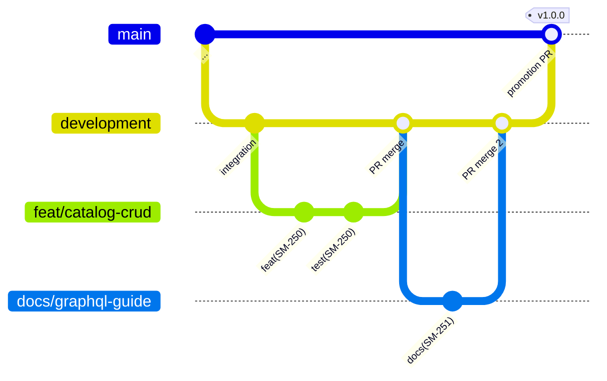
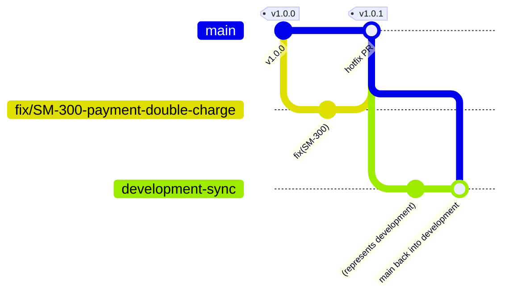

# SmartSense Marketplace — Git Workflow Guide

Version: 1.0

---

## Purpose

Define how code moves through Git in this repository: the branch model, how changes are proposed, reviewed, merged, released, and — when needed — hot-fixed. This is the operational companion to the rules other documents own:

| Already covered elsewhere                                                            | Owner                                                                              |
| ------------------------------------------------------------------------------------ | ---------------------------------------------------------------------------------- |
| Commit message rules, branch-name conventions, PR expectations (the normative rules) | [coding-standards.md § 13](./coding-standards.md#13-git--commit-message-standards) |
| The code review checklist reviewers apply                                            | [coding-standards.md § 14](./coding-standards.md#14-code-review-checklist)         |
| Versioning scheme, release/rollback/hotfix _policy_                                  | [deployment.md § Release Strategy](./deployment.md#release-strategy)               |
| CI pipeline stages, current and target                                               | [testing.md § CI Testing Pipeline](./testing.md#ci-testing-pipeline)               |
| Small-PR / incremental-delivery philosophy                                           | [milestones.md § Engineering Philosophy](./milestones.md#engineering-philosophy)   |

This document adds the **workflow mechanics**: which branch to start from, how merges happen, what the diagrams look like, and the observed conventions of this repository's actual history.

**Assumptions made explicit.**

1. **Documented from observed practice.** The merge style (merge commits, PRs #1–#8), branch prefixes, and the `development`-as-integration-branch model below are read from the repository's real history, then stated as the standard going forward.
2. **No release tags exist yet, and `main` currently trails `development` by ~22 commits** — the first `development → main` promotion since the project's early days happens with v1.0 ([roadmap.md § Release Strategy](./roadmap.md#release-strategy)). The Release Tags/Versioning sections define the process that promotion will follow.
3. **Protected-branch settings live in GitHub's repository configuration and cannot be verified from the repository contents** — the [Protected Branches](#protected-branches) section is the target configuration to apply/confirm, not a description of verified settings.

---

## Branch Strategy

Two long-lived branches, short-lived everything else:

| Branch                        | Role                                                                                                                                             | Merges in from                                  | Deploys to (future)                                                   |
| ----------------------------- | ------------------------------------------------------------------------------------------------------------------------------------------------ | ----------------------------------------------- | --------------------------------------------------------------------- |
| `main`                        | Release history — every commit on `main` is (or was) a releasable state                                                                          | `development` (promotion PRs), `fix/*` hotfixes | Staging → Production ([deployment.md](./deployment.md#cicd-strategy)) |
| `development`                 | Integration — the default target for all feature work; always green, never half-broken ([milestones.md](./milestones.md#engineering-philosophy)) | `feat/* fix/* docs/* chore/*` PRs               | Shared Development environment, continuously                          |
| `feat/* fix/* docs/* chore/*` | One branch per logical change, created from `development`, deleted after merge                                                                   | —                                               | —                                                                     |



The lifecycle of one change: branch from `development` → commit in small, convention-checked steps → PR into `development` → review + green CI → merge commit → branch deleted. Releases are a separate, deliberate promotion of `development` into `main` plus a tag.

## Branch Naming

Normative rules owned by [coding-standards.md § 13](./coding-standards.md#13-git--commit-message-standards) (`<type>/<kebab-short-description>`). The observed prefix vocabulary, matching commit types:

| Prefix   | Used for                                  | Real examples from this repo                                     |
| -------- | ----------------------------------------- | ---------------------------------------------------------------- |
| `feat/`  | New functionality                         | `feat/backend-authentication-integration`, `feat/keycloak-setup` |
| `fix/`   | Defect fixes (incl. hotfixes from `main`) | —                                                                |
| `docs/`  | Documentation-only work                   | `docs/folder-structure`, `docs/domain-model`                     |
| `chore/` | Tooling/infrastructure housekeeping       | `chore/claude-agents`                                            |

One branch = one logical change = one PR. A branch that accumulates a second unrelated concern gets that concern extracted onto its own branch before review.

## Commit Convention

Fully owned by [coding-standards.md § 13](./coding-standards.md#13-git--commit-message-standards) and mechanically enforced by commitlint via the `commit-msg` hook — a non-conforming commit cannot be created locally. The anatomy, for reference:

```
<type>(<scope>): <subject ≤ 100 chars, not Start Case>
                                          ← blank line
<body — optional, every line < 100 chars,
 short single-idea lines over long prose>
                                          ← blank line
Jira: SM-235                              ← footer form of the Jira key,
                                            if not already in the scope
```

- The Jira key (`SM-<n>`) is **required** — in the scope (`feat(SM-235): ...`) or as a `Jira:` footer.
- Commit small and often on your branch; each commit should still pass lint/typecheck on its own ([Best Practices](#best-practices)).
- Types: `feat` `fix` `docs` `style` `refactor` `perf` `test` `chore` `ci` `revert` `build`.

## Pull Requests

Expectations (title format, description content, scope discipline, local checks before opening) are owned by [coding-standards.md § 13](./coding-standards.md#13-git--commit-message-standards). The workflow mechanics:

1. Push the branch; open a PR **into `development`** (never directly into `main`, except hotfixes — [Hotfix Process](#hotfix-process)).
2. CI runs automatically ([CI Expectations](#ci-expectations)); a red pipeline pauses review — fix first.
3. Address review by **pushing new commits** to the branch — do not force-push over commits a reviewer has already read (it destroys their ability to see what changed since their last pass). Tidying with an interactive rebase is fine _before_ review starts, not after.
4. On approval + green CI: merge (see [Merge Strategy](#merge-strategy)), delete the branch.
5. The PR description links the Jira issue; the merged PR closes the loop in [TASKS.md](./TASKS.md#review-process)'s task lifecycle (`Review → Testing/Done`).

## Code Reviews

The checklist reviewers apply is [coding-standards.md § 14](./coding-standards.md#14-code-review-checklist); security-sensitive changes get the elevated treatment defined in [security.md § Secure Coding](./security.md#secure-coding) (guard order, `@Public()` additions called out explicitly). Workflow etiquette on top:

- **Author:** keep PRs reviewable ([milestones.md](./milestones.md#engineering-philosophy) — "if a PR is hard to review, it is too big"); respond to every comment (fix, or explain why not); never merge with unresolved threads.
- **Reviewer:** review the diff _and_ the claim — for anything touching runtime behavior, "does it actually run" is part of the review, not an assumption (risk T1, [milestones.md § Risk Management](./milestones.md#risk-management)).
- Review turnaround is a team priority — a PR waiting days breeds mega-rebases and stale context.

## Merge Strategy

| Merge                              | Method                                                                            | Why                                                                                                                                                                                    |
| ---------------------------------- | --------------------------------------------------------------------------------- | -------------------------------------------------------------------------------------------------------------------------------------------------------------------------------------- |
| Feature branch → `development`     | **Merge commit** (GitHub "Merge pull request")                                    | The observed, standing convention (PRs #1–#8): the merge commit records the PR boundary, and each constituent commit remains individually commitlint-valid and revertable.             |
| Keeping a feature branch current   | `git merge development` into the branch (or rebase **only before review starts**) | Post-review force-pushes break reviewer context ([Pull Requests](#pull-requests)).                                                                                                     |
| `development` → `main` (promotion) | **Merge commit via PR**, tagged                                                   | The release boundary must be visible in history and carry the version tag.                                                                                                             |
| Squash merging                     | Not used                                                                          | Squashing collapses commits whose individual messages carry required Jira keys and reviewable granularity; if a branch's history is too messy to merge, tidy it before review instead. |

## Release Tags

**None exist yet (Assumption 2).** The process, first exercised at v1.0:

- An **annotated tag** on the `main` merge commit of the promotion PR: `git tag -a v1.0.0 -m "v1.0.0 — Core Marketplace" && git push origin v1.0.0`.
- The tag is what CI/CD (once built) treats as the release trigger, and its name matches the Docker image tag ([deployment.md § CI/CD Strategy](./deployment.md#cicd-strategy) — "build once, tag with version + commit SHA").
- Tags are immutable — a broken release gets a _new_ tag (patch version), never a moved one.

## Versioning

Owned by [deployment.md § Release Strategy](./deployment.md#release-strategy): SemVer, Conventional-Commit-derived bumps (`feat` → minor, `fix` → patch), product-release numbering per [roadmap.md § Release Strategy](./roadmap.md#release-strategy). Git's part: the version exists as an annotated tag on `main` plus the matching `package.json` version bump committed in the promotion PR.

## Hotfix Process

Policy owned by [deployment.md § Release Strategy](./deployment.md#release-strategy) (staging not skipped; patch version). The git mechanics:



1. Branch `fix/<SM-key>-<description>` **from `main`** (the deployed state — not from `development`, which may contain unreleased work).
2. Fix + regression test ([testing.md § Regression Testing](./testing.md#regression-testing)); PR into `main`; full CI + review apply — urgency compresses the calendar, never the gates.
3. Merge, tag the patch version, release through the pipeline.
4. **Immediately merge `main` back into `development`** — skipping this step means the next promotion silently reverts the hotfix. This back-merge is part of the hotfix, not a follow-up chore.

## GitHub Flow

For orientation against the textbook models: this repository runs **GitHub Flow plus one long-lived integration branch**. Pure GitHub Flow merges feature branches straight into `main` and deploys continuously; this project inserts `development` between feature work and `main` because releases are deliberate promotions ([deployment.md § CI/CD Strategy](./deployment.md#cicd-strategy) — "deployment is triggered by promotion, not by every merge"). It is _not_ full GitFlow either — no `release/*` branches, no separate hotfix branch type beyond `fix/*`. If continuous deployment to production ever becomes the model, collapsing back to pure GitHub Flow is a one-decision change; until then, `development` is the integration buffer.

## Protected Branches

Target configuration (Assumption 3 — apply/verify in GitHub settings):

| Setting                                      | `main`        | `development`                                                                                             |
| -------------------------------------------- | ------------- | --------------------------------------------------------------------------------------------------------- |
| Require PR before merging (no direct pushes) | ✅            | ✅                                                                                                        |
| Require status checks (CI) to pass           | ✅            | ✅                                                                                                        |
| Require at least one approving review        | ✅            | ✅ (self-review exception acceptable while the team is a single developer — revisit at first team growth) |
| Block force pushes and deletions             | ✅            | ✅                                                                                                        |
| Restrict who can merge promotion PRs         | Release owner | —                                                                                                         |

## CI Expectations

- **Current** (`.github/workflows/ci.yml`): install → Prisma generate → lint → typecheck → build, on every push/PR to `main` and `development`. Green CI is required, not advisory ([coding-standards.md § 13](./coding-standards.md#13-git--commit-message-standards)).
- **Known gap:** no test stages yet — the target pipeline (unit → integration → Playwright between typecheck and build) is owned by [testing.md § CI Testing Pipeline](./testing.md#ci-testing-pipeline), tracked as debt TD-2 / task M18-T1 ([TASKS.md](./TASKS.md#technical-debt)).
- Local hooks are the first CI: pre-commit (lint-staged per workspace) and commit-msg (commitlint) catch most failures before they reach GitHub — bypassing them with `--no-verify` just moves the failure to CI with extra latency ([developer-setup.md § Best Practices](./developer-setup.md#best-practices)).

## Best Practices

- [ ] Branch from a fresh `development` (`git pull` first); name it `<type>/<kebab-description>`.
- [ ] Commit in small, self-contained steps — each passes lint/typecheck alone, each message carries its `SM-*` key.
- [ ] Rebase/tidy _before_ opening the PR; only additive commits after review begins.
- [ ] Keep one logical change per branch/PR; extract drive-by fixes to their own branch unless trivial.
- [ ] Delete merged branches (local and remote) — the branch list should show only live work.
- [ ] Never commit generated noise or secrets: `__generated__` diffs are reviewed via their source documents ([graphql.md § 10](./graphql.md#10-graphql-code-generator)); `.env*` files stay untracked ([developer-setup.md](./developer-setup.md#environment-variables)).
- [ ] After any hotfix: verify `main` is merged back into `development` before closing the incident.

## Anti-Patterns

| Anti-pattern                                            | Why it's a problem                                                                               | Instead                                                                                   |
| ------------------------------------------------------- | ------------------------------------------------------------------------------------------------ | ----------------------------------------------------------------------------------------- |
| Force-pushing a branch under active review              | Reviewer loses the delta since their last pass; comments detach from lines                       | Additive commits during review; tidy only pre-review                                      |
| Long-lived feature branches drifting from `development` | Merge conflicts compound; integration pain arrives all at once                                   | Small PRs, merged frequently ([milestones.md](./milestones.md#engineering-philosophy))    |
| Committing straight to `development` or `main`          | Skips review, CI gating, and the PR record the task lifecycle depends on                         | Everything through a PR ([Protected Branches](#protected-branches) makes this mechanical) |
| `--no-verify` to silence a failing hook                 | The rule still fails in CI/review; the bypass just hides it longer                               | Fix the message/code — the hooks enforce documented, agreed rules                         |
| Hotfix branched from `development`                      | Ships unreleased work to production alongside the fix                                            | Branch from `main`; back-merge after ([Hotfix Process](#hotfix-process))                  |
| Forgetting the hotfix back-merge                        | Next promotion silently reverts the production fix                                               | Back-merge is step 4 of the hotfix, not optional                                          |
| Moving a published tag                                  | Anything built from the old tag is now unreproducible                                            | New patch tag; tags are immutable ([Release Tags](#release-tags))                         |
| "WIP" / "fix stuff" commits pushed to a PR              | Fails commitlint locally anyway; if forced through, pollutes history and loses Jira traceability | Meaningful Conventional Commits, every time                                               |
