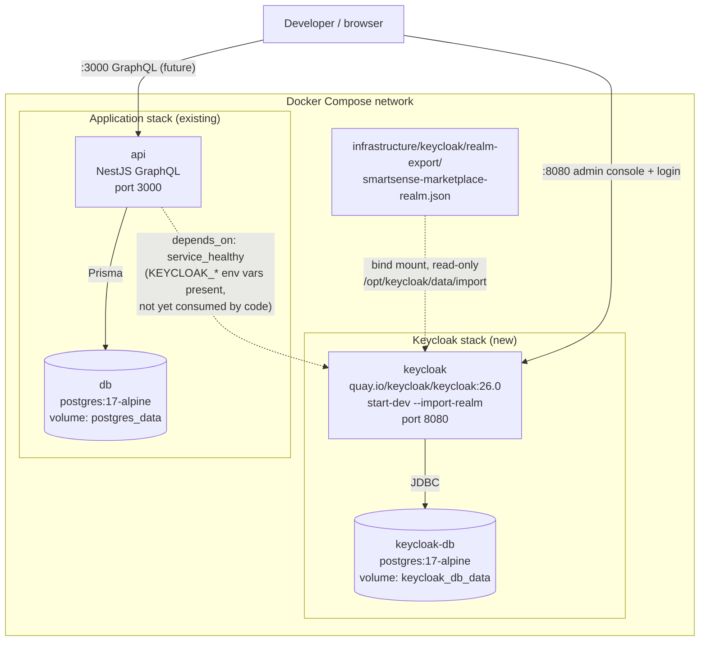

# SmartSense Marketplace — Keycloak Setup

Version: 1.1
Status: Infrastructure provisioned and verified locally (2026-07-01). Backend
integration (NestJS validating these tokens) shipped 2026-07-02 — see
`apps/api/README.md`'s Authentication & Authorization section. Frontend
integration is still pending.

## Purpose

This document is the operational counterpart to [`docs/authentication.md`](./authentication.md). Where that document designs _how_ authentication and authorization work, this document sets up the actual local Keycloak environment those flows will run against: the realm, clients, roles, groups, and a starter user, all running in Docker.

This milestone was originally infrastructure only:

- ~~No NestJS module reads these tokens yet~~ — superseded: `apps/api/src/modules/auth/` now validates Keycloak-issued JWTs (signature via JWKS, `exp`, `iss`, `aud`/`azp`), resolves roles/permissions, and enforces them via global GraphQL guards. See `apps/api/README.md`.
- No React code talks to Keycloak yet (`apps/web/src/features/auth/` remains scaffolding) — still true.

**Known gap surfaced by the backend integration**: this realm export does not configure an audience mapper adding `smartsense-api` to tokens issued to the `smartsense-web` client. The backend checks `aud` OR `azp` against `smartsense-api` (per `docs/authentication.md`'s claims table), but neither claim will match on a real `smartsense-web` login today — `azp` will be `smartsense-web`, and `aud` defaults to Keycloak's built-in `account` audience. Real end-to-end login will fail the audience check until this realm is updated with an audience mapper (or dedicated client scope) for `smartsense-api`. This is a realm/client configuration change to this same infrastructure, not a backend code change.

The remaining frontend integration work is Phase 3 of `docs/roadmap.md` / `TASKS.md`, and follows the design already recorded in `docs/authentication.md`.

---

## What Was Added

| Path                                                                     | Purpose                                                                                                                                                                                                                |
| ------------------------------------------------------------------------ | ---------------------------------------------------------------------------------------------------------------------------------------------------------------------------------------------------------------------- |
| `infrastructure/keycloak/realm-export/smartsense-marketplace-realm.json` | Realm export auto-imported by Keycloak on container start (`--import-realm`). Defines the realm, roles, groups, clients, and starter users.                                                                            |
| `infrastructure/docker/docker-compose.yml`                               | Full-stack compose — gained `keycloak` and `keycloak-db` services alongside the existing `api`/`db`.                                                                                                                   |
| `apps/api/docker-compose.yml`                                            | API-focused compose — gained the same `keycloak`/`keycloak-db` services, mirroring the existing `api`+`db` duplication pattern between the two compose files.                                                          |
| `apps/api/.env.example`                                                  | Gained `KEYCLOAK_URL`, `KEYCLOAK_REALM`, `KEYCLOAK_API_CLIENT_ID`, `KEYCLOAK_API_CLIENT_SECRET`.                                                                                                                       |
| `apps/web/.env.example`                                                  | `VITE_KEYCLOAK_REALM` and `VITE_KEYCLOAK_CLIENT_ID` updated from placeholder values (`smartsense` / `marketplace-app`) to the realm/clients actually provisioned here (`smartsense-marketplace` / `smartsense-web`).   |
| `docs/authentication.md`                                                 | Realm/client names (`smartsense` → `smartsense-marketplace`, `marketplace-app`/`marketplace-api` → `smartsense-web`/`smartsense-api`) reconciled to match this milestone's approved naming. No design content changed. |

---

## Docker Architecture



Key properties, matching the milestone requirements:

- **Keycloak's database is fully separate from the application's database** (`keycloak-db` vs. `db`) — different Postgres containers, different credentials, different volumes. This mirrors the isolation principle already stated in `docs/authentication.md`'s Docker Services section: identity data and business/authorization data never share a schema.
- **Both databases persist via named volumes** (`postgres_data`, `keycloak_db_data`) — surviving `docker compose down` (without `-v`) and container recreation.
- **The realm is imported automatically** on every `keycloak` container start via the `start-dev --import-realm` command and a read-only bind mount of the export file into Keycloak's import directory — no manual realm configuration step.
- **`api` depends on `keycloak` being healthy** before starting, and already receives the `KEYCLOAK_*` environment variables it will need — but does not read or validate any token yet. This wiring exists so Phase 3 integration is a code change only, not an infrastructure change.

---

## Realm Configuration

Realm: **`smartsense-marketplace`**

| Setting                                           | Value             | Why                                                                                                                                                                                        |
| ------------------------------------------------- | ----------------- | ------------------------------------------------------------------------------------------------------------------------------------------------------------------------------------------ |
| `sslRequired`                                     | `none`            | Local development only, plain HTTP on `localhost`. Must be tightened (`external` or stricter) for staging/production per `docs/authentication.md`'s Multi-Environment Configuration table. |
| `registrationAllowed`                             | `false`           | Users are provisioned by Admin/onboarding flows (`docs/domain-model.md`'s Partner Onboarding), not self-registration.                                                                      |
| `bruteForceProtected`                             | `true`            | Basic account lockout protection, sensible even in dev.                                                                                                                                    |
| `accessTokenLifespan`                             | 900s (15 min)     | Matches the "short-lived access token" guidance in `docs/authentication.md`.                                                                                                               |
| `ssoSessionIdleTimeout` / `ssoSessionMaxLifespan` | 30 min / 10 hours | Placeholder dev values bounding session/refresh-token lifetime, per the Session Management design.                                                                                         |

### Roles (realm-level)

| Role       | Maps to                                 |
| ---------- | --------------------------------------- |
| `Admin`    | `docs/domain-model.md` platform Admin   |
| `Partner`  | `docs/domain-model.md` vendor-org staff |
| `Customer` | `docs/domain-model.md` buyer            |

These three names are the join key described in `docs/authentication.md`'s Role Mapping section — they must exactly match the `Role.name` rows already seeded in Postgres (`database/prisma/seed.ts`).

### Groups

One group per role, each carrying the corresponding realm role as a composite so any user added to the group inherits the role automatically:

| Group        | Realm role granted |
| ------------ | ------------------ |
| `/Admins`    | `Admin`            |
| `/Partners`  | `Partner`          |
| `/Customers` | `Customer`         |

Users are assigned to **groups**, not roles directly — this is the mechanism requirement #7 (create groups for each role) establishes, and it's what a future Admin-facing "invite user" flow will target (add to a group) rather than juggling individual role assignments.

### Clients

| Client ID        | Type                      | Flow                               | Notes                                                                                                                                                                                                                                                                   |
| ---------------- | ------------------------- | ---------------------------------- | ----------------------------------------------------------------------------------------------------------------------------------------------------------------------------------------------------------------------------------------------------------------------- |
| `smartsense-web` | Public                    | Authorization Code + PKCE (`S256`) | `standardFlowEnabled: true`, `directAccessGrantsEnabled: false`, no client secret. Redirect URI `http://localhost:5173/*` (the Vite dev server).                                                                                                                        |
| `smartsense-api` | Confidential, bearer-only | None (never initiates login)       | `bearerOnly: true`, `publicClient: false`, `standardFlowEnabled: false`, `directAccessGrantsEnabled: false`. Carries a dev-only placeholder secret (`smartsense-api-dev-secret-change-me`) for shape-completeness; unused while `serviceAccountsEnabled` stays `false`. |

Both match the client posture already designed in `docs/authentication.md`'s "Keycloak Realm & Client Topology" table — this milestone only provisions them, it doesn't change that decision.

### Users

Two users are seeded for verification purposes:

| Username                        | Password (dev only) | Group       | Purpose                                                                                                                                                                            |
| ------------------------------- | ------------------- | ----------- | ---------------------------------------------------------------------------------------------------------------------------------------------------------------------------------- |
| `admin@smartsense.local`        | `Admin@12345`       | `/Admins`   | The one admin user requested (requirement #8) — used to verify Admin login.                                                                                                        |
| `partner.test@smartsense.local` | `Partner@12345`     | `/Partners` | Additional test user (beyond the explicit admin requirement) so role/group mapping can be verified end-to-end for a non-admin role, per requirement #11's "test user login works". |

**These credentials are committed in plaintext in the realm export file and are for local development only.** They must never be reused in any shared or internet-reachable environment. Staging/production Keycloak provisioning is out of scope for this milestone (see `docs/authentication.md`'s environment table) and would use a proper admin-created account, not a checked-in password.

---

## Folder Structure

```
infrastructure/
├── docker/
│   └── docker-compose.yml          # Full-stack: api, db, keycloak, keycloak-db
└── keycloak/
    └── realm-export/
        └── smartsense-marketplace-realm.json   # Auto-imported on Keycloak startup

apps/
├── api/
│   ├── docker-compose.yml          # API-focused: api, db, keycloak, keycloak-db
│   └── .env.example                # + KEYCLOAK_* variables
└── web/
    └── .env.example                # VITE_KEYCLOAK_REALM / VITE_KEYCLOAK_CLIENT_ID updated

docs/
├── authentication.md                # Architecture design (naming reconciled to this milestone)
└── keycloak-setup.md                # This file
```

Nothing under `apps/api/src/` or `apps/web/src/` was touched beyond `.env.example` — no NestJS module, guard, or React auth code was added, per the milestone's explicit exclusions.

---

## Environment Variables

### Backend (`apps/api/.env`)

```
KEYCLOAK_URL=http://localhost:8080
KEYCLOAK_REALM=smartsense-marketplace
KEYCLOAK_API_CLIENT_ID=smartsense-api
KEYCLOAK_API_CLIENT_SECRET=smartsense-api-dev-secret-change-me
```

Inside Docker Compose, `api` receives `KEYCLOAK_URL=http://keycloak:8080` (the service name) instead of `localhost`, since containers reach each other by service name on the compose network — see `KC_DB_URL` in the `keycloak` service definition for the analogous pattern already used for `db`.

### Frontend (`apps/web/.env.local`, copied from `.env.example`)

```
VITE_KEYCLOAK_URL=http://localhost:8080
VITE_KEYCLOAK_REALM=smartsense-marketplace
VITE_KEYCLOAK_CLIENT_ID=smartsense-web
```

These are read from the browser, so they always point at `localhost:8080`, never the internal Docker service name.

---

## Starting the Environment

From the repository root:

```bash
# Full stack (api + db + keycloak + keycloak-db)
docker compose -f infrastructure/docker/docker-compose.yml up -d

# Or, Keycloak + its database only (useful while api/web aren't ready to consume it yet)
docker compose -f infrastructure/docker/docker-compose.yml up -d keycloak-db keycloak
```

Or, from `apps/api/`, equivalently:

```bash
cd apps/api
docker compose up -d keycloak-db keycloak
```

First startup pulls the `quay.io/keycloak/keycloak:26.0` image (~150MB) and runs 148 Liquibase changesets against `keycloak-db` before the realm import — expect ~15–25 seconds before the health check passes. Watch progress with:

```bash
docker compose logs -f keycloak
```

A successful startup log ends with:

```
Realm 'smartsense-marketplace' imported
Import finished successfully
Keycloak ... started ... Listening on: http://0.0.0.0:8080.
```

### Resetting to a clean state

The realm import strategy is `OVERWRITE_EXISTING`, so restarting the `keycloak` container re-applies `smartsense-marketplace-realm.json` from scratch (any ad-hoc changes made through the admin console since the last restart are discarded). To fully reset, including Keycloak's own database:

```bash
docker compose -f infrastructure/docker/docker-compose.yml down keycloak keycloak-db -v
```

---

## Verification

All four checks were run locally against this exact configuration on 2026-07-01.

### 1. Docker starts successfully

```bash
$ docker compose up -d keycloak-db keycloak
 Container docker-keycloak-db-1  Started
 Container docker-keycloak-db-1  Healthy
 Container docker-keycloak-1     Started

$ docker inspect --format='{{.State.Health.Status}}' docker-keycloak-1
healthy
```

Health check: a TCP probe against port 8080 inside the container (`exec 3<>/dev/tcp/127.0.0.1/8080`), since the base Keycloak image doesn't ship `curl`/`wget`. This confirms the HTTP listener is up; it is not a full `/health/ready` readiness probe. If deeper health semantics are needed later, `KC_HEALTH_ENABLED=true` is already set, so `/health/ready` on the management port (9000) is available to switch to.

### 2. Realm imports automatically

```
2026-07-01 12:31:20,691 INFO  [org.keycloak.exportimport.dir.DirImportProvider] Importing from directory /opt/keycloak/bin/../data/import
2026-07-01 12:31:22,423 INFO  [org.keycloak.services] KC-SERVICES0030: Full model import requested. Strategy: OVERWRITE_EXISTING
2026-07-01 12:31:24,342 INFO  [org.keycloak.exportimport.util.ImportUtils] Realm 'smartsense-marketplace' imported
2026-07-01 12:31:24,358 INFO  [org.keycloak.services] KC-SERVICES0032: Import finished successfully
```

Confirmed independently via the Admin REST API:

```bash
$ curl -s http://localhost:8080/realms/smartsense-marketplace/.well-known/openid-configuration -o /dev/null -w "%{http_code}\n"
200
```

And, via the Admin API, that every declared object exists exactly as configured:

- Realm roles: `Admin`, `Partner`, `Customer` (plus Keycloak's own built-ins: `offline_access`, `uma_authorization`, `default-roles-smartsense-marketplace`).
- Groups: `/Admins → Admin`, `/Partners → Partner`, `/Customers → Customer` (role mappings verified via `GET /groups/{id}/role-mappings/realm`).
- Clients: `smartsense-web` (`publicClient=true`, `standardFlowEnabled=true`, `directAccessGrantsEnabled=false`, `redirectUris=["http://localhost:5173/*"]`) and `smartsense-api` (`publicClient=false`, `bearerOnly=true`, `standardFlowEnabled=false`, `directAccessGrantsEnabled=false`) — both confirmed via `GET /clients`.

### 3. Admin login works

Verified via the Resource Owner Password Credentials grant against the built-in `admin-cli` client (a Keycloak-provided test client present in every realm, enabled here only for this verification step — neither `smartsense-web` nor `smartsense-api` allow password grants, by design):

```bash
$ curl -s -X POST http://localhost:8080/realms/smartsense-marketplace/protocol/openid-connect/token \
    -d grant_type=password -d client_id=admin-cli \
    -d username=admin@smartsense.local -d password='Admin@12345'
# → 200 OK, valid access_token returned
```

Cross-checked via the Admin REST API that the authenticated identity resolves to the expected group/role:

```
admin@smartsense.local | enabled=True | emailVerified=True | groups=['/Admins'] | effective realm roles=['Admin']
```

Also verified that the Keycloak **admin console** itself is reachable using the bootstrap admin credentials (`KEYCLOAK_ADMIN` / `KEYCLOAK_ADMIN_PASSWORD`, both `admin` — master realm, separate from the application realm's `admin@smartsense.local` user):

```bash
$ curl -s -X POST http://localhost:8080/realms/master/protocol/openid-connect/token \
    -d grant_type=password -d client_id=admin-cli -d username=admin -d password=admin
# → 200 OK, valid access_token returned
```

### 4. Test user login works

```bash
$ curl -s -X POST http://localhost:8080/realms/smartsense-marketplace/protocol/openid-connect/token \
    -d grant_type=password -d client_id=admin-cli \
    -d username=partner.test@smartsense.local -d password='Partner@12345'
# → 200 OK, valid access_token returned
```

```
partner.test@smartsense.local | enabled=True | emailVerified=True | groups=['/Partners'] | effective realm roles=['Partner']
```

> **Note on token content:** tokens issued to the built-in `admin-cli` client carry a minimal scope (`profile email`) in this realm and don't include `sub`/`realm_access` claims in the JWT body itself — that's a property of `admin-cli`'s own default client scopes, not of `smartsense-web`/`smartsense-api` or of the users/roles/groups themselves (confirmed independently and correctly via the Admin REST API above). This does not affect Phase 3 integration, which will use `smartsense-web` (full standard flow, full default scopes) for real logins.

---

## Verification Checklist

- [x] `docker compose up` starts `keycloak` and `keycloak-db` without errors; `keycloak` reaches `healthy`.
- [x] `keycloak-db` is a dedicated PostgreSQL database, isolated from the application's `db` service.
- [x] Both `db` and `keycloak-db` persist to named Docker volumes (`postgres_data`, `keycloak_db_data`).
- [x] Realm `smartsense-marketplace` imports automatically from `infrastructure/keycloak/realm-export/smartsense-marketplace-realm.json` on every container start, with no manual step.
- [x] Client `smartsense-web` exists as a public client with Authorization Code + PKCE, no secret.
- [x] Client `smartsense-api` exists as a confidential, bearer-only client.
- [x] Realm roles `Admin`, `Partner`, `Customer` exist.
- [x] Groups `/Admins`, `/Partners`, `/Customers` exist, each granting the matching realm role.
- [x] One admin user (`admin@smartsense.local`) exists, enabled, in `/Admins`.
- [x] Environment variables documented and added to `apps/api/.env.example` and `apps/web/.env.example`.
- [x] Keycloak admin console login works (master realm, bootstrap admin).
- [x] Admin user login works (`smartsense-marketplace` realm, password grant).
- [x] Test user login works (`partner.test@smartsense.local`, `/Partners` group, `Partner` role resolved correctly).
- [x] No NestJS or React authentication code was added.

---

## Explicitly Out of Scope (This Milestone)

- ~~NestJS `AuthModule` reading/validating any Keycloak-issued token~~ — done, see `apps/api/README.md`.
- React `features/auth` calling Keycloak or handling redirects — still pending.
- Adding an audience mapper so `smartsense-web`-issued tokens carry `smartsense-api` in `aud` — needed for real end-to-end login once the frontend lands; see the Known Gap note above.
- Realm/client provisioning for staging or production (separate Keycloak deployment, per `docs/authentication.md`'s environment table).
- Rotating the placeholder `smartsense-api` client secret or the seeded user passwords — required before this configuration is ever used outside a local machine.

The frontend integration and the audience mapper are addressed in Phase 3 of `docs/roadmap.md` / `TASKS.md`, building directly on the design in `docs/authentication.md` and the infrastructure provisioned here.

---

## Suggested Commit Message

```
feat(infra): provision local Keycloak realm, clients, roles, and groups

Add a dedicated Keycloak + PostgreSQL stack to both docker-compose
files, with the smartsense-marketplace realm auto-imported on
startup (smartsense-web public/PKCE client, smartsense-api
bearer-only client, Admin/Partner/Customer roles and groups, one
seeded admin user). Reconciles realm/client naming in
docs/authentication.md and both .env.example files to match.

No NestJS or React authentication code included — see
docs/keycloak-setup.md for the verified startup and login flow.
```
