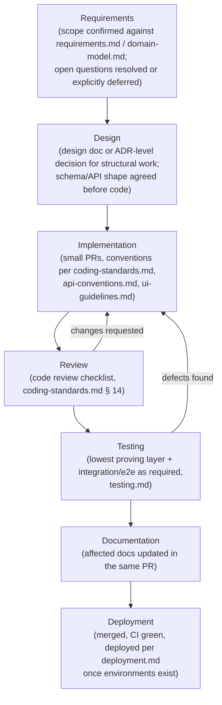
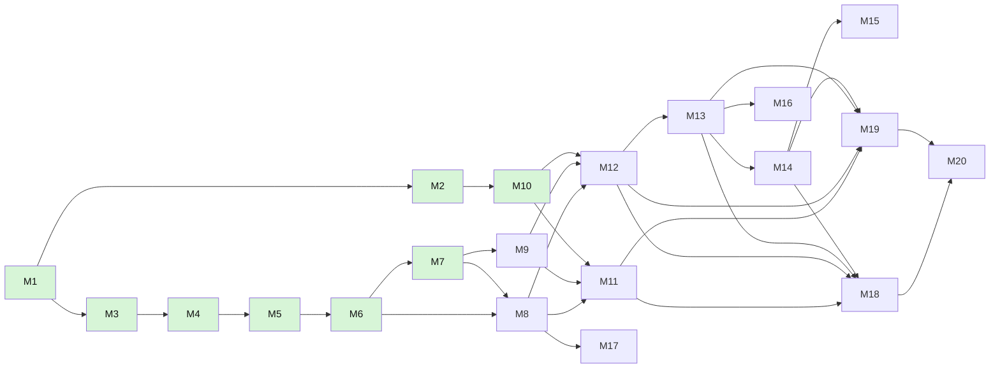

# SmartSense Marketplace — Engineering Implementation Plan

Version: 1.0

---

## Purpose

### Goals

- Define **how the project is built from start to production**: the milestone sequence, what each milestone delivers, when it is considered done, and what it depends on.
- Make progress legible — anyone can read the [Milestone Overview](#milestone-overview) and know exactly where the project stands without asking.
- Keep execution honest: exit criteria are verifiable statements, not vibes; a milestone with unmet exit criteria is not complete regardless of how much of its code exists (a lesson this project has already learned — see [Risk Management](#risk-management), risk T1).

### Scope

This document covers **engineering execution**: milestones, sequencing, definition of done, progress tracking, and delivery risk. It does not own:

| Not covered here                                        | See                                                                |
| ------------------------------------------------------- | ------------------------------------------------------------------ |
| Product direction, release strategy, business rationale | [roadmap.md](./roadmap.md)                                         |
| Functional requirements per module                      | [requirements.md](./requirements.md)                               |
| Technical architecture and design decisions             | [architecture.md](./architecture.md)                               |
| Change-level Definition of Done, coding conventions     | [coding-standards.md](./coding-standards.md#16-definition-of-done) |
| Task-level tracking (individual work items)             | Jira (`SM-*` issues) and `TASKS.md`                                |

**Assumptions made explicit.**

1. **This document supersedes the earlier informal milestone checklist** that previously lived at this path (17 unnumbered entries). The new `M1–M20` scheme preserves the original order for M1–M15 and adds Notifications (M16), Settings (M17), and Performance Optimization (M19) as first-class milestones; the old "Playwright E2E" and "Production Deployment" entries became M18 and M20. Statuses were carried over: the seven milestones previously marked complete map to M1–M7.
2. **Milestone IDs are identifiers, not a strict serial execution order.** Dependencies ([Milestone Overview](#milestone-overview)) define order; where dependencies permit, milestones run in parallel — in particular, M15–M17 (v1.1 scope per [roadmap.md](./roadmap.md#release-strategy)) may execute after or alongside M18–M20, which gate the v1.0 production launch.
3. **No calendar dates are attached**, consistent with [roadmap.md](./roadmap.md) Assumption 2 — sequencing is committed, scheduling is a governance decision.

### Audience

Engineers executing the work, reviewers verifying it, and the product owner reconciling delivery reality against [roadmap.md](./roadmap.md).

---

## Engineering Philosophy

| Principle                        | Practice                                                                                                                                                                                                                                                                                                                                                                                           |
| -------------------------------- | -------------------------------------------------------------------------------------------------------------------------------------------------------------------------------------------------------------------------------------------------------------------------------------------------------------------------------------------------------------------------------------------------- |
| **Incremental development**      | Every milestone leaves the system in a working, demonstrable state — `main`/`development` never hold a half-broken build. No milestone is "big bang"; large scopes are split until each increment is independently verifiable.                                                                                                                                                                     |
| **Vertical slicing**             | Feature milestones (M11–M17) deliver thin, complete slices — schema → resolver → service → UI → test for one capability — rather than horizontal layers ("all backends first, all UIs later"). The module boundaries in [architecture.md](./architecture.md#future-scalability) and [folder-structure.md](./folder-structure.md) exist to make this possible.                                      |
| **Small pull requests**          | One logical change per PR ([coding-standards.md § 13](./coding-standards.md#13-git--commit-message-standards)); a milestone is many small PRs, not one giant one. If a PR is hard to review, it is too big — split it.                                                                                                                                                                             |
| **Test-first mindset**           | Critical paths (auth, business rules, money) get their tests in the same PR as the code, at the lowest layer that proves the behavior ([testing.md § Testing Strategy](./testing.md#testing-strategy)). "Boots and passes typecheck" is not verification — see risk T1.                                                                                                                            |
| **Documentation-first approach** | Design documents precede implementation for anything structural (this project's own history: [authentication.md](./authentication.md) and [database-schema.md](./database-schema.md) were written and reviewed before their milestones were built). Docs are updated in the same PR as the change that invalidates them ([coding-standards.md § 16](./coding-standards.md#16-definition-of-done)). |

---

## Development Lifecycle

Every milestone — and every substantial change within one — moves through the same lifecycle:

In practice Review/Testing/Documentation interleave within each PR rather than running as separate phases — the diagram shows the order of _gates_, not a waterfall: nothing merges before review, nothing is milestone-complete before its tests and docs exist.

---

## Milestone Overview

| ID  | Name                     | Objective (one line)                                  | Release ([roadmap.md](./roadmap.md#release-strategy)) | Status         | Depends on  |
| --- | ------------------------ | ----------------------------------------------------- | ----------------------------------------------------- | -------------- | ----------- |
| M1  | Project Foundation       | Monorepo, tooling, CI skeleton                        | v0.x                                                  | ✅ Complete    | —           |
| M2  | Frontend Foundation      | React app shell, routing scaffold, feature structure  | v0.x                                                  | ✅ Complete    | M1          |
| M3  | Backend Foundation       | NestJS app, GraphQL server, module scaffold           | v0.x                                                  | ✅ Complete    | M1          |
| M4  | Database                 | Schema, migrations, constraints, seed                 | v0.x                                                  | ✅ Complete    | M3          |
| M5  | Authentication Design    | Auth architecture designed and documented             | v0.x                                                  | ✅ Complete    | M4          |
| M6  | Keycloak Infrastructure  | Realm, clients, Docker services                       | v0.x                                                  | ✅ Complete    | M5          |
| M7  | Backend Authentication   | JWT validation, guards, RBAC enforced                 | v0.x                                                  | ✅ Complete    | M5, M6      |
| M8  | Frontend Authentication  | Login/logout/session in the SPA                       | v0.x                                                  | ✅ Complete    | M6, M7      |
| M9  | GraphQL Integration      | Codegen pipeline, typed operations end to end         | v0.x                                                  | ✅ Complete    | M7          |
| M10 | Shared Component Library | Core reusable UI components                           | v0.x                                                  | ✅ Complete    | M2          |
| M11 | Dashboard                | First vertical feature slice                          | v1.0                                                  | ✅ Complete    | M8, M9, M10 |
| M12 | Catalog                  | Products, variants, inventory, categories             | v1.0                                                  | 🔵 In progress | M8, M9, M10 |
| M13 | Orders                   | Order lifecycle end to end                            | v1.0                                                  | 🔵 In progress | M12         |
| M14 | Billing                  | Invoices and payments                                 | v1.0                                                  | 🔵 In progress | M13         |
| M15 | Reports & Analytics      | Billing/Orders/Inventory/Product/Notification reports | v1.1                                                  | 🔵 In progress | M14         |
| M16 | Notifications            | In-app and email event notifications                  | v1.1                                                  | 🔵 In progress | M13         |
| M17 | Settings                 | User and organization preferences                     | v1.1                                                  | ⬜ Not started | M8          |
| M18 | Playwright Testing       | E2E suites across core journeys                       | gates v1.0                                            | ⬜ Not started | M11–M14     |
| M19 | Performance Optimization | Measured performance to target                        | gates v1.0                                            | ⬜ Not started | M11–M14     |
| M20 | Production Readiness     | Deployed, monitored, recoverable production           | gates v1.0                                            | ⬜ Not started | M18, M19    |

Dependency shape at a glance:

---

## Milestone Details

### Foundation (v0.x)

#### M1 — Project Foundation ✅

| Field                     | Detail                                                                                                                            |
| ------------------------- | --------------------------------------------------------------------------------------------------------------------------------- |
| **Objective**             | A monorepo any engineer can clone, install, build, and contribute to with quality gates enforced from day one.                    |
| **Deliverables**          | Turborepo + npm workspaces, shared tsconfig/ESLint/Prettier packages, Husky + commitlint, CI (lint/typecheck/build), root README. |
| **Exit criteria**         | `npm ci && npm run lint && npm run typecheck && npm run build` green locally and in CI; commit conventions enforced by hooks.     |
| **Dependencies**          | None.                                                                                                                             |
| **Risks (retrospective)** | Workspace hoisting quirks — realized later as the `@nestjs/apollo` dependency issue (risk T1's history).                          |
| **Documentation**         | [folder-structure.md](./folder-structure.md), [coding-standards.md](./coding-standards.md)                                        |

#### M2 — Frontend Foundation ✅

| Field                     | Detail                                                                                                                                         |
| ------------------------- | ---------------------------------------------------------------------------------------------------------------------------------------------- |
| **Objective**             | The React application shell with the feature-based structure every later feature drops into.                                                   |
| **Deliverables**          | Vite + React 19 + Tailwind v4 app, `app/` shell (router, providers), scaffolded `features/*` and `shared/*` trees, path aliases.               |
| **Exit criteria**         | App boots, placeholder route renders, structure matches [folder-structure.md § apps/web](./folder-structure.md#appsweb--frontend-application). |
| **Dependencies**          | M1.                                                                                                                                            |
| **Risks (retrospective)** | Scaffold-only folders read as "done" — mitigated by the explicit scaffold-state callouts now in the docs.                                      |
| **Documentation**         | [architecture.md](./architecture.md), [folder-structure.md](./folder-structure.md)                                                             |

#### M3 — Backend Foundation ✅

| Field                                | Detail                                                                                                                                                                                                                                                                                    |
| ------------------------------------ | ----------------------------------------------------------------------------------------------------------------------------------------------------------------------------------------------------------------------------------------------------------------------------------------- |
| **Objective**                        | The NestJS GraphQL API skeleton every domain module plugs into.                                                                                                                                                                                                                           |
| **Deliverables**                     | NestJS 11 + Apollo Server 5, code-first GraphQL, domain module scaffold, global filter/pipe/logging, config validation, `/health`, Dockerfile.                                                                                                                                            |
| **Exit criteria**                    | API boots, `/health` 200, `/graphql` serves placeholder queries — **verified by running it**, not by typecheck alone.                                                                                                                                                                     |
| **Dependencies**                     | M1.                                                                                                                                                                                                                                                                                       |
| **Risks (retrospective — realized)** | Shipped "complete" without ever booting; four stacked boot-breaking defects (DI-stripping lint rule, logger recursion, missing Apollo integration dep, wrong Docker context) were found only by a later audit. This is the origin of the "exit criteria are verifiable" rule and risk T1. |
| **Documentation**                    | [api-conventions.md](./api-conventions.md), [graphql.md](./graphql.md)                                                                                                                                                                                                                    |

#### M4 — Database ✅

| Field                     | Detail                                                                                                             |
| ------------------------- | ------------------------------------------------------------------------------------------------------------------ |
| **Objective**             | The complete data model with integrity rules enforced as deeply as the database allows.                            |
| **Deliverables**          | Prisma schema (16 entities), initial migration incl. hand-written `CHECK`/exclusion constraints, seed script.      |
| **Exit criteria**         | Migration applies cleanly; every hand-added constraint verified to reject invalid data against a scratch database. |
| **Dependencies**          | M3.                                                                                                                |
| **Risks (retrospective)** | Rules Prisma can't express silently going unenforced — mitigated by the constraint verification exit criterion.    |
| **Documentation**         | [database-schema.md](./database-schema.md), [domain-model.md](./domain-model.md)                                   |

#### M5 — Authentication Design ✅

| Field             | Detail                                                                                                                           |
| ----------------- | -------------------------------------------------------------------------------------------------------------------------------- |
| **Objective**     | The full auth/authz architecture decided and reviewed before any auth code exists (documentation-first).                         |
| **Deliverables**  | [authentication.md](./authentication.md): flows, JWT validation rules, role/permission strategy, session design, open questions. |
| **Exit criteria** | Design reviewed; open questions either resolved or explicitly carried in the doc's Open Questions section.                       |
| **Dependencies**  | M4 (RBAC design builds on the User/Role/Permission model).                                                                       |
| **Documentation** | [authentication.md](./authentication.md)                                                                                         |

#### M6 — Keycloak Infrastructure ✅

| Field             | Detail                                                                                                                                               |
| ----------------- | ---------------------------------------------------------------------------------------------------------------------------------------------------- |
| **Objective**     | A reproducible local identity provider matching the auth design.                                                                                     |
| **Deliverables**  | Keycloak 26 + dedicated Postgres in Compose, auto-imported realm (roles, groups, clients, test users), env wiring.                                   |
| **Exit criteria** | Fresh `docker compose up` yields a working realm; the [keycloak-setup.md verification checklist](./keycloak-setup.md#verification-checklist) passes. |
| **Dependencies**  | M5.                                                                                                                                                  |
| **Documentation** | [keycloak-setup.md](./keycloak-setup.md)                                                                                                             |

#### M7 — Backend Authentication ✅

| Field             | Detail                                                                                                                                                                     |
| ----------------- | -------------------------------------------------------------------------------------------------------------------------------------------------------------------------- |
| **Objective**     | Every GraphQL operation authenticated and authorized by default, per the M5 design.                                                                                        |
| **Deliverables**  | JWT strategy (JWKS), global guard chain, `@Public()`/`@Roles()`/`@Permissions()`/`@CurrentUser()`, user provisioning + role sync, `me` query, unit + integration tests.    |
| **Exit criteria** | Auth e2e suite green against real Postgres + mock JWKS ([testing.md § Authorization Testing](./testing.md#graphql-testing)); unauthenticated requests rejected by default. |
| **Dependencies**  | M5, M6.                                                                                                                                                                    |
| **Documentation** | [authentication.md](./authentication.md), [testing.md](./testing.md)                                                                                                       |

#### M8 — Frontend Authentication ✅

| Field             | Detail                                                                                                                                                                                                                                                                                                                                                                                                                                                        |
| ----------------- | ------------------------------------------------------------------------------------------------------------------------------------------------------------------------------------------------------------------------------------------------------------------------------------------------------------------------------------------------------------------------------------------------------------------------------------------------------------- |
| **Objective**     | A user can log in, stay logged in, and log out of the SPA; routes and UI respect roles/permissions.                                                                                                                                                                                                                                                                                                                                                           |
| **Deliverables**  | Auth service (Keycloak adapter, the only code touching it), `useAuth`/permission hooks, route guards, Apollo auth+error links, `/login` `/unauthorized` `/forbidden` pages, silent refresh.                                                                                                                                                                                                                                                                   |
| **Exit criteria** | Full login → protected route → refresh → logout journey works against local Keycloak; tokens held in memory only; `UNAUTHENTICATED`/`FORBIDDEN` handled per design.                                                                                                                                                                                                                                                                                           |
| **Dependencies**  | M6, M7.                                                                                                                                                                                                                                                                                                                                                                                                                                                       |
| **Status notes**  | Login → protected route → logout verified live via Playwright against the real local realm + API (`apps/web/e2e/auth/`); proactive/reactive token refresh is implemented per design (`authService`'s `updateToken` polling + the Apollo error link) but not observed firing against a naturally-expiring token in this pass — access tokens live 15 min ([keycloak-setup.md](./keycloak-setup.md#realm-configuration)), longer than this verification window. |
| **Risks**         | ~~Silent-refresh approach (iframe vs. proxy) is an open question...~~ resolved — see [authentication.md § Open Questions](./authentication.md#open-questions).                                                                                                                                                                                                                                                                                                |
| **Documentation** | [authentication.md § Frontend Auth Feature Responsibilities](./authentication.md#frontend-auth-feature-responsibilities)                                                                                                                                                                                                                                                                                                                                      |

#### M9 — GraphQL Integration ✅

| Field             | Detail                                                                                                                                                                                                                                                                        |
| ----------------- | ----------------------------------------------------------------------------------------------------------------------------------------------------------------------------------------------------------------------------------------------------------------------------- |
| **Objective**     | The typed end-to-end pipeline proven: schema → codegen → typed hooks → rendered data.                                                                                                                                                                                         |
| **Deliverables**  | Codegen wired into the dev workflow, first real feature operations (`me` consumed via generated hook), fragment/error conventions exercised in practice.                                                                                                                      |
| **Exit criteria** | A schema change flows to a compile error in the frontend when a document goes stale; conventions in [graphql.md](./graphql.md) demonstrated by working code.                                                                                                                  |
| **Dependencies**  | M7 (M8 for authenticated operations).                                                                                                                                                                                                                                         |
| **Status notes**  | Landed alongside M8, not as a separate pass: `apps/web/codegen.ts` + the `client` preset were wired to consume M7's `me` query, so the pipeline was proven before this row was marked complete — this status update itself corrects that gap rather than reflecting new work. |
| **Documentation** | [graphql.md](./graphql.md), [api-conventions.md](./api-conventions.md)                                                                                                                                                                                                        |

#### M10 — Shared Component Library

| Field                     | Detail                                                                                                                                                                                                                                                                                                                                                                                                                                                                                                                                                        |
| ------------------------- | ------------------------------------------------------------------------------------------------------------------------------------------------------------------------------------------------------------------------------------------------------------------------------------------------------------------------------------------------------------------------------------------------------------------------------------------------------------------------------------------------------------------------------------------------------------- |
| **Objective**             | The reusable UI vocabulary features compose from, so M11–M17 don't each invent their own buttons and tables.                                                                                                                                                                                                                                                                                                                                                                                                                                                  |
| **Deliverables**          | The canonical set from [requirements.md § UI](./requirements.md#ui) (Button, Input, Select, Modal, Table, Pagination, Card, Badge, Skeleton, Empty/Error states, Toast), each state-complete and accessible per [ui-guidelines.md](./ui-guidelines.md); frontend test tooling introduced with them ([testing.md](./testing.md), currently absent).                                                                                                                                                                                                            |
| **Exit criteria**         | Each component keyboard-operable, WCAG-AA-checkable, component-tested, and used by at least the auth pages.                                                                                                                                                                                                                                                                                                                                                                                                                                                   |
| **Dependencies**          | M2.                                                                                                                                                                                                                                                                                                                                                                                                                                                                                                                                                           |
| **Risks (retrospective)** | Design-token/icon decisions were resolved at this milestone: `@theme` semantic color tokens added to `apps/web/src/index.css`, `lucide-react` chosen as the icon set. Built in `apps/web/src/shared/components`/`shared/layouts` rather than `packages/ui`, per [folder-structure.md](./folder-structure.md#packages--shared-workspace-packages)'s promote-don't-pre-share rule (`apps/api` never consumes React components). Vitest + React Testing Library + `jest-axe` introduced alongside the components; Storybook set up with one story per component. |
| **Documentation**         | [ui-guidelines.md](./ui-guidelines.md)                                                                                                                                                                                                                                                                                                                                                                                                                                                                                                                        |

### Core Marketplace (v1.0)

#### M11 — Dashboard ✅

| Field             | Detail                                                                                                                                                                                                                                                                                                                                                                                                                                                                                                                                                                                                                                                                                                                                                                                                                                                                                                                                                                                             |
| ----------------- | -------------------------------------------------------------------------------------------------------------------------------------------------------------------------------------------------------------------------------------------------------------------------------------------------------------------------------------------------------------------------------------------------------------------------------------------------------------------------------------------------------------------------------------------------------------------------------------------------------------------------------------------------------------------------------------------------------------------------------------------------------------------------------------------------------------------------------------------------------------------------------------------------------------------------------------------------------------------------------------------------- |
| **Objective**     | The first full vertical slice — proves the entire stack (auth → API → codegen → shared UI) as a template for every later feature.                                                                                                                                                                                                                                                                                                                                                                                                                                                                                                                                                                                                                                                                                                                                                                                                                                                                  |
| **Deliverables**  | Role-appropriate dashboard (overview, statistics, recent activity per [requirements.md § Dashboard](./requirements.md#modules)), progressive per-card loading.                                                                                                                                                                                                                                                                                                                                                                                                                                                                                                                                                                                                                                                                                                                                                                                                                                     |
| **Exit criteria** | All four view states implemented; renders correctly per role; the slice's pattern documented as the reference for M12–M17.                                                                                                                                                                                                                                                                                                                                                                                                                                                                                                                                                                                                                                                                                                                                                                                                                                                                         |
| **Dependencies**  | M8, M9, M10.                                                                                                                                                                                                                                                                                                                                                                                                                                                                                                                                                                                                                                                                                                                                                                                                                                                                                                                                                                                       |
| **Status notes**  | `dashboardStats` (`apps/api/src/modules/dashboard`) returns mock `totalProducts`/`totalOrders`/`totalCustomers` counts, gated by `@Permissions('dashboard:view')` — no revenue field: money needs a real Decimal/Money scalar ([graphql.md § 7](./graphql.md#7-graphql-types)), deliberately deferred to M14, so Revenue renders as a UI-only "Coming soon" card instead of a mock schema field. Loading/error/empty/success states live in `StatisticsGrid`, fetched independently of the static Welcome/QuickActions/RecentActivity sections per the progressive-loading pattern in [ui-guidelines.md](./ui-guidelines.md#progressive-loading). Recent Activity is a static placeholder pending Orders/Catalog (M12–M13) as an event source. Verified via `apps/api` unit + integration tests, `apps/web` Vitest component tests, and a real-Keycloak Playwright suite (`apps/web/e2e/dashboard/`) covering authenticated access, loading, error+retry, and rendering in one continuous session. |
| **Risks**         | As the first slice it will surface integration friction the foundation milestones missed — budget for that; it is this milestone's job.                                                                                                                                                                                                                                                                                                                                                                                                                                                                                                                                                                                                                                                                                                                                                                                                                                                            |
| **Documentation** | [requirements.md](./requirements.md), [ui-guidelines.md](./ui-guidelines.md)                                                                                                                                                                                                                                                                                                                                                                                                                                                                                                                                                                                                                                                                                                                                                                                                                                                                                                                       |

#### M12 — Catalog

| Field             | Detail                                                                                                                                                                                                                                                                                                                                                                                                                                                                                                                                                                                                                                                                                                                                                                                                                                                                                                                                                                                                                                                                                                                                                                                                                                      |
| ----------------- | ------------------------------------------------------------------------------------------------------------------------------------------------------------------------------------------------------------------------------------------------------------------------------------------------------------------------------------------------------------------------------------------------------------------------------------------------------------------------------------------------------------------------------------------------------------------------------------------------------------------------------------------------------------------------------------------------------------------------------------------------------------------------------------------------------------------------------------------------------------------------------------------------------------------------------------------------------------------------------------------------------------------------------------------------------------------------------------------------------------------------------------------------------------------------------------------------------------------------------------------- |
| **Objective**     | Partners manage products end to end; the marketplace has things to sell.                                                                                                                                                                                                                                                                                                                                                                                                                                                                                                                                                                                                                                                                                                                                                                                                                                                                                                                                                                                                                                                                                                                                                                    |
| **Deliverables**  | Product/variant CRUD, category taxonomy, inventory tracking with reservation rules, search/filter/pagination — the first real use of the list conventions in [graphql.md § 5](./graphql.md#5-queries) and [api-conventions.md § Pagination Strategy](./api-conventions.md#pagination-strategy).                                                                                                                                                                                                                                                                                                                                                                                                                                                                                                                                                                                                                                                                                                                                                                                                                                                                                                                                             |
| **Exit criteria** | Full catalog lifecycle (draft → published → archived) works per [domain-model.md § Catalog Management](./domain-model.md#catalog-management); SKU-uniqueness and inventory invariants enforced and tested.                                                                                                                                                                                                                                                                                                                                                                                                                                                                                                                                                                                                                                                                                                                                                                                                                                                                                                                                                                                                                                  |
| **Dependencies**  | M8, M9, M10.                                                                                                                                                                                                                                                                                                                                                                                                                                                                                                                                                                                                                                                                                                                                                                                                                                                                                                                                                                                                                                                                                                                                                                                                                                |
| **Risks**         | First feature with real pagination/filtering — conventions exist on paper but not in code; expect iteration.                                                                                                                                                                                                                                                                                                                                                                                                                                                                                                                                                                                                                                                                                                                                                                                                                                                                                                                                                                                                                                                                                                                                |
| **Status notes**  | Catalog Foundation pass complete: Product CRUD (list/detail/create/edit/archive), category browse, cursor pagination, search/filter/sort, and the draft→published→archived status lifecycle are implemented and tested. **SM-12 follow-up pass complete:** `ProductVariant`/`Inventory` are now fully exposed — Variant CRUD (`createProductVariant`/`updateProductVariant`/`archiveProductVariant`/`setDefaultProductVariant`), a Partner-initiated stock adjustment mutation (`adjustInventory`), a real validated `price` (new shared `Decimal` GraphQL scalar, reused as-is by M13/M14), exactly one default Variant per Product, and a "Variants" tab on the Product detail page — all tested (backend unit + GraphQL e2e, frontend Playwright). Order-driven inventory _reservation_ (this row's original "reservation rules" deliverable, `quantityReserved` moving automatically on Order confirmation) remains deferred to M13 Orders, the first real consumer of it — this pass's `adjustInventory` is direct stock correction only. Category taxonomy management (Admin create/edit/delete) is still not built — Partners browse an Admin-seeded tree only. See [TASKS.md § M12 scope notes](./TASKS.md) for the full breakdown. |
| **Documentation** | [domain-model.md](./domain-model.md), [database-schema.md](./database-schema.md)                                                                                                                                                                                                                                                                                                                                                                                                                                                                                                                                                                                                                                                                                                                                                                                                                                                                                                                                                                                                                                                                                                                                                            |

#### M13 — Orders

| Field             | Detail                                                                                                                                                                                                                                                                                                                                                                                                                                                                                                                                                                                                                                                                                                                                                                                                                                                                                                                                                                                                                                                                                                                                                                                                                                                                                                                                                                                                                                                                                                                                                                                                                                                                                                                                                                                                                                                                                                                                                                                                                                                                                                                                                                                                                                                                                                                                                                                                                                                                |
| ----------------- | --------------------------------------------------------------------------------------------------------------------------------------------------------------------------------------------------------------------------------------------------------------------------------------------------------------------------------------------------------------------------------------------------------------------------------------------------------------------------------------------------------------------------------------------------------------------------------------------------------------------------------------------------------------------------------------------------------------------------------------------------------------------------------------------------------------------------------------------------------------------------------------------------------------------------------------------------------------------------------------------------------------------------------------------------------------------------------------------------------------------------------------------------------------------------------------------------------------------------------------------------------------------------------------------------------------------------------------------------------------------------------------------------------------------------------------------------------------------------------------------------------------------------------------------------------------------------------------------------------------------------------------------------------------------------------------------------------------------------------------------------------------------------------------------------------------------------------------------------------------------------------------------------------------------------------------------------------------------------------------------------------------------------------------------------------------------------------------------------------------------------------------------------------------------------------------------------------------------------------------------------------------------------------------------------------------------------------------------------------------------------------------------------------------------------------------------------------------------- |
| **Objective**     | The commerce loop's core: orders placed, tracked, and fulfilled through their full lifecycle.                                                                                                                                                                                                                                                                                                                                                                                                                                                                                                                                                                                                                                                                                                                                                                                                                                                                                                                                                                                                                                                                                                                                                                                                                                                                                                                                                                                                                                                                                                                                                                                                                                                                                                                                                                                                                                                                                                                                                                                                                                                                                                                                                                                                                                                                                                                                                                         |
| **Deliverables**  | Order placement with inventory reservation, status lifecycle + timeline UI, cancellation rules, cross-table invariants (single-partner orders, server-computed totals) enforced in services with transactions.                                                                                                                                                                                                                                                                                                                                                                                                                                                                                                                                                                                                                                                                                                                                                                                                                                                                                                                                                                                                                                                                                                                                                                                                                                                                                                                                                                                                                                                                                                                                                                                                                                                                                                                                                                                                                                                                                                                                                                                                                                                                                                                                                                                                                                                        |
| **Exit criteria** | Every transition in [domain-model.md § Order Lifecycle](./domain-model.md#order-lifecycle) implemented and tested, including invalid-transition rejection; order/inventory writes provably atomic ([testing.md § Transaction Testing](./testing.md#database-testing)).                                                                                                                                                                                                                                                                                                                                                                                                                                                                                                                                                                                                                                                                                                                                                                                                                                                                                                                                                                                                                                                                                                                                                                                                                                                                                                                                                                                                                                                                                                                                                                                                                                                                                                                                                                                                                                                                                                                                                                                                                                                                                                                                                                                                |
| **Dependencies**  | M12.                                                                                                                                                                                                                                                                                                                                                                                                                                                                                                                                                                                                                                                                                                                                                                                                                                                                                                                                                                                                                                                                                                                                                                                                                                                                                                                                                                                                                                                                                                                                                                                                                                                                                                                                                                                                                                                                                                                                                                                                                                                                                                                                                                                                                                                                                                                                                                                                                                                                  |
| **Risks**         | Highest business-rule density in the system — the service-layer-only invariants ([database-schema.md § Constraints Not Enforceable](./database-schema.md#constraints-not-enforceable-at-the-database-level)) have no schema safety net; test coverage is the only net.                                                                                                                                                                                                                                                                                                                                                                                                                                                                                                                                                                                                                                                                                                                                                                                                                                                                                                                                                                                                                                                                                                                                                                                                                                                                                                                                                                                                                                                                                                                                                                                                                                                                                                                                                                                                                                                                                                                                                                                                                                                                                                                                                                                                |
| **Status notes**  | **Scoped pass complete, marked In progress rather than Complete against this row's literal exit criterion.** A deliberate scope decision (made explicit before implementation, not discovered after) limited this pass to 4 of the `OrderStatus` enum's 10 values — `DRAFT`, `CONFIRMED`, `PROCESSING`, `CANCELLED` — with every other requested transition rejected as invalid rather than silently allowed. The remaining six (`PENDING_PAYMENT`, `SHIPPED`, `DELIVERED`, `RETURN_REQUESTED`, `COMPLETED`, `REFUNDED`) depend on Billing (M14, not yet built — `COMPLETED` triggers Invoice generation) or fulfillment/logistics concepts outside this pass's objective, so "every transition... implemented" is not yet true; extending the remaining states is future work once M14 lands. Within that scope, delivered: `Order`/`OrderItem` placement with server-recomputed totals and single-partner-order validation; a new `OrderStatusHistory` model backing the Order detail page's Timeline tab; inventory reservation on `DRAFT`→`CONFIRMED` only (`quantityReserved` moves, `quantityOnHand` untouched — physical stock consumption is a future fulfillment concern), via a new `InventoryService.reserve()`/`.release()` pair exported from `CatalogModule` and called inside `OrdersService`'s own transaction; a new `orders:create` permission (split from `orders:write`, since Customers must self-serve checkout/cancellation but never drive fulfillment — see [authorization.md § Orders](./authorization.md#orders-status-transition-matrix-m13)); the codebase's first domain events (`OrderCreated`/`OrderConfirmed`/`OrderCancelled`/`InventoryReserved`/`InventoryReleased` via `@nestjs/event-emitter`), with only a logging listener consuming them today (M16 Notifications is the real future consumer, unchanged dependency). Frontend Order List/Detail/Create pages ship, reusing only existing shared components; no customer or shipping-address picker exists yet (no browse/search query for either), so Create Order takes raw optional UUID text inputs for `customerId`/`shippingAddressId` — a documented gap, not a fabricated picker. Tested: backend unit + GraphQL e2e (including a transactional-rollback proof per [testing.md § Transaction Testing](./testing.md#database-testing)) and one Playwright journey (`e2e/orders/orders.spec.ts`). See [TASKS.md § M13 scope notes](./TASKS.md) for the full breakdown. |
| **Documentation** | [domain-model.md](./domain-model.md), [api-conventions.md](./api-conventions.md), [authorization.md](./authorization.md)                                                                                                                                                                                                                                                                                                                                                                                                                                                                                                                                                                                                                                                                                                                                                                                                                                                                                                                                                                                                                                                                                                                                                                                                                                                                                                                                                                                                                                                                                                                                                                                                                                                                                                                                                                                                                                                                                                                                                                                                                                                                                                                                                                                                                                                                                                                                              |

#### M14 — Billing

| Field             | Detail                                                                                                                                                                                                                                                                                                                                                                                                                                                                                                                                                                                                                                                                                                                                                                                                                                                                                                                                                                                                                                                                                                                                                                                                                                                                                                                                                                            |
| ----------------- | --------------------------------------------------------------------------------------------------------------------------------------------------------------------------------------------------------------------------------------------------------------------------------------------------------------------------------------------------------------------------------------------------------------------------------------------------------------------------------------------------------------------------------------------------------------------------------------------------------------------------------------------------------------------------------------------------------------------------------------------------------------------------------------------------------------------------------------------------------------------------------------------------------------------------------------------------------------------------------------------------------------------------------------------------------------------------------------------------------------------------------------------------------------------------------------------------------------------------------------------------------------------------------------------------------------------------------------------------------------------------------- |
| **Objective**     | Money is tracked correctly: every completed order invoiced, every payment recorded, the ledger always balances.                                                                                                                                                                                                                                                                                                                                                                                                                                                                                                                                                                                                                                                                                                                                                                                                                                                                                                                                                                                                                                                                                                                                                                                                                                                                   |
| **Deliverables**  | Invoice generation, payment recording (incl. partial payments, idempotency per [api-conventions.md § Idempotency](./api-conventions.md#idempotency)), status reconciliation, CSV/PDF export.                                                                                                                                                                                                                                                                                                                                                                                                                                                                                                                                                                                                                                                                                                                                                                                                                                                                                                                                                                                                                                                                                                                                                                                      |
| **Exit criteria** | Invoice/payment state machine correct under partial payments and voiding; reconciliation invariants tested; financial values `Decimal`-safe end to end.                                                                                                                                                                                                                                                                                                                                                                                                                                                                                                                                                                                                                                                                                                                                                                                                                                                                                                                                                                                                                                                                                                                                                                                                                           |
| **Dependencies**  | M13.                                                                                                                                                                                                                                                                                                                                                                                                                                                                                                                                                                                                                                                                                                                                                                                                                                                                                                                                                                                                                                                                                                                                                                                                                                                                                                                                                                              |
| **Risks**         | Ledger-grade correctness requirement — defects here are business-trust incidents, not bugs; the money-related custom scalar decision ([graphql.md § 7](./graphql.md#7-graphql-types)) must land here at the latest.                                                                                                                                                                                                                                                                                                                                                                                                                                                                                                                                                                                                                                                                                                                                                                                                                                                                                                                                                                                                                                                                                                                                                               |
| **Documentation** | [domain-model.md § Billing Flow](./domain-model.md#billing-flow)                                                                                                                                                                                                                                                                                                                                                                                                                                                                                                                                                                                                                                                                                                                                                                                                                                                                                                                                                                                                                                                                                                                                                                                                                                                                                                                  |
| **Status notes**  | Billing Foundation pass complete: `Invoice`/`Payment` generation, idempotent payment recording, `DRAFT`/`ISSUED`→`PARTIALLY_PAID`/`PAID` reconciliation, `voidInvoice`'s payment-free invariant, and CSV/PDF export are implemented and tested (backend unit + e2e against real Postgres, frontend Vitest). Closed the M13 gap this milestone depended on: `PROCESSING`→`SHIPPED`→`DELIVERED`→`COMPLETED` order transitions were added (deferred by M13, `orders:write`, no inventory effect) so `OrderCompletedEvent` — Billing's actual invoice-generation trigger — is reachable; Orders and Billing stay decoupled via `@nestjs/event-emitter`, not a direct cross-module import. The M12 `Decimal` scalar is reused as-is, per its own doc comment. `recordPayment`/`voidInvoice` require `billing:manage` (Admin only); `invoices`/`invoice`/`exportInvoicesCsv`/`invoicePdf` require `billing:read` (Admin all, Partner own) — Customers hold no `billing:*` permission and never reach this feature. v1 has no live payment gateway, so `recordPayment` always creates an already-`SUCCEEDED` Payment ("recorded, not processed" per [roadmap.md](./roadmap.md)); gateway integration, automated payout, and dunning remain v2.0. See [TASKS.md § M14 scope notes](./TASKS.md) for the full breakdown, including the `pdfkit` import gotcha found in manual verification. |

### Insight & Awareness (v1.1)

#### M15 — Reports & Analytics

| Field             | Detail                                                                                                                                                                                                                                                                                                                                                                                                                                                                                                                                                                                                                                                                                                                                                                                                                                                                                                                                                                                                                                                                                                                                                 |
| ----------------- | ------------------------------------------------------------------------------------------------------------------------------------------------------------------------------------------------------------------------------------------------------------------------------------------------------------------------------------------------------------------------------------------------------------------------------------------------------------------------------------------------------------------------------------------------------------------------------------------------------------------------------------------------------------------------------------------------------------------------------------------------------------------------------------------------------------------------------------------------------------------------------------------------------------------------------------------------------------------------------------------------------------------------------------------------------------------------------------------------------------------------------------------------------ |
| **Objective**     | Partners and operators get decision-grade summaries out of the ledger and operational data — not just billing, the full picture.                                                                                                                                                                                                                                                                                                                                                                                                                                                                                                                                                                                                                                                                                                                                                                                                                                                                                                                                                                                                                       |
| **Deliverables**  | Periodic billing reports (non-overlapping periods, per the schema's exclusion constraint) with a Generated→Finalized→PaidOut lifecycle; live Revenue/Orders/Inventory/Product Performance/Notification Activity reports and a Reports Dashboard (KPI cards + charts), all Partner-owned (Admin sees all partners, no cross-partner rollups); CSV export, with an Excel-format foundation reserved for later.                                                                                                                                                                                                                                                                                                                                                                                                                                                                                                                                                                                                                                                                                                                                           |
| **Exit criteria** | Report figures reconcile exactly against underlying Invoice/Payment data in tests; every live report is scoped correctly by ownership (Partner: own, Admin: all, Customer: none).                                                                                                                                                                                                                                                                                                                                                                                                                                                                                                                                                                                                                                                                                                                                                                                                                                                                                                                                                                      |
| **Dependencies**  | M14. (Orders/Inventory/Notification Activity reports additionally depend on M13/M12/M16.)                                                                                                                                                                                                                                                                                                                                                                                                                                                                                                                                                                                                                                                                                                                                                                                                                                                                                                                                                                                                                                                              |
| **Documentation** | [domain-model.md § Billing Report](./domain-model.md#billing-report), [roadmap.md](./roadmap.md#feature-roadmap), [authorization.md § Resource Authorization](./authorization.md#resource-authorization)                                                                                                                                                                                                                                                                                                                                                                                                                                                                                                                                                                                                                                                                                                                                                                                                                                                                                                                                               |
| **Status notes**  | Expanded in scope from "Billing reports only" to "Reports & Analytics": the persisted `BillingReport` entity (schema already migrated pre-M15, including the non-overlapping-period GiST exclusion constraint) gets its service/resolver layer plus lifecycle mutations (`generateBillingReport`/`finalizeBillingReport`/`markBillingReportPaidOut`); four additional report types are live, computed-on-read queries with no new Prisma models (`ReportsService` queries Order/Invoice/Payment/Product/Inventory/Notification directly via Prisma, mirroring `DashboardService`'s existing cross-domain read pattern rather than importing other modules). A single new `reports:read` permission gates every operation. Frontend ships four new shared components (`DateRangePicker`, `Chart` — the first charting library in this codebase, Chart.js — `KpiCard`, `ExportMenu`) plus one Reports feature module with 8 pages. True cross-partner/marketplace-wide BI, cohort/funnel analysis, and AI-powered recommendations remain out of scope, deferred to a future Analytics epic (see [roadmap.md § Analytics](./roadmap.md#feature-roadmap)). |

#### M16 — Notifications

| Field             | Detail                                                                                                                                                                                                                                                                                                                                                                                                                                                                                                                                                                                                                                                                                                                                                                                                                                                                                                                                                                                                                                                                                                                                                                                                                                                                                                                                                                                                                                                                                                                                                                                                                                                                                                                                                                                                                                                                                                                                                                                                                                                                                                                                                                                |
| ----------------- | ------------------------------------------------------------------------------------------------------------------------------------------------------------------------------------------------------------------------------------------------------------------------------------------------------------------------------------------------------------------------------------------------------------------------------------------------------------------------------------------------------------------------------------------------------------------------------------------------------------------------------------------------------------------------------------------------------------------------------------------------------------------------------------------------------------------------------------------------------------------------------------------------------------------------------------------------------------------------------------------------------------------------------------------------------------------------------------------------------------------------------------------------------------------------------------------------------------------------------------------------------------------------------------------------------------------------------------------------------------------------------------------------------------------------------------------------------------------------------------------------------------------------------------------------------------------------------------------------------------------------------------------------------------------------------------------------------------------------------------------------------------------------------------------------------------------------------------------------------------------------------------------------------------------------------------------------------------------------------------------------------------------------------------------------------------------------------------------------------------------------------------------------------------------------------------- |
| **Objective**     | Users learn about events (order placed, status changed, low stock) without polling screens.                                                                                                                                                                                                                                                                                                                                                                                                                                                                                                                                                                                                                                                                                                                                                                                                                                                                                                                                                                                                                                                                                                                                                                                                                                                                                                                                                                                                                                                                                                                                                                                                                                                                                                                                                                                                                                                                                                                                                                                                                                                                                           |
| **Deliverables**  | Domain event model, in-app notification center, email delivery, per-event wiring for the v1.1 event set.                                                                                                                                                                                                                                                                                                                                                                                                                                                                                                                                                                                                                                                                                                                                                                                                                                                                                                                                                                                                                                                                                                                                                                                                                                                                                                                                                                                                                                                                                                                                                                                                                                                                                                                                                                                                                                                                                                                                                                                                                                                                              |
| **Exit criteria** | Events fire exactly once per business action; notifications render per [ui-guidelines.md § Feedback Components](./ui-guidelines.md#feedback-components); email delivery verified in a non-production environment.                                                                                                                                                                                                                                                                                                                                                                                                                                                                                                                                                                                                                                                                                                                                                                                                                                                                                                                                                                                                                                                                                                                                                                                                                                                                                                                                                                                                                                                                                                                                                                                                                                                                                                                                                                                                                                                                                                                                                                     |
| **Dependencies**  | M13 (first meaningful events).                                                                                                                                                                                                                                                                                                                                                                                                                                                                                                                                                                                                                                                                                                                                                                                                                                                                                                                                                                                                                                                                                                                                                                                                                                                                                                                                                                                                                                                                                                                                                                                                                                                                                                                                                                                                                                                                                                                                                                                                                                                                                                                                                        |
| **Risks**         | First asynchronous/event-driven machinery in the system — design the event model deliberately; it underpins the workflow-automation vision in [roadmap.md § Future Product Vision](./roadmap.md#future-product-vision).                                                                                                                                                                                                                                                                                                                                                                                                                                                                                                                                                                                                                                                                                                                                                                                                                                                                                                                                                                                                                                                                                                                                                                                                                                                                                                                                                                                                                                                                                                                                                                                                                                                                                                                                                                                                                                                                                                                                                               |
| **Documentation** | [roadmap.md § Feature Roadmap](./roadmap.md#feature-roadmap)                                                                                                                                                                                                                                                                                                                                                                                                                                                                                                                                                                                                                                                                                                                                                                                                                                                                                                                                                                                                                                                                                                                                                                                                                                                                                                                                                                                                                                                                                                                                                                                                                                                                                                                                                                                                                                                                                                                                                                                                                                                                                                                          |
| **Status notes**  | **In-app Notification Foundation pass complete; email delivery (this row's other stated deliverable) is deliberately out of scope for this pass and remains not started.** A new `Notification` model + `NotificationsModule` (`notifications`/`unreadNotificationCount` queries, `markNotificationRead`/`markAllNotificationsRead` mutations) is populated exclusively by a `NotificationEventsListener` reacting to Orders' 4 existing M13 domain events plus 2 new Billing events (`invoice.generated`, `payment.recorded`, added to `BillingService` this pass, emitted after its transaction commits — same emit-after-commit discipline as Orders) — Orders/Billing never call `NotificationsService` directly, preserving the decoupling this milestone's Risk row calls for. Every event fans out to every `ACTIVE`, non-deleted `User` of the recipient Partner/Customer org (`notifyPartnerUsers`/`notifyCustomerUsers`), each with independent read state; `order.completed` and the 2 new Billing events notify only the Partner side (no `customerId` on either event, a known, accepted gap — see [TASKS.md § M16 scope notes](./TASKS.md)). Deliberately no `notifications:*` permission key: every operation is ownership-scoped to the caller's own `recipientId`, with zero role differentiation, so there is no capability boundary for a permission key to encode (docs/authorization.md § Ownership Rules). Frontend: a header dropdown (bell + unread badge, 45s-interval Apollo polling paused while the tab is backgrounded — no WebSockets/subscriptions in this milestone) and a full `/notifications` page (feed layout, filter, cursor pagination), replacing the M10-era placeholder shell. Catalog low-stock and Authentication user-registered events are not wired in this pass — Catalog/Auth still emit zero domain events; that remains explicit future scope, not an oversight. Tested: backend unit + GraphQL e2e (a full order-lifecycle → real event → real listener → real notification-row round trip against real Postgres), frontend Vitest component tests, and one Playwright smoke journey (`e2e/notifications/notifications.spec.ts`). |

#### M17 — Settings

| Field             | Detail                                                                                                           |
| ----------------- | ---------------------------------------------------------------------------------------------------------------- |
| **Objective**     | Users manage their own profile, preferences, and organization details — self-service instead of support tickets. |
| **Deliverables**  | Profile management, organization settings for Partners, notification preferences (with M16).                     |
| **Exit criteria** | Settings persist and apply; permission-scoped correctly (a Partner user edits their org only per their role).    |
| **Dependencies**  | M8 (M16 for notification preferences).                                                                           |
| **Documentation** | [roadmap.md § Feature Roadmap](./roadmap.md#feature-roadmap)                                                     |

### Quality & Launch (gates v1.0)

#### M18 — Playwright Testing

| Field             | Detail                                                                                                                                                                                                                         |
| ----------------- | ------------------------------------------------------------------------------------------------------------------------------------------------------------------------------------------------------------------------------ |
| **Objective**     | Every core user journey protected by an automated end-to-end suite before production carries real traffic.                                                                                                                     |
| **Deliverables**  | The suite structure in [testing.md § End-to-End Testing](./testing.md#end-to-end-testing) populated: auth, dashboard, catalog, orders, billing journeys; page objects; CI integration (closing the CI test-stage gap for e2e). |
| **Exit criteria** | Happy-path, permission-denied, and validation-failure scenarios green per module in CI; suite stable (no tolerated flakes, per [testing.md § Testing Philosophy](./testing.md#testing-philosophy)).                            |
| **Dependencies**  | M11–M14. (Note: suites are _written incrementally during_ M11–M14 per the test-first principle; this milestone is the completeness gate, not the moment testing starts.)                                                       |
| **Documentation** | [testing.md](./testing.md)                                                                                                                                                                                                     |

#### M19 — Performance Optimization

| Field             | Detail                                                                                                                                                                                                                                                                                                                                                             |
| ----------------- | ------------------------------------------------------------------------------------------------------------------------------------------------------------------------------------------------------------------------------------------------------------------------------------------------------------------------------------------------------------------ |
| **Objective**     | Measured performance meets targets under realistic data volume — before launch, not after complaints.                                                                                                                                                                                                                                                              |
| **Deliverables**  | N+1 audit + DataLoader where needed ([graphql.md § 13](./graphql.md#13-performance-guidelines)), query depth/complexity limits ([graphql.md § 12](./graphql.md#12-security-considerations)), bundle/lazy-loading audit, index verification against real query patterns, baseline load test ([testing.md § Performance Testing](./testing.md#performance-testing)). |
| **Exit criteria** | Defined latency targets met at representative data volume; no unbounded queries remain; depth/complexity limits enforced and tested.                                                                                                                                                                                                                               |
| **Dependencies**  | M11–M14.                                                                                                                                                                                                                                                                                                                                                           |
| **Documentation** | [graphql.md](./graphql.md), [api-conventions.md § Performance](./api-conventions.md#performance)                                                                                                                                                                                                                                                                   |

#### M20 — Production Readiness

| Field             | Detail                                                                                                                                                                                                                                                                                                                  |
| ----------------- | ----------------------------------------------------------------------------------------------------------------------------------------------------------------------------------------------------------------------------------------------------------------------------------------------------------------------- |
| **Objective**     | A production environment that is deployed, verified, monitored, and recoverable — v1.0 goes live.                                                                                                                                                                                                                       |
| **Deliverables**  | The prioritized gap list in [deployment.md § Future Enhancements](./deployment.md#future-enhancements): Docker context fix merged, environments provisioned, CD pipeline, `/health` dependency checks, monitoring/alerting, rehearsed backup-restore, security posture verified (introspection off, real secrets, TLS). |
| **Exit criteria** | The [deployment.md § Best Practices](./deployment.md#best-practices) checklist passes for a production deploy; smoke tests green against production; restore rehearsal completed.                                                                                                                                       |
| **Dependencies**  | M18, M19.                                                                                                                                                                                                                                                                                                               |
| **Risks**         | Everything here is currently unprovisioned ([deployment.md](./deployment.md), Assumption 1) — this milestone is infrastructure-heavy and benefits from starting early in parallel (risk D2).                                                                                                                            |
| **Documentation** | [deployment.md](./deployment.md)                                                                                                                                                                                                                                                                                        |

---

## Definition of Done

**Change-level DoD is owned by [coding-standards.md § 16](./coding-standards.md#16-definition-of-done)** (lint, typecheck, tests, build, docs, no `console.log`/orphan TODOs) and applies to every PR. A **milestone** is done when, additionally:

| Dimension         | Milestone-level criterion                                                                                                                                              |
| ----------------- | ---------------------------------------------------------------------------------------------------------------------------------------------------------------------- |
| **Code**          | Every deliverable listed for the milestone exists and works — verified by running it, not by its files existing (risk T1).                                             |
| **Tests**         | The milestone's exit criteria that are test-shaped are green in CI, at the layers [testing.md](./testing.md) assigns.                                                  |
| **Documentation** | Every doc the milestone's Documentation row references is accurate afterward; new conventions the milestone established are written down.                              |
| **Review**        | All constituent PRs reviewed per [coding-standards.md § 14](./coding-standards.md#14-code-review-checklist); no unresolved review threads.                             |
| **Security**      | Authorization verified for every new operation (default-protected, correct role/permission); no new secret handling outside the documented pattern.                    |
| **Performance**   | No known unbounded query or N+1 introduced; feature milestones respect the lazy-loading and pagination conventions from day one rather than deferring them all to M19. |

---

## Progress Tracking

- **Milestone status** lives in this document's [Milestone Overview](#milestone-overview) table — updated by PR whenever a status changes, so status changes are reviewed and dated like any other change.
- **Task-level progress** lives in Jira (`SM-*`) and `TASKS.md`; this document never becomes a task list — if a milestone needs sub-tracking, that belongs in Jira under an epic per milestone.
- **Statuses:** `⬜ Not started` → `🔵 In progress` → `🟡 Blocked (named blocker)` → `✅ Complete (exit criteria verified)`. There is no "mostly done."

Example of the table as it evolves:

| ID  | Name                    | Status      | Note                                                                               |
| --- | ----------------------- | ----------- | ---------------------------------------------------------------------------------- |
| M7  | Backend Authentication  | ✅ Complete | Auth e2e suite green; merged via PR #8.                                            |
| M8  | Frontend Authentication | ✅ Complete | Login → protected route → logout verified live via Playwright; merged via PR #10.  |
| M9  | GraphQL Integration     | ✅ Complete | Landed alongside M8's `me` consumption; status corrected retroactively during M11. |
| M11 | Dashboard               | ✅ Complete | First vertical slice; mock `dashboardStats` + UI-only Revenue placeholder.         |
| M20 | Production Readiness    | 🟡 Blocked  | Awaiting hosting decision (risk D2).                                               |

---

## Risk Management

| ID  | Risk                                                                                                                                                                                                                                                                                                                                            | Type       | Mitigation                                                                                                                                                               |
| --- | ----------------------------------------------------------------------------------------------------------------------------------------------------------------------------------------------------------------------------------------------------------------------------------------------------------------------------------------------- | ---------- | ------------------------------------------------------------------------------------------------------------------------------------------------------------------------ |
| T1  | **"Done" without verification.** M3 shipped with four boot-breaking defects that typecheck/lint could not catch — found only by actually running the app.                                                                                                                                                                                       | Technical  | Exit criteria are runtime-verifiable; the [verify-by-booting rule](./deployment.md#health-checks) applies to every milestone touching runtime behavior.                  |
| T2  | Cross-cutting engineering gaps deferred too long: ~~CI test stages~~ (resolved — unit + backend integration tests now gate CI, [testing.md](./testing.md#ci-testing-pipeline); Playwright stage still pending, M18-T4), frontend test tooling (absent until M10), unmerged Docker context fix ([deployment.md](./deployment.md), Assumption 3). | Technical  | Each is pinned to a specific milestone above (M10, M18, M20) instead of floating; the Docker fix merge should not wait for M20.                                          |
| T3  | Business-rule density in M13/M14 (service-layer-only invariants, financial correctness) exceeds what schema constraints can protect.                                                                                                                                                                                                            | Technical  | Test-first on every invariant; reconciliation tests as exit criteria; [testing.md § Critical Paths](./testing.md#code-coverage) coverage rules.                          |
| S1  | Sequencing without dates invites unnoticed drift — nothing forces a cadence check.                                                                                                                                                                                                                                                              | Schedule   | Governance reviews at every release boundary and quarterly ([roadmap.md § Roadmap Governance](./roadmap.md#roadmap-governance)) reconcile this document against reality. |
| S2  | M11 (first vertical slice) absorbs hidden integration cost from all foundation milestones at once.                                                                                                                                                                                                                                              | Schedule   | Explicitly budgeted in M11's risk row; friction found there feeds fixes back rather than being worked around.                                                            |
| D1  | Open design questions ([authentication.md](./authentication.md#open-questions), [domain-model.md](./domain-model.md#summary-of-open-questions)) block milestones if left unresolved until implementation starts.                                                                                                                                | Dependency | Each milestone's Requirements/Design lifecycle step explicitly clears the open questions its scope touches.                                                              |
| D2  | M20 depends on external decisions (hosting, secrets manager, monitoring stack) with procurement/lead time.                                                                                                                                                                                                                                      | Dependency | Start M20's provisioning decisions in parallel with M11–M14, not after M19 completes.                                                                                    |

---

## Change Management

- **Adding, splitting, or re-scoping a milestone** is a PR to this document, reviewed like code, with the reason recorded in the [Revision History](#revision-history).
- **Scope changes to a milestone in progress** require the product owner's agreement when they alter what a roadmap release delivers ([roadmap.md § Roadmap Governance](./roadmap.md#roadmap-governance)); pure engineering re-sequencing within the same release scope is an engineering decision, recorded here but not escalated.
- **Status changes** follow [Progress Tracking](#progress-tracking) — a milestone is marked complete only in a PR that links the evidence its exit criteria demand.
- When this document and delivery reality disagree, reality wins and this document is corrected — the same rule [roadmap.md](./roadmap.md#roadmap-governance) applies to itself.

---

## Related Documentation

| Document                                                                | Relationship                                                               |
| ----------------------------------------------------------------------- | -------------------------------------------------------------------------- |
| [roadmap.md](./roadmap.md)                                              | Product releases this plan executes; governance rules shared with this doc |
| [requirements.md](./requirements.md)                                    | Functional scope of the feature milestones                                 |
| [architecture.md](./architecture.md)                                    | Structural design the milestones build within                              |
| [domain-model.md](./domain-model.md)                                    | Business rules M12–M15 implement                                           |
| [database-schema.md](./database-schema.md)                              | Data model delivered by M4, extended by feature milestones                 |
| [authentication.md](./authentication.md)                                | Design contract for M5–M8                                                  |
| [keycloak-setup.md](./keycloak-setup.md)                                | M6's deliverable                                                           |
| [graphql.md](./graphql.md) / [api-conventions.md](./api-conventions.md) | Conventions every backend milestone follows                                |
| [ui-guidelines.md](./ui-guidelines.md)                                  | Conventions every frontend milestone follows                               |
| [coding-standards.md](./coding-standards.md)                            | Change-level DoD and review checklist                                      |
| [testing.md](./testing.md)                                              | Quality gates per milestone; M18's scope                                   |
| [deployment.md](./deployment.md)                                        | M20's scope; release mechanics                                             |

---

## Revision History

| Version | Date       | Author       | Changes                                                                                                                                                                                     |
| ------- | ---------- | ------------ | ------------------------------------------------------------------------------------------------------------------------------------------------------------------------------------------- |
| 1.0     | 2026-07-02 | Yash Lakhani | Initial plan — replaces the informal 17-item checklist; renumbered to M1–M20 (added M16 Notifications, M17 Settings, M19 Performance Optimization); statuses carried over (M1–M7 complete). |
