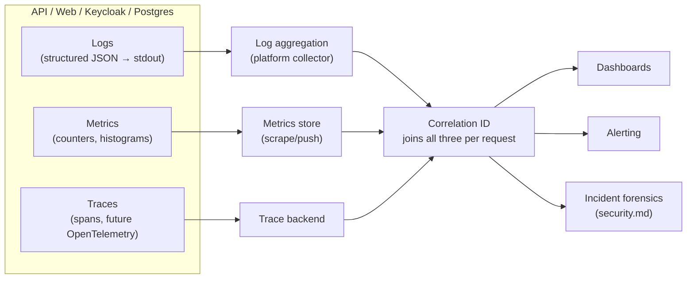
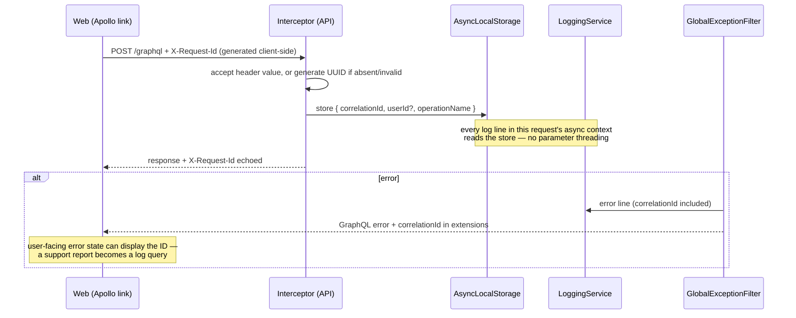

# SmartSense Marketplace — Observability Guide

Version: 1.0

---

## Purpose

### Goals

- Define how the platform is **observed in operation**: the three telemetry signals (logs, metrics, traces), how they connect through correlation, what "healthy" means numerically (SLIs/SLOs), and how signals become alerts, dashboards, and incident evidence.
- Own the observability topics no other document owns: the structured log format, the correlation-ID design, SLI/SLO/SLA definitions, retention, and alerting rules. Conventions owned elsewhere are referenced, never restated.

### Scope

| Already covered elsewhere                                                       | Owner                                                                  |
| ------------------------------------------------------------------------------- | ---------------------------------------------------------------------- |
| Log level semantics, what must never be logged                                  | [coding-standards.md § 11](./coding-standards.md#11-logging-standards) |
| What a service should/shouldn't log per request; audit-vs-log distinction       | [api-conventions.md § Logging](./api-conventions.md#logging)           |
| `LoggingService` mechanics (`bufferLogs`, `useLogger`, ConsoleLogger extension) | [backend-architecture.md § Logging](./backend-architecture.md#logging) |
| Health-check endpoints and container probes (incl. the empty-check gap, TD-4)   | [deployment.md § Health Checks](./deployment.md#health-checks)         |
| Monitoring/dashboards/alerts as deployment targets (the summary table)          | [deployment.md § Monitoring](./deployment.md#monitoring)               |
| Incident response process (detect → contain → eradicate → post-incident)        | [security.md § Incident Response](./security.md#incident-response)     |
| Performance budgets and per-operation latency targets                           | [performance.md](./performance.md#performance-budgets)                 |

**Assumptions made explicit — current state.** Verified, not aspirational: the only telemetry today is **unstructured console logging** to stdout (`LoggingService extends ConsoleLogger`, human-readable text). There are no metrics, no tracing, no correlation IDs (debt TD-6), no log aggregation, no error reporting service, no alerting, and `/health` verifies nothing (debt TD-4) — [TASKS.md § Technical Debt](./TASKS.md#technical-debt). This document is therefore mostly a **target-state specification**, written now so the M20 monitoring work ([milestones.md](./milestones.md#milestone-details)) implements a design rather than improvising one. Each section states its current status.

### The Three Signals

The design center: **one request, one correlation ID, three signals** — a user-reported error resolves to its exact log lines, its latency measurements, and (eventually) its trace, without guesswork.

---

## Logging Strategy

Conventions (levels, content, prohibitions) are owned by [coding-standards.md § 11](./coding-standards.md#11-logging-standards) and [api-conventions.md § Logging](./api-conventions.md#logging); mechanics by [backend-architecture.md § Logging](./backend-architecture.md#logging). The strategy layer this adds:

- **Logs go to stdout/stderr, always** — already true. The application never writes log files, rotates anything, or knows where logs end up; shipping and retention are the platform's job ([Log Retention](#log-retention)). This is what makes the logging destination swappable without an application change.
- **One logger, injected** — no second logging path may appear; a library that logs on its own is configured to route through the same sink or is reconsidered.
- **Log for the reader at 3 a.m.** — every `error`-level line carries what/where/who-context sufficient to act without reproducing the request; that bar is already met by `GlobalExceptionFilter`'s status/path/message lines and is the bar for every new log statement.

## Structured Logging

**Status: target — current output is human-readable text.** The specification, so the switch is a formatting change, not a redesign:

- **Format:** one JSON object per line (NDJSON) in deployed environments; the current pretty format remains the development default. NestJS's logger abstraction makes this a `LoggingService` formatting concern — call sites don't change.
- **Field schema:**

| Field           | Type     | Notes                                                                                                                          |
| --------------- | -------- | ------------------------------------------------------------------------------------------------------------------------------ |
| `timestamp`     | ISO-8601 | UTC always                                                                                                                     |
| `level`         | string   | `error` \| `warn` \| `log` \| `debug` — semantics per [coding-standards.md § 11](./coding-standards.md#11-logging-standards)   |
| `context`       | string   | The NestJS context (class name) already passed today (`AuthService`, `GlobalExceptionFilter`)                                  |
| `message`       | string   | Human-readable; **no interpolated secrets/PII** — the prohibition list applies to every field                                  |
| `correlationId` | string   | See [Correlation IDs](#correlation-ids); absent until TD-6 lands                                                               |
| `userId`        | string?  | The authenticated user's `id` (never email/token) — for support and forensics ([security.md](./security.md#incident-response)) |
| `operationName` | string?  | GraphQL operation name, when in a request context                                                                              |
| `durationMs`    | number?  | On request-completion/timing lines only                                                                                        |

- **Rule:** context that varies per event goes in **fields, not prose** — `"message": "unknown role ignored", "role": "Auditor"` beats a role name buried in a sentence, because fields are what aggregators filter on.

## Metrics

**Status: none exist.** Target model — RED for the request path, USE for resources — implemented at the [timing-interceptor attachment point](./backend-architecture.md#interceptors) plus process/DB exporters:

| Metric                                                        | Type          | Labels                                           | Answers                                                                                                         |
| ------------------------------------------------------------- | ------------- | ------------------------------------------------ | --------------------------------------------------------------------------------------------------------------- |
| `graphql_request_duration` (histogram → p95/p99)              | Rate/Duration | `operationName`, `operationType`                 | Is the API meeting [performance.md](./performance.md#performance-budgets)'s latency budgets, per operation?     |
| `graphql_requests_total`                                      | Rate          | `operationName`, `outcome` (`ok`/`error_code`)   | Traffic shape; error rate per operation                                                                         |
| `graphql_errors_total`                                        | Errors        | `code` (`FORBIDDEN`, `INTERNAL_SERVER_ERROR`, …) | Which failure class is spiking — the [graphql.md § 11](./graphql.md#11-error-handling) code taxonomy, countable |
| `prisma_queries_per_request` (histogram)                      | —             | `operationName`                                  | N+1 detection in production, not just review ([performance.md](./performance.md#prisma-optimization))           |
| Process: CPU, heap, event-loop lag, restarts                  | USE           | service                                          | Capacity and leak detection                                                                                     |
| Postgres: connections, slow queries, replication lag (future) | USE           | database                                         | The DB-side view ([performance.md § Database Optimization](./performance.md#database-optimization))             |

Per-`operationName` labeling is the non-negotiable — `/graphql` as a single undifferentiated endpoint hides everything ([performance.md § Monitoring](./performance.md#monitoring)).

## Tracing

**Status: future, explicitly not scheduled** — a single-process backend gets most trace value from correlation IDs + per-operation timing at a fraction of the cost. The pre-decision, so early choices stay compatible: when adopted, it is **OpenTelemetry** (vendor-neutral SDK, exporter chosen per stack), with spans at the boundaries this documentation already names — GraphQL operation → guard chain → resolver → service method → Prisma query — and the correlation ID carried as the trace correlation attribute. The trigger to adopt: the first genuinely multi-service topology (a worker from [backend-architecture.md § Background Jobs](./backend-architecture.md#background-jobs-future), federation) or a latency investigation that per-operation metrics can't decompose.

## Correlation IDs

**Status: debt TD-6, design owned here** (recommended shape sketched in [api-conventions.md § Logging](./api-conventions.md#logging)):

Design decisions fixed now: header name `X-Request-Id`; inbound values accepted only if well-formed (length/charset-capped — a client header is untrusted input); storage via `AsyncLocalStorage` (or `nestjs-cls`) so injection reaches every log line without threading a parameter through every service signature; the ID appears in error `extensions` so the frontend's error states can surface it. Lands with M20's monitoring task or the first production debugging session, whichever comes first ([TASKS.md TD-6](./TASKS.md#technical-debt)).

## Health Checks

Owned by [deployment.md § Health Checks](./deployment.md#health-checks) — endpoint inventory, container probes, and the TD-4 gap (the Terminus check list is empty). The observability addition: health checks are **binary liveness/readiness signals for orchestration**, not a monitoring substitute — a green `/health` with a database indicator says "can serve requests right now," while the metrics above say "how well" — both are needed, neither replaces the other.

## Monitoring

The what-to-monitor summary table is owned by [deployment.md § Monitoring](./deployment.md#monitoring); performance-specific signals by [performance.md § Monitoring](./performance.md#monitoring). This document's addition is the **priority order for M20**: (1) log aggregation with correlation IDs — forensics first, because incidents don't wait for dashboards; (2) the RED metrics + alert rules; (3) dashboards; (4) error reporting; tracing last, on its trigger ([Tracing](#tracing)).

## Dashboards

**Status: none.** One dashboard per environment, answering three questions top-to-bottom — _is it healthy_ (SLO status, error rate, health checks), _what changed_ (deploy markers overlaid on every chart — a regression without a deploy marker is a mystery; with one it's a diff), _what's trending_ (p95 per operation, traffic, saturation). Per-module drill-downs arrive with the modules that need them; the golden-signals top view arrives with M20.

## Alerting

**Status: none.** The rules that will govern the first alert configuration:

| Principle                        | Rule                                                                                                                                                                                              |
| -------------------------------- | ------------------------------------------------------------------------------------------------------------------------------------------------------------------------------------------------- |
| Symptoms, not causes             | Page on user-felt breach (availability, error rate, latency SLO burn) — not on every warning log or CPU blip                                                                                      |
| Every page is actionable         | An alert maps to a runbook entry ([deployment.md § Operational Runbooks](./deployment.md#operational-runbooks)) or it's a dashboard line, not a page                                              |
| Two tiers                        | **Page** (SLO-threatening, human now): health-check failure, error-rate spike, DB unreachable, cert expiry. **Notify** (next business day): disk trends, dependency advisories, slow-query growth |
| Burn-rate over static thresholds | Once SLOs exist ([SLO](#slo)), alert on error-budget burn rate — catches both fast outages and slow rots without static-threshold flapping                                                        |
| Alert fatigue is an incident     | A noisy alert gets fixed or deleted with the same urgency as a flaky test ([testing.md § Testing Philosophy](./testing.md#testing-philosophy) — the same "no tolerated noise" rule)               |

## Error Reporting

**Status: none — designed insertion points already exist.** A Sentry-class service (self-hosted or SaaS) receiving: backend unhandled exceptions (from `GlobalExceptionFilter`, alongside its log line), frontend render crashes (from the error boundaries) and unexpected GraphQL/network errors (from the Apollo error link) — the exact seams named in [frontend-architecture.md § Error Handling](./frontend-architecture.md#error-handling). Grouping by stack fingerprint, tagged with `correlationId` and release version ([deployment.md § Release Strategy](./deployment.md#release-strategy)'s image tags), scrubbed by the same never-log rules ([coding-standards.md § 11](./coding-standards.md#11-logging-standards)). Error reporting answers "what's broken for users _right now_" days before a user files a report — it precedes dashboards in value for a small team.

## Log Retention

**Status: target — nothing is retained today beyond container stdout buffers.** Initial windows, set alongside the aggregation stack and revisited with real volume/cost data:

| Data                             | Retention (initial)                                                                                                                                                                                                                              | Rationale                                                                          |
| -------------------------------- | ------------------------------------------------------------------------------------------------------------------------------------------------------------------------------------------------------------------------------------------------ | ---------------------------------------------------------------------------------- |
| Application logs (deployed envs) | 30 days hot                                                                                                                                                                                                                                      | Covers a release cycle of debugging; correlation IDs make short windows sufficient |
| Error-reporting events           | 90 days                                                                                                                                                                                                                                          | Slow-burn issue patterns outlive log windows                                       |
| Metrics                          | 13 months (downsampled after 30d)                                                                                                                                                                                                                | Year-over-year seasonality for capacity planning                                   |
| `AuditLog` rows                  | **Not log retention** — a permanent database record ([domain-model.md § Audit Log](./domain-model.md#audit-log)); never expired by this table; any future retention policy is a compliance decision ([TASKS.md](./TASKS.md), audit enhancements) |
| Local/dev logs                   | None — ephemeral                                                                                                                                                                                                                                 | Nothing in dev output is worth keeping                                             |

PII discipline is upstream, not at retention time: the never-log rules mean retention windows never become a data-protection liability.

## Incident Response

Owned by [security.md § Incident Response](./security.md#incident-response) — the process (detect → contain → eradicate → post-incident), severity classification, and ownership. This document supplies its **inputs**: alerts are the detection channel, dashboards the triage view, correlation-ID-joined logs (and error-report events) the forensic record. The observability commitment to that process: every post-incident review asks "did the signals exist to catch this sooner?" — a no answers with a change to this document's metric/alert tables.

---

## SLI

**Service Level Indicators** — what is measured. Chosen to be few, user-centric, and derivable from the [Metrics](#metrics) table:

| SLI                               | Definition                                                                                                                                                            |
| --------------------------------- | --------------------------------------------------------------------------------------------------------------------------------------------------------------------- |
| **Availability**                  | Successful responses ÷ total valid requests at `/graphql` (5xx and `INTERNAL_SERVER_ERROR` count as failures; client errors — `BAD_USER_INPUT`, `FORBIDDEN` — do not) |
| **Latency**                       | p95 GraphQL request duration, per operation class (query / mutation)                                                                                                  |
| **Error rate**                    | `INTERNAL_SERVER_ERROR`-class responses ÷ total, per operation                                                                                                        |
| **Freshness** (future, with jobs) | Job/event delivery lag once [background jobs](./backend-architecture.md#background-jobs-future) exist (e.g. notification delivery time, M16)                          |

## SLO

**Service Level Objectives** — the targets on those SLIs. Initial values, ratified alongside [performance.md](./performance.md#performance-budgets)'s M19 budget ratification and measured over a rolling 30 days:

| SLO                  | Initial target | Error budget (30d)                     |
| -------------------- | -------------- | -------------------------------------- |
| Availability         | 99.5%          | ~3.6 hours unavailable                 |
| Query latency p95    | < 300 ms       | Budgeted as % of intervals over target |
| Mutation latency p95 | < 500 ms       | Same                                   |
| Internal error rate  | < 0.5%         | Same                                   |

99.5% (not 99.9%) is deliberate for v1.0: a single-host Compose deployment without redundancy ([deployment.md § Scaling Strategy](./deployment.md#scaling-strategy)) cannot honestly promise more, and an SLO the infrastructure can't meet teaches everyone to ignore SLOs. Targets tighten when the topology does. The error budget is the shared currency between feature velocity and reliability: budget exhausted → reliability work preempts features until it recovers ([Alerting](#alerting) burn-rate rules enforce this mechanically).

## SLA

**None exists, deliberately.** An SLA is an _external contractual commitment_ with remedies — nothing in [requirements.md](./requirements.md) or [roadmap.md](./roadmap.md) commits one, and no customer contract exists to anchor it. The SLOs above are internal engineering targets. If commercial SLAs ever arrive (roadmap's partner-growth era), they are set _below_ demonstrated SLO performance with margin — an SLA is a promise made from evidence, and it triggers the [roadmap.md § Roadmap Governance](./roadmap.md#roadmap-governance) dated-commitment rule (Risk 7's trigger).

---

## Future Monitoring Stack

No vendor/stack is chosen — that's an M20-T2 hosting-coupled decision ([TASKS.md](./TASKS.md#milestone-task-breakdown)). What is fixed now is the **shape any candidate must satisfy**, so the choice is a comparison, not a design session:

| Slot                 | Requirement                                                                                    | Representative candidates               |
| -------------------- | ---------------------------------------------------------------------------------------------- | --------------------------------------- |
| Log aggregation      | Ingests NDJSON from stdout; queryable by any field ([Structured Logging](#structured-logging)) | Loki+Grafana, ELK, hosted equivalents   |
| Metrics + dashboards | Histogram-native (real p95/p99), label-based, deploy-marker overlays                           | Prometheus+Grafana, hosted equivalents  |
| Alerting             | Burn-rate rules, two-tier routing                                                              | Alertmanager, PagerDuty-class routing   |
| Error reporting      | Fingerprint grouping, release tagging, PII scrubbing                                           | Sentry (self-hosted or SaaS), GlitchTip |
| Tracing (deferred)   | OpenTelemetry-native ingestion                                                                 | Tempo, Jaeger, hosted equivalents       |

Preference, consistent with the stack's posture: boring, self-hostable, OpenTelemetry-compatible components over a proprietary all-in-one — the application's only coupling is stdout JSON and (eventually) OTel exporters, so the stack stays swappable.

---

## Best Practices

- [ ] New log statements put variable context in structured fields, carry the right level, and would make sense to a stranger at 3 a.m.
- [ ] New GraphQL operations are observable by name from day one — the `operationName` label is automatic, never opt-in.
- [ ] Every alert added has an owner, a runbook line, and a deletion criterion.
- [ ] Deploy markers accompany every release on every dashboard.
- [ ] SLO status is reviewed at the same release-boundary cadence as everything else ([roadmap.md § Roadmap Governance](./roadmap.md#roadmap-governance)); budget exhaustion changes the next sprint's shape.
- [ ] Post-incident: the "did the signals exist?" question is answered in writing, and this document changes if the answer was no.
- [ ] The never-log prohibitions ([coding-standards.md § 11](./coding-standards.md#11-logging-standards)) apply to _every_ telemetry channel — metrics labels and error-report payloads included (no emails, tokens, or PII as label values).

## Anti-Patterns

| Anti-pattern                                                                   | Why it's a problem                                                           | Instead                                                                     |
| ------------------------------------------------------------------------------ | ---------------------------------------------------------------------------- | --------------------------------------------------------------------------- |
| Logging more as a substitute for structure                                     | A thousand prose lines that can't be filtered answer nothing                 | Fewer lines, structured fields ([Structured Logging](#structured-logging))  |
| High-cardinality metric labels (userId, orderId as labels)                     | Explodes the metrics store; cost and query death                             | IDs go in logs/traces; labels are bounded sets (operation name, error code) |
| Paging on causes (CPU 80%) instead of symptoms                                 | Wakes humans for non-events; misses user-felt failures with quiet causes     | Symptom/SLO-based paging ([Alerting](#alerting))                            |
| An alert that's "always red, ignore it"                                        | Trains everyone to ignore the channel — the next real page dies in the noise | Fix or delete, same-day ([Alerting](#alerting))                             |
| Dashboards as wallpaper (30 charts, no question answered)                      | Triage time goes up, not down                                                | Three questions top-to-bottom ([Dashboards](#dashboards))                   |
| Correlation ID threaded as a parameter through every signature                 | Pollutes every service API for a cross-cutting concern                       | `AsyncLocalStorage` context ([Correlation IDs](#correlation-ids))           |
| Promising an SLA from hope                                                     | Contractual exposure the infrastructure can't back                           | SLOs first, evidence, then SLAs with margin ([SLA](#sla))                   |
| PII/tokens in metrics labels or error-report payloads "because it's not a log" | The prohibition is about the data, not the channel                           | Never-log rules apply to all telemetry ([Best Practices](#best-practices))  |
