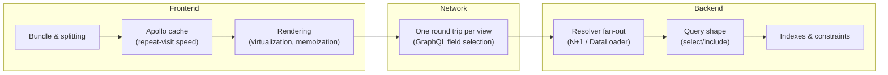

# SmartSense Marketplace — Performance Strategy Guide

Version: 1.0

---

## Purpose

### Goals

- Consolidate the platform's **performance program in one place**: the targets (budgets), the per-layer strategy, and the process (profiling, load testing, monitoring) that keeps performance a measured property rather than a vibe.
- Own what no other document owns — budgets, profiling tooling, and the measurement process. Per-layer _mechanisms_ are owned by the documents that own those layers and are referenced, never restated.

### Scope

| Mechanism already owned elsewhere                                                | Owner                                                                                              |
| -------------------------------------------------------------------------------- | -------------------------------------------------------------------------------------------------- |
| N+1, DataLoader, query optimization, server/client caching, pagination           | [graphql.md § 13](./graphql.md#13-performance-guidelines)                                          |
| Prisma batching (`createMany`), timeout handling, service-level query shaping    | [api-conventions.md § Performance](./api-conventions.md#performance)                               |
| Frontend performance layering (splitting → cache → virtualization → memoization) | [frontend-architecture.md § Performance Strategy](./frontend-architecture.md#performance-strategy) |
| Memoization policy (when, and when not)                                          | [coding-standards.md § Memoization Guidelines](./coding-standards.md#4-react-standards)            |
| Indexing strategy, composite indexes, soft-delete indexes                        | [database-schema.md § Indexing Strategy](./database-schema.md#indexing-strategy)                   |
| Skeletons, progressive loading, perceived-performance rules                      | [ui-guidelines.md § Loading Experience](./ui-guidelines.md#loading-experience)                     |
| Horizontal scaling, connection pooling, statelessness                            | [deployment.md § Scaling Strategy](./deployment.md#scaling-strategy)                               |
| Load-testing tooling and its place in the test strategy                          | [testing.md § Performance Testing](./testing.md#performance-testing)                               |

**Assumptions made explicit.**

1. **No performance work has been measured yet** — the schema exposes placeholder queries, no deployed environment exists, and M19 ([milestones.md](./milestones.md#milestone-details)) is the audit gate. Every budget below is an **initial target to be ratified (or corrected) at M19** against real measurements, not a recorded achievement.
2. Budgets are stated for a **mid-range device on a fast-3G/slow-4G connection** for frontend metrics, and **representative data volume** (thousands of products, tens of thousands of orders) for API metrics — measuring on a developer machine against an empty database validates nothing.

---

## Performance Goals

Performance is treated as a feature with acceptance criteria, not an optimization pass:

- **Perceived speed first** — a page that paints a correct skeleton in 200ms _feels_ faster than one that blocks 800ms for complete data ([ui-guidelines.md § Loading Experience](./ui-guidelines.md#loading-experience)); the four-state model is as much a performance tool as a UX one.
- **Measured, never assumed** — no optimization merges without a before/after measurement; no regression is "probably fine" ([Profiling](#profiling)).
- **Budgets gate releases** — from v1.0 on, exceeding a budget is a release blocker with the same standing as a failing test ([Performance Budgets](#performance-budgets)).

The diagram is also the debugging order: when a screen is slow, walk it left to right — most "backend is slow" reports are resolver fan-out (E) or a missing index (G); most "app feels heavy" reports are bundle (A) or rendering (C).

---

## Frontend Performance

Strategy layering owned by [frontend-architecture.md § Performance Strategy](./frontend-architecture.md#performance-strategy): (1) route splitting, (2) Apollo cache, (3) virtualization, (4) targeted memoization — in that order, because each earlier layer is cheaper and broader than the next. The sections below add only targets and tooling per layer.

## React Optimization

Owned by [coding-standards.md § Memoization Guidelines](./coding-standards.md#4-react-standards) (memoize on evidence, not by default) and [frontend-architecture.md § Anti-Patterns](./frontend-architecture.md#anti-patterns) (derive during render; no effect-driven state sync). Additions:

| Concern             | Rule                                                                                                                                                                                |
| ------------------- | ----------------------------------------------------------------------------------------------------------------------------------------------------------------------------------- |
| Re-render diagnosis | React DevTools Profiler _before_ any `memo`/`useMemo` PR — the measurement is part of the review evidence                                                                           |
| Long lists          | Pagination first ([graphql.md § Pagination](./graphql.md#pagination)); virtualization only when a single page must render hundreds of rows                                          |
| Context granularity | A context that changes often (auth loading states) is separated from one that rarely changes (resolved user) so consumers of the stable half don't re-render with the volatile half |

## Code Splitting

- **Route-level splitting is the mandated baseline** ([CLAUDE.md](../CLAUDE.md), [frontend-architecture.md § Routing](./frontend-architecture.md#routing-architecture)) — the entry chunk contains shell + layouts only.
- Below route level, split only proven-heavy, conditionally-used subtrees (a future chart library on the dashboard is the canonical candidate) — verified in the bundle analysis, not guessed.

## Lazy Loading

Owned by [frontend-architecture.md § Routing / Loading](./frontend-architecture.md#routing-architecture) (every route lazy, Suspense fallbacks are skeletons) and [ui-guidelines.md § Loading Experience](./ui-guidelines.md#loading-experience). Addition: images below the fold use native `loading="lazy"`; nothing above the fold ever does.

## Apollo Cache

Owned by [graphql.md § 9 Apollo Client Strategy](./graphql.md#9-apollo-client-strategy) — `cache-and-network` as the repeat-navigation accelerator, normalization as the consistency mechanism. The performance framing this adds: the cache is the frontend's **highest-leverage performance feature** — a navigation that paints from cache is a 0-RTT navigation; protecting normalization (always select `id`) is therefore a performance rule, not just a correctness rule.

## GraphQL Optimization

Owned end-to-end by [graphql.md § 13 Performance Guidelines](./graphql.md#13-performance-guidelines) (N+1, per-request DataLoader, pagination, field selection) and [§ 12](./graphql.md#12-security-considerations) (depth/complexity limits — which are also performance controls). Addition: one view should need **one query** — a page assembling three queries for one screen is a schema-shape smell to fix in the schema ([graphql.md § Best Practices](./graphql.md#15-best-practices), "design for the client"), except where progressive per-card loading is the deliberate choice ([ui-guidelines.md](./ui-guidelines.md#loading-experience)).

## Backend Optimization

Owned by [api-conventions.md § Performance](./api-conventions.md#performance) (batching, `createMany`, timeout posture) and [backend-architecture.md](./backend-architecture.md) (stateless singletons, no in-process caches). Addition — the measurement hook that makes backend performance visible at all: per-operation timing (the future timing interceptor, [backend-architecture.md § Interceptors](./backend-architecture.md#interceptors)) is a prerequisite for everything else in this document's backend sections; it lands with monitoring (M20) or the first performance investigation, whichever comes first.

## Database Optimization

Owned by [database-schema.md § Indexing Strategy](./database-schema.md#indexing-strategy) (every FK indexed, composite `[partnerId, status]` patterns, `deletedAt` indexes; indexes added for named query patterns only). Additions:

| Practice                       | Rule                                                                                                                                                                   |
| ------------------------------ | ---------------------------------------------------------------------------------------------------------------------------------------------------------------------- |
| `EXPLAIN ANALYZE` before/after | Required evidence on any PR adding an index or claiming a query fix                                                                                                    |
| Slow-query review              | Quarterly, once monitoring exists ([TASKS.md § Maintenance Tasks](./TASKS.md#maintenance-tasks)) — `pg_stat_statements` is enabled with the first deployed environment |
| Sortable = indexed             | Already a rule ([api-conventions.md § Filtering](./api-conventions.md#filtering)) — restated here because it's the most common accidental full-table-sort source       |

## Prisma Optimization

Owned by [api-conventions.md](./api-conventions.md#performance) and [graphql.md § Query Optimization](./graphql.md#13-performance-guidelines) (`select`/`include` discipline, one query with includes over sequential queries). Additions: enable Prisma query logging in development (surfacing accidental query storms while they're free to fix), and treat a resolver producing more than a handful of queries per request as an N+1 investigation trigger regardless of latency — data volume will find it later even if the dev database doesn't.

## Caching Strategy

Owned by [graphql.md § Caching](./graphql.md#13-performance-guidelines) (client cache primary; no server cache yet) and [backend-architecture.md § Caching Strategy](./backend-architecture.md#caching-strategy) (when added: external store, service-layer, injectable module — never in-process). The program-level rule this adds: **a cache is the last resort, adopted with eviction/invalidation designed up front** — the order of remedies for a slow read is: query shape → index → schema shape → cache. A cache adopted before the first three is a bug preservative.

## Bundle Optimization

| Concern            | Convention                                                                                                                                                                                  |
| ------------------ | ------------------------------------------------------------------------------------------------------------------------------------------------------------------------------------------- |
| Analysis           | Bundle visualization (`rollup-plugin-visualizer` or Vite equivalent) run at M19 and on any "why is the bundle big" question — evidence, not intuition                                       |
| Dependencies       | The [CLAUDE.md](../CLAUDE.md) "no unnecessary dependencies" rule is a bundle rule too: a library must justify its gzipped cost; prefer tree-shakeable imports; no moment.js-class monoliths |
| Generated code     | Codegen output is tree-shaken per operation — unused operations cost nothing; stale `.graphql` documents are deleted, not kept "just in case"                                               |
| Budget enforcement | The budget table below; checked at M19, then per release                                                                                                                                    |

## Image Optimization

Owned by [ui-guidelines.md § Icons & Images](./ui-guidelines.md#icons--images) (slot-appropriate sizes, avatar fallbacks, icons as components) with the pipeline/CDN decision explicitly open. Until that decision: product imagery ships with explicit `width`/`height` (no layout shift — the CLS budget below depends on it), below-fold images lazy-load, and no image is committed to the repo as a UI asset that an icon component or CSS could express.

## Network Optimization

- **Fewer round trips beats faster round trips**: one query per view (above), cache-first paints, and — future — route/query preloading ([frontend-architecture.md § Future Enhancements](./frontend-architecture.md#future-enhancements)).
- Compression (gzip/brotli) and HTTP/2 land at the reverse proxy ([deployment.md § Infrastructure Components](./deployment.md#infrastructure-components)) — nothing to do in application code.
- Payload discipline is GraphQL field selection ([graphql.md § Field Selection](./graphql.md#field-selection)) — over-fetching is a per-operation review item, not a global setting.

## Monitoring

Owned by [deployment.md § Monitoring](./deployment.md#monitoring) (logs/metrics/alerts/dashboards, all future until M20). The performance-specific additions to that plan: p95/p99 latency **per GraphQL operation** (not just per endpoint — `/graphql` aggregates everything and hides everything), Apollo cache hit behavior in the client (via error/timing instrumentation when frontend observability lands), and frontend Core Web Vitals from real users (field data), which is what the budget table is ultimately verified against — lab measurements approximate, field data decides.

## Performance Budgets

Initial targets — ratified or corrected at M19 (Assumption 1), then enforced per release:

| Metric                                           | Budget   | Measured by                                                                                |
| ------------------------------------------------ | -------- | ------------------------------------------------------------------------------------------ |
| First Contentful Paint (FCP)                     | < 1.8s   | Lighthouse (lab) → field data once monitoring exists                                       |
| Largest Contentful Paint (LCP)                   | < 2.5s   | Same                                                                                       |
| Cumulative Layout Shift (CLS)                    | < 0.1    | Same — skeletons matching real layout and sized images are what earn this                  |
| Interaction to Next Paint (INP)                  | < 200ms  | Field data                                                                                 |
| Entry JS bundle (gzipped, shell + layouts)       | < 200 KB | Bundle analysis in CI (target)                                                             |
| Per-route lazy chunk (gzipped)                   | < 150 KB | Same                                                                                       |
| GraphQL query latency (p95, representative data) | < 300ms  | API metrics                                                                                |
| GraphQL mutation latency (p95)                   | < 500ms  | API metrics                                                                                |
| Queries per GraphQL request (max, any resolver)  | ≤ 10     | Prisma query logging / investigation trigger ([Prisma Optimization](#prisma-optimization)) |

A budget change (loosening _or_ tightening) is a reviewed edit to this table with the measurement that justified it — budgets drift by decision, never by neglect.

## Load Testing

Tooling and strategy owned by [testing.md § Performance Testing](./testing.md#performance-testing) (k6/Artillery, staging-like target, p95/p99 + error-rate thresholds). The scenario-design rules this adds:

1. Test **representative operation mixes**, not single endpoints — a Partner's real session is dashboard + orders list + a couple of mutations, in proportion.
2. Test at **representative data volume** (Assumption 2) — load tests against a seeded-only database measure the ORM's happy path, nothing else.
3. Include the **pathological shapes** the limits exist for: max-depth queries, max-page-size list queries — verifying the M19 depth/complexity limits under load, not just functionally.
4. First run is the M19 baseline; thereafter per release against the previous baseline — the trend is the signal, the absolute number is context.

## Profiling

The toolbox, by layer — profiling evidence is expected in any performance-claiming PR:

| Layer            | Tool                                                                           | Use                                        |
| ---------------- | ------------------------------------------------------------------------------ | ------------------------------------------ |
| React rendering  | React DevTools Profiler                                                        | Which components re-render, why, how long  |
| Browser runtime  | Chrome DevTools Performance panel                                              | Long tasks, layout thrash, script cost     |
| Web vitals (lab) | Lighthouse                                                                     | Budget-table lab measurements              |
| Bundle           | Vite/Rollup visualizer                                                         | What the bytes actually are                |
| API process      | Node `--inspect` / clinic.js flame graphs                                      | CPU hotspots in resolvers/services         |
| Queries          | Prisma query logging (dev), `EXPLAIN ANALYZE`, `pg_stat_statements` (deployed) | Query count, shape, and plan per operation |

---

## Best Practices

- [ ] Measure before optimizing; attach the measurement to the PR ([Profiling](#profiling)).
- [ ] New list query: paginated, sortable only on indexed fields, one Prisma query where relations are known.
- [ ] New page: lazy route, skeleton matching real layout, one primary query (or deliberate per-card loading).
- [ ] New dependency: gzipped cost stated in the PR alongside the justification.
- [ ] New index: named query pattern + `EXPLAIN ANALYZE` evidence.
- [ ] Budgets checked at every release from v1.0; a breach blocks like a failing test.
- [ ] Remedy order for slow reads: query shape → index → schema shape → cache — in that order, with evidence at each step.

## Anti-Patterns

| Anti-pattern                                                             | Why it's a problem                                                                                                            | Instead                                                                                       |
| ------------------------------------------------------------------------ | ----------------------------------------------------------------------------------------------------------------------------- | --------------------------------------------------------------------------------------------- |
| Speculative `useMemo`/`memo` sprinkled "for performance"                 | Cost without evidence; obscures the real hotspots when one finally exists                                                     | Profile first ([coding-standards.md § Memoization](./coding-standards.md#4-react-standards))  |
| Optimizing against an empty dev database                                 | Every query is fast with 12 rows; N+1 and missing indexes are invisible                                                       | Representative volume (Assumption 2); query-count triggers, not latency-only                  |
| Adding a cache in front of a slow query                                  | Preserves the bug, adds invalidation complexity, hides the fix                                                                | Remedy order: shape → index → schema → cache ([Caching Strategy](#caching-strategy))          |
| An unpaginated list "because it's small right now"                       | Unbounded response growth is a performance _and_ security concern ([graphql.md § 13](./graphql.md#13-performance-guidelines)) | Cursor pagination from the first version                                                      |
| Spinners replacing full layouts on every fetch                           | Perceived slowness + CLS budget destruction                                                                                   | Skeletons matching real structure ([ui-guidelines.md](./ui-guidelines.md#loading-experience)) |
| "It's fast on my machine" as review evidence                             | Dev hardware + localhost + empty DB ≈ best case of the best case                                                              | Lab budgets + representative data; field data once it exists                                  |
| A giant shared "utils" or barrel pulling heavy deps into the entry chunk | Silently defeats route splitting — everything imports the barrel, the barrel imports the world                                | Keep heavy deps behind lazy boundaries; check the visualizer                                  |

## Future Enhancements

- **Per-operation timing interceptor** — the backend measurement prerequisite ([Backend Optimization](#backend-optimization)); with M20 monitoring or first investigation.
- **CI budget enforcement** — automated bundle-size and Lighthouse checks failing PRs that breach the table, once budgets are M19-ratified.
- **Route/query preloading and list virtualization** — owned by [frontend-architecture.md § Future Enhancements](./frontend-architecture.md#future-enhancements); adopted on measured need.
- **Server-side caching and read replicas** — the last-resort tier ([Caching Strategy](#caching-strategy), [deployment.md § Scaling Strategy](./deployment.md#scaling-strategy)); each requires a measured bottleneck the earlier remedies couldn't clear.
- **Real-user monitoring (field vitals)** — the budget table's final arbiter; with frontend observability ([frontend-architecture.md § Future Enhancements](./frontend-architecture.md#future-enhancements)).
- **Continuous load-test baseline** — per-release automated k6 run comparing against the stored baseline, once the first M19 baseline exists.
