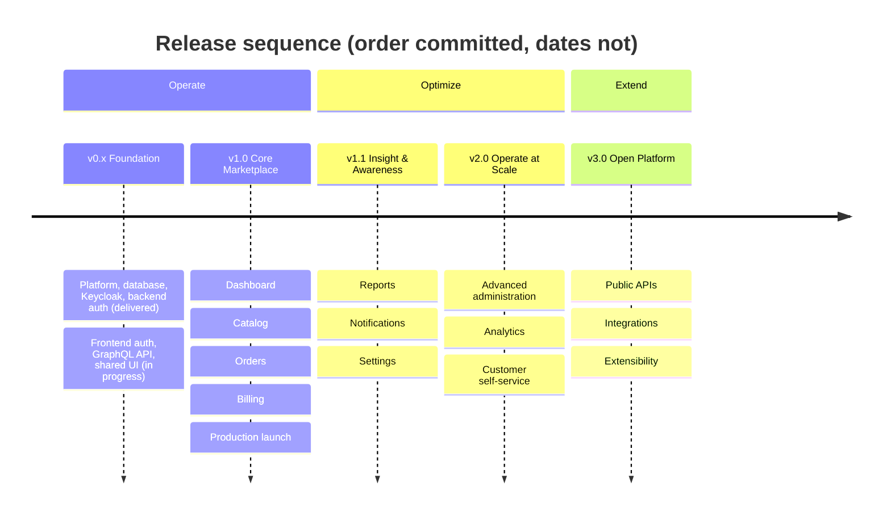

# SmartSense Marketplace — Product Roadmap

Version: 1.0

---

## Purpose

### Goals

- Describe the **long-term product evolution** of SmartSense Marketplace: what the product becomes, in what order, and why that order.
- Give every stakeholder — engineering, product, business — one shared answer to "what are we building next and what is deliberately later."
- Keep ambition honest: every roadmap item traces to a business objective, and items with unresolved prerequisites say so.

### Vision

SmartSense Marketplace grows from an internal partner-management platform into a full multi-sided commerce platform where Partners run their entire selling operation — catalog, inventory, orders, billing, and insight — in one place.

### Scope

This document covers **product direction**: releases, feature domains, and future capabilities. It deliberately excludes what other documents own:

| Not covered here                                                 | See                                               |
| ---------------------------------------------------------------- | ------------------------------------------------- |
| Detailed functional requirements per module                      | [requirements.md](./requirements.md)              |
| Technical architecture and implementation approach               | [architecture.md](./architecture.md)              |
| Domain entities, business rules, and entity lifecycles           | [domain-model.md](./domain-model.md)              |
| Delivery-level milestone tracking (what is done vs. in progress) | [milestones.md](./milestones.md)                  |
| Engineering release mechanics (versioning, pipelines, rollback)  | [deployment.md](./deployment.md#release-strategy) |

**Assumptions made explicit.**

1. **No formal business plan exists in this repository.** The vision, target users, and growth strategy below are derived from [requirements.md](./requirements.md), [domain-model.md](./domain-model.md) (including its open questions), and the delivery history in [milestones.md](./milestones.md) — they are the product direction _implied by what has been specified and built_, written down so it can be corrected by stakeholders rather than remain implicit.
2. **No calendar dates are committed.** Releases are sequenced (what depends on what), not scheduled — attaching dates is a governance decision ([Roadmap Governance](#roadmap-governance)) this document does not pre-empt.
3. **Version numbers below are product releases**, not the workspace `package.json` versions (currently `0.0.1`) — engineering versioning mechanics are owned by [deployment.md § Release Strategy](./deployment.md#release-strategy).

---

## Product Vision

### Business Objectives

- **Operational consolidation:** give Partners a single system of record for products, inventory, orders, and billing — replacing spreadsheet- and email-driven workflows.
- **Trustworthy commerce:** every financial record (Order, Invoice, Payment) is accurate, auditable, and permanent — the ledger-grade integrity rules in [domain-model.md](./domain-model.md) are a business promise, not just a schema decision.
- **Scalable partner growth:** onboarding a new Partner is a configuration act, not an engineering project — the platform absorbs more Partners, more Products, and more order volume without structural change.

### Target Users

The three roles defined in [requirements.md § User Roles](./requirements.md#user-roles), in order of product priority:

| User                 | Primary jobs to be done                                                                          | Priority rationale                                                                    |
| -------------------- | ------------------------------------------------------------------------------------------------ | ------------------------------------------------------------------------------------- |
| **Partner**          | Manage catalog and inventory, fulfill orders, track invoices and payouts, understand performance | The paying/operating side — the platform exists to serve their workflow first.        |
| **Admin (operator)** | Approve and manage Partners, oversee the catalog taxonomy, resolve disputes, audit activity      | The platform team's own leverage — every Admin capability reduces operational cost.   |
| **Customer**         | Browse, order, and track purchases                                                               | Read-mostly in early releases; grows into a full self-service buyer experience later. |

### Growth Strategy

Depth before breadth: make the core Partner workflow (catalog → order → invoice → payment) complete and reliable for a small number of Partners **before** adding adjacent capabilities (notifications, analytics) or new audiences (public storefront, mobile). Each release earns the next — a billing module nobody trusts makes an analytics module worthless.

### Marketplace Evolution

Three broad eras, matching the release sequence below:

1. **Operate** (v1.x) — Partners and operators run the core commerce loop inside the platform.
2. **Optimize** (v2.x) — the platform starts telling users things they didn't know: reports, analytics, notifications, richer administration.
3. **Extend** (v3.x+) — the platform opens outward: public APIs, integrations, and the future capabilities in [Future Product Vision](#future-product-vision).

---

## Product Principles

| Principle                | Meaning for product decisions                                                                                                                                                                                                                          |
| ------------------------ | ------------------------------------------------------------------------------------------------------------------------------------------------------------------------------------------------------------------------------------------------------ |
| **Security First**       | No feature ships without its authorization story; role- and permission-based access ([authentication.md](./authentication.md)) is part of a feature's definition, never a follow-up.                                                                   |
| **API First**            | Every capability is a typed API operation before it is a screen — the UI is a consumer of the platform, not the platform itself ([graphql.md](./graphql.md)). This is what keeps public APIs (v3.x) a packaging exercise rather than a rewrite.        |
| **Modular Architecture** | Features arrive as self-contained modules ([architecture.md § Future Scalability](./architecture.md#future-scalability)); a roadmap item that can't be expressed as a module is a signal to decompose it further.                                      |
| **Scalability**          | Growth in Partners, Products, and order volume is handled by the existing design, not by re-architecture ([deployment.md § Scaling Strategy](./deployment.md#scaling-strategy)).                                                                       |
| **User Experience**      | Consistent, accessible, state-complete interfaces ([ui-guidelines.md](./ui-guidelines.md)) — a feature is not "done" at functional; it's done at usable.                                                                                               |
| **Automation**           | Anything done twice by hand — testing, deployment, partner onboarding steps, report generation — is a candidate for automation before new feature work expands the manual surface.                                                                     |
| **Extensibility**        | New roles, permissions, modules, and (eventually) third-party extensions are additive — the extensible RBAC design in [domain-model.md](./domain-model.md#role) exists precisely so the roadmap never blocks on "we'd need a migration to add a role." |

---

## Release Strategy

| Release                        | Objective                                                                                                                                                                                                                                                                     | Gate to ship                                                                                                                                  |
| ------------------------------ | ----------------------------------------------------------------------------------------------------------------------------------------------------------------------------------------------------------------------------------------------------------------------------- | --------------------------------------------------------------------------------------------------------------------------------------------- |
| **v0.x — Foundation**          | Everything a product needs before it has features: monorepo, database, identity, security model, CI. Milestones 1–7 are delivered; frontend auth through shared UI (milestones 8–10) complete this phase ([milestones.md](./milestones.md)).                                  | All 17 delivery milestones' prerequisites for feature work met.                                                                               |
| **v1.0 — Core Marketplace**    | A Partner can run the full commerce loop: publish products, receive and fulfill orders, get invoiced and paid — with the Admin oversight to match. Corresponds to the four core modules in [requirements.md § Modules](./requirements.md#modules) plus production deployment. | End-to-end tested ([testing.md](./testing.md)), production environment live ([deployment.md](./deployment.md)), first real Partner onboarded. |
| **v1.1 — Insight & Awareness** | The platform starts communicating: billing reports Partners can act on, notifications so users aren't polling screens, self-service settings.                                                                                                                                 | v1.0 stable in production; report accuracy reconciled against the ledger.                                                                     |
| **v2.0 — Operate at Scale**    | The operator side matures: richer administration, cross-partner analytics, dispute/refund workflows, and a genuine Customer self-service experience.                                                                                                                          | Enough production usage that analytics has data worth analyzing.                                                                              |
| **v3.0 — Open Platform**       | The marketplace opens outward: public/partner APIs, integration points, and the first steps of the extensibility vision.                                                                                                                                                      | API-first discipline held through v1–v2 (so "opening up" is packaging, not rebuilding).                                                       |

---

## Feature Roadmap

Organized by domain. "Planned capabilities" describe the target release's scope at product level; functional detail belongs to [requirements.md](./requirements.md) and entity behavior to [domain-model.md](./domain-model.md).

### Platform Foundation — v0.x (largely delivered)

- **Business value:** none directly visible — and everything depends on it. Identity, security, data integrity, and delivery automation are what make every later domain shippable in weeks instead of quarters.
- **Planned capabilities:** monorepo and CI, database with enforced integrity rules, Keycloak identity, backend and frontend authentication, typed GraphQL API, shared UI component library.
- **Future enhancements:** the engineering gaps already tracked in [deployment.md](./deployment.md#future-enhancements) and [testing.md](./testing.md#future-enhancements) (deployed environments, CI test stages, monitoring) — foundation work never fully ends; it just stops blocking features.

### Authentication & Access — v0.x → continuous

- **Business value:** partners trust the platform with commercial data only if access is provably controlled; operators can delegate safely only with fine-grained permissions.
- **Planned capabilities:** login/logout/session management, role-based routing and UI, permission-checked operations end to end ([authentication.md](./authentication.md)).
- **Future enhancements:** custom roles composed from permissions (the extensibility already designed into the domain model), invitation-based user onboarding, MFA policies via Keycloak.

### Partner Management — v1.0 core, v2.0 depth

- **Business value:** the speed and safety of Partner onboarding directly bounds marketplace growth.
- **Planned capabilities:** partner registration and approval workflow, profile and commission management, suspension/deactivation with history preserved ([domain-model.md § Partner Onboarding](./domain-model.md#partner-onboarding)).
- **Future enhancements:** self-service partner application, tiered commission structures, partner performance scorecards (v2.0, with Analytics).

### Catalog — v1.0

- **Business value:** the catalog _is_ the marketplace's inventory of things to sell — its quality, searchability, and freshness drive every downstream transaction.
- **Planned capabilities:** product and variant management, category taxonomy, search and filtering, publish/review lifecycle ([requirements.md § Catalog](./requirements.md#modules)).
- **Future enhancements:** product review/approval queues for Admins, rich media management (pending the file-upload decision in [api-conventions.md](./api-conventions.md#file-upload-strategy)), bulk import/export.

### Inventory — v1.0 (with Catalog)

- **Business value:** overselling destroys customer trust and creates manual reconciliation cost; accurate availability is a prerequisite for order-taking, not a nice-to-have.
- **Planned capabilities:** per-variant stock tracking, reservation on order placement, low-stock visibility ([domain-model.md § Inventory](./domain-model.md#inventory)).
- **Future enhancements:** low-stock alerts (v1.1, with Notifications), inventory history and forecasting (v2.0, with Analytics), multi-location stock (unscoped).

### Orders — v1.0

- **Business value:** the heart of the commerce loop — every order processed correctly and visibly is revenue and reputation; every one mishandled is both, lost.
- **Planned capabilities:** order placement, status lifecycle with timeline visibility, fulfillment tracking, cancellation rules ([domain-model.md § Order Lifecycle](./domain-model.md#order-lifecycle)).
- **Future enhancements:** returns and refunds workflow (v2.0), partial fulfillment/shipments (unscoped), delivery integrations (v3.0).

### Billing & Payments — v1.0

- **Business value:** this is where the marketplace makes and moves money — invoice and payment accuracy is the single highest-stakes correctness requirement in the product.
- **Planned capabilities:** invoice generation per completed order, payment recording (including partial payments), invoice/payment status visibility, CSV/PDF export ([requirements.md § Billing](./requirements.md#modules)).
- **Future enhancements:** payment-provider integration (v2.0 — currently payments are recorded, not processed), automated payout/settlement runs, dunning for overdue invoices.

### Reports — v1.1

- **Business value:** partners and operators make pricing, stocking, and commission decisions from these numbers — reports convert the ledger into decisions.
- **Planned capabilities:** periodic billing reports per Partner ([domain-model.md § Billing Report](./domain-model.md#billing-report)), sales summaries, downloadable exports.
- **Future enhancements:** scheduled report delivery (with Notifications), custom report periods, operator-side cross-partner reporting (v2.0, feeding Analytics).

### Notifications — v1.1

- **Business value:** without notifications, users must poll screens to learn that an order arrived or stock ran out — awareness is what turns the platform from a tool people check into one that reaches them.
- **Planned capabilities:** in-app notification center and email notifications for key events (order placed/status changed, invoice issued, low stock) — the module [architecture.md § Future Scalability](./architecture.md#future-scalability) and [ui-guidelines.md § Feedback Components](./ui-guidelines.md#feedback-components) already reserve space for.
- **Future enhancements:** per-user notification preferences, digest modes, additional channels (webhooks in v3.0).

### Settings — v1.1

- **Business value:** every preference users can manage themselves is a support ticket that never gets filed.
- **Planned capabilities:** user profile and preference management, organization-level settings for Partners.
- **Future enhancements:** notification preferences (with Notifications), localization preferences (with the multi-language vision), theme selection once dark mode ships ([ui-guidelines.md § Dark Mode](./ui-guidelines.md#dark-mode)).

### Administration — v1.0 basic, v2.0 mature

- **Business value:** operator efficiency — the fewer engineers needed to run the marketplace day-to-day, the more the platform scales economically.
- **Planned capabilities (v1.0):** user and role administration, partner approval, catalog oversight — the Admin-facing slices of the core modules.
- **Future enhancements (v2.0):** dispute resolution workflows, impersonation/"view as" for support, platform configuration without deployments, bulk operations.

### Analytics — v2.0

- **Business value:** aggregate insight across partners, products, and time — the difference between reporting what happened and understanding why.
- **Planned capabilities:** dashboards for sales trends, partner performance, and category performance; operator-side marketplace health views.
- **Future enhancements:** cohort and funnel analysis, anomaly detection, the AI-powered recommendations in [Future Product Vision](#future-product-vision).

### Audit Logs — v1.0 (recording) → v2.0 (surfacing)

- **Business value:** accountability and dispute resolution — "who changed what, when" answered from records, not recollection. Recording starts at v1.0 because audit history cannot be backfilled.
- **Planned capabilities:** immutable audit trail of business-relevant actions from launch ([domain-model.md § Audit Log](./domain-model.md#audit-log)); an Admin-facing audit browser with search/filter in v2.0.
- **Future enhancements:** retention policies, compliance-oriented export, alerting on sensitive actions.

---

## Future Product Vision

Directional candidates beyond v3.0 — deliberately unscoped, listed so they inform (not constrain) earlier design decisions:

| Capability                     | Product rationale                                                                   | Earlier-release implication                                                                                                                              |
| ------------------------------ | ----------------------------------------------------------------------------------- | -------------------------------------------------------------------------------------------------------------------------------------------------------- |
| **Multi-tenant support**       | Operating multiple branded marketplaces on one platform                             | Keep tenant-scoping questions visible in data-model decisions; don't hard-code "one marketplace" assumptions into business rules.                        |
| **Multi-language**             | International partners and customers                                                | The i18n readiness rules in [ui-guidelines.md § Internationalization Readiness](./ui-guidelines.md#internationalization-readiness) are the down payment. |
| **Mobile applications**        | Partners managing orders/inventory on the go                                        | API-first discipline means mobile is a new client, not a new backend.                                                                                    |
| **AI-powered recommendations** | Product recommendations, demand forecasting, pricing suggestions                    | Requires the clean transactional history v1.x accumulates — data quality now is the feature later.                                                       |
| **Workflow automation**        | Partner-defined rules ("auto-reorder at low stock," "auto-approve returns under X") | Grows out of the Notifications event model — events designed as first-class things, not UI side effects.                                                 |
| **Plugin ecosystem**           | Third parties extending the platform                                                | The most demanding test of the modularity principle; not planned, but the principle is maintained as if it were.                                         |
| **Public APIs**                | Partners integrating their own ERP/e-commerce systems                               | The v3.0 headline — everything before it keeps the API surface clean enough to publish.                                                                  |

---

## Risks & Assumptions

| #   | Assumption / Risk                                                                                                                                                                                                                          | Type            | Mitigation / trigger to revisit                                                                                           |
| --- | ------------------------------------------------------------------------------------------------------------------------------------------------------------------------------------------------------------------------------------------ | --------------- | ------------------------------------------------------------------------------------------------------------------------- |
| 1   | The Partner-first prioritization is correct — Partner workflow depth beats Customer experience breadth in early releases.                                                                                                                  | Business        | Validate with the first onboarded Partners; re-order v1.1/v2.0 if Customer demand dominates.                              |
| 2   | Single-partner orders remain the rule (an Order belongs to exactly one Partner — [domain-model.md](./domain-model.md#scope--assumptions), Assumption 3).                                                                                   | Business/Domain | Cross-partner carts would be a major domain change; treat any such requirement as a v-next scoping exercise, not a tweak. |
| 3   | Payments are _recorded_ in v1.0, not _processed_ — no payment-provider integration at launch.                                                                                                                                              | Business        | Acceptable if launch Partners settle out-of-band; v2.0 integration becomes urgent the moment they don't.                  |
| 4   | The open questions in [domain-model.md § Summary of Open Questions](./domain-model.md#summary-of-open-questions) and [authentication.md § Open Questions](./authentication.md#open-questions) are resolved before the features they block. | Technical       | Each release's planning pass explicitly clears the open questions its scope touches.                                      |
| 5   | No deployed environment exists yet ([deployment.md](./deployment.md), Assumption 1) — v1.0's production launch includes provisioning everything from scratch.                                                                              | Technical       | Provision the first environments during v0.x completion, not as a v1.0 afterthought.                                      |
| 6   | Team capacity supports sequential module delivery; the roadmap has no parallel-track assumption baked in.                                                                                                                                  | Delivery        | If capacity grows, Catalog/Orders and Billing can parallelize — the module boundaries permit it.                          |
| 7   | Sequencing over scheduling (Assumption 2) remains acceptable to stakeholders — no external commitment forces calendar dates yet.                                                                                                           | Governance      | First external commitment triggers a dated plan through [Roadmap Governance](#roadmap-governance).                        |

---

## Success Metrics

Targets are set per release by governance; the _dimensions_ are fixed now so instrumentation is built in, not bolted on:

| Dimension                | Example metrics                                                                                                                                         |
| ------------------------ | ------------------------------------------------------------------------------------------------------------------------------------------------------- |
| **Adoption**             | Active Partners, published Products, Orders per Partner per period, Customer repeat-order rate.                                                         |
| **Reliability**          | Uptime, error rate, zero ledger discrepancies (Invoice/Payment reconciliation always balances).                                                         |
| **Performance**          | Page-load and API latency within targets as data volume grows ([graphql.md § 13](./graphql.md#13-performance-guidelines) defines the engineering side). |
| **User satisfaction**    | Partner onboarding time-to-first-published-product, support-ticket volume per module, qualitative Partner feedback per release.                         |
| **Development velocity** | Lead time from scoped feature to production, escaped-defect rate per release ([testing.md](./testing.md) owns the quality machinery behind this).       |

---

## Roadmap Governance

| Concern                               | Convention                                                                                                                                                                                                                 |
| ------------------------------------- | -------------------------------------------------------------------------------------------------------------------------------------------------------------------------------------------------------------------------- |
| **Ownership**                         | The product owner (currently the project lead) owns this document; engineering owns feasibility input, not scope decisions.                                                                                                |
| **Change approval**                   | Scope changes to a _committed_ release (v-next) require explicit product-owner approval recorded in the [Revision History](#revision-history); re-ordering _uncommitted_ releases is a planning act, not a change request. |
| **Review frequency**                  | Reviewed at every release boundary (mandatory) and quarterly (calendar backstop) — whichever comes first. Each review reconciles this document against [milestones.md](./milestones.md) delivery reality.                  |
| **Relationship to delivery tracking** | This document says _what and why_; [milestones.md](./milestones.md) and the Jira project (SM-*) say _when and how far along_. When they disagree, delivery reality wins and this document is corrected at the next review. |

---

## Related Documentation

| Document                                 | Relationship to this roadmap                                       |
| ---------------------------------------- | ------------------------------------------------------------------ |
| [requirements.md](./requirements.md)     | Functional definition of the modules this roadmap sequences        |
| [domain-model.md](./domain-model.md)     | Business entities and rules the feature domains are built on       |
| [architecture.md](./architecture.md)     | Technical structure that makes the modular delivery model possible |
| [milestones.md](./milestones.md)         | Delivery-level status tracking against this roadmap                |
| [deployment.md](./deployment.md)         | Release engineering mechanics behind the Release Strategy          |
| [testing.md](./testing.md)               | Quality gates each release must pass                               |
| [authentication.md](./authentication.md) | Security model underpinning the Security First principle           |
| [ui-guidelines.md](./ui-guidelines.md)   | Experience standards behind the User Experience principle          |

---

## Revision History

| Version | Date       | Author       | Changes                                                                                                                      |
| ------- | ---------- | ------------ | ---------------------------------------------------------------------------------------------------------------------------- |
| 1.0     | 2026-07-02 | Yash Lakhani | Initial roadmap — replaces placeholder; derived from requirements, domain model, and delivery milestones 1–7 being complete. |
