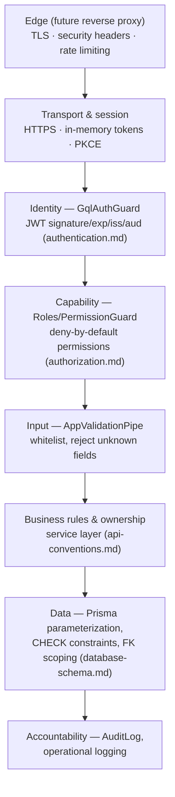

# SmartSense Marketplace — Security Guide

Version: 1.0

---

## Purpose

### Goals

- Consolidate the platform's **security posture in one place**: which threats are addressed, by which mechanism, at which layer — and, just as deliberately, which gaps are known, accepted for now, and scheduled.
- Own the security topics other documents explicitly deferred here: rate limiting ([graphql.md § 12](./graphql.md#12-security-considerations), [api-conventions.md § Security](./api-conventions.md#security)), security headers, CSP, CORS posture, and incident response.
- Serve as the security review companion: the [Security Checklist](#security-checklist) is the release gate's security section, expanded.

### Scope

This document is the **security program view** — it maps threats to controls and owns what no other document owns. Mechanisms documented elsewhere are referenced, never restated:

| Mechanism                                                                       | Owner                                                                                    |
| ------------------------------------------------------------------------------- | ---------------------------------------------------------------------------------------- |
| Identity, login flows, JWT validation, token/session lifecycle                  | [authentication.md](./authentication.md)                                                 |
| Roles, permissions, ownership scoping, deny-by-default enforcement              | [authorization.md](./authorization.md)                                                   |
| GraphQL-specific hardening (introspection, depth/complexity, persisted queries) | [graphql.md § 12](./graphql.md#12-security-considerations)                               |
| Secret injection, TLS, least privilege, image security at deploy time           | [deployment.md § Security During Deployment](./deployment.md#security-during-deployment) |
| Input validation layering (DTO → business → database)                           | [api-conventions.md § Validation Strategy](./api-conventions.md#validation-strategy)     |
| Security-relevant testing (authorization, injection, adversarial input)         | [testing.md § Security Testing](./testing.md#security-testing)                           |
| What may never be logged                                                        | [coding-standards.md § 11](./coding-standards.md#11-logging-standards)                   |

**Assumptions made explicit — the current gap register.** Verified against the code and configuration at the time of writing, not aspirational:

1. **CORS fails open by default**: `apps/api/src/main.ts` restricts CORS to a configured origin allowlist (`CORS_ALLOWED_ORIGINS`) **when one is set**, but falls back to a permissive, any-origin policy when it is unset — the dev default. The mechanism to lock it down exists; the gap is that the safe posture is opt-in rather than the default — see [CORS](#cors).
2. **Security headers and CSP are in place at the serving layers**: the API applies helmet baseline headers (HSTS, `X-Content-Type-Options`, `X-Frame-Options`) with CSP intentionally off there (`apps/api/src/main.ts` — the API serves no HTML), and the frontend's nginx serving layer (`apps/web/nginx.conf`) ships a real Content-Security-Policy plus `X-Content-Type-Options`, `X-Frame-Options`, and `Referrer-Policy`. This gap is closed for the containerized deployment; see [Security Headers](#security-headers), [CSP](#csp).
3. **No rate limiting** at any layer — see [Rate Limiting](#rate-limiting).
4. **No password policy** is set in the dev realm export (`passwordPolicy: null`), though Keycloak **brute-force protection is already enabled** (`bruteForceProtected: true`) and access tokens are 15 minutes — see [Password Policies](#password-policies).
5. **`sslRequired: none`** in the dev realm — a dev-only setting; production requires `external` at minimum ([HTTPS](#https)).
6. No deployed environment, monitoring, or incident tooling exists yet ([deployment.md](./deployment.md), Assumption 1) — [Incident Response](#incident-response) is a defined process awaiting infrastructure.

---

## Security Principles

The defense-in-depth stack, each layer denying independently:

| Principle                    | Applied as                                                                                                                                                                                         |
| ---------------------------- | -------------------------------------------------------------------------------------------------------------------------------------------------------------------------------------------------- |
| **Fail closed**              | Missing config aborts boot; unknown roles are ignored, not mapped; unauthenticated is the default state ([authorization.md § Security Considerations](./authorization.md#security-considerations)) |
| **Least privilege**          | Minimal role grants, scoped DB credentials, no dev toolchain in production images ([deployment.md](./deployment.md#security-during-deployment))                                                    |
| **Defense in depth**         | Every request crosses all eight layers above; no control assumes another one held                                                                                                                  |
| **Secure by default**        | A new resolver is protected without any decoration; opting _out_ (`@Public()`) is the explicit act                                                                                                 |
| **No security by obscurity** | Hiding UI, disabling introspection, and `NOT_FOUND`-on-ownership-miss are hardening on top of real controls, never the control itself                                                              |

---

## Authentication

Fully owned by [authentication.md](./authentication.md): Authorization Code + PKCE for the SPA, confidential client for the API, full JWT validation on every request, in-memory-only tokens, refresh rotation, single sign-out. Its [Security Best Practices Checklist](./authentication.md#security-best-practices-checklist) is incorporated into this document's [Security Checklist](#security-checklist) by reference.

## Authorization

Fully owned by [authorization.md](./authorization.md): deny-by-default permission model, capability-based checks, ownership scoping composed with permissions, the four-layer enforcement stack, and audit obligations for privileged actions.

---

## OWASP Top 10

Posture mapped against OWASP Top 10 (2021):

| #   | Category                                 | Posture                                                                                                                                                                                                                                                                                                                                                                                                                                               |
| --- | ---------------------------------------- | ----------------------------------------------------------------------------------------------------------------------------------------------------------------------------------------------------------------------------------------------------------------------------------------------------------------------------------------------------------------------------------------------------------------------------------------------------- |
| A01 | Broken Access Control                    | Strongest area: global guards, deny-by-default permissions, service-layer ownership, `NOT_FOUND` on cross-tenant reads ([authorization.md](./authorization.md)). Every new operation must keep it that way ([testing.md § Security Testing](./testing.md#security-testing)).                                                                                                                                                                          |
| A02 | Cryptographic Failures                   | Delegated: Keycloak signs RS256 JWTs, key distribution via JWKS; TLS at the future edge ([HTTPS](#https)). The app stores no credentials and does no hand-rolled crypto.                                                                                                                                                                                                                                                                              |
| A03 | Injection                                | Prisma parameterization by construction; the only raw SQL is migration DDL ([testing.md § Security Testing](./testing.md#security-testing)). XSS covered [below](#xss).                                                                                                                                                                                                                                                                               |
| A04 | Insecure Design                          | Mitigated by process: design-docs-first ([milestones.md § Engineering Philosophy](./milestones.md#engineering-philosophy)), threat-relevant open questions tracked explicitly, this gap register.                                                                                                                                                                                                                                                     |
| A05 | Security Misconfiguration                | **Improving, with two known residuals**: CORS fails open when its origin allowlist is unset (safe posture is opt-in, not default), and the dev realm carries dev-grade Keycloak settings — both listed in the gap register with owners ([Assumptions](#purpose)). Security headers and CSP are now served (helmet on the API, a full CSP + headers at the nginx SPA layer). Boot-time config validation prevents the silent-misconfiguration variant. |
| A06 | Vulnerable & Outdated Components         | Pinned majors; scanning not yet automated — see [Dependency Scanning](#dependency-scanning).                                                                                                                                                                                                                                                                                                                                                          |
| A07 | Identification & Authentication Failures | Keycloak-delegated; brute-force protection enabled; short-lived tokens; full claim validation ([authentication.md](./authentication.md)).                                                                                                                                                                                                                                                                                                             |
| A08 | Software & Data Integrity Failures       | Lockfile-only installs (`npm ci`), immutable release images, reviewed generated-schema diffs ([deployment.md § Build Process](./deployment.md#build-process)). CI pipeline hardening (signed artifacts) is future.                                                                                                                                                                                                                                    |
| A09 | Security Logging & Monitoring Failures   | Logging conventions exist; aggregation/alerting do not yet ([deployment.md § Monitoring](./deployment.md#monitoring)) — acknowledged gap until M20.                                                                                                                                                                                                                                                                                                   |
| A10 | Server-Side Request Forgery              | Minimal surface: the API's only outbound call is JWKS fetch to a configured, validated URL — never a user-supplied one. Revisit when webhooks/integrations arrive ([roadmap.md](./roadmap.md#future-product-vision)).                                                                                                                                                                                                                                 |

---

## XSS

- **Primary control:** React's default JSX escaping — all user-supplied content renders as text unless explicitly opted out. `dangerouslySetInnerHTML` is effectively banned: any proposed use requires a sanitization library and review, and none exists in the codebase today.
- **Secondary controls:** input validation server-side (nothing unvalidated is stored), and CSP once implemented ([CSP](#csp)) to blunt whatever slips through.
- **Token theft resistance:** even a successful XSS finds no tokens in `localStorage`/`sessionStorage` — tokens are in-memory only ([authentication.md § Session Management](./authentication.md#session-management)). XSS remains serious (it can act _as_ the user while the tab lives), which is why escaping and CSP still matter.

## CSRF

Largely mitigated **by architecture** rather than by tokens: the API authenticates via the `Authorization: Bearer` header, not cookies — a cross-site form/img request cannot attach the header, so classic CSRF has nothing to ride on. Residual surface: Keycloak's own session cookies on its own origin, protected by Keycloak's built-in CSRF countermeasures and exact-match redirect URIs ([authentication.md § Security Best Practices Checklist](./authentication.md#security-best-practices-checklist)). If cookie-based anything is ever introduced (e.g. a same-origin refresh proxy — an open question in [authentication.md](./authentication.md#open-questions)), CSRF protection must be designed in at that moment, not retrofitted.

## SQL Injection

Eliminated by construction for all application queries: Prisma Client parameterizes every value; string concatenation into queries does not occur. `queryRaw`/`executeRaw` are not used in application code — introducing one requires tagged-template parameterization and review. The hand-written migration SQL is DDL applied by operators, not a runtime input path ([testing.md § Security Testing](./testing.md#security-testing)).

## GraphQL Security

Owned by [graphql.md § 12 Security Considerations](./graphql.md#12-security-considerations): introspection/playground off in production, depth and complexity limits (planned, M19), persisted queries (future). This document adds the priority ruling: **depth/complexity limits are a launch prerequisite** (M19 gates v1.0 — [milestones.md](./milestones.md#milestone-details)), not an optimization — an unlimited-shape query API without them is a self-service denial-of-service endpoint.

## JWT Security

Validation mechanics (signature via JWKS, `exp`/`iss`/`aud`, clock tolerance, per-request `User.status` re-check) are owned by [authentication.md § JWT Validation](./authentication.md#jwt-validation). The hardening rules this document adds:

- **Algorithm confinement:** RS256 only — the strategy never accepts a token's self-declared `alg` beyond the configured one (kills `alg: none` / RS→HS confusion attacks).
- **Key rotation is operationally free:** keys are fetched by `kid` from the JWKS endpoint with a bounded cache TTL (`KEYCLOAK_JWKS_CACHE_TTL_SECONDS`, default 600s) — Keycloak can rotate signing keys with no API deploy; worst case is one cache-TTL window of overlap.
- **Tokens are bearer credentials:** never logged, never in URLs, never persisted ([coding-standards.md § 11](./coding-standards.md#11-logging-standards)).

## Secret Management

Owned by [deployment.md § Environment Configuration](./deployment.md#environment-configuration) and [§ Security During Deployment](./deployment.md#security-during-deployment): runtime injection from a secret store, never in Git/images/logs; the checked-in Compose values are dev-only placeholders by declaration. Rotation procedure: [deployment.md § Operational Runbooks](./deployment.md#operational-runbooks).

## Environment Variables

Owned by [deployment.md](./deployment.md#environment-configuration) (strategy) and [authentication.md § Required Environment Variables](./authentication.md#required-environment-variables) (auth tables). The security-relevant invariants: boot-time Joi validation fails closed on missing values; `VITE_*` values are public by definition — a secret prefixed `VITE_` is a leak the moment it's built, which is why the SPA is a public OIDC client with no secret at all.

## HTTPS

Owned by [deployment.md § Security During Deployment](./deployment.md#security-during-deployment): TLS everywhere beyond local dev, terminated at the future reverse proxy. This document adds the Keycloak-side requirement from the gap register: the production realm must set `sslRequired` to `external` (or `all`) — the dev export's `none` is a local convenience that must never ship, alongside `start` replacing `start-dev` ([deployment.md § Keycloak Deployment](./deployment.md#keycloak-deployment)).

## CSP

**Not implemented** (gap #2). Target policy, designed for this stack (SPA + GraphQL + Keycloak):

- Delivered at the serving layer (reverse proxy / static host) for the SPA — `default-src 'self'`; `connect-src 'self' <api-origin> <keycloak-origin>`; `frame-src <keycloak-origin>` only if iframe-based silent SSO is chosen ([authentication.md § Open Questions](./authentication.md#open-questions)); `object-src 'none'`; `frame-ancestors 'none'`.
- The practical constraint to plan for: Vite/Tailwind and a strict `style-src` interact (inline styles); the policy is tuned when the serving layer exists — but **shipping v1.0 without any CSP is not acceptable**; it lands with M20's security posture task ([TASKS.md M20-T7](./TASKS.md#milestone-task-breakdown)).

## CORS

**Currently wide open** (gap #1): `app.enableCors()` with no options reflects any origin. The target posture:

- Allowed origins become configuration (`CORS_ORIGINS`, comma-separated, validated by Joi like everything else) — exact origins per environment, no wildcards outside local dev, mirroring the exact-match redirect-URI rule ([authentication.md](./authentication.md#security-best-practices-checklist)).
- `credentials` stays disabled — auth is header-based, no cookies cross this boundary ([CSRF](#csrf)).
- Priority: must be fixed **before the first deployed environment**, not at v1.0 — an internet-reachable dev deployment with `*` CORS plus bearer tokens is an exfiltration convenience. Tracked under M20-T3's environment provisioning.

## Rate Limiting

**Not implemented at any layer** (gap #3) — this document owns the strategy the other documents deferred:

| Layer                          | Mechanism                                                       | Protects against                                                      |
| ------------------------------ | --------------------------------------------------------------- | --------------------------------------------------------------------- |
| Edge (reverse proxy) — primary | Per-IP request-rate caps                                        | Volumetric abuse, credential-stuffing traffic before it costs compute |
| Application — secondary        | `@nestjs/throttler`-style per-identity limits on `/graphql`     | Authenticated abuse an IP limit can't see (one user, many tokens/IPs) |
| Query cost — complementary     | Depth/complexity limits ([GraphQL Security](#graphql-security)) | Few-but-expensive requests that rate counts can't measure             |
| Identity — already active      | Keycloak brute-force protection (enabled)                       | Password guessing at the login surface                                |

Sequencing: edge limits arrive with the reverse proxy (M20-T3/T4); application-level limits are added when a measured need or launch review demands them; query-cost limits are M19. All three are complementary — none substitutes for another.

## Audit Logs

Owned by [authorization.md § Security Considerations](./authorization.md#security-considerations) (what is audited vs. operationally logged) and [domain-model.md § Audit Log](./domain-model.md#audit-log) (the immutable, actor-attributed entity). Security addition: audit rows are append-only **by schema design** (no `updatedAt`, no soft delete — [database-schema.md](./database-schema.md#design-conventions)), and `AuditLog` writes for privileged actions are part of an operation's definition of done ([authorization.md § Best Practices](./authorization.md#best-practices)) — an unaudited admin action is an incomplete feature, not a logging preference.

## Dependency Scanning

Target owned by [deployment.md § Security During Deployment](./deployment.md#security-during-deployment) (Dependabot/`npm audit` in CI). Until automated: `npm audit` runs as part of the monthly dependency batch ([TASKS.md § Maintenance Tasks](./TASKS.md#maintenance-tasks)), and critical advisories preempt the batch. The lockfile-only install rule (`npm ci`) already prevents the silent-drift variant of supply-chain exposure.

## Secure Coding

Owned by [coding-standards.md](./coding-standards.md) as a whole — strict types, banned `any`, validated inputs, no secrets in logs — plus [api-conventions.md](./api-conventions.md)'s fail-closed service conventions. The one addition: security-sensitive code (guards, strategies, permission logic, anything touching tokens) gets the elevated review treatment — guard-order changes and `@Public()` additions are explicitly called out in review rather than waved through as routine ([backend-architecture.md § Best Practices](./backend-architecture.md#best-practices)).

## Security Headers

**Not implemented** (gap #2). Target set, split by where each lands:

| Header                                | Value (target)                        | Layer                        |
| ------------------------------------- | ------------------------------------- | ---------------------------- |
| `Strict-Transport-Security`           | `max-age=31536000; includeSubDomains` | Reverse proxy                |
| `Content-Security-Policy`             | Per [CSP](#csp)                       | Reverse proxy / static host  |
| `X-Content-Type-Options`              | `nosniff`                             | Reverse proxy + API (helmet) |
| `X-Frame-Options` / `frame-ancestors` | `DENY` / `'none'`                     | Reverse proxy                |
| `Referrer-Policy`                     | `strict-origin-when-cross-origin`     | Reverse proxy                |
| `Permissions-Policy`                  | deny-by-default for unused features   | Reverse proxy                |

On the API itself, a helmet-style middleware supplies the applicable subset for the rare direct-API access path. Lands with M20-T7.

## Password Policies

**Owned entirely by Keycloak** — the application never sees, stores, or validates a password; there is no password field anywhere in the schema ([domain-model.md § User](./domain-model.md#user)). Current state and requirement:

- Dev realm: no `passwordPolicy` set (fine for seeded test users), brute-force protection **already enabled**.
- Production realm requirement (M20-T7 verification): an explicit policy (length ≥ 12, breached/common-password rejection where available), brute-force protection kept on, and MFA/OTP enabled at least for `Admin`-role users — all realm configuration changes per [deployment.md § Keycloak Deployment](./deployment.md#keycloak-deployment), no application code involved.

## Session Security

Owned by [authentication.md § Session Management](./authentication.md#session-management) and [§ Silent Refresh](./authentication.md#silent-refresh--token-refresh-strategy): in-memory access tokens, 15-minute lifespan, refresh rotation with reuse rejection, true single sign-out, per-request `User.status` re-check so a suspended user's session dies at the next request rather than at token expiry.

## Incident Response

No tooling exists yet (gap #6) — the process is defined now so the first incident isn't also the first draft:

1. **Detect & triage** — via monitoring/alerts once provisioned ([deployment.md § Monitoring](./deployment.md#monitoring)); until then, via report. Classify severity using the same scale as defects ([testing.md § Bug Reporting Guidelines](./testing.md#bug-reporting-guidelines)) with a security lens: suspected data exposure or auth bypass is always Critical.
2. **Contain** — the pre-authorized moves, decided now: revoke sessions realm-wide (Keycloak), rotate the affected secret ([deployment.md § Operational Runbooks](./deployment.md#operational-runbooks)), disable the affected `@Public()` surface or take the deployment offline. Containment does not wait for root cause.
3. **Eradicate & recover** — fix forward through the standard pipeline (hotfix process, [deployment.md § Release Strategy](./deployment.md#release-strategy)); restore data from backups only if integrity was affected.
4. **Post-incident** — a blameless write-up; every incident yields at least one regression test ([testing.md § Regression Testing](./testing.md#regression-testing)) and one gap-register/checklist update in this document.

Ownership: the project lead is incident owner until a rotation exists. `AuditLog` plus aggregated logs (with future correlation IDs) are the forensic record — which is itself a reason TD-6 ([TASKS.md](./TASKS.md#technical-debt)) matters beyond debugging convenience.

---

## Security Checklist

Consolidated release-gate security section — each line's detail lives in its owning document:

- [ ] [authentication.md § Security Best Practices Checklist](./authentication.md#security-best-practices-checklist) passes in full (PKCE, in-memory tokens, claim validation, rotation, sign-out, redirect URIs, secret sourcing, DB isolation).
- [ ] Every new operation: default-protected, permission-declared, ownership-scoped, audit-logged where privileged ([authorization.md § Best Practices](./authorization.md#best-practices)).
- [ ] `GRAPHQL_INTROSPECTION=false`, `GRAPHQL_PLAYGROUND=false` in production ([graphql.md § 12](./graphql.md#12-security-considerations)).
- [ ] CORS restricted to the environment's exact origins — no `*` beyond local dev ([CORS](#cors)).
- [ ] Security headers + CSP served; verified against the target table ([Security Headers](#security-headers)).
- [ ] Rate limiting active at the edge; depth/complexity limits active at the API ([Rate Limiting](#rate-limiting)).
- [ ] Keycloak production posture: `start` (not `start-dev`), `sslRequired ≠ none`, password policy set, brute-force protection on, Admin MFA ([Password Policies](#password-policies)).
- [ ] No dev-placeholder secret anywhere in the environment ([deployment.md § Best Practices](./deployment.md#best-practices)).
- [ ] `npm audit` clean of criticals; image scan clean once wired ([Dependency Scanning](#dependency-scanning)).
- [ ] Adversarial-input and authorization test suites green ([testing.md § Security Testing](./testing.md#security-testing)).
- [ ] Incident contacts and containment runbook entries current ([Incident Response](#incident-response)).

## Future Security Enhancements

The scheduled items live in the gap register and their milestones (CORS/M20-T3, headers+CSP+realm posture/M20-T7, rate limiting/M20+M19, dependency scanning/CI). Beyond those:

- **Persisted queries** — production locked to a known-good operation allow-list ([graphql.md § 17](./graphql.md#17-future-enhancements)); the strongest GraphQL hardening available once the client's operation set stabilizes.
- **MFA broadly** (beyond Admin) and WebAuthn/passkeys — Keycloak-native, zero application code; product decision on friction vs. assurance.
- **Secrets manager with automatic rotation** — upgrade from static injected secrets once hosting is chosen ([deployment.md](./deployment.md#security-during-deployment)).
- **Supply-chain hardening** — image signing/provenance (SLSA-style) and CI artifact attestation, after basic scanning is in place.
- **Penetration test** — an external assessment against the v1.0 candidate before production carries real Partner data; findings feed this document's gap register.
- **`docs/security.md` review cadence** — this document joins the release-boundary reconciliation ([TASKS.md § Maintenance Tasks](./TASKS.md#maintenance-tasks)): every release either confirms the gap register shrank or documents why not.
