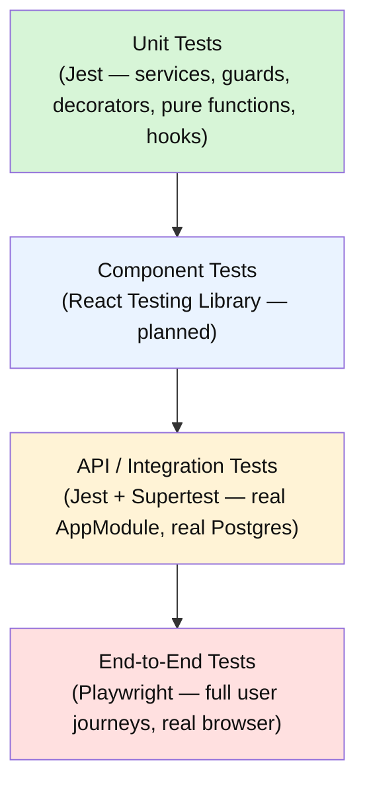
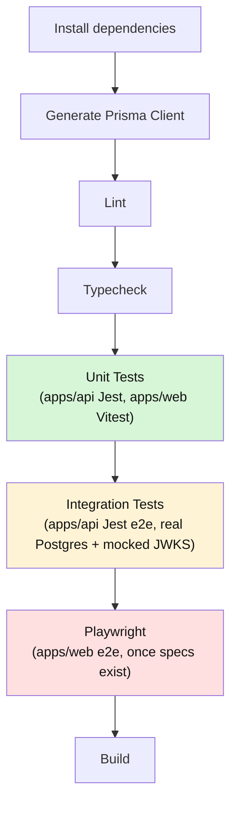

# SmartSense Marketplace — Testing Strategy & Quality Assurance Guide

Version: 1.0

---

## Purpose

### Goals

- Give every engineer one answer to "how should this be tested" regardless of whether the change is a resolver, a guard, a component, or a full user flow.
- Make critical functionality — authentication, authorization, business rules, financial calculations — provably correct via automated tests, not verified by hand each release.
- Keep the cost of testing proportional to the risk being covered: a pure utility function gets a fast unit test; a cross-cutting security boundary gets both a unit test and an integration test; a full user journey gets an end-to-end test — not everything gets the heaviest tool by default.

### Scope

This document defines the **testing strategy and quality assurance process** for SmartSense Marketplace: what gets tested, at which layer, with which tool, and what "done" means for test coverage. It does not repeat conventions already owned elsewhere — read those first:

| Already covered elsewhere                                                                  | See                                          |
| ------------------------------------------------------------------------------------------ | -------------------------------------------- |
| General coding standards, the Definition of Done, the code review checklist                | [coding-standards.md](./coding-standards.md) |
| Backend layer responsibilities (Resolver/Service/Repository), error handling, transactions | [api-conventions.md](./api-conventions.md)   |
| UI component hierarchy, accessibility design expectations, states (Loading/Empty/Error)    | [ui-guidelines.md](./ui-guidelines.md)       |
| JWT validation, guard chain, roles/permissions, session/token lifecycle                    | [authentication.md](./authentication.md)     |
| GraphQL schema design, query/mutation conventions, error code mapping                      | [graphql.md](./graphql.md)                   |
| Domain entities and business rules being verified                                          | [domain-model.md](./domain-model.md)         |
| Prisma schema, constraints, migrations being verified                                      | [database-schema.md](./database-schema.md)   |

**Assumption made explicit — current tooling state.** At the time of writing: `apps/api` has a working Jest unit-test suite (real specs exist under `apps/api/src/modules/auth/`) and one Jest-based end-to-end integration test (`apps/api/test/auth.e2e-spec.ts`, run via `npm run test:e2e -w @smartsense/api`). `apps/web` has Playwright configured (`apps/web/playwright.config.ts`) with real specs under `apps/web/e2e/auth/`, and — as of M10 — Vitest + React Testing Library + `jest-axe` (`apps/web/vitest.config.ts`, `npm run test -w @smartsense/web`), used for the shared component library's tests. This document defines the target strategy across all these layers and states plainly, section by section, which parts are implemented today versus pending — it is not a description of a fully built-out suite.

### Testing Philosophy

- **Test behavior, not implementation.** A test verifies what a unit does (a Service rejects an inactive user; a component renders an error state), not how it does it internally — refactoring an implementation should not break its tests if the observable behavior is unchanged.
- **Critical functionality is non-negotiable.** Per [CLAUDE.md](../CLAUDE.md) ("Add tests for critical functionality"), authentication, authorization, and financial/business-rule logic always have automated coverage before merge — this is the one area where "we'll add tests later" is not an acceptable trade-off.
- **The right tool for the layer.** A fast, isolated unit test is preferred wherever it can prove correctness; a slower integration or end-to-end test is used only where an isolated unit test cannot prove the thing that actually matters (e.g. that the full guard chain really rejects an invalid JWT against a real Postgres-backed user).
- **A failing test blocks merge, always.** There is no "known flaky, ignore it" state tolerated in this codebase — a flaky test is a bug in the test (or the code) to be fixed, not silenced.

---

## Testing Pyramid



The pyramid is read bottom-up by volume and speed: most tests are unit tests (fast, cheap, isolated); progressively fewer tests exist at each higher layer (slower, more integrated, more expensive to maintain) — the inverse of that shape (many slow end-to-end tests, few unit tests) is the anti-pattern this structure exists to avoid (see [Anti-Patterns](#anti-patterns)).

| Layer                       | Tool                                | Verifies                                                                                           | Current status                                                                    |
| --------------------------- | ----------------------------------- | -------------------------------------------------------------------------------------------------- | --------------------------------------------------------------------------------- |
| **Unit Tests**              | Jest (backend); none yet (frontend) | A single function/class/hook in isolation, all dependencies mocked                                 | Implemented on backend (`apps/api/src/**/*.spec.ts`); not yet started on frontend |
| **Component Tests**         | React Testing Library (planned)     | A single React component's rendered output and interaction behavior, in isolation from the network | Not yet implemented — see [Frontend Testing](#frontend-testing)                   |
| **Integration / API Tests** | Jest + Supertest (backend)          | Multiple real units composed together — resolver → guard → service → real Prisma/Postgres          | Implemented (`apps/api/test/*.e2e-spec.ts`)                                       |
| **End-to-End Tests**        | Playwright                          | A full user journey through the real, running frontend and backend, in a real browser              | Configured, no specs written yet ([End-to-End Testing](#end-to-end-testing))      |

---

## Testing Strategy

### Overall Strategy

Every change is tested at the **lowest layer that can actually prove the thing that matters**, and additionally at a higher layer only when a lower layer structurally cannot verify the property in question (e.g. a unit test can prove a Guard's logic given a fake context, but only an integration test can prove the guard chain's _registration order_ actually holds against a real request, per [authentication.md](./authentication.md#backend-auth-module-responsibilities)'s ordering requirement).

### Layer Responsibility

| Concern                                                                                       | Primary responsible layer                                                                                 |
| --------------------------------------------------------------------------------------------- | --------------------------------------------------------------------------------------------------------- |
| A pure function's correctness (a formatter, a mapper, a validator helper)                     | Unit test                                                                                                 |
| A Service's business logic, given mocked Prisma/dependencies                                  | Unit test ([Backend Testing § Service Testing](#service-testing))                                         |
| A Guard's authorization decision, given a fake execution context                              | Unit test ([Backend Testing § Guard Testing](#guard-testing))                                             |
| A React component's rendered states and user interaction                                      | Component test ([Frontend Testing](#frontend-testing))                                                    |
| The full guard chain + JWT validation + Prisma, wired together for real                       | Integration test ([Backend Testing](#backend-testing), [Authentication Testing](#authentication-testing)) |
| A GraphQL operation's shape, error codes, and authorization as actually exposed by the schema | Integration test ([GraphQL Testing](#graphql-testing))                                                    |
| A complete user journey across pages, real network calls, real browser rendering              | End-to-end test ([End-to-End Testing](#end-to-end-testing))                                               |

---

## Frontend Testing

### React Testing Library

Installed as of M10 (`apps/web/package.json`'s `@testing-library/react`/`jest-dom`/`user-event`, configured in `apps/web/vitest.config.ts`). RTL's guiding principle — query and interact with components the way a user would (by role, label, and text, not by internal implementation detail or CSS class) — is the project's default testing style, consistent with this document's "test behavior, not implementation" philosophy. Naming follows the project's one documented convention ([coding-standards.md § Naming Conventions](./coding-standards.md#naming-conventions)): `*.spec.tsx`, colocated with the component, not `*.test.tsx`.

### Component Testing

A component test renders the component in isolation (mocking Apollo/GraphQL responses per [Mocking Strategy § GraphQL Mocking](#graphql-mocking) for feature-level components; shared UI primitives have no data dependency to mock) and asserts on what a user would see/do:

```tsx
test('renders the empty state when there are no orders', () => {
  render(<OrdersListPage />, { apolloMocks: [emptyOrdersMock] })
  expect(screen.getByText(/no orders yet/i)).toBeInTheDocument()
})
```

Every shared component in `apps/web/src/shared/components`/`shared/layouts` ([ui-guidelines.md § Component Hierarchy](./ui-guidelines.md#component-hierarchy)) has a component test covering its documented states (default, loading, disabled, error, per [ui-guidelines.md](./ui-guidelines.md)'s per-component sections) plus a `jest-axe` `toHaveNoViolations()` check, established with the M10 component set. Feature-level components (`ProductCard`, `OrderTimeline`, etc.) follow the same pattern as they're built.

### Hook Testing

A custom hook ([folder-structure.md § features — Feature Modules](./folder-structure.md#features--feature-modules)) is tested via React Testing Library's `renderHook`, asserting on its returned value/state transitions rather than rendering a full component around it purely to exercise the hook.

### Form Testing

A form's test covers, at minimum: the validation-error path (submitting invalid input surfaces the expected message, per [ui-guidelines.md § Forms § Error Messages](./ui-guidelines.md#error-messages)), the success path (valid input calls the expected mutation with the expected variables), and the loading/disabled path during submission ([ui-guidelines.md § Forms § Loading States](./ui-guidelines.md#loading-states)) — not just that the form "renders."

### Accessibility Testing

Automated accessibility checks (e.g. `jest-axe` or Playwright's accessibility snapshot assertions, once either is introduced) run against shared components and key pages, checking for the structural violations a screen-reader/keyboard user would hit (missing labels, insufficient contrast where computable, missing focus management) — this is a mechanical floor, not a replacement for the design-level accessibility review already required by [ui-guidelines.md § Accessibility](./ui-guidelines.md#accessibility). Manual keyboard-only and screen-reader spot checks remain necessary for anything an automated tool cannot evaluate (logical tab order, meaningful announcement of dynamic content).

### Snapshot Policy

**Snapshot tests are not used for component output.** A full-render snapshot (`toMatchSnapshot()` on rendered markup) tends to be updated reflexively on every visual change without the reviewer actually verifying the new output is correct — it fails "test behavior, not implementation" by asserting on exact markup structure rather than user-observable behavior. Prefer explicit assertions (`getByRole`, `getByText`, prop/state checks) that state what is actually expected. The one acceptable use of snapshotting is a small, stable, non-visual data structure (e.g. a mapping function's output shape) where a snapshot is genuinely reviewing meaningful structured data.

### Mocking Strategy (Frontend)

See [Mocking Strategy § GraphQL Mocking](#graphql-mocking) below for the Apollo-specific approach — summarized here as the frontend-testing entry point: a component/hook test never hits a real GraphQL endpoint; it supplies mocked operation responses matching the component's actual `.graphql` documents.

---

## Backend Testing

Backend unit tests already exist and establish the project's actual conventions — this section documents the pattern in place, not a proposal.

### Service Testing

A Service is tested with its dependencies (`PrismaService`, other injected services, `LoggingService`) replaced by plain Jest mock objects and instantiated directly with `new` — **not** via Nest's `Test.createTestingModule()`, which is reserved for integration tests (see [database-schema.md](./database-schema.md) references and business rules under test). This keeps a Service unit test fast and focused purely on its own logic:

```ts
// Established pattern — apps/api/src/modules/auth/auth.service.spec.ts
let prisma: { user: { findUnique: jest.Mock; update: jest.Mock } /* ... */ }
let service: AuthService

beforeEach(() => {
  prisma = { user: { findUnique: jest.fn(), update: jest.fn() } /* ... */ }
  service = new AuthService(
    prisma as never,
    permissionService as unknown as PermissionService,
    logger as never,
  )
})

it('rejects a user whose status is not ACTIVE', async () => {
  prisma.user.findUnique.mockResolvedValue({ ...activeUser, status: UserStatus.SUSPENDED })
  await expect(service.validateAndProvisionUser(payload)).rejects.toThrow(UnauthorizedException)
})
```

A Service test asserts on: the returned value for each meaningful input, the exact exception thrown for each failure path ([api-conventions.md § Error Handling Strategy](./api-conventions.md#error-handling-strategy)), and any Prisma call made with the expected arguments (`expect(prisma.user.update).toHaveBeenCalledWith(...)`) where the _fact that a call happened correctly_ is itself the behavior under test (e.g. role-sync upserts).

### Resolver Testing

A resolver is intentionally thin ([api-conventions.md § Layer Responsibilities](./api-conventions.md#layer-responsibilities)) — its unit test, where one is warranted, asserts only that it delegates to the correct service method with the correct arguments and returns that method's result unchanged. A resolver with no branching logic of its own (the common case) does not need a dedicated unit test at all if it is already exercised by a [GraphQL Testing](#graphql-testing) integration test — writing both would test the same delegation twice.

### Guard Testing

Guards are tested with a minimal fake `ExecutionContext`, established by `RolesGuard`'s spec:

```ts
// Established pattern — apps/api/src/modules/auth/guards/roles.guard.spec.ts
function fakeGqlContext(user: AuthenticatedUser | undefined): ExecutionContext {
  return {
    getType: () => 'graphql',
    getArgs: () => [undefined, undefined, { req: { user } }, undefined],
    getClass: () => class {},
    getHandler: () => function handler() {},
  } as unknown as ExecutionContext
}
```

A guard test covers: no metadata declared (guard is a no-op, per [authentication.md](./authentication.md#graphql-authentication)), metadata declared and satisfied (allows), metadata declared and unsatisfied (throws the correct exception — `ForbiddenException` for `RolesGuard`/`PermissionGuard`). Custom decorators (`@Public()`, `@Roles()`, `@Permissions()`) are tested directly against a real `Reflector`, verifying the metadata key/value they set — see `decorators.spec.ts` for the established pattern.

### Validation Testing

DTO validation (`class-validator` decorators, enforced by `AppValidationPipe`) is tested by constructing an instance of the DTO with invalid data and running it through `class-validator`'s `validate()` directly, asserting on which constraint(s) fail — this tests the DTO's own declared rules without needing to boot the full Nest application (reserve that for the integration-level check that the pipe is actually wired in, per [Backend Testing § below](#error-handling-testing)).

### Error Handling Testing

`GlobalExceptionFilter`'s exception-to-`extensions.code` mapping ([graphql.md § 11 Error Handling](./graphql.md#11-error-handling)) is tested directly: construct the filter, invoke `catch()` with each exception type the mapping table declares (`NotFoundException`, `UnauthorizedException`, `ForbiddenException`, `BadRequestException`, an unrecognized `Error`), and assert the resulting `GraphQLError`'s `extensions.code` matches the documented value for each. A Service's own Prisma-error translation (`P2002`/`P2025`/`P2003` → typed exception, per [api-conventions.md § Error Handling Strategy](./api-conventions.md#error-handling-strategy)) is tested at the Service level, alongside that Service's other unit tests.

### Repository Testing

Per [api-conventions.md § Request Lifecycle](./api-conventions.md#request-lifecycle)'s explicit assumption, this codebase has no dedicated Repository class today — "Repository" is a Service's own Prisma calls. There is therefore no separate repository-testing tier; Prisma interaction is verified either as part of a Service's mocked-Prisma unit test (the call was made correctly) or as part of an integration test (the call produces the correct result against real Postgres, per [Database Testing](#database-testing)). If a dedicated Repository class is introduced later (per that document's stated threshold), it is tested the same way a Service is: unit-tested with a mocked `PrismaService`, integration-tested against real Postgres for anything query-shape-sensitive.

---

## GraphQL Testing

GraphQL-specific integration tests exercise the schema as a client actually would — sending a GraphQL document string over HTTP (via Supertest, against a real, fully-bootstrapped `AppModule`) rather than calling a resolver method directly in TypeScript, since the goal is to verify what the schema actually exposes and enforces, not just the resolver function's return value.

### Query Testing

Send the query document, assert on the shape and values of `response.body.data`. For a field marked `@Public()`, verify it succeeds with no `Authorization` header (e.g. `authStatus`, `catalogStatus` in the current schema).

### Mutation Testing

Same approach — send the mutation document with variables, assert on the returned payload. Once real mutations exist ([graphql.md § 3 Schema Organization](./graphql.md#future-subscription-support) notes today's schema is placeholder-only), a mutation test also asserts the resulting database state changed as expected (a following query, or a direct Prisma read in the test, confirms persistence) — a mutation test that only checks the GraphQL response and never verifies the actual write occurred is incomplete.

### Error Testing

For each operation, test at least one failure path and assert on `response.body.errors[0].extensions.code` matching the table in [graphql.md § 11 Error Handling](./graphql.md#11-error-handling) — e.g. requesting a nonexistent entity returns `NOT_FOUND`, an invalid input returns `BAD_USER_INPUT`.

### Authorization Testing

The established pattern, from `apps/api/test/auth.e2e-spec.ts`: boot the real `AppModule` against a real Postgres test database, stand up a throwaway local HTTP server serving a JWKS document for a self-generated RSA test key pair (replacing Keycloak, per [authentication.md](./authentication.md)'s note on CI using mocked, signed JWTs rather than a live Keycloak instance), and sign test tokens with that key:

```ts
// Established pattern — apps/api/test/auth.e2e-spec.ts
function signToken(overrides: Partial<Record<string, unknown>> = {}): string {
  const payload = { sub: '...', iss: issuer, aud: audience, realm_access: { roles: ['Admin'] }, /* ... */, ...overrides }
  return jwt.sign(payload, privateKey.export({ type: 'pkcs1', format: 'pem' }), { algorithm: 'RS256', keyid: KEY_ID })
}
```

This exercises the _real_ `GqlAuthGuard` → `RolesGuard` → `PermissionGuard` chain, `JwtStrategy`'s signature/`exp`/`iss`/`aud` checks, and `AuthService`'s database-backed user resolution — nothing about JWT validation is mocked, only the identity provider's network endpoint is. Test cases to cover for every protected operation: no token (`UNAUTHENTICATED`), expired token, invalid signature, wrong `aud`/`iss`, valid token but insufficient role/permission (`FORBIDDEN`), valid token and sufficient role/permission (success).

### Pagination Testing

Once real paginated queries exist ([api-conventions.md § Pagination Strategy](./api-conventions.md#pagination-strategy)): seed a known number of rows, request a page smaller than the total, and assert on `pageInfo.hasNextPage`, the returned `edges` count, and that following `after: pageInfo.endCursor` returns the next, non-overlapping page — the property under test is that paging through every page exactly once returns every seeded row with no duplicates or gaps.

---

## Database Testing

### Prisma Testing

Prisma Client itself is not unit-tested (it's generated, typed, and already covered by Prisma's own test suite upstream) — what's tested is _this project's_ usage of it: query shape, `where`/`include` correctness, and the Service-level translation of Prisma errors ([api-conventions.md § Error Handling Strategy](./api-conventions.md#error-handling-strategy)), all via integration tests against a real database rather than a mocked Prisma client, since a mock cannot verify that a query is actually valid SQL or that a constraint actually fires.

### Migration Testing

A new migration is verified before merge the same way the initial schema's hand-added constraints were ([database-schema.md § Constraints Added by Hand to the Migration](./database-schema.md#constraints-added-by-hand-to-the-migration)): applied to a scratch database and exercised with both valid and invalid data to confirm it enforces exactly the intended rule — a constraint that doesn't actually reject bad data is treated as a bug in the migration, not a passing state.

### Seed Verification

`database/prisma/seed.ts` is verified by running it against a clean test database and asserting the expected reference rows exist (system Roles, Permissions, the seed admin user referenced in [authentication.md](./authentication.md)) — this can be a lightweight integration test run as part of the test-database setup step ([Test Environment](#test-environment)) rather than a separate suite.

### Transaction Testing

Per [api-conventions.md § Transactions](./api-conventions.md#transactions): a transactional Service method is tested by forcing a failure partway through the sequence (e.g. mocking the second write to throw) and asserting that the first write's effect was rolled back — provable only against a real database, since a fully mocked Prisma client cannot demonstrate real rollback semantics.

### Test Database Strategy

Integration/e2e tests run against a real, disposable PostgreSQL instance — the same engine version as production ([database-schema.md](./database-schema.md) targets PostgreSQL 17) — never an in-memory or SQLite substitute, since this project relies on Postgres-specific features (native enums, `jsonb`, `CHECK`/exclusion constraints, per [database-schema.md § Design Conventions](./database-schema.md#design-conventions)) that a different engine cannot faithfully emulate. Locally and in CI, this is the same `db` service already defined in `infrastructure/docker/docker-compose.yml` / `apps/api/docker-compose.yml`, pointed at by a test-specific `DATABASE_URL`. Each test run either runs against a freshly migrated, empty database or cleans up its own created rows — see [Test Data Strategy § Test Isolation](#test-isolation).

---

## Authentication Testing

Full mechanics owned by [authentication.md](./authentication.md) — this section states what must be covered by tests, not how the mechanism itself works.

| Scenario               | Coverage expectation                                                                                                                                                                                                                                                                         |
| ---------------------- | -------------------------------------------------------------------------------------------------------------------------------------------------------------------------------------------------------------------------------------------------------------------------------------------- |
| **Login**              | Frontend: the login route redirects to Keycloak with the correct client/realm (component or e2e test, once frontend auth exists). Backend: not directly applicable — the backend never handles credentials, per [authentication.md](./authentication.md#complete-authentication-flow-login). |
| **Logout**             | End-to-end: logging out clears the in-memory session and redirects per Keycloak's end-session flow ([authentication.md § Logout Flow](./authentication.md#logout-flow)).                                                                                                                     |
| **Token validation**   | Integration: a validly signed, non-expired token with correct `iss`/`aud` is accepted — see [GraphQL Testing § Authorization Testing](#authorization-testing) pattern.                                                                                                                       |
| **Expired tokens**     | Integration: a token with `exp` in the past is rejected with `UNAUTHENTICATED`, within the configured clock-tolerance window ([authentication.md § Required Environment Variables](./authentication.md#required-environment-variables), `JWT_CLOCK_TOLERANCE_SECONDS`).                      |
| **Invalid tokens**     | Integration: a token signed with a key not present in the JWKS response, a malformed token, and a token with a mismatched `aud`/`iss` are each rejected with `UNAUTHENTICATED`.                                                                                                              |
| **Authorization**      | Integration: a valid token lacking a required role is rejected with `FORBIDDEN` by `RolesGuard` ([Backend Testing § Guard Testing](#guard-testing) for the unit-level equivalent).                                                                                                           |
| **Permission testing** | Integration and unit: `PermissionService.can`/`canAll` unit-tested directly for AND-semantics correctness; enforcement via `PermissionGuard` covered the same way as role authorization above.                                                                                               |

---

## End-to-End Testing

### Playwright Strategy

Playwright is configured (`apps/web/playwright.config.ts`: Chromium + Firefox projects, retries on CI, HTML + list reporters, auto-starts the dev server) but **no test specs exist yet** — `apps/web/e2e/` currently contains only a placeholder. This section defines the target suite structure for when specs are written, organized by the product modules already defined in [requirements.md § Modules](./requirements.md#modules):

```
apps/web/e2e/
├── auth/            # login, logout, session expiry, protected-route redirects
├── dashboard/       # overview loads, key stats render
├── catalog/         # product CRUD, search/filter, category navigation
├── orders/          # order list, order detail, status transitions
├── billing/         # invoice list, invoice detail, payment status
└── reports/         # report generation/download, once the Billing module supports it
```

Each spec file follows the [coding-standards.md § Naming Conventions](./coding-standards.md#8-naming-conventions) test-file pattern (`<subject>.spec.ts`) and, per [architecture.md § Testing Strategy](./architecture.md#testing-strategy), uses the Page Object Model to keep selectors and page-navigation logic out of the test assertions themselves.

### Coverage by Module

| Module                  | Key scenarios                                                                                                                                                                                                                                                                                          |
| ----------------------- | ------------------------------------------------------------------------------------------------------------------------------------------------------------------------------------------------------------------------------------------------------------------------------------------------------ |
| **Authentication Flow** | Unauthenticated user redirected to login; successful login lands on the role-appropriate default page; session-expiry mid-use redirects to `/unauthorized` ([ui-guidelines.md § Error Pages](./ui-guidelines.md#error-pages)); logout clears session and blocks back-navigation into protected routes. |
| **Dashboard**           | Loads and renders for each role; empty/loading/error states render correctly for a dashboard with no data yet.                                                                                                                                                                                         |
| **Catalog**             | Create/edit/deactivate a Product; search and filter return expected results; category navigation reflects the taxonomy ([domain-model.md § Catalog Management](./domain-model.md#catalog-management)).                                                                                                 |
| **Orders**              | Create an Order (once implemented); Order status transitions follow the lifecycle in [domain-model.md § Order Lifecycle](./domain-model.md#order-lifecycle); an unauthorized status transition is rejected end-to-end.                                                                                 |
| **Billing**             | Invoice list/detail render correctly; a Payment against an Invoice updates its status; permission-scoped visibility (a Partner sees only their own Invoices).                                                                                                                                          |
| **Reports**             | Report generation completes and produces a downloadable artifact, once the Billing module's reporting capability exists.                                                                                                                                                                               |

### Testing Scenarios (Cross-Cutting)

Regardless of module, every end-to-end suite includes at least one scenario per: the happy path, a permission-denied path (an authenticated user without the required role attempting the action), and a validation-failure path (submitting invalid form input, per [ui-guidelines.md § Forms](./ui-guidelines.md#forms)) — matching the "all four states are designed" principle from [ui-guidelines.md § Design Philosophy](./ui-guidelines.md#design-philosophy) applied to test coverage instead of just visual design.

---

## Test Data Strategy

| Concept            | Convention                                                                                                                                                                                                                                                                                                                                                                                                  |
| ------------------ | ----------------------------------------------------------------------------------------------------------------------------------------------------------------------------------------------------------------------------------------------------------------------------------------------------------------------------------------------------------------------------------------------------------- |
| **Fixtures**       | Small, static, hand-authored data objects used directly in a unit test (e.g. `activeUser` in `auth.service.spec.ts`) — used when the exact shape matters and there are few variations needed.                                                                                                                                                                                                               |
| **Factories**      | A function generating a valid entity with sensible defaults and overridable fields (e.g. `buildOrder({ status: 'CANCELLED' })`), preferred over fixtures once a test suite needs many slightly-varied instances of the same entity — not yet established in this codebase but the recommended pattern once integration/e2e tests grow beyond a handful of fixtures.                                         |
| **Seed data**      | `database/prisma/seed.ts` provides the baseline reference data (system Roles, Permissions, the seed admin) that integration tests can rely on existing — see [database-schema.md § Seed Data](./database-schema.md#seed-data). Tests must not assume additional data beyond what the seed script guarantees.                                                                                                |
| **Mock data**      | GraphQL response mocks for frontend component tests ([Mocking Strategy § GraphQL Mocking](#graphql-mocking)) — shaped to match the actual generated types from [graphql.md § 10 GraphQL Code Generator](./graphql.md#10-graphql-code-generator), never a hand-typed object that could drift from the real schema.                                                                                           |
| **Test isolation** | Every integration/e2e test either creates and cleans up its own rows (the pattern in `auth.e2e-spec.ts`, which creates a scoped test user and tears it down in `afterAll`) or runs inside a transaction that is rolled back at the end of the test — no test may depend on execution order or leave state that affects a later test. Parallel test execution must be safe by construction, not by accident. |

---

## Mocking Strategy

| What                       | How                                                                                                                                                                                                                                                                                                                        | Used by                                  |
| -------------------------- | -------------------------------------------------------------------------------------------------------------------------------------------------------------------------------------------------------------------------------------------------------------------------------------------------------------------------- | ---------------------------------------- |
| **GraphQL mocking**        | Apollo's `MockedProvider` (or equivalent) supplying typed mock responses per operation document, matching generated types ([graphql.md § 10](./graphql.md#10-graphql-code-generator)) — never a hand-shaped plain object standing in for a query result.                                                                   | Frontend component/hook tests            |
| **API mocking**            | Not used for backend integration tests — those run against a real, running `AppModule`. Reserved for the rare frontend scenario needing to simulate a raw network failure/timeout at the HTTP layer rather than a GraphQL-shaped error.                                                                                    | Frontend, network-failure scenarios only |
| **Database mocking**       | Plain Jest mock objects (`{ findUnique: jest.fn(), ... }`) for Service **unit** tests ([Backend Testing § Service Testing](#service-testing)) — never used for anything claiming to be an integration test, which must run against real Postgres per [Database Testing § Test Database Strategy](#test-database-strategy). | Backend unit tests                       |
| **Authentication mocking** | Self-signed RSA test key pair + a local throwaway JWKS HTTP server, exactly as established in `auth.e2e-spec.ts` — the token issuance path is faked, but signature/claim validation runs for real. Never a bypassed/disabled guard "for testing."                                                                          | Backend integration tests                |
| **External services**      | Keycloak is the only current external service dependency, mocked as above. Any future third-party integration (payment processor, storage/CDN) follows the same principle: fake the network boundary, exercise the real validation/business logic behind it.                                                               | Any future external integration          |

---

## Test Environment

| Environment        | Description                                                                                                                                                                                                                                                                                                                                                                                                                                                                |
| ------------------ | -------------------------------------------------------------------------------------------------------------------------------------------------------------------------------------------------------------------------------------------------------------------------------------------------------------------------------------------------------------------------------------------------------------------------------------------------------------------------- |
| **Local**          | A developer runs `npm run test`/`test:e2e` against the Dockerized `db`/`keycloak` services from `infrastructure/docker/docker-compose.yml` or `apps/api/docker-compose.yml` ([keycloak-setup.md § Docker Architecture](./keycloak-setup.md#docker-architecture)) — or, for backend integration tests, the mocked-JWKS approach above, which needs no live Keycloak at all.                                                                                                 |
| **CI**             | GitHub Actions (`.github/workflows/ci.yml`). **Current state:** the pipeline runs install → Prisma client generation → lint → typecheck → build; it does **not** currently invoke `npm run test` or `npm run test:e2e` for either workspace. This is a stated, current gap — see [CI Testing Pipeline](#ci-testing-pipeline) for the target pipeline this should evolve into, and treat closing this gap as a near-term priority rather than an aspirational future state. |
| **Future Staging** | Not yet provisioned — [deployment.md](./deployment.md) is itself still a placeholder document at time of writing. Once a staging environment exists, it is the target for end-to-end smoke tests run against a real deployed instance (as opposed to CI's ephemeral, locally-orchestrated services), verifying the deployed build in an environment closer to production.                                                                                                  |

---

## Code Coverage

### Coverage Goals

| Area                                                       | Target                                                                                                                                                                            |
| ---------------------------------------------------------- | --------------------------------------------------------------------------------------------------------------------------------------------------------------------------------- |
| Guards, Services implementing business/authorization logic | High coverage, effectively exhaustive over branches — these are exactly the "critical functionality" [CLAUDE.md](../CLAUDE.md) requires tests for.                                |
| DTOs, simple mapping/formatting utilities                  | Covered incidentally through the tests of what consumes them; a dedicated 100% target is not pursued for trivial pass-through code.                                               |
| Resolvers with no branching logic                          | Covered by the integration/GraphQL test layer, not necessarily a dedicated unit test — see [Backend Testing § Resolver Testing](#resolver-testing).                               |
| Overall project-wide percentage                            | No single blanket percentage threshold is mandated. Coverage is a diagnostic for finding untested critical paths, not a target to game by adding low-value tests to trivial code. |

### Critical Paths

Always covered, regardless of overall coverage percentage: JWT validation and every guard's allow/deny branches ([authentication.md](./authentication.md)), any business rule enforced only in the Service layer because it cannot be expressed as a database constraint ([database-schema.md § Constraints Not Enforceable at the Database Level](./database-schema.md#constraints-not-enforceable-at-the-database-level)), and any financial calculation (Order totals, Invoice/Payment amounts, per [domain-model.md](./domain-model.md)).

### Exclusions

Generated code is excluded from coverage requirements entirely — `apps/api/src/schema.gql`, `apps/web/src/lib/graphql/__generated__/`, and Prisma Client's own generated output ([graphql.md § Rules for Generated Files](./graphql.md#rules-for-generated-files), [coding-standards.md § Migrations](./coding-standards.md#migrations)) are build artifacts, not hand-written logic, and are never hand-edited to "make coverage pass."

---

## CI Testing Pipeline

### Target Pipeline



### Current State vs. Target

`.github/workflows/ci.yml` currently implements only **Install → Generate Prisma Client → Lint → Typecheck → Build** — the Unit Tests, Integration Tests, and Playwright stages above are not yet wired into CI, even though the underlying `npm run test` / `npm run test:e2e` scripts and Turborepo tasks (`turbo.json`'s `test`/`test:e2e`, with `outputs: ["coverage/**"]` / `["playwright-report/**"]`) already exist and work locally. Closing this gap — adding `test` and `test:e2e` steps to the CI workflow, in the position shown above (after typecheck, before build, since a broken build is a distinct failure mode from a broken test) — is the immediate next step for this pipeline, not a future enhancement.

---

## Performance Testing

Not currently implemented. Future strategy, once the API surface has real, non-placeholder operations under load-bearing use: a load-testing tool (e.g. k6 or Artillery) driving representative GraphQL query/mutation traffic against a staging-like environment, with pass/fail thresholds on p95/p99 latency and error rate — informed by the N+1 and DataLoader concerns already flagged in [graphql.md § 13 Performance Guidelines](./graphql.md#13-performance-guidelines) and [api-conventions.md § Performance](./api-conventions.md#performance), which this testing layer would exist to catch regressions in.

---

## Security Testing

| Concern                     | Coverage                                                                                                                                                                                                                                                                                                                                                                                                                                                             |
| --------------------------- | -------------------------------------------------------------------------------------------------------------------------------------------------------------------------------------------------------------------------------------------------------------------------------------------------------------------------------------------------------------------------------------------------------------------------------------------------------------------- |
| **Authorization tests**     | Every protected operation has at least one test proving denial for an insufficiently-privileged caller and one proving success for a sufficiently-privileged one ([Authentication Testing](#authentication-testing), [GraphQL Testing § Authorization Testing](#authorization-testing)).                                                                                                                                                                             |
| **Injection tests**         | Prisma's parameterized query builder eliminates classic SQL injection by construction for anything expressed through it — a security test here specifically targets any place raw SQL is used (the hand-added constraints in [database-schema.md § Constraints Added by Hand to the Migration](./database-schema.md#constraints-added-by-hand-to-the-migration) are DDL, not runtime query input, and carry no injection risk) rather than re-testing Prisma itself. |
| **Input validation**        | Covered by [GraphQL Testing § Error Testing](#error-testing) and [Backend Testing § Validation Testing](#validation-testing) — a security-relevant subset of these is deliberately adversarial input (oversized strings, unexpected types, boundary values) beyond the "happy path invalid input" already covered there.                                                                                                                                             |
| **Authentication security** | Expired/invalid/malformed/wrong-audience tokens are rejected, per [Authentication Testing](#authentication-testing) — plus, once query depth/complexity limiting is implemented ([graphql.md § 12 Security Considerations](./graphql.md#12-security-considerations)), a test proving an over-deep or over-complex query is rejected before resolver execution.                                                                                                       |

Rate limiting and broader security posture beyond the above are tracked as gaps in [graphql.md § 12](./graphql.md#12-security-considerations) and [api-conventions.md § Security](./api-conventions.md#security) — this section will grow to cover them once those mechanisms are implemented; there is nothing to test yet for a control that doesn't exist.

---

## Regression Testing

Every bug fix includes a test that reproduces the original failure and would fail without the fix — this is what prevents the same defect from silently returning in a later change. Before each release/merge to `main` ([coding-standards.md § Branch Naming](./coding-standards.md#branch-naming)), the full automated suite (unit + integration, and Playwright once populated) is the regression gate — a release is not manually re-verified feature-by-feature if the automated suite already covers that functionality; manual verification ([Manual Testing Checklist](#manual-testing-checklist)) is reserved for what automation does not yet cover.

---

## Manual Testing Checklist

For release verification of functionality not yet covered by automation:

- [ ] Login and logout succeed for at least one account per role (Admin, Partner, Customer) once frontend auth is implemented.
- [ ] Each role sees only its permitted navigation items and modules ([requirements.md § User Roles](./requirements.md#user-roles)).
- [ ] Every page's Loading, Empty, and Error states render as designed ([ui-guidelines.md § Loading Experience](./ui-guidelines.md#loading-experience), [§ Empty States](./ui-guidelines.md#empty-states)).
- [ ] Forms show correct validation errors and a correct success state for at least one representative form per module.
- [ ] Responsive layout is checked at mobile, tablet, and desktop widths ([ui-guidelines.md § Responsive Design](./ui-guidelines.md#responsive-design)) for any newly changed screen.
- [ ] No console errors/warnings appear in the browser during the above (a stricter manual check than the automated "no `console.log`" rule in [coding-standards.md § 16](./coding-standards.md#16-definition-of-done), which governs source code, not runtime output).
- [ ] `GRAPHQL_INTROSPECTION`/`GRAPHQL_PLAYGROUND` are confirmed `false` in the production configuration being released ([graphql.md § 12](./graphql.md#12-security-considerations)).

---

## Bug Reporting Guidelines

| Field            | Expectation                                                                                                                                                                                                                                                             |
| ---------------- | ----------------------------------------------------------------------------------------------------------------------------------------------------------------------------------------------------------------------------------------------------------------------- |
| **Reproduction** | Exact steps, starting from a known state (which role, which page/URL, which input) — a bug report that "sometimes happens" without steps is not actionable and should be sent back for more detail before triage.                                                       |
| **Severity**     | **Critical** — data loss, security bypass, or a critical path (auth, checkout/billing) completely broken. **Major** — a feature is broken with no workaround. **Minor** — a feature is impaired but has a workaround. **Cosmetic** — visual-only, no functional impact. |
| **Priority**     | Independent of severity — a Critical-severity bug affecting an unreleased, unused feature may be lower priority than a Major-severity bug affecting every user's daily workflow. Priority determines scheduling; severity describes impact.                             |

Every bug fixed via a code change gets a regression test per [Regression Testing](#regression-testing) — the bug report's reproduction steps are the direct source for that test's setup.

---

## Best Practices

Developer checklist for any change touching testable logic:

- [ ] The lowest-layer test that can prove the behavior was written first — not automatically reaching for an end-to-end test for something a unit test could verify.
- [ ] Business logic, guards, and authorization paths added or changed have corresponding unit tests covering both the success and failure branches.
- [ ] A new GraphQL operation has at least one integration test covering its success path, one error path, and (if protected) one authorization-denial path.
- [ ] Tests assert on behavior (return values, thrown exceptions, rendered user-visible output) — not on internal implementation details that would break under a valid refactor.
- [ ] No test depends on execution order or leaves state affecting another test ([Test Data Strategy § Test Isolation](#test-isolation)).
- [ ] A bug fix includes a regression test reproducing the original failure.
- [ ] Mocks match the real shape they stand in for (generated GraphQL types, the actual Prisma model shape) — never a hand-shaped approximation that could silently drift.
- [ ] New tests pass locally before pushing, per [coding-standards.md § 16 Definition of Done](./coding-standards.md#16-definition-of-done).

---

## Anti-Patterns

| Anti-pattern                                                                       | Why it's a problem                                                                                          | Instead                                                                                                                                       |
| ---------------------------------------------------------------------------------- | ----------------------------------------------------------------------------------------------------------- | --------------------------------------------------------------------------------------------------------------------------------------------- |
| An inverted pyramid — many end-to-end tests, few unit tests                        | Slow, flaky, expensive-to-maintain suite; a single logic bug requires running the heaviest tool to catch it | Push coverage down to the fastest layer that can prove the behavior ([Testing Pyramid](#testing-pyramid))                                     |
| Full-render snapshot tests as the primary component assertion                      | Reviewers rubber-stamp snapshot diffs without verifying correctness ([Snapshot Policy](#snapshot-policy))   | Explicit, behavior-based assertions                                                                                                           |
| Mocking Prisma for what's labeled an "integration" test                            | Doesn't actually prove anything about real query/constraint behavior — false confidence                     | Real Postgres for integration tests ([Database Testing § Test Database Strategy](#test-database-strategy)); mocks only for true unit tests    |
| A test that depends on another test's leftover data or execution order             | Breaks under parallelization and reordering; failures become non-reproducible                               | Independent setup/teardown per test ([Test Data Strategy § Test Isolation](#test-isolation))                                                  |
| Disabling/bypassing a guard "just for the test"                                    | Tests a code path that will never run in production, proving nothing about real behavior                    | Mock only the external boundary (Keycloak's JWKS endpoint); exercise the real guard chain ([Authentication Testing](#authentication-testing)) |
| Marking a flaky test `.skip`/`xit` instead of fixing it                            | Silently erodes suite reliability and hides a real bug (in the test or the code) indefinitely               | Fix the root cause immediately, or delete the test if it's genuinely no longer valid                                                          |
| Writing a test only to satisfy a coverage percentage, with no meaningful assertion | Coverage number goes up; actual defect protection does not                                                  | Coverage as a diagnostic tool ([Code Coverage](#code-coverage)), not a target metric to game                                                  |

---

## Future Enhancements

Tracked here as known, deliberate gaps in the current testing strategy:

- **Contract testing** — verifying the GraphQL schema's compatibility across frontend/backend deploys without a full end-to-end run, complementing [graphql.md § 14 Versioning & Deprecation](./graphql.md#14-versioning--deprecation)'s additive-evolution rule with an automated check.
- **Visual regression testing** — automated screenshot comparison for shared components and key pages, to catch unintended visual drift against [ui-guidelines.md](./ui-guidelines.md)'s design system once it has enough real components to make this worthwhile.
- **Load testing** — see [Performance Testing](#performance-testing) above.
- **Chaos testing** — deliberately injecting failures (database unavailability, Keycloak/JWKS unreachability) to verify graceful degradation, once the application has enough production traffic/criticality to justify it.
- **Mutation testing** — running a mutation-testing tool (e.g. Stryker) against the existing unit-test suite to verify the tests actually fail when the underlying logic is deliberately broken, as a check on test _quality_ rather than just test _coverage percentage_ ([Code Coverage](#code-coverage)).
