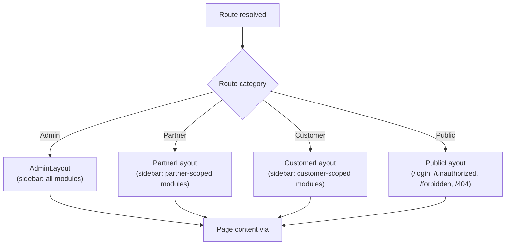
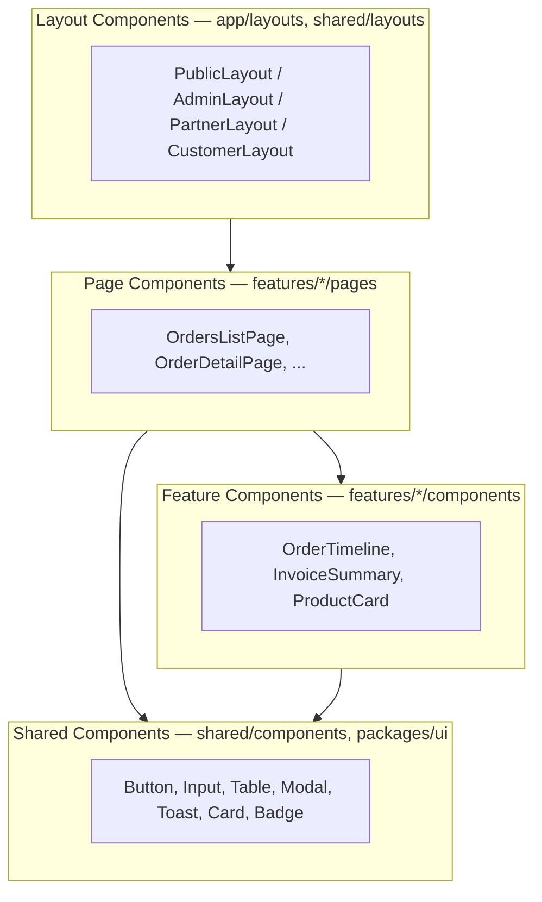

# SmartSense Marketplace — UI Development Guidelines

Version: 1.0

---

## Purpose

### Goals

- Give every engineer building UI the same vocabulary and the same default decisions — spacing, color, states, layout — so screens built by different people feel like one product.
- Make the "boring" parts of UI work (loading states, empty states, error pages, form validation feedback) a matter of following a documented pattern, not re-inventing one per feature.
- Provide a single reference for what belongs in a shared component library (`packages/ui`, `apps/web/src/shared/components`) versus a feature-specific component, so reuse happens by design rather than by accident.

### Scope

This document governs **visual design, interaction patterns, and component-level UI conventions** for `apps/web`. It does not repeat what is already defined elsewhere — read those first, and treat this document as the layer built on top of them:

| Already covered elsewhere                                                                                                                              | See                                          |
| ------------------------------------------------------------------------------------------------------------------------------------------------------ | -------------------------------------------- |
| Feature-based architecture, routing/layout structure, state management, API layer, general Accessibility/Performance/Loading Strategy principles       | [architecture.md](./architecture.md)         |
| React component rules (functional-only, size limits, props/hooks/memoization conventions), accessibility code-level expectations, Tailwind usage rules | [coding-standards.md](./coding-standards.md) |
| Where shared vs. feature vs. layout components physically live in the repo                                                                             | [folder-structure.md](./folder-structure.md) |
| Product modules, user roles, the canonical reusable-component list, routing table                                                                      | [requirements.md](./requirements.md)         |
| Route protection, `/unauthorized` vs. `/forbidden` semantics                                                                                           | [authentication.md](./authentication.md)     |

**Status.** As of M10, the shared component library is built and populated at `apps/web/src/shared/components`/`apps/web/src/shared/layouts` — not `packages/ui` (`apps/api` never consumes React components, so per [folder-structure.md](./folder-structure.md#packages--shared-workspace-packages)'s promote-don't-pre-share rule, `packages/ui` remains an untouched scaffold). As of the design-token system build-out, `apps/web/src/index.css` defines the full semantic token set (color, typography, z-index, motion) described in [Design Tokens](#design-tokens) below, and [Dark Mode](#dark-mode) moved from scaffolded to implemented; the rest of this document's conventions were established alongside that first implementation and are the reference every subsequent component follows. Where a concrete Tailwind token value is stated below, it is either a currently-in-use default or a defined `@theme`/`@utility` addition, and each is labeled accordingly.

### Design Philosophy

- **Utility-first, no bespoke CSS.** Tailwind CSS only, per [CLAUDE.md](../CLAUDE.md) — component styling is expressed as utility classes, not hand-written stylesheets or CSS-in-JS.
- **Consistency over local optimization.** A screen-specific one-off spacing value or color is a defect, not a shortcut — see [Anti-Patterns](#anti-patterns).
- **Accessible by default, not by retrofit.** Accessibility is a property of the base components ([Component Hierarchy](#component-hierarchy)), not something added per-feature after the fact.
- **State-complete by default.** Every data-driven view is designed with all four states — Loading, Empty, Success, Error — from the start, matching [architecture.md § Loading Strategy](./architecture.md#loading-strategy). A screen without a designed Empty or Error state is an incomplete design, not an edge case to defer.

---

## UI Principles

| Principle                  | What it means here                                                                                                                                                                                                                            |
| -------------------------- | --------------------------------------------------------------------------------------------------------------------------------------------------------------------------------------------------------------------------------------------- |
| **Simplicity**             | Default to the plainest layout and the fewest visual elements that communicate the content clearly. A dashboard card that could be a plain list stays a plain list.                                                                           |
| **Consistency**            | The same kind of action, state, or piece of information looks and behaves identically everywhere it appears — a destructive button is always styled the same way, regardless of which feature it's in ([Buttons](#buttons)).                  |
| **Predictability**         | Interactive elements behave the way their appearance promises — a button that looks clickable is clickable; a disabled control is visibly and unambiguously disabled ([Buttons § Disabled Buttons](#disabled-buttons)).                       |
| **Accessibility**          | Every interactive surface is usable by keyboard and screen reader, not only by mouse/pointer — detailed in [Accessibility](#accessibility).                                                                                                   |
| **Responsiveness**         | Every screen is designed mobile-first and verified at every breakpoint in [Responsive Design](#responsive-design), not just the designer's own monitor width.                                                                                 |
| **Performance**            | UI work respects [architecture.md § Performance](./architecture.md#performance) (lazy loading, avoiding unnecessary re-renders) — a visually polished screen that is slow to load or janky to scroll has failed this principle.               |
| **Reusability**            | A pattern used twice is a candidate for `shared/components`; a pattern used across features is a candidate for `packages/ui` ([Component Hierarchy](#component-hierarchy)) — building the one-off version a third time is the anti-pattern.   |
| **Progressive Disclosure** | Show the minimum needed to act; reveal detail on demand (an Order row shows status and total; its full item breakdown, addresses, and audit trail live behind opening the row) rather than surfacing every field a domain entity has at once. |

---

## Design System

### Design Tokens

Design tokens are expressed as Tailwind utility classes backed by Tailwind's token scales, configured via the CSS-first `@theme` mechanism (Tailwind v4) rather than a `tailwind.config.js` file. Project-specific tokens are declared only in one place, `apps/web/src/index.css` (the source of truth — this section summarizes it, but that file is authoritative if the two ever disagree); they are never redefined ad hoc as arbitrary Tailwind values (`bg-[#1a2b3c]`) scattered across components, and a component never hardcodes a raw `gray-*`/`white`/`black` Tailwind color class.

Two layers:

1. **Primitives** — Tailwind's own default palette/scales (gray, green, amber, red, blue; spacing; radius; shadow; breakpoints). Never redefined; referenced by `var(--color-*)` in the semantic layer. No separate brand color/type ramp has been introduced — neutral gray is the deliberate baseline (see [Color Philosophy](#color-philosophy)).
2. **Semantic tokens** — named by role (`surface`, `fg-muted`, `border-control`, `success`, ...), not by hue or shade number. Components consume only these.

Color tokens are theme-aware: each is a plain CSS custom property redeclared under `:root` (light) and `.dark` (dark), then re-exposed to Tailwind's utility generator via `@theme inline` — a Tailwind v4 mechanism that keeps the token a live `var()` reference instead of resolving it to a literal at build time, so toggling the `.dark` class on `<html>` ([Dark Mode](#dark-mode)) repaints every consumer with **no per-component `dark:` variant required**. This is what closes the gap the old scaffolded plan warned about ("a component library with partial dark mode coverage is worse than no dark mode") — a component that only ever writes `bg-surface` cannot have a missing dark mode; there's no separate styling to forget.

| Category      | Tokens                                                                                                                | Replaces                                                              |
| ------------- | --------------------------------------------------------------------------------------------------------------------- | --------------------------------------------------------------------- |
| Surface       | `bg-canvas`, `bg-surface`, `bg-surface-subtle`, `bg-surface-hover`                                                    | `bg-gray-50`/`bg-white`/`bg-gray-100` + their `dark:` pairs           |
| Border        | `border-border-default` (containers), `border-border-control` (interactive controls)                                  | `border-gray-200`/`border-gray-300` + their `dark:` pairs             |
| Foreground    | `text-fg-default`, `text-fg-secondary`, `text-fg-muted`, `text-fg-on-emphasis`                                        | `text-gray-900`/`-700`/`-500` + their `dark:` pairs                   |
| Inverted fill | `bg-neutral-emphasis`, `bg-neutral-emphasis-hover`                                                                    | `bg-gray-900 dark:bg-gray-100` (primary button, active nav item)      |
| Focus         | `outline-focus-ring` / `ring-focus-ring`                                                                              | Per-variant `outline-gray-*`/`ring-gray-*` (now one consistent color) |
| Overlay       | `bg-overlay` (used as `bg-overlay/50`)                                                                                | `bg-gray-900/50` — same both themes, not `:root`/`.dark` split        |
| Status        | `success`/`warning`/`danger`/`info`, each with base/`-subtle`/`-emphasis`                                             | M10's fixed values — now theme-aware (see below)                      |
| Typography    | `--font-sans` (`@theme`, applied globally via `@layer base`)                                                          | No font was declared anywhere before this                             |
| Z-index       | `z-dropdown` (20), `z-overlay` (40), `z-modal` (50), `z-toast` (60) — `@utility`, not a `@theme` namespace            | Every overlay hardcoding the same `z-50`                              |
| Motion        | `duration-fast` (150ms), `duration-base` (200ms), `ease-standard` — `@utility`; pair with Tailwind's `motion-reduce:` | Ad hoc `duration-150`/`duration-200` per component                    |

Status colors are now dark-mode-aware, not just aliased once: M10's `-subtle` values (e.g. `green-50`) were fixed regardless of theme, which would render as a near-white chip on a near-black dark-mode card. `-subtle` and `-emphasis` now invert direction per theme (dark mode: a deep, desaturated subtle background paired with a light emphasis text color) so a Badge/Alert/Toast using `success`/`warning`/`danger`/`info` gets correct contrast in both themes with no code change — this was true of every consumer of these four tokens the moment the token definition changed, which is the actual argument for centralizing color in tokens instead of per-component `dark:` classes.

Spacing, radius, shadow, and breakpoints are **deliberately not** given new named aliases — they already ride Tailwind's default scales, used by a fixed, documented role ([Border Radius](#border-radius), [Elevation & Shadows](#elevation--shadows), [Responsive Breakpoints](#responsive-breakpoints)). `rounded-md`/`shadow-xl`/`lg:` are already tokens, not arbitrary values; renaming them to project-specific aliases would add indirection without changing what any component looks like.

### Color Philosophy

- Color communicates **meaning**, not decoration: a status uses a consistent semantic color across the whole app (success = green family, warning = amber family, danger = red family, informational = blue family), never a different color for the same status in two different features.
- Neutral grays carry structure (backgrounds, borders, body text); semantic colors are reserved for state and action, not layout. Structural neutrals are themselves named tokens by role, not raw shade numbers — `bg-canvas`/`bg-surface`/`bg-surface-subtle`/`bg-surface-hover` for backgrounds, `text-fg-default`/`text-fg-secondary`/`text-fg-muted` for text, `border-border-default`/`border-border-control` for borders (see [Design Tokens](#design-tokens)) — so "the page background" or "muted helper text" has exactly one definition each, the same way a status color does.
- Every semantic color has a defined pairing for text/background/border use so a "danger" badge, a "danger" button, and a "danger" alert all read as visually related, not merely all "reddish."
- Color is never the _only_ signal for a state — an error also carries an icon or text label, per [Accessibility § Color Contrast](#color-contrast) and the general principle that color-blind users must be able to distinguish states.

### Typography Hierarchy

| Role                  | Tailwind classes (current default scale) | Usage                                                                                                         |
| --------------------- | ---------------------------------------- | ------------------------------------------------------------------------------------------------------------- |
| Page title            | `text-3xl font-bold tracking-tight`      | One per page, matches the existing `PlaceholderPage` heading style                                            |
| Section heading       | `text-xl font-semibold`                  | Card headers, section dividers within a page                                                                  |
| Body text             | `text-sm` / `text-base`                  | Default reading text; `text-sm` is the default for dense data UI (tables), `text-base` for prose-like content |
| Supporting/muted text | `text-sm text-gray-500`                  | Captions, helper text, secondary metadata                                                                     |
| Label text            | `text-sm font-medium`                    | Form field labels, table column headers                                                                       |

A page uses at most one page title and a small number of heading levels — never skip a level (a section heading appearing without ever having a page title above it) purely for visual sizing; use font weight/color instead of heading level for pure visual emphasis.

The type scale above (`text-3xl`/`text-xl`/`text-sm`/`text-base`) already rides Tailwind's default, unmodified font-size scale — these are tokens, not arbitrary values, so no separate custom type ramp has been introduced. The one real gap was that `apps/web` never declared a font at all (it rendered on the bare browser default stack); `--font-sans` in `apps/web/src/index.css` formalizes the system font stack (`ui-sans-serif, system-ui, ...`) as an explicit project token, applied globally via `@layer base` — a system stack, not a self-hosted webfont, per [Design Tokens](#design-tokens): zero network cost, no FOUC, no new dependency for a purely visual upgrade nothing had asked for.

### Spacing System

Tailwind's default 4px-based spacing scale (`p-1` = 0.25rem through the standard scale) is used as-is. Two rules keep it consistent:

- **Spacing values come from the scale, never arbitrary values** (`p-[13px]` is not acceptable where `p-3`/`p-4` exists) — this is what makes spacing feel deliberate across the app rather than incidentally different per component.
- **A component's internal spacing and the spacing between components are distinguished deliberately** — e.g. padding inside a Card is a fixed, small set of values (`p-4`/`p-6`) independent of the gap between Cards in a grid (`gap-4`/`gap-6`), so changing a layout's density doesn't require touching every component's own padding.

### Border Radius

A small, fixed set of radius values, used consistently by role rather than by component:

| Role                                           | Convention (Tailwind default scale) |
| ---------------------------------------------- | ----------------------------------- |
| Interactive controls (buttons, inputs, badges) | `rounded-md`                        |
| Containers (cards, panels, modals)             | `rounded-lg`                        |
| Avatars, circular icons                        | `rounded-full`                      |

### Elevation & Shadows

Elevation communicates layering (what's "above" what), not decoration:

| Layer                                                 | Convention                                                                        |
| ----------------------------------------------------- | --------------------------------------------------------------------------------- |
| Flat surface (page background, inline card on a page) | No shadow — separated by border/background color only (`border border-gray-200`)  |
| Raised surface (dropdown menu, popover, tooltip)      | `shadow-md`                                                                       |
| Overlay surface (modal, drawer)                       | `shadow-xl`, always paired with a backdrop ([Dialogs & Modals](#dialogs--modals)) |

A shadow is never used on a flat, in-flow page element purely for visual weight — that role belongs to spacing, borders, and typography.

### Z-Index

A named scale (`z-dropdown` 20, `z-overlay` 40, `z-modal` 50, `z-toast` 60 — `@utility` tokens in `apps/web/src/index.css`, since z-index has no Tailwind v4 `@theme` namespace to extend) replaces every overlay previously hardcoding the same `z-50`: Modal and Drawer use `z-overlay` for their backdrop and `z-modal` for their panel, Toast's viewport uses `z-toast`. This is what makes a Toast fired from inside an open Modal render above it deterministically, rather than depending on DOM/portal mount order. A new overlay-style component picks the token matching its role rather than reaching for a bare `z-50`.

### Icons

- One icon set for the entire application — `lucide-react`, chosen at M10, re-exported from `apps/web/src/shared/icons` as the single sourcing point (components/features import icons from there, never from `lucide-react` directly). Mixing icon sets/styles (outline vs. filled, different stroke widths) within the same screen is not acceptable.
- Icons default to `currentColor` so they inherit their container's text color rather than hardcoding a fill — this is what lets the same icon component work inside a default, success, and danger button variant without a prop for color.
- A standalone icon that conveys meaning (not purely decorative) always has an accessible label — see [Accessibility § ARIA Usage](#aria-usage).

---

## Layout Guidelines

### Application Layouts

Per [architecture.md § Routing](./architecture.md#routing) and [folder-structure.md § app — Application Shell](./folder-structure.md#app--application-shell), the application selects one of a small set of layout shells based on the route's audience, implemented under `app/layouts` and referenced by the router:



Each authenticated layout (Admin/Partner/Customer) shares the same structural skeleton (header + sidebar + content region, see below) and differs only in which navigation items and which route guards apply — the visual chrome is one shared layout component parameterized by role-specific navigation data, not three independently built layouts.

### Page Layouts

A page (rendered inside a layout's content region) follows a consistent internal structure:

```
┌─────────────────────────────────────────────┐
│ Page header (title + primary action, if any) │
├─────────────────────────────────────────────┤
│ Filters / toolbar (if the page has a list)    │
├─────────────────────────────────────────────┤
│                                                │
│           Page content (table, form,          │
│           dashboard cards, etc.)               │
│                                                │
└─────────────────────────────────────────────┘
```

The page header always contains the page title ([Typography Hierarchy](#typography-hierarchy)); it contains a primary action button only when the page has exactly one obvious primary action (e.g. "Create Order" on an Orders list) — a page with several equally-weighted actions places them in a toolbar instead, not stacked in the header.

The filters/toolbar region is visually contained in a `Card` (border + background, matching any other grouped content on the page) rather than floating as bare form controls directly above the table — this reads as one distinct "controls" region separate from the data below it, consistent with [Design System § Elevation & Shadows](#elevation--shadows)'s flat-container treatment (a border, never a shadow, for an in-flow region).

### Container Widths

| Context                               | Convention                                                                                                                                    |
| ------------------------------------- | --------------------------------------------------------------------------------------------------------------------------------------------- |
| Data-dense pages (tables, dashboards) | Full width of the content region — maximize visible data                                                                                      |
| Forms, settings, narrow content       | Constrained max width (`max-w-2xl` or similar) and centered, so a long form doesn't stretch to an uncomfortable line length on a wide monitor |
| Modal/dialog content                  | Bounded by the [Dialogs & Modals](#dialogs--modals) size conventions, independent of the page behind it                                       |

### Grid System

Tailwind's CSS grid/flexbox utilities are used directly (`grid grid-cols-*`, `flex`) — no separate grid framework or column library is introduced. A dashboard's card grid, for example, is `grid grid-cols-1 sm:grid-cols-2 lg:grid-cols-3 gap-4` (mobile-first, columns added as width increases, per [Responsive Design](#responsive-design)).

### Responsive Breakpoints

Tailwind's default breakpoint scale, used consistently rather than introducing custom breakpoints:

| Breakpoint | Min width | Primary target              |
| ---------- | --------- | --------------------------- |
| (default)  | 0px       | Mobile                      |
| `sm`       | 640px     | Large mobile / small tablet |
| `md`       | 768px     | Tablet                      |
| `lg`       | 1024px    | Small desktop               |
| `xl`       | 1280px    | Desktop                     |
| `2xl`      | 1536px    | Large/wide desktop          |

See [Responsive Design](#responsive-design) for per-device layout behavior built on top of this scale.

### Sidebar Behavior

- Persistent and expanded on `lg` and above, with a user-toggleable collapsed (icon-only) state — the collapse control sits at the bottom of the nav list, persists the choice to `localStorage`, and every nav item keeps an accessible name (`aria-label` + native `title` tooltip) when collapsed, since an icon-only link is never unlabeled ([Accessibility § ARIA Usage](#aria-usage)). Below `lg`, the sidebar is fully hidden behind the header's hamburger toggle, opening as a `Drawer` instead — a genuinely different device class gets a different pattern rather than a squeezed collapsed rail, consistent with [Responsive Design](#responsive-design). A persistent icon-only rail specifically for tablet widths remains unbuilt ([Future Enhancements](#future-enhancements)).
- Contains role-appropriate navigation only — an Admin sees every module, a Partner/Customer sees only the modules [requirements.md § Modules](./requirements.md#modules) grants their role. Every nav item has an icon (`apps/web/src/shared/icons`) — required for the collapsed state to read as anything more than an empty rail, and applied consistently in the expanded state too.
- Never contains page-specific actions (a "Create Order" button does not live in the sidebar) — the sidebar is navigation-only, with one deliberate exception: the account footer below, which is account-level chrome, not a page action.
- **Account footer** (`shared/components/ui/UserMenu`, rendered by `Sidebar` itself below the nav list and above the collapse control) shows identity (avatar, email, role) and the one action that exists today, Log out — no "Profile"/"Settings" entry, since those pages don't exist and a menu item that goes nowhere is worse than no menu item. Expanded, it's a full row (avatar + name/role + chevron); collapsed, it shrinks to an icon-only avatar button with the same accessible name, matching the nav items' own collapsed treatment. Rendered in both the persistent desktop sidebar and the mobile nav `Drawer`, so logging out is always reachable — on mobile that's one tap into the hamburger menu rather than a persistent header control.

### Header Behavior

- Fixed to the top of the viewport — literally: `AppLayout` (`shared/layouts/AppLayout.tsx`) pins the shell to `h-screen overflow-hidden`, so Header and Sidebar never scroll regardless of how tall a routed page's content is. `Content` (`shared/layouts/Content.tsx`) is the one scrolling region (`overflow-y-auto`); a routed page's height flows into it, not the document. Contains the current context (module/page name), a search trigger, a notifications icon, and the theme switch — global actions and orientation, never module navigation or account identity (the sidebar owns both of those, see [Sidebar Behavior](#sidebar-behavior)'s account footer).
- **Search** is a read-only field that opens the [Command Palette](#command-palette) on click/focus, and collapses to an icon-only trigger below `sm` — it is not a second search implementation; there is no shell-level free-text business search (see [Command Palette](#command-palette) for what it actually does).
- **Notifications** is an icon button opening a panel — today, always the empty-state placeholder, since there is no Notifications feature yet ([roadmap.md § Notifications](./roadmap.md#notifications), v1.1). It never shows a fabricated unread count or sample data; a capability that doesn't exist yet says so plainly rather than being faked, the same posture as [Internationalization Readiness](#internationalization-readiness)'s "stated scope boundary, not an oversight."

### Footer Behavior

The authenticated application shell does not have a persistent footer — data-dense, task-focused screens should not lose vertical space to a footer on every page. A footer (copyright, links) is reserved for `PublicLayout` pages only (`/login`, error pages).

---

## Component Hierarchy



This mirrors the dependency direction already established in [folder-structure.md § Import Rules (Frontend)](./folder-structure.md#import-rules-frontend) (`app → features → shared`) — this section states each tier's _design_ responsibility, not its file location (already covered there).

| Tier                   | Responsibility                                                                                                                                                                                                                                                       | Example          |
| ---------------------- | -------------------------------------------------------------------------------------------------------------------------------------------------------------------------------------------------------------------------------------------------------------------- | ---------------- |
| **Layout components**  | Application chrome: header, sidebar, content region, role-based navigation. Never contains business/domain data fetching.                                                                                                                                            | `AdminLayout`    |
| **Page components**    | Composition root for one route: fetches data via feature hooks/services, arranges Feature and Shared components, owns the page's Loading/Empty/Success/Error branching ([architecture.md § Loading Strategy](./architecture.md#loading-strategy)).                   | `OrdersListPage` |
| **Feature components** | Domain-specific presentation with no reuse outside their owning feature — per [architecture.md § UI Architecture](./architecture.md#ui-architecture)'s existing distinction (`ProductCard`, `OrderTimeline`, `InvoiceSummary`, `PartnerStatistics`).                 | `OrderTimeline`  |
| **Shared components**  | Generic, domain-agnostic UI primitives with no knowledge of any feature's data shape — the canonical set from [requirements.md § UI](./requirements.md#ui): Button, Input, Select, Modal, Table, Pagination, Card, Badge, Skeleton, Empty State, Error State, Toast. | `Button`         |

A component is promoted up a tier (Feature → Shared) only once a second, genuine, unrelated consumer needs it — matching [folder-structure.md § Best Practices](./folder-structure.md#best-practices)'s "promote, don't pre-share" rule, applied here to UI components specifically.

---

## Forms

Form state/validation mechanics (React Hook Form + Zod) are mandated by [CLAUDE.md](../CLAUDE.md) and structured per [architecture.md § Forms](./architecture.md#forms) (`schema.ts` beside `Form.tsx`) — this section covers the **visual/UX conventions** on top of that mechanism.

### Form Layouts

- Single-column by default — a multi-column form layout is harder to scan and harder to make responsive; use it only for tightly related short fields (e.g. City / State / ZIP on one row).
- Related fields are grouped visually (spacing, an optional section heading) rather than presented as one undifferentiated list of inputs for a long form (e.g. a checkout form separates "Shipping" from "Billing").
- The primary submit action is always at the bottom of the form (or in a sticky footer for a long/scrollable form inside a modal, see [Dialogs & Modals § Forms in Dialogs](#forms-in-dialogs)) — never above the fields it submits.

### Labels

Every field has a visible, persistent label (`text-sm font-medium`, per [Typography Hierarchy](#typography-hierarchy)) positioned above its input — a placeholder is never used as a substitute for a label, since placeholder text disappears the moment the user starts typing and fails accessibility requirements ([Accessibility § Screen Readers](#screen-readers)).

### Required Fields

Required fields are marked consistently (a trailing `*` next to the label is the project convention) with a one-time legend ("* Required") at the top of the form when any field is optional — if every field in a form is required, omit the markers entirely rather than marking every single field.

### Validation

- **Timing:** validate on blur for the first interaction with a field, then on every change once a field has been touched and has an active error — this avoids showing an error while the user is still mid-typing their first entry, while still giving immediate feedback once a real error exists.
- **Source of truth:** the Zod schema beside the form ([architecture.md § Forms](./architecture.md#forms)) is the only place validation rules are declared — a component never duplicates a rule as a separate manual check.

### Error Messages

- Displayed immediately below the field they apply to, in a consistent danger color/text style, paired with a non-color signal (an icon) per [Accessibility § Color Contrast](#color-contrast).
- Written to state what's wrong and, where possible, how to fix it ("Email must be a valid address," not "Invalid input").
- A field's error state also changes the input's own border/ring color — a user should be able to spot which fields have errors by scanning the form, not only by reading each message individually.

### Success States

A successful form submission is confirmed via a Toast ([Feedback Components](#feedback-components)) for an action that doesn't navigate away (e.g. "Save" on a settings form), or by navigating to the resulting resource's detail view for a creation flow (e.g. "Create Order" navigates to the new Order's detail page) — never silently succeed with no feedback at all.

### Disabled States

A disabled field is visually distinct (reduced opacity/muted background, per the same convention as [Buttons § Disabled Buttons](#disabled-buttons)) and never the only way a user learns a field is unavailable — if a field is disabled due to a specific condition (e.g. "cannot edit Partner while an Order is in progress"), that reason is surfaced as helper text, not left for the user to guess.

### Loading States

While a form is submitting: the submit button enters its loading variant ([Buttons § Loading Buttons](#loading-buttons)) and the entire form's fields become disabled — this prevents a double-submit and matches the "no ambiguous in-between state" principle from [UI Principles § Predictability](#ui-principles).

### Helper Text

Helper text (`text-sm text-gray-500`, per [Typography Hierarchy](#typography-hierarchy)) sits directly below a field's label/input, used for guidance needed _before_ an error occurs (format hints, character limits) — once a field has a validation error, the error message takes that same position and the helper text is hidden, rather than showing both at once and crowding the field.

---

## Tables

The canonical Table component is part of the shared component set ([requirements.md § UI](./requirements.md#ui)). Pagination strategy itself (cursor vs. offset, when each applies) is fully defined in [api-conventions.md § Pagination Strategy](./api-conventions.md#pagination-strategy) and the GraphQL-facing shape in [graphql.md § Pagination](./graphql.md#pagination) — this section covers only the table UI's presentation of those mechanics.

| Concern                 | Convention                                                                                                                                                                                                                                                                                                                                                                                                                                                                                                                                                                                                                                                                                                                                                                                                                                                                                                                                                                                                                                                                                                                                       |
| ----------------------- | ------------------------------------------------------------------------------------------------------------------------------------------------------------------------------------------------------------------------------------------------------------------------------------------------------------------------------------------------------------------------------------------------------------------------------------------------------------------------------------------------------------------------------------------------------------------------------------------------------------------------------------------------------------------------------------------------------------------------------------------------------------------------------------------------------------------------------------------------------------------------------------------------------------------------------------------------------------------------------------------------------------------------------------------------------------------------------------------------------------------------------------------------ |
| **Pagination**          | Page-forward/back controls driven by the underlying cursor connection ([graphql.md § Pagination](./graphql.md#pagination)) — the UI never exposes a "jump to page N" control for a cursor-paginated table, since cursor pagination has no stable page numbers by design. A full-height list page (CatalogPage, OrdersPage) renders `Pagination` as the last, non-scrolling child of a bounded-height flex column (`flex h-full flex-col`), with the table itself in a `flex-1 overflow-y-auto` region above it, `border-t` separated — never `position: sticky` over the scrolling content. Sticky looked simpler but is fragile: `Table`'s own horizontal-scroll wrapper (`overflow-x-auto`) silently promotes its vertical overflow to `auto` too (the CSS spec's "visible next to scroll/auto" rule), which interacted badly with a sticky sibling and produced a real content/footer overlap. A plain footer in normal flow can't overlap anything. "Previous" is never `window.history.back()`: the backend only implements forward pagination, so the page's data hook (`useCatalog`/`useOrders`) tracks its own client-side cursor stack. |
| **Sorting**             | Clicking a sortable column header toggles ascending/descending, with a visible directional indicator (chevron icon) on the active sort column only — only columns backed by an indexed field are sortable, per [api-conventions.md § Filtering](./api-conventions.md#filtering).                                                                                                                                                                                                                                                                                                                                                                                                                                                                                                                                                                                                                                                                                                                                                                                                                                                                 |
| **Filtering**           | Filters live in the page's toolbar above the table ([Page Layouts](#page-layouts)), never as inline per-column filter inputs embedded in the header row — that pattern doesn't scale to the table's responsive/mobile behavior below. A dropdown filter's "All"/clear option must always be re-selectable once a real value has been chosen — pass the shared `Select` component's `clearable` prop (`apps/web/src/shared/components/ui/Select/Select.tsx`); its default (`clearable={false}`) renders the placeholder as a disabled, one-way option, which is correct for a required form field but silently traps a filter on its last value if left unset (a real M13 bug, fixed by adding this convention).                                                                                                                                                                                                                                                                                                                                                                                                                                  |
| **Selection**           | Row selection (when a table supports bulk actions) uses a checkbox column as the leftmost column; a header checkbox selects/deselects all rows on the current page only, never "all rows in the entire result set" implicitly.                                                                                                                                                                                                                                                                                                                                                                                                                                                                                                                                                                                                                                                                                                                                                                                                                                                                                                                   |
| **Bulk actions**        | Appear in a toolbar that replaces the default toolbar the moment one or more rows are selected, showing the count selected and the available actions — the default filters/search do not disappear, they are temporarily superseded.                                                                                                                                                                                                                                                                                                                                                                                                                                                                                                                                                                                                                                                                                                                                                                                                                                                                                                             |
| **Empty state**         | See [Empty States § No Data](#no-data) / [§ No Search Results](#no-search-results) — a table with zero rows never renders as a bare header with nothing below it.                                                                                                                                                                                                                                                                                                                                                                                                                                                                                                                                                                                                                                                                                                                                                                                                                                                                                                                                                                                |
| **Loading state**       | Skeleton rows matching the table's actual column structure ([Loading Experience § Skeletons](#skeletons)), not a centered spinner replacing the whole table — this avoids the table's layout shifting once data arrives.                                                                                                                                                                                                                                                                                                                                                                                                                                                                                                                                                                                                                                                                                                                                                                                                                                                                                                                         |
| **Column alignment**    | Numeric and currency columns (price, quantity, totals) are right-aligned — both the `TableHead` and every `TableCell` in that column — so magnitudes stay scannable top-to-bottom; text/identifier columns (name, SKU, status) stay left-aligned. Use `md:text-right` rather than plain `text-right` so the mobile stacked-card layout's label/value row (a `flex justify-between` pair, per [Responsive Behavior](#tables) below) isn't affected — the right-alignment is a desktop-table-only convention.                                                                                                                                                                                                                                                                                                                                                                                                                                                                                                                                                                                                                                      |
| **Row hover**           | The shared `TableRow` applies a `md:hover:bg-surface-hover` background on hover (desktop table mode only — the mobile stacked-card mode has no equivalent affordance since touch has no hover) so a data-dense table stays scannable as the pointer moves down it, without introducing a new token or component.                                                                                                                                                                                                                                                                                                                                                                                                                                                                                                                                                                                                                                                                                                                                                                                                                                 |
| **Responsive behavior** | Below `md`, a data table converts to a stacked card-per-row layout (each row's cells become labeled key/value pairs) rather than allowing horizontal scroll as the default — horizontal scroll is an acceptable fallback only for a table whose columns are inherently tabular/numeric and lose meaning when stacked (e.g. a financial ledger).                                                                                                                                                                                                                                                                                                                                                                                                                                                                                                                                                                                                                                                                                                                                                                                                  |

---

## Buttons

| Concern               | Convention                                                                                                                                                                                                                                                                                                                 |
| --------------------- | -------------------------------------------------------------------------------------------------------------------------------------------------------------------------------------------------------------------------------------------------------------------------------------------------------------------------- |
| **Variants**          | `primary` (the page/section's main action, one visually dominant instance per view), `secondary` (default bordered/neutral action), `ghost` (lowest-emphasis, text-only action), `danger` (destructive actions only, see below).                                                                                           |
| **Sizes**             | `sm`, `md` (default), `lg` — chosen by context density (a table row action is `sm`; a page header's primary action is `md`/`lg`), not by developer preference on a per-instance basis.                                                                                                                                     |
| **Icons**             | An icon-plus-label button always places the icon before the label for a forward action (Create, Add) and can place it after for a navigating-away action (Next, Continue); an icon-only button always has an accessible label ([Accessibility § ARIA Usage](#aria-usage)).                                                 |
| **Loading buttons**   | Replaces the label's leading position with a spinner and keeps the button's width stable (no layout shift) while disabling interaction — never simply relabels the button to "Loading..." without a visual spinner cue.                                                                                                    |
| **Disabled buttons**  | Reduced opacity, `cursor-not-allowed`, and never removes the button from the tab order silently — a disabled action the user might expect to be available should be accompanied by a reason (tooltip or helper text) rather than a bare disabled control.                                                                  |
| **Dangerous actions** | Always the `danger` variant, and any destructive action with an irreversible or hard-to-reverse effect (delete, cancel an Order, deactivate a Partner) requires a [confirmation dialog](#confirmation-dialogs) before executing — a danger-variant button alone is not sufficient confirmation for an irreversible action. |

---

## Dialogs & Modals

| Concern                  | Guideline                                                                                                                                                                                                                                                                                                                                                                                                                                                                                                                 |
| ------------------------ | ------------------------------------------------------------------------------------------------------------------------------------------------------------------------------------------------------------------------------------------------------------------------------------------------------------------------------------------------------------------------------------------------------------------------------------------------------------------------------------------------------------------------- |
| **Confirmation dialogs** | Short, focused: a title stating the action, one sentence of consequence, and two actions (the confirming action styled per its actual risk — `danger` variant for a destructive confirmation, `primary` otherwise — and a `secondary`/`ghost` cancel). Never bury a confirmation dialog's consequence description below the fold.                                                                                                                                                                                         |
| **Forms in dialogs**     | Reserved for short forms (a handful of fields) that logically belong to the triggering context (e.g. "Add Address" from an Order's shipping section) — a form long enough to need its own page-level layout ([Form Layouts](#form-layouts)) belongs on a page, not in a modal.                                                                                                                                                                                                                                            |
| **Destructive actions**  | Always confirmed via a dialog (see Confirmation dialogs above) before the mutation fires — never optimistically executed with only an "Undo" toast as the safety net for anything that isn't trivially and fully reversible.                                                                                                                                                                                                                                                                                              |
| **Drawer vs. Modal**     | A **Modal** interrupts the current context and is used for short, focused tasks (confirmations, small forms) that block interaction with the page behind it. A **Drawer** (slide-in panel) is used for tasks that benefit from retaining visual context with the underlying page (e.g. viewing an Order's detail while still seeing its position in a list) or for content too long to comfortably fit a centered modal. Default to a Modal; reach for a Drawer only when retaining page context is a genuine UX benefit. |

---

## Navigation

| Element         | Convention                                                                                                                                                                                                                                                                                                                                                                                                                                                                                                                                                                                                                                           |
| --------------- | ---------------------------------------------------------------------------------------------------------------------------------------------------------------------------------------------------------------------------------------------------------------------------------------------------------------------------------------------------------------------------------------------------------------------------------------------------------------------------------------------------------------------------------------------------------------------------------------------------------------------------------------------------- |
| **Sidebar**     | See [Layout Guidelines § Sidebar Behavior](#sidebar-behavior).                                                                                                                                                                                                                                                                                                                                                                                                                                                                                                                                                                                       |
| **Breadcrumbs** | Shown on any page nested more than one level deep from its module root (e.g. Orders → Order #1234) — omitted on top-level list pages where they'd just repeat the sidebar's active item. Derived from route metadata (`handle.crumb` in `app/router/index.tsx`), rendered once by the shell (`shared/layouts/Breadcrumbs.tsx`) — no page hand-rolls its own `<Breadcrumb>`. A page with a data-dependent trailing label (a Product's title, an Order's number) calls `useBreadcrumb(label)` to replace the route's static fallback once the label loads; `undefined` (still loading) leaves the fallback in place rather than showing a blank crumb. |
| **Tabs**        | Used to switch between views of the _same_ entity/context (e.g. an Order's "Details" / "Timeline" / "Invoice" tabs) — never used as a substitute for top-level navigation between unrelated modules (that's the sidebar's job).                                                                                                                                                                                                                                                                                                                                                                                                                      |
| **Menus**       | `shared/components/ui/Menu` — a dropdown/overflow menu (row actions in a table, the header's user menu) opens on click, closes on outside-click/`Escape`/selection, and is keyboard-navigable ([Accessibility § Keyboard Navigation](#keyboard-navigation)) by virtue of wrapping `@radix-ui/react-dropdown-menu` rather than hand-rolled behavior. `shared/components/ui/Popover` is the sibling primitive for anchored content that isn't a list of commands (e.g. the notifications panel) — using Menu there would mislabel passive content with `role="menu"`.                                                                                  |
| **Pagination**  | See [Tables § Pagination](#tables) — the same pagination control is reused wherever a paginated list appears, not redesigned per feature.                                                                                                                                                                                                                                                                                                                                                                                                                                                                                                            |
| **Search**      | The header's search box does not implement a shell-level business search — see [Command Palette](#command-palette). A list's own search (table toolbar) stays owned by that feature — see [Queries § Searching](./graphql.md#searching) for how it's implemented against the API.                                                                                                                                                                                                                                                                                                                                                                    |

---

## Command Palette

`shared/components/ui/CommandPalette`, opened by `Ctrl`/`Cmd`+`K` from anywhere in the authenticated shell or by clicking the header's search box (the two are the same instance — one piece of UI, not a search box that duplicates a separate palette).

- **Scope: navigation and shell actions only, never business data search.** It lists the same permission-filtered nav items the sidebar shows (jump to Dashboard/Catalog/Orders/Billing) plus a small set of shell actions (switch theme, log out). It does not search products, orders, customers, or any other business entity — that stays each feature's own job (e.g. the Catalog page's filter bar, [Navigation § Search](#navigation)). A future business-data command (e.g. "jump to Order #1234") is a deliberate, separate scope decision, not an assumed extension of this palette.
- **Why `cmdk`, not hand-rolled.** A searchable, keyboard-navigable, filterable list is exactly the ARIA/keyboard behavior [Anti-Patterns](#anti-patterns) says never to reimplement by hand. Radix has no combobox/command primitive; `cmdk` is the focused, purpose-built library for this one interaction pattern, consistent with reaching for a Radix primitive for every other complex interactive pattern in this library.
- **Keyboard:** arrow keys move selection, `Enter` activates, `Escape` closes, typing filters — all `cmdk` behavior, not custom code.

---

## Feedback Components

| Component             | When to use                                                                                                                                                                                                                        | Behavior                                                                                                                                                                                                                                        |
| --------------------- | ---------------------------------------------------------------------------------------------------------------------------------------------------------------------------------------------------------------------------------- | ----------------------------------------------------------------------------------------------------------------------------------------------------------------------------------------------------------------------------------------------- |
| **Toasts**            | Confirming a completed action that doesn't require the user to read and dismiss (Save succeeded, item added)                                                                                                                       | Auto-dismiss after a few seconds, stack in a single consistent screen corner, never block interaction with the page.                                                                                                                            |
| **Alerts**            | Persistent, page-level or section-level information that stays visible until dismissed or resolved (a banner warning that a Partner's account is pending approval)                                                                 | Stay on screen (no auto-dismiss); styled by severity (info/warning/danger) using the same semantic colors as everywhere else ([Color Philosophy](#color-philosophy)).                                                                           |
| **Notifications**     | Asynchronous, user-directed events not tied to the current in-progress action (e.g. a future "Order shipped" notification)                                                                                                         | The header's icon/panel shell exists (`NotificationsMenu`, [Header Behavior](#header-behavior)) but only ever renders an empty-state placeholder — the actual feature is a v1.1 module, tracked in [Future Enhancements](#future-enhancements). |
| **Inline validation** | Field-level form feedback                                                                                                                                                                                                          | See [Forms § Error Messages](#error-messages) — not a separate component, a state of the Input component.                                                                                                                                       |
| **Success messages**  | See Toasts above for transient success, or an inline success Alert for a persistent confirmation (e.g. "Your changes have been saved" banner on a settings page that doesn't navigate away).                                       |
| **Error messages**    | Field-level errors use inline validation; operation-level errors (a failed mutation) use a Toast for a transient failure or an inline Alert for a failure that leaves the page in a state the user must address before continuing. |

---

## Loading Experience

Builds on the four-state model already required by [architecture.md § Loading Strategy](./architecture.md#loading-strategy) ("Skeleton loaders are preferred over spinners for page content").

### Skeletons

The default loading treatment for any content with a known/predictable final shape (a table, a card grid, a detail page) — the skeleton mirrors the real layout's structure (same number of rows/columns, similar block sizing) so there is no layout shift when real content replaces it.

### Spinners

Reserved for: (a) an action-scoped loading state where a skeleton doesn't apply (a button's [loading state](#loading-buttons), a small inline refresh indicator), or (b) a genuinely unpredictable-shape loading scenario where no meaningful skeleton can be drawn. A spinner is never the default treatment for a full page's initial load.

### Lazy Loading

Route-level code splitting is mandated by [CLAUDE.md](../CLAUDE.md) ("Use lazy loading for routes") and structured per [architecture.md § Routing](./architecture.md#routing) ("All routes are lazy loaded") — the UI-facing requirement on top of that mechanism is that a lazily-loaded route shows the app-level loading state (not a blank screen) while its chunk downloads, consistent with [authentication.md § Route Protection](./authentication.md#route-protection-frontend)'s "render app-level loading state (no flash of login or content)" during auth bootstrapping.

### Progressive Loading

For a page composed of multiple independently-fetched sections (e.g. a dashboard with several cards each backed by a different query), each section shows its own skeleton/loading state independently rather than blocking the entire page behind the slowest query — a fast card renders as soon as its data arrives, even while a slower sibling card is still loading.

---

## Empty States

Every list/data view has a designed empty state — never a bare, contentless area. All empty states share the same visual anatomy: an icon or illustration, a short headline, one sentence of explanation, and — where applicable — a primary action.

| Scenario              | Headline example                                                                                                                                                                                                                                                                                         | Action                                                                                                 |
| --------------------- | -------------------------------------------------------------------------------------------------------------------------------------------------------------------------------------------------------------------------------------------------------------------------------------------------------- | ------------------------------------------------------------------------------------------------------ |
| **No Data**           | "No orders yet"                                                                                                                                                                                                                                                                                          | Primary action to create the first item, if the viewer has permission to do so                         |
| **No Search Results** | "No results for '{query}'"                                                                                                                                                                                                                                                                               | Action to clear filters/search, not a create action (the data may well exist — it's just filtered out) |
| **Permission Denied** | Handled as a distinct page, not an inline empty state — see [Error Pages § 403](#403)                                                                                                                                                                                                                    |
| **First Time User**   | A dedicated, slightly richer variant of "No Data" for a page a new user is expected to encounter empty on day one (e.g. an Admin's first login to an empty Catalog) — may include a short onboarding hint beyond the standard No Data copy, but reuses the same component, not a bespoke one-off screen. |

---

## Error Pages

Route-level error pages are rendered inside `PublicLayout` ([Layout Guidelines § Application Layouts](#application-layouts)). The routing/redirect _logic_ that sends a user to each of these is owned by [authentication.md § Route Protection](./authentication.md#route-protection-frontend) and [architecture.md § Routing](./architecture.md#routing) — this section defines only each page's content and tone.

| Code                      | When shown                                                                                                                                             | Content guidance                                                                                                                                                                                                                  |
| ------------------------- | ------------------------------------------------------------------------------------------------------------------------------------------------------ | --------------------------------------------------------------------------------------------------------------------------------------------------------------------------------------------------------------------------------- |
| **401 (`/unauthorized`)** | Session invalidated/expired while the SPA still believed it had one ([authentication.md](./authentication.md#route-protection-frontend))               | "Your session has expired" + a clear sign-in action; tone is neutral, not alarming — this is an expected occurrence, not a fault.                                                                                                 |
| **403 (`/forbidden`)**    | Authenticated but lacking permission for the requested route/action                                                                                    | "You don't have access to this page" + a link back to the user's default landing page; never reveals what the restricted content _is_, only that access is denied.                                                                |
| **404**                   | No matching route                                                                                                                                      | "Page not found" + a link back to the user's default landing page.                                                                                                                                                                |
| **500**                   | An unrecovered application/render error, caught by the app-level Error Boundary ([architecture.md § Error Handling](./architecture.md#error-handling)) | Generic, reassuring copy ("Something went wrong on our end") — never surfaces a raw stack trace or internal error message to the user.                                                                                            |
| **Offline**               | Network connectivity lost mid-session (detected via the browser's online/offline events)                                                               | A persistent, low-emphasis banner/alert rather than a full-page takeover, since the SPA shell itself can usually still render from cache — full-page treatment is reserved for a failed initial load with no connectivity at all. |

---

## Accessibility

The code-level rules (semantic HTML, keyboard operability, labeled inputs, `alt` text, WCAG 2.1 AA target) are already defined in [coding-standards.md § Accessibility Expectations](./coding-standards.md#accessibility-expectations) and [architecture.md § Accessibility](./architecture.md#accessibility). This section states the _design-level_ expectations that satisfy them.

### WCAG Expectations

WCAG 2.1 AA is the target for every shared component and every page, per [architecture.md § Accessibility](./architecture.md#accessibility) — a component that cannot meet AA (contrast, focus visibility, keyboard operability) is not ready to ship, not an acceptable known gap for a shared/reusable component specifically (a feature-specific, one-off admin tool has more latitude than a component every future feature will inherit).

### Keyboard Navigation

Every interactive component (button, input, menu, tab, table row action, modal) is operable via keyboard alone: `Tab`/`Shift+Tab` to move focus, `Enter`/`Space` to activate, `Escape` to close an overlay (menu, modal, drawer), and arrow keys where a native pattern implies them (a tab list, a menu's items).

### Focus Management

- A visible focus ring on every focusable element — never suppressed with `outline: none` without a replacement focus style.
- Opening a modal/drawer moves focus into it (typically its first focusable element or a heading) and traps focus within it while open; closing it returns focus to the element that triggered it.
- A page-level async transition (route change, a page's primary content finishing loading) moves focus to the new content's heading, so screen reader users aren't left focused on a now-gone trigger element.

### Color Contrast

- Text meets WCAG AA contrast ratios against its background (4.5:1 for normal text, 3:1 for large text) — verified per color pairing when a project `@theme` is defined, not assumed from Tailwind's default palette alone.
- State is never communicated by color alone (an error field, a status badge) — always paired with an icon, text label, or pattern, per [UI Principles § Accessibility](#ui-principles) and [Forms § Error Messages](#error-messages).

### Screen Readers

- Every image conveying meaning has descriptive `alt` text; purely decorative images/icons are hidden from assistive technology (`aria-hidden`).
- Every form input has a programmatically associated label — never a placeholder-only field, per [Forms § Labels](#labels).
- Dynamic content that appears without a page navigation (a validation error, a toast) is announced via an appropriate live region so a screen reader user is notified without needing to re-scan the page.

### ARIA Usage

ARIA is used to **supplement** semantic HTML, never to replace it — a `<button>` is a real `<button>` element (native keyboard/focus/role behavior included for free), not a `<div role="button">` with hand-rolled key handlers, except where no native element fits (a custom combobox, a custom tab list) and ARIA authoring patterns are the only option. An icon-only button always has an `aria-label` describing its action, not its icon's name (`aria-label="Delete order"`, not `aria-label="trash icon"`).

---

## Responsive Design

Built on the breakpoint scale in [Layout Guidelines § Responsive Breakpoints](#responsive-breakpoints). Design and build mobile-first (base styles target the smallest viewport; larger-viewport styles are additive `sm:`/`md:`/`lg:` overrides), per [architecture.md § Styling](./architecture.md#styling)'s "responsive by default."

| Target            | Width range     | Layout behavior                                                                                                                                                                                                                                  |
| ----------------- | --------------- | ------------------------------------------------------------------------------------------------------------------------------------------------------------------------------------------------------------------------------------------------ |
| **Mobile**        | < 640px         | Single column; sidebar hidden behind a toggle; tables render as stacked cards ([Tables § Responsive Behavior](#tables)); dialogs take the full viewport width.                                                                                   |
| **Tablet**        | 640px – 1023px  | Single or two-column content depending on the page; sidebar collapsible (icon-only or overlay), not always persistent.                                                                                                                           |
| **Desktop**       | 1024px – 1535px | Persistent sidebar; multi-column dashboard grids; tables render as real tables.                                                                                                                                                                  |
| **Large Screens** | ≥ 1536px        | Content area gains a max-width and centers, or gains additional grid columns for dashboard-style pages — content never stretches edge-to-edge indefinitely on very wide monitors, per [Layout Guidelines § Container Widths](#container-widths). |

---

## Dark Mode

### Current Strategy

Implemented. `apps/web/src/index.css` declares `@custom-variant dark (&:where(.dark, .dark *));` — Tailwind v4's class-based dark mode strategy — but components no longer write `dark:` variants themselves for color: every semantic color token in [Design Tokens](#design-tokens) is theme-aware (redeclared under `:root`/`.dark`, exposed via `@theme inline`), so a component styled with `bg-surface`/`text-fg-default`/etc. is correct in both themes with zero dark-mode-specific code. The `dark:` variant is still available and still the right tool for a genuinely non-token, dark-specific treatment (an image needing reduced opacity, for instance) — it's just no longer needed for the color system itself, which was the actual maintenance risk the old scaffolded plan was worried about.

The mechanism:

- **Persistence + resolution** — `apps/web/src/shared/services/theme.service.ts` owns reading/writing the chosen mode (`'light' | 'dark' | 'system'`) to `localStorage`, resolving `'system'` against `prefers-color-scheme`, and toggling the `.dark` class on `<html>`. Centralized here per this section's original guidance ("the same centralized service, not scattered direct access pattern already established for configuration access").
- **React integration** — `ThemeProvider` (`apps/web/src/shared/components/ui/ThemeToggle/ThemeProvider.tsx`, exported from the shared barrel) wraps the app at the composition root (`apps/web/src/app/providers/index.tsx`, outermost — it depends on nothing else) and exposes `useTheme()` (`mode`, `resolvedTheme`, `setMode`). Choosing `'system'` also subscribes to live OS-level theme changes; an explicit `'light'`/`'dark'` choice does not, since a deliberate override should not be silently undone by an OS change.
- **No flash of the wrong theme** — `apps/web/index.html` contains a small inline script, before any module loads, that re-implements the same read-and-resolve logic synchronously and applies the `.dark` class pre-paint. This necessarily duplicates a few lines of logic from `theme.service.ts` (an inline pre-module script is the only thing that runs early enough); the two are commented to point at each other and must be kept in sync if the storage key or resolution rule changes.
- **Toggle UI** — `ThemeToggle` (same folder) is a single icon button in the header cycling light → dark → system, showing the icon/label of the active _mode_ (not the resolved value), so an explicit "light" choice reads differently from "system" happening to resolve to light.

### Coverage Rule

Every shared component in `shared/components` ships its color styling using the semantic tokens, not a `dark:` variant pair — this is now enforced by the tokens existing at all, not by developer discipline alone. A future shared component that reaches for `bg-white dark:bg-gray-900` instead of `bg-surface` is the regression to catch in review, per [Anti-Patterns](#anti-patterns).

---

## Animations

### Transition Philosophy

Motion clarifies state change (something opened, something was removed, focus moved) — it does not decorate. Every animation has a specific reason tied to one of: orienting the user after a layout change, or softening an otherwise-abrupt appearance/disappearance (a modal, a toast, a dropdown).

### Motion Guidelines

| Interaction              | Guidance                                                                                                                                                                                          |
| ------------------------ | ------------------------------------------------------------------------------------------------------------------------------------------------------------------------------------------------- |
| Modal/drawer open-close  | Short (150–250ms), paired with the backdrop's own fade, using Tailwind's transition utilities.                                                                                                    |
| Toast enter/exit         | Slide/fade, short duration, consistent direction per the app's chosen toast corner.                                                                                                               |
| Menu/dropdown open-close | Very short (~100–150ms) — this is a frequent, low-ceremony interaction and should feel instant, not showcased.                                                                                    |
| Page-to-page navigation  | No full-page transition animation by default — a route change should feel immediate; reserve motion for the loading state itself ([Loading Experience](#loading-experience)), not the transition. |

### Performance Considerations

- Animate `transform`/`opacity` only wherever possible (GPU-accelerated, no layout recalculation) — never animate `width`/`height`/`top`/`left` for a frequently-triggered UI transition (menus, toasts, modals).
- Respect `prefers-reduced-motion` — a user with this preference set sees state changes apply instantly (or with a minimal fade), not the full motion treatment, per [Accessibility](#accessibility)'s general "accessible by default" posture. Applied via Tailwind's built-in `motion-reduce:` variant alongside the relevant `transition-*` utility (e.g. `transition-opacity motion-reduce:transition-none`) — Modal, Drawer, and Toast do this today.
- `duration-fast` (150ms), `duration-base` (200ms), and `ease-standard` (`apps/web/src/index.css`, `@utility` tokens) are the named durations/easing for the guidance table above — used instead of picking a raw `duration-150`/`duration-200` per component.

---

## Icons & Images

| Concern                | Guideline                                                                                                                                                                                                                                                                                                                                                  |
| ---------------------- | ---------------------------------------------------------------------------------------------------------------------------------------------------------------------------------------------------------------------------------------------------------------------------------------------------------------------------------------------------------- |
| **Icon usage**         | See [Design System § Icons](#icons) for the sourcing/consistency rules. Icons are sized via Tailwind classes (`size-4`/`size-5`, matching their adjacent text size), never hardcoded pixel dimensions inline.                                                                                                                                              |
| **Image optimization** | Product/catalog images ([domain-model.md § Product](./domain-model.md#product)) are served at a size appropriate to their layout slot (a table thumbnail is not the same asset as a detail page's hero image) — the concrete image pipeline/CDN choice is an infrastructure decision not yet made, tracked in [Future Enhancements](#future-enhancements). |
| **Avatars**            | A user/Partner/Customer avatar falls back to initials-on-a-solid-background when no image is set — never a broken image icon or an empty circle.                                                                                                                                                                                                           |
| **Logos**              | The SmartSense Marketplace logo appears once per layout (header, per [Layout Guidelines § Header Behavior](#header-behavior)) and on `PublicLayout` pages (login, error pages) — never repeated multiple times within the same view.                                                                                                                       |

---

## Internationalization Readiness

### Current Scope

English only. No i18n library (e.g. `react-i18next`, `FormatJS`) is included in `apps/web`'s dependencies, and no string-extraction convention exists yet. This is a stated scope boundary, not an oversight — [requirements.md](./requirements.md) does not currently specify a multi-language requirement.

### Future Support

If internationalization becomes a requirement, the readiness work to do in advance (regardless of which library is chosen) is: never concatenate translatable strings out of fragments (a sentence built from `"Showing " + count + " of " + total` breaks translation grammar for many languages — use a single templated string instead), and always format dates/numbers/currency through a centralized utility ([architecture.md § Shared](./architecture.md#shared) already calls for centralized "Date utilities" and "Formatting utilities") rather than inline `toLocaleString()` calls scattered through components, so locale-awareness can be added in one place later.

---

## Anti-Patterns

| Anti-pattern                                                                                                      | Why it's a problem                                                                                                                                                     | Instead                                                                                                                                                                                                                                                                                                                      |
| ----------------------------------------------------------------------------------------------------------------- | ---------------------------------------------------------------------------------------------------------------------------------------------------------------------- | ---------------------------------------------------------------------------------------------------------------------------------------------------------------------------------------------------------------------------------------------------------------------------------------------------------------------------- |
| A one-off arbitrary Tailwind value (`p-[13px]`, `bg-[#f4f4f4]`) instead of a scale token                          | Breaks the deliberate spacing/color system ([Design Tokens](#design-tokens)) and can't be updated centrally                                                            | Use the nearest scale value, or add a proper `@theme` token if a genuinely new value is needed                                                                                                                                                                                                                               |
| A raw neutral color paired with its own `dark:` variant (`bg-white dark:bg-gray-900`) instead of a semantic token | Reintroduces per-component dark-mode bookkeeping the token system exists to remove ([Dark Mode](#dark-mode)) — easy to get right once and forget on the next component | Use the matching semantic token (`bg-surface`, `text-fg-muted`, ...) — it's already theme-aware, no `dark:` variant needed                                                                                                                                                                                                   |
| A second, slightly different Button/Modal/Table built inside a feature instead of using the shared one            | Immediately fragments consistency and doubles future maintenance                                                                                                       | Extend the shared component's variants/props, or raise the gap and extend the shared component itself                                                                                                                                                                                                                        |
| A page with a Loading state but no designed Empty or Error state                                                  | Leaves the user facing a blank or broken-looking screen in the (common) case of zero results or a failed fetch                                                         | Design all four states up front, per [architecture.md § Loading Strategy](./architecture.md#loading-strategy)                                                                                                                                                                                                                |
| Color as the only signal for a status (a red row with no icon/label)                                              | Fails color-blind users and violates [Accessibility § Color Contrast](#color-contrast)'s pairing rule                                                                  | Pair every semantic color with an icon or text label                                                                                                                                                                                                                                                                         |
| A destructive action wired directly to a button's `onClick` with no confirmation                                  | One misclick causes irreversible/hard-to-reverse damage                                                                                                                | Route every destructive action through a [confirmation dialog](#confirmation-dialogs)                                                                                                                                                                                                                                        |
| A custom `<div>` reimplementing button/tab/menu/listbox keyboard behavior by hand                                 | Almost always misses a keyboard/ARIA edge case a native element gets for free                                                                                          | Use the native element or an established ARIA authoring pattern ([Accessibility § ARIA Usage](#aria-usage)) — `Menu`/`Popover` (Radix) and `CommandPalette` (`cmdk`, [Command Palette](#command-palette)) are this project's answers for dropdown/overflow menus, anchored panels, and searchable command lists respectively |
| A spinner covering an entire page for every load, including navigations between already-visited pages             | Feels slower than it is and causes layout shift on every load                                                                                                          | Skeletons matching the real layout ([Loading Experience § Skeletons](#skeletons)); cache-and-network fetch policy already mitigates repeat-navigation loading ([graphql.md § Fetch Policies](./graphql.md#fetch-policies))                                                                                                   |
| Inline styles (`style={{ ... }}`) for anything not genuinely dynamic/computed at runtime                          | Bypasses Tailwind entirely, per [CLAUDE.md](../CLAUDE.md) ("Use Tailwind CSS only")                                                                                    | A Tailwind utility class, or a dynamic class computed via a `clsx`-style helper for conditional styling                                                                                                                                                                                                                      |

---

## Best Practices Checklist

Before submitting UI work:

- [ ] All four states (Loading, Empty, Success, Error) are designed and implemented for any data-driven view.
- [ ] Spacing, color, radius, and typography use existing scale tokens — no arbitrary Tailwind values introduced without a corresponding `@theme` addition.
- [ ] A new pattern used more than once was extracted to `shared/components` (or `packages/ui` if cross-feature) rather than copy-pasted, per [Component Hierarchy](#component-hierarchy).
- [ ] Every interactive element is keyboard-operable, has a visible focus state, and — if icon-only — has an accessible label.
- [ ] Every form field has a persistent label, correctly-timed validation, and a clear, actionable error message.
- [ ] Every destructive action is behind a confirmation dialog and uses the `danger` button variant.
- [ ] The screen has been checked at mobile, tablet, and desktop breakpoints, not just the default development viewport.
- [ ] No color is the sole carrier of meaning/state.
- [ ] Component stays under the 250-line limit ([coding-standards.md § Component Size Guidelines](./coding-standards.md#component-size-guidelines)) — a screen this document's guidance makes more complex is a signal to extract a subcomponent, not to grow the file.
- [ ] Motion respects `prefers-reduced-motion` and animates only `transform`/`opacity` for frequent interactions.

---

## Future Enhancements

Tracked here as known, deliberate scope boundaries — not oversights:

- **A finalized brand color/type ramp** — the design-token system covers structural neutrals, status colors, typography, z-index, and motion ([Design Tokens](#design-tokens)), but no distinct brand hue has been introduced; primary actions still use an inverted neutral fill (`bg-neutral-emphasis`) rather than a brand color, per [Color Philosophy](#color-philosophy)'s "no separate brand color/type ramp" baseline. Deliberate, pending a product decision.
- **A Settings-page theme picker** — the header's `ThemeToggle` (see [Dark Mode](#dark-mode)) covers the immediate need; a richer settings-surface theme selector is tracked in [roadmap.md](./roadmap.md), not required by any current milestone.
- **A Notifications center** — the header's notifications icon and panel exist ([Header Behavior](#header-behavior)), but only as an honest empty-state placeholder; the actual feature (asynchronous, user-directed notifications beyond in-the-moment Toasts/Alerts, [Feedback Components](#feedback-components)) is a v1.1 module ([roadmap.md § Notifications](./roadmap.md#notifications)), not yet built.
- **Image/CDN pipeline** for Product and avatar assets ([Icons & Images § Image Optimization](#icons--images)) — no asset delivery infrastructure decision has been made yet.
- **Internationalization** — library selection and string-extraction tooling, if/when a multi-language requirement is introduced ([Internationalization Readiness](#internationalization-readiness)).
- **Tablet sidebar polish** — the sidebar now has a user-toggleable collapsed state on desktop (`lg` and above) and a `Drawer` on mobile (per [Sidebar Behavior](#sidebar-behavior)), but a persistent icon-only rail specifically for tablet widths (as distinct from either of those) is not yet built.
- **Command palette business-data search** — the palette ([Command Palette](#command-palette)) navigates between existing pages and shell actions only; extending it to jump directly to a specific Order/Product by number is a deliberate future scope decision, not an oversight.
